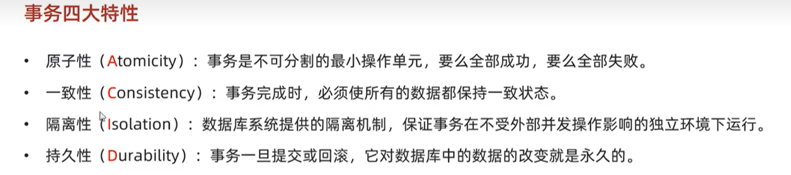

## MySQL数据库

MySQL结构图：


### 1 表空间结构

**表空间由段（segment）、区（extent）、页（page）、行（row）组成**，InnoDB存储引擎的逻辑存储结构大致如下图：


**页：InnoDB 的数据是按「页」为单位来读写的**，也就是说，当需要读一条记录的时候，并不是将这个行记录从磁盘读出来，而是以页为单位，将其整体读入内存。

**默认每个页的大小为 16KB**，也就是最多能保证 16KB 的连续存储空间。

**区（extent）** InnoDB 存储引擎是用 B+ 树来组织数据的。

B+ 树中每一层都是通过双向链表连接起来的，如果是以页为单位来分配存储空间，那么链表中相邻的两个页之间的物理位置并不是连续的，可能离得非常远，那么磁盘查询时就会有大量的随机I/O，随机 I/O 是非常慢的。

解决这个问题也很简单，就是让链表中相邻的页的物理位置也相邻，这样就可以使用顺序 I/O 了，那么在范围查询（扫描叶子节点）的时候性能就会很高。

那具体怎么解决呢？

**在表中数据量大的时候，为某个索引分配空间的时候就不再按照页为单位分配了，而是按照区（extent）为单位分配。每个区的大小为 1MB，对于 16KB 的页来说，连续的 64 个页会被划为一个区，这样就使得链表中相邻的页的物理位置也相邻，就能使用顺序 I/O 了**。

**段：**表空间是由各个段（segment）组成的，段是由多个区（extent）组成的。段一般分为数据段、索引段和回滚段等。

- 索引段：存放 B + 树的非叶子节点的区的集合；
- 数据段：存放 B + 树的叶子节点的区的集合；
- 回滚段：存放的是回滚数据的区的集合


### 2 Compact行格式


> 每个数据库表的行格式都有「NULL 值列表」吗？

NULL 值列表也不是必须的。

**当数据表的字段都定义成 NOT NULL 的时候，这时候表里的行格式就不会有 NULL 值列表了**。

所以在设计数据库表的时候，通常都是建议将字段设置为 NOT NULL，这样可以至少节省 1 字节的空间（NULL 值列表至少占用 1 字节空间）。


### 3 Varchar(n) 中n的最大取值是多少？

**MySQL 规定除了 TEXT、BLOBs 这种大对象类型之外，其他所有的列（不包括隐藏列和记录头信息）占用的字节长度加起来不能超过 65535 个字节**。

也就是说，一行记录除了 TEXT、BLOBs 类型的列，限制最大为 65535 字节，注意是一行的总长度，不是一列。

一行记录最大能存储 65535 字节的数据，但是这个是包含「变长字段字节数列表所占用的字节数」和「NULL值列表所占用的字节数」。所以， 我们在算 varchar(n) 中 n 最大值时，需要减去这两个列表所占用的字节数。


要算 varchar(n) 最大能允许存储的字节数，还要看数据库表的字符集，因为字符集代表着1个字符要占用多少字节，比如 ascii 字符集， 1 个字符占用 1 字节，那么 varchar(100) 意味着最大能允许存储 100 字节的数据。

> MySQL 怎么知道 varchar(n) 实际占用数据的大小？

MySQL 的 Compact 行格式中会用「变长字段长度列表」存储变长字段实际占用的数据大小。


### 4 MySQL 的 NULL 值是怎么存放的？

MySQL 的 Compact 行格式中会用「NULL值列表」来标记值为 NULL 的列，NULL 值并不会存储在行格式中的真实数据部分。

NULL值列表会占用 1 字节空间，当表中所有字段都定义成 NOT NULL，行格式中就不会有 NULL值列表，这样可节省 1 字节的空间。

### 5 行溢出后，MySQL 是怎么处理的？

如果一个数据页存不了一条记录，InnoDB 存储引擎会自动将溢出的数据存放到「溢出页」中。

Compact 行格式针对行溢出的处理是这样的：当发生行溢出时，在记录的真实数据处只会保存该列的一部分数据，而把剩余的数据放在「溢出页」中，然后真实数据处用 20 字节存储指向溢出页的地址，从而可以找到剩余数据所在的页。

Compressed 和 Dynamic 这两种格式采用完全的行溢出方式，记录的真实数据处不会存储该列的一部分数据，只存储 20 个字节的指针来指向溢出页。而实际的数据都存储在溢出页中。


### 6 索引分类

我们可以按照四个角度来分类索引。

- 按「数据结构」分类：**B+tree索引、Hash索引、Full-text索引**。
- 按「物理存储」分类：**聚簇索引（主键索引）、二级索引（辅助索引）**。
- 按「字段特性」分类：**主键索引、唯一索引、普通索引、前缀索引**。
- 按「字段个数」分类：**单列索引、联合索引**。


### 7 B+树索引

B+Tree 是一种多叉树，叶子节点才存放数据，非叶子节点只存放索引，而且每个节点里的数据是**按主键顺序存放**的。每一层父节点的索引值都会出现在下层子节点的索引值中，因此在叶子节点中，包括了所有的索引值信息，并且每一个叶子节点都有两个指针，分别指向下一个叶子节点和上一个叶子节点，形成一个双向链表。

主键索引的 B+Tree 如图所示：


B+Tree 存储千万级的数据只需要 3-4 层高度就可以满足，这意味着从千万级的表查询目标数据最多需要 3-4 次磁盘 I/O，所以**B+Tree 相比于 B 树和二叉树来说，最大的优势在于查询效率很高，因为即使在数据量很大的情况，查询一个数据的磁盘 I/O 依然维持在 3-4次。**

> 通过二级索引查询商品数据的过程

主键索引的 B+Tree 和二级索引的 B+Tree 区别如下：

- 主键索引的 B+Tree 的叶子节点存放的是实际数据，所有完整的用户记录都存放在主键索引的 B+Tree 的叶子节点里；
- 二级索引的 B+Tree 的叶子节点存放的是主键值，而不是实际数据。

如果我用 product_no 二级索引查询商品，如下查询语句：

```sql
select * from product where product_no = '0002';
```

会先检二级索引中的 B+Tree 的索引值（商品编码，product_no），找到对应的叶子节点，然后获取主键值，然后再通过主键索引中的 B+Tree 树查询到对应的叶子节点，然后获取整行数据。**这个过程叫「回表」，也就是说要查两个 B+Tree 才能查到数据**。如下图：


### 8 为什么InnoDB 选择 B+树作为索引的数据结构？

https://xiaolincoding.com/mysql/index/why_index_chose_bpuls_tree.html

***1、B+Tree vs B Tree***

B+Tree 只在叶子节点存储数据，而 B 树 的非叶子节点也要存储数据，所以 B+Tree 的单个节点的数据量更小，在相同的磁盘 I/O 次数下，就能查询更多的节点。

另外，B+Tree 叶子节点采用的是双链表连接，适合 MySQL 中常见的基于范围的顺序查找，而 B 树无法做到这一点。

B+ 树与 B 树差异的点，主要是以下这几点：

- **叶子节点（最底部的节点）才会存放实际数据（索引+记录），非叶子节点只会存放索引；**
- **B+树所有索引都会在叶子节点出现，叶子节点之间构成一个有序双向链表；**
- 非叶子节点的索引也会同时存在在子节点中，并且是在子节点中所有索引的最大（或最小）。
- 非叶子节点中有多少个子节点，就有多少个索引；

***2、B+Tree vs 二叉树***

对于有 N 个叶子节点的 B+Tree，其搜索复杂度为`O(logdN)`，其中 d 表示节点允许的最大子节点个数为 d 个。

在实际的应用当中， d 值是大于100的，这样就保证了，即使数据达到千万级别时，B+Tree 的高度依然维持在 3~4 层左右，也就是说一次数据查询操作只需要做 3~4 次的磁盘 I/O 操作就能查询到目标数据。

而二叉树的每个父节点的儿子节点个数只能是 2 个，意味着其搜索复杂度为 `O(logN)`，这已经比 B+Tree 高出不少，因此二叉树检索到目标数据所经历的磁盘 I/O 次数要更多。

***3、B+Tree vs Hash***

Hash 在做等值查询的时候效率贼快，搜索复杂度为 O(1)。

但是 Hash 表不适合做范围查询，它更适合做等值的查询，这也是 B+Tree 索引要比 Hash 表索引有着更广泛的适用场景的原因


### 9 聚簇索引、二级索引

从物理存储的角度来看，索引分为聚簇索引（主键索引）、二级索引（辅助索引）。

这两个区别在前面也提到了：

- 主键索引的 B+Tree 的叶子节点存放的是实际数据，所有完整的用户记录都存放在主键索引的 B+Tree 的叶子节点里；
- 二级索引的 B+Tree 的叶子节点存放的是主键值，而不是实际数据。

所以，在查询时使用了二级索引，如果查询的数据能在二级索引里查询的到，那么就不需要回表，这个过程就是**覆盖索引**。如果查询的数据不在二级索引里，就会先检索二级索引，找到对应的叶子节点，获取到主键值后，然后再检索主键索引，就能查询到数据了，这个过程就是**回表**。


**总结：**

- **聚簇索引的叶子节点存放的是实际数据，所有完整的用户记录都存放在聚簇索引的叶子节点；**
- **二级索引（非聚簇索引）的叶子节点存放的是主键值，而不是实际数据。**


### 10 联合索引 最左匹配原则

**联合索引的最左匹配原则，在遇到范围查询（如 >、<）的时候，就会停止匹配，也就是范围查询的字段可以用到联合索引，但是在范围查询字段的后面的字段无法用到联合索引。注意，对于 >=、<=、BETWEEN、like 前缀匹配的范围查询，并不会停止匹配，前面我也用了四个例子说明了**。


### 11 索引失效

常见发生索引失效的情况：

- 当我们使用左或者左右模糊匹配的时候，也就是 `like %xx` 或者 `like %xx%`这两种方式都会造成索引失效；
- 当我们在查询条件中对索引列做了计算、函数、类型转换操作，这些情况下都会造成索引失效；
- 联合索引要能正确使用需要遵循最左匹配原则，也就是按照最左优先的方式进行索引的匹配，否则就会导致索引失效。
- 在 WHERE 子句中，如果在 OR 前的条件列是索引列，而在 OR 后的条件列不是索引列，那么索引会失效。


### 12 事务四大特性



并发事务所引发的问题：

**脏读：**一个事务读到另外一个事务还没有提交的数据

**幻读**：一个事务按照条件查询数据时，没有对应的数据行，但是在插入数据时，发现这行数据又存在了，好像出现了“幻影”

**不可重复读：**一个事务先后读取同一条记录，但两次读取的数据不同


### 13 事务的隔离级别


```mysql
-- 查看事务隔离级别
select @@transaction_isolation;

-- 设置事务隔离级别
set session transaction isolation level read uncommitted
```

事务的隔离级别越高，数据越安全，但是性能越低。

- **读未提交（\*read uncommitted\*）**，指一个事务还没提交时，它做的变更就能被其他事务看到；
- **读提交（\*read committed\*）**，指一个事务提交之后，它做的变更才能被其他事务看到；
- **可重复读（\*repeatable read\*）**，指一个事务执行过程中看到的数据，一直跟这个事务启动时看到的数据是一致的，**MySQL InnoDB 引擎的默认隔离级别**；
- **串行化（\*serializable\* ）**；会对记录加上读写锁，在多个事务对这条记录进行读写操作时，如果发生了读写冲突的时候，后访问的事务必须等前一个事务执行完成，才能继续执行；


### 14 MySQL锁

- 全局锁

执行后，**整个数据库就处于只读状态了**，这时其他线程执行以下操作，都会被阻塞：

​       对数据的增删改操作，比如 insert、delete、update等语句；

​       对表结构的更改操作，比如 alter table、drop table 等语句。

> 应用场景：**全库逻辑备份**：这样在备份数据库期间，不会因为数据或表结构的更新，而出现备份文件的数据与预期的不一样。


- 表级锁

  - 表共享读锁（read lock）
  - 表独占写锁（write lock）

  ```mysql
  --- 加锁
  lock tables 表名... read/write
  --- 解锁
  unlock tables
  ```

  - 元数据锁（meta data lock ，MDL），系统自动控制 

    - 对一张表进行 CRUD 操作时，加的是 **MDL 读锁**；
    - 对一张表做结构变更操作的时候，加的是 **MDL 写锁**；

  - **意向锁**

    - 使用InnoDB时，对表里的某些记录加  **共享锁** 之前，需要先在表级别加上一个  **意向共享锁**
    - 使用InnoDB时，对表里的某些记录加  **独占锁** 之前，需要先在表级别上加一个  **意向独占锁**

    意向共享锁和意向独占锁是表级锁, 不会和行级的共享锁和独占锁发生冲突，而且意向锁之间也不会发生冲突，只会和共享表锁(lock tables.. read)和独占表锁(lock tables ... write)发生冲突。

    表锁和行锁是满足读读共享、读写互斥、写写互斥的。

    如果没有「意向锁」，那么加「独占表锁」时，就需要遍历表里所有记录，查看是否有记录存在独占锁，这样效率会很慢。
    那么有了「意向锁」，由于在对记录加独占锁前，先会加上表级别的意向独占锁，那么在加「独占表锁」时，直接查该表是否有意向独占锁，如果有就意味着表里已经有记录被加了独占锁，这样就不用去遍历表里的记录。所以，**意向锁的目的是为了快速判断表里是否有记录被加锁。**

- 行级锁

  - 记录锁（Record Lock），有S锁和X锁之分
  - 间隙锁（gap lock），只存在于**可重复读隔离级别**，目的是**解决可重复读隔离级别下的幻读现象**。
  - 临键锁（Next-Key lock），它是Record Lock + Gap Lock 的组合，锁定一个范围，并且锁定记录本身。


### 15. 事务的特性是怎么实现的 

事务是由一系列SQL语句组成的逻辑处理单元，要么全部执行成功，要么全部回滚到事务开始前的状态。MySQL使用以下几个关键字来实现事务特性：

1. **BEGIN (或 START TRANSACTION):** 标志着事务的开始。
2. **COMMIT：** 提交事务，将之前的所有操作永久保存到数据库。
3. **ROLLBACK：** 回滚事务，撤销之前的所有未提交的操作，使数据库回滚到事务开始前的状态。
4. **SAVEPOINT 和 ROLLBACK TO：** 可以在事务中设置保存点（Savepoint），以便在需要时回滚到这个保存点。
5. **SET autocommit：** 用于设置是否自动提交事务。默认情况下，MySQL是自动提交的，每个SQL语句都被视为一个单独的事务。通过将`autocommit`设置为0，可以手动控制事务的提交和回滚。

> 事务的底层实现

以下是一般性的事务底层实现概述：

1. **日志系统：** 事务的关键**在于能够撤销或重放操作，以确保事务的原子性、一致性、隔离性和持久性**（ACID属性）。数据库通常使用事务日志（transaction log）记录数据库的变化。这个日志包括了对数据库的所有修改操作，包括插入、更新、删除等。
2. **写前日志（Write-Ahead Logging, WAL）：** 在修改数据库数据之前，DBMS首先将修改写入事务日志。这确保了在数据库中的实际数据修改之前，已经有了对修改的记录。这样，如果发生故障，系统可以通过重放日志来恢复事务。
3. **事务表：** 数据库通常会维护一个事务表，用于记录当前进行中的事务信息，包括事务的开始时间、结束时间、事务状态等。这有助于系统在事务发生故障时进行恢复。
4. **事务控制器：** 数据库中有一个**事务控制器，它负责协调和管理事务的执行**。当事务提交时，控制器将修改应用到数据库中。如果事务需要回滚，它将根据事务日志和事务表的信息来撤销事务。
5. **锁管理：** 数据库**使用锁来保证事务的隔离性**。当一个事务修改某个数据时，其他事务可能需要等待直到锁被释放。这确保了不同事务之间的数据一致性。

总体而言，事务的底层实现依赖于日志系统、事务表、事务控制器、锁管理等多个组件的协同工作。这些机制共同确保了事务的原子性、一致性、隔离性和持久性，以满足ACID属性的要求。不同的DBMS可能有不同的优化和实现细节，但上述概述提供了一个通用的事务底层实现框架。

### 16. 事务日志

> redo log 重做日志：保证事务的持久性

`InnoDB` 存储引擎使用 `redo log` 来保证事务的持久性。`redo log` 记录了每个事务所做的修改，它是一个循环的、预写式的日志，用于在发生故障时恢复未提交的事务更改。

当数据修改时，除了修改Buffer Pool中的数据，还会在redo log记录这次操作；当事务提交时，会调用fsync接口**对redo log进行刷盘**。如果MySQL宕机，重启时可以读取redo log中的数据，对数据库进行恢复。redo log采用的是WAL(Write-ahead logging，预写式日志)，所有修改先写入日志，再更新到Buffer Pool保证了数据不会因MySQL宕机而丢失，从而满足了持久性要求。


`redo log` 的主要作用包括：

1. **持久性：** 通过将事务的修改记录到 `redo log` 中，可以确保即使在数据库发生故障的情况下，已提交的事务的更改也能够被重做，从而保持数据的一致性。
2. **性能：** 通过将事务的修改记录到 `redo log`，而不是直接修改磁盘上的数据页，可以提高事务的提交性能，因为写入磁盘是相对较慢的操作。

`redo log` 的基本工作原理是：

-  在事务提交时，将事务所做的修改操作记录到 `redo log` 中。
-  `redo log` 是一个循环的日志，当日志写满时，它会回到开头继续写。
-  `InnoDB` 将 `redo log` 记录的信息异步刷写到磁盘。

通过这种方式，`redo log` 提供了一种高效的方式来确保已提交事务的修改持久化到磁盘，并且在数据库崩溃后可以通过重做操作来还原这些修改。


> uodo log 回滚日志：保证原子性、隔离性

实现原子性的关键，是当事务回滚时能够撤销所有已经成功执行的sql语句。**InnoDB实现回滚，靠的是undo log:**当事务对数据库进行修改时，InnoDB会生成对应的undo log;如果事务执行失败或调用了rollback，导致事务需要回滚，便可以利用undo log中的信息将数据回滚到修改之前的样子。

### 17. InnoDB存储引擎组成


InnoDB存储引擎的内存结构由四部分组成：

- Buffer Pool：缓冲池，用来**缓存表数据 和 索引数据**，减少磁盘IO操作，提升效率。
- Change Buffer：写缓冲区，针对**二级索引页** 的更新优化措施。
- Log Buffer：日志缓冲区，**用来缓存写入磁盘上log文件（Redo、Undo）的数据**，日志缓冲区的内容会定期地刷新到磁盘的Log文件中。主要作用：**用来优化每次更新操作之后都要写入redo log产生的磁盘IO**
- Adaptive Hash Index：**自适应Hash索引**。InnoDB不支持手动创建Hash索引的，但是InnoDB会进行自调优，如果判断建立 自适应Hash索引能够提升查询效率。InnoDB就会在自己的内存中创建相关的Hash索引。自适应指的是不需要人工干预，InnoDB会根据自己的需求去创建索引。

### 18. 什么是Buffer Pool？ 

Buffer Pool：缓冲池，用来缓存 **表数据和索引数据**的，减少磁盘IO

Buffer Pool 由**缓存数据页（Page）和对缓存数据页进行描述的控制块**组成

1. 缓存数据页Page：**InnoDB存储引擎页的单位**，对数据进行划分，以**页Page作为磁盘和内存交互的基本单位**，一个页的大小默认是16kb

​		Buffer Pool中除了缓存了索引页和数据页，还包括了undo页，自适应hash索引，插入缓存页，锁信息

2. 控制块：控制块中存储着**对应的 缓存页所属的表空间信息，数据页编号，**控制块所对应的缓存页在Buffer Pool中的地址信息
3. Buffer Pool的默认大小：128M，以Page为单位，Page页16KB，控制块一般为数据也的5%，大概是800字节


> Buffer Pool 中如何管理Page页？

Page页分类：在Buffer Pool的底层采用的是**链表**数据结构来管理Page

Page根据状态可以分为3种类型：

1. free Page：空闲Page 未被使用的page
2. clean Page：被使用的page，但是数据没有被修改过
3. dirty page：脏页，被使用过的page，并且数据被修改了，缓存页中的数据和磁盘的数据不一致了


