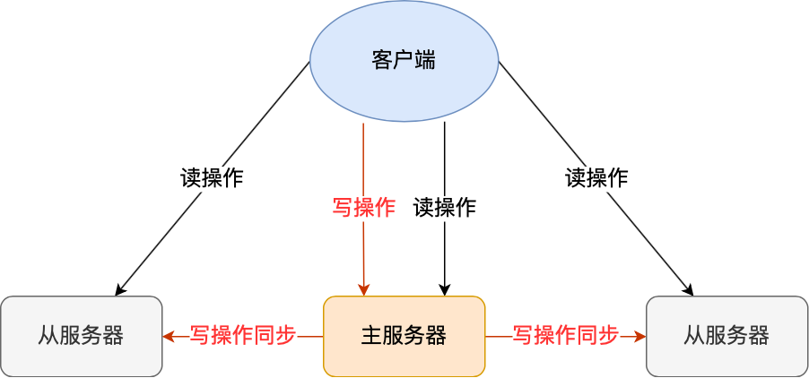
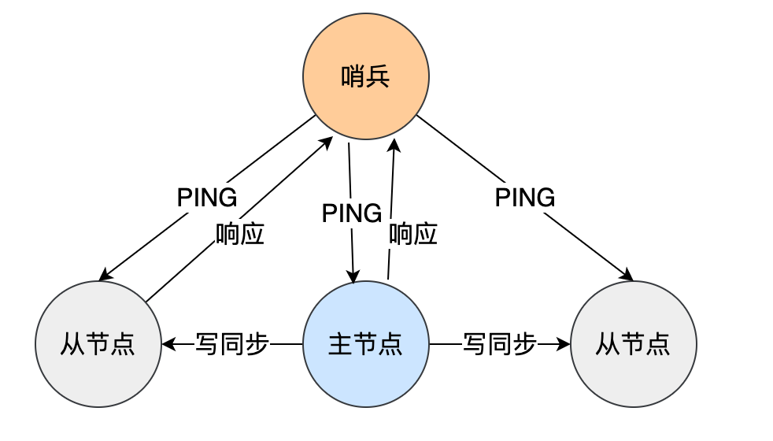
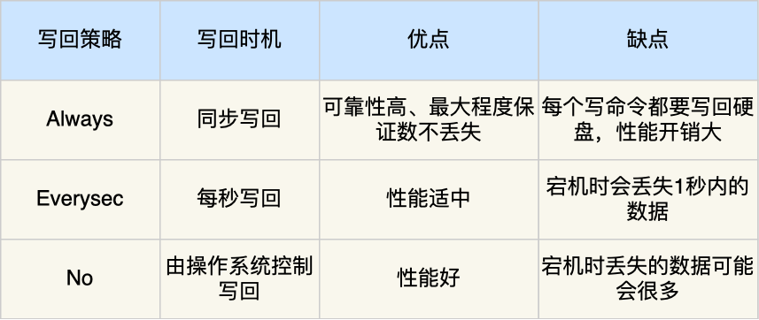
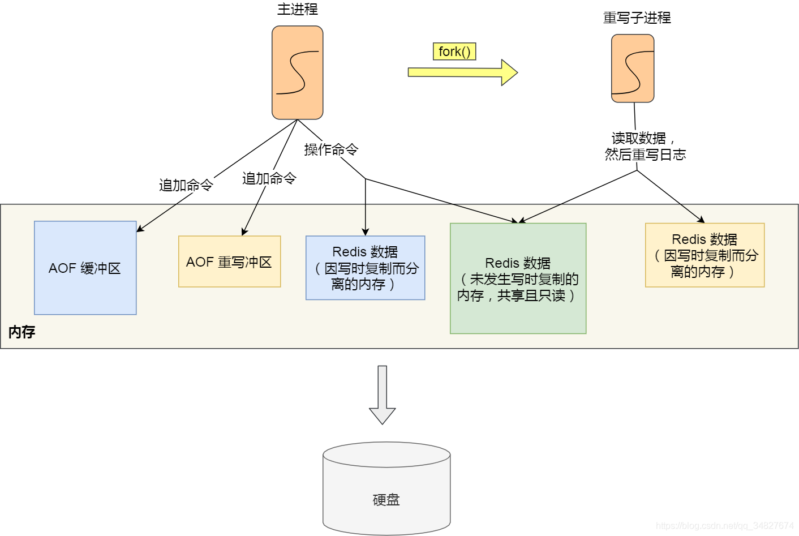

## Redis

### 1 Redis如何实现服务高可用？

#### 主从复制

主从复制是 Redis 高可用服务的最基础的保证，实现方案就是将从前的一台 Redis 服务器，同步数据到多台从 Redis 服务器上，即**一主多从**的模式，且**主从服务器之间采用的是「读写分离」的方式**。

**主服务器可以进行读写操作，当发生写操作时自动将写操作同步给从服务器**，而**从服务器一般是只读，并接受主服务器同步过来写操作命令，然后执行这条命令**。

也就是说，所有的数据修改只在主服务器上进行，然后将最新的数据同步给从服务器，这样就使得主从服务器的数据是一致的。

注意，主从服务器之间的命令复制是**异步**进行的。

具体来说，在主从服务器命令传播阶段，主服务器收到新的写命令后，会发送给从服务器。但是，主服务器并不会等到从服务器实际执行完命令后，再把结果返回给客户端，而是主服务器自己在本地执行完命令后，就会向客户端返回结果了。如果从服务器还没有执行主服务器同步过来的命令，主从服务器间的数据就不一致了。

所以，无法实现强一致性保证（主从数据时时刻刻保持一致），数据不一致是难以避免的。

#### 哨兵模式

在使用 Redis 主从服务的时候，会有一个问题，就是当 Redis 的主从服务器出现故障宕机时，需要手动进行恢复。

为了解决这个问题，Redis 增加了哨兵模式（**Redis Sentinel**），因为哨兵模式做到了可以监控主从服务器，并且提供**主从节点故障转移的功能。**

#### 切片集群模式

当 Redis 缓存数据量大到一台服务器无法缓存时，就需要使用 **Redis 切片集群**（Redis Cluster ）方案，**它将数据分布在不同的服务器上，以此来降低系统对单主节点的依赖，**从而提高 Redis 服务的读写性能。

Redis Cluster 方案采用哈希槽（Hash Slot），来处理数据和节点之间的映射关系。在 Redis Cluster 方案中，**一个切片集群共有 16384 个哈希槽**，这些哈希槽类似于数据分区，每个键值对都会根据它的 key，被映射到一个哈希槽中，具体执行过程分为两大步：

- 根据键值对的 key，按照 [CRC16 算法 (opens new window)](https://en.wikipedia.org/wiki/Cyclic_redundancy_check)计算一个 16 bit 的值。
- 再用 16bit 值对 16384 取模，得到 0~16383 范围内的模数，每个模数代表一个相应编号的哈希槽。

接下来的问题就是，这些哈希槽怎么被映射到具体的 Redis 节点上的呢？有两种方案：

- **平均分配：** 在使用 cluster create 命令创建 Redis 集群时，Redis 会自动把所有哈希槽平均分布到集群节点上。比如集群中有 9 个节点，则每个节点上槽的个数为 16384/9 个。
- **手动分配：** 可以使用 cluster meet 命令手动建立节点间的连接，组成集群，再使用 cluster addslots 命令，指定每个节点上的哈希槽个数。

#### 集群脑裂导致数据丢失怎么办？

总结一句话就是：**由于网络问题，集群节点之间失去联系。主从数据不同步；重新平衡选举，产生两个主服务。**等网络恢复，旧主节点会降级为从节点，再与新主节点进行同步复制的时候，由于会从节点会清空自己的缓冲区，所以导致之前客户端写入的数据丢失了。

解决方案：

当主节点发现从**节点下线或者通信超时的总数量小于阈值时，那么禁止主节点进行写数据**，直接把错误返回给客户端。

### 2. Redis有没有可能丢数据？怎么解决？

Redis 的读写操作都是在内存中，所以 Redis 性能才会高，但是**当 Redis 重启后，内存中的数据就会丢失**，那为了保证内存中的数据不会丢失，Redis 实现了数据持久化的机制，这个机制会把数据存储到磁盘，这样在 Redis 重启就能够从磁盘中恢复原有的数据。

### 3. Redis持久化

Redis 共有三种数据持久化的方式：

- **AOF 日志**：每执行一条写操作命令，就把该命令以追加的方式写入到一个文件里；
- **RDB 快照**：将某一时刻的内存数据，以二进制的方式写入磁盘；
- **混合持久化方式**：Redis 4.0 新增的方式，集成了 AOF 和 RBD 的优点；

> AOF 日志是如何实现的？

Redis 在执行完一条写操作命令后，就会**把该命令以追加的方式写入到一个文件里**，然后 Redis 重启时，会读取该文件记录的命令，然后逐一执行命令的方式来进行数据恢复。

> 为什么先执行命令，再把数据写入日志呢？

Reids 是先执行写操作命令后，才将该命令记录到 AOF 日志里的，这么做其实有两个好处。

- **避免额外的检查开销**：因为如果先将写操作命令记录到 AOF 日志里，再执行该命令的话，如果当前的命令语法有问题，那么如果不进行命令语法检查，该错误的命令记录到 AOF 日志里后，Redis 在使用日志恢复数据时，就可能会出错。
- **不会阻塞当前写操作命令的执行**：因为当写操作命令执行成功后，才会将命令记录到 AOF 日志。

当然，这样做也会带来风险：

- **数据可能会丢失：** 执行写操作命令和记录日志是两个过程，那当 Redis 在还没来得及将命令写入到硬盘时，服务器发生宕机了，这个数据就会有丢失的风险。
- **可能阻塞其他操作：** 由于写操作命令执行成功后才记录到 AOF 日志，所以不会阻塞当前命令的执行，但因为 AOF 日志也是在主线程中执行，所以当 Redis 把日志文件写入磁盘的时候，还是会阻塞后续的操作无法执行。

Redis 三个写回策略

> AOF日志过大，会出发什么机制？

Redis 为了避免 AOF 文件越写越大，提供了 **AOF 重写机制**，当 AOF 文件的大小超过所设定的阈值后，Redis 就会启用 AOF 重写机制，来压缩 AOF 文件。

AOF 重写机制是在重写时，读取当前数据库中的所有键值对，然后将每一个键值对用一条命令记录到「新的 AOF 文件」，等到全部记录完后，就将新的 AOF 文件替换掉现有的 AOF 文件。

> 重写 AOF 日志的过程是怎样的？

Redis 的**重写 AOF 过程是由后台子进程 bgrewriteaof 来完成的**，这么做可以达到两个好处：

- 子进程进行 AOF 重写期间，主进程可以继续处理命令请求，从而避免阻塞主进程；
- 子进程带有主进程的数据副本，这里使用子进程而不是线程，因为如果是使用线程，多线程之间会共享内存，那么在修改共享内存数据的时候，需要通过加锁来保证数据的安全，而这样就会降低性能。而使用子进程，创建子进程时，父子进程是共享内存数据的，不过这个共享的内存只能以只读的方式，而当父子进程任意一方修改了该共享内存，就会发生「写时复制」，于是父子进程就有了独立的数据副本，就不用加锁来保证数据安全。

**但是重写过程中，主进程依然可以正常处理命令**，那问题来了，重写 AOF 日志过程中，如果主进程修改了已经存在 key-value，那么会发生写时复制，此时这个 key-value 数据在子进程的内存数据就跟主进程的内存数据不一致了，这时要怎么办呢？

为了解决这种数据不一致问题，Redis 设置了一个 **AOF 重写缓冲区**，这个缓冲区在创建 bgrewriteaof 子进程之后开始使用。

在重写 AOF 期间，当 Redis 执行完一个写命令之后，它会**同时将这个写命令写入到 「AOF 缓冲区」和 「AOF 重写缓冲区」**。

> RDB快照是如何实现的？

Redis 提供了两个命令来生成 RDB 文件，分别是 save 和 bgsave，他们的区别就在于是否在「主线程」里执行：

- 执行了 save 命令，就会在主线程生成 RDB 文件，由于和执行操作命令在同一个线程，所以如果写入 RDB 文件的时间太长，**会阻塞主线程**；
- 执行了 bgsave 命令，会创建一个子进程来生成 RDB 文件，这样可以**避免主线程的阻塞**；

这里提一点，Redis 的快照是**全量快照**，也就是说每次执行快照，都是把内存中的「所有数据」都记录到磁盘中。所以执行快照是一个比较重的操作，如果频率太频繁，可能会对 Redis 性能产生影响。如果频率太低，服务器故障时，丢失的数据会更多。

> 混合持久化

RDB 优点是数据 **恢复速度快**，但是快照的频率不好把握。频率太低，丢失的数据就会比较多，频率太高，就会影响性能。

AOF 优点是**丢失数据少，但是数据恢复不快**。

为了集成了两者的优点， Redis 4.0 提出了**混合使用 AOF 日志和内存快照**，也叫混合持久化，既保证了 Redis 重启速度，又降低数据丢失风险。

**混合持久化优点：**

- 混合持久化结合了 RDB 和 AOF 持久化的优点，开头为 RDB 的格式，使得 Redis 可以更快的启动，同时结合 AOF 的优点，有减低了大量数据丢失的风险。

**混合持久化缺点：**

- AOF 文件中添加了 RDB 格式的内容，使得 AOF 文件的可读性变得很差；
- 兼容性差，如果开启混合持久化，那么此混合持久化 AOF 文件，就不能用在 Redis 4.0 之前版本了。

### 4. Redis过期删除、内存淘汰

Redis 使用的过期删除策略是「**惰性删除+定期删除**」这两种策略配和使用。

每当我们对一个 key 设置了过期时间时，Redis 会把该 key 带上过期时间存储到一个**过期字典**（expires dict）中，也就是说「过期字典」保存了数据库中所有 key 的过期时间。

当我们查询一个 key 时，Redis 首先检查该 key 是否存在于过期字典中：

- 如果不在，则正常读取键值；
- 如果存在，则会获取该 key 的过期时间，然后与当前系统时间进行比对，如果比系统时间大，那就没有过期，否则判定该 key 已过期。

> 惰性删除

惰性删除策略的做法是，**不主动删除过期键，每次从数据库访问 key 时，都检测 key 是否过期，如果过期则删除该 key。**

惰性删除策略的**优点**：

- 因为每次访问时，才会检查 key 是否过期，所以此策略只会使用很少的系统资源，因此，惰性删除策略对 CPU 时间最友好。

惰性删除策略的**缺点**：

- 如果一个 key 已经过期，而这个 key 又仍然保留在数据库中，那么只要这个过期 key 一直没有被访问，它所占用的内存就不会释放，造成了一定的内存空间浪费。所以，惰性删除策略对内存不友好。

> 定期删除

定期删除策略的做法是，**每隔一段时间「随机」从数据库（过期字典）中取出一定数量的 key 进行检查，并删除其中的过期key。**

redis:
讲一下基本数据结构
zset的底层可以讲一下吗
如何实现redis两个操作变成一个事务性操作

●你还有什么其他的方式来保证Redis的可靠性？（主从复制、哨兵、集群一通甩出来）

●Redis保证incr命令原子性的原理是什么？（不清楚）
●AOF重写期间命令可能会写入两次，会造成什么影响？（忘记了）

1. Redis 的数据结构有哪些？GEO 怎么用的？
2. Redis 如何实现分布式锁？

