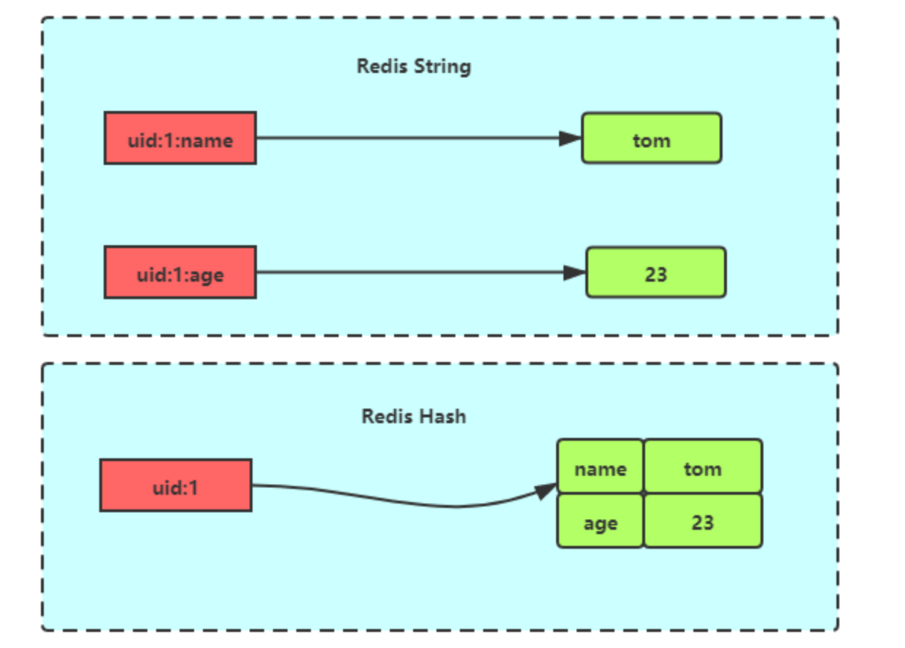
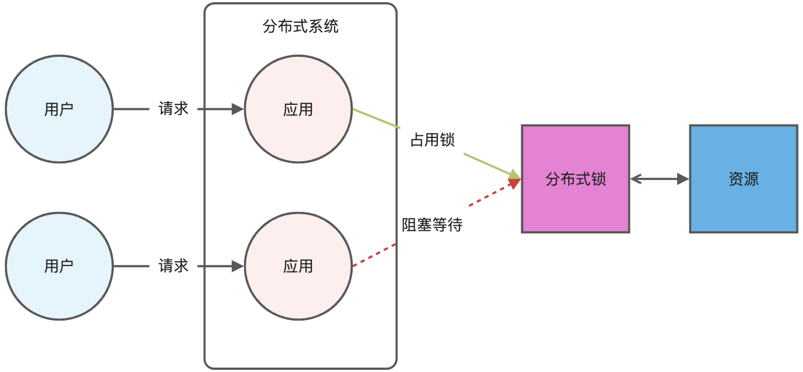

\1. 自我介绍

\2. 对OOP的理解

\3. OOP里多态和继承的概念

\4. 如果是语言开发者，怎么去设计和实现多态和继承的特性

4.1 例如Python里一个子对象，覆盖了父对象，会发生什么操作


\5. Go里goroutine和线程的区别 -> GMP模型

5.1 goroutine阻塞是会怎么做

5.2 M对应的goroutine运行完了，其他M还有G，会怎么做

\6. Go的垃圾回收机制（与Python的区别）

6.1 循环引用，能否回收掉

\7. Go会把新建的对象放到栈还是堆上


\8. 前端请求的数据，没有收到对应的消息，怎么排查

8.1 前端收到的数据不符合预期，有时是乱码，怎么排查


\9. A、B、C形成的联合索引，BC能否使用到索引

\10. SQL查询非常慢，如何排查

10.1 如果是回表，怎么优化

\11. 数据库遭受不住过高QPS，怎么办

\12. 如何保证缓存和和数据库的一致性


\17. Kafka消费者数据积压，有碰到过吗

\18. 命名空间有了解吗

\19. 算法：LC 238. 除自身以外数组的乘积


项目怎么部署的

Go的GMP调度

用过哪些锁(Mutex、RWMutex)

项目中用到过锁吗

goroutine间如何同步(channel、信号量)

MySQL批量插入(开启事务分批次插入)

如何加行锁(for update)

项目哪里使用到Redis，用了哪些数据类型

如何实现分布式锁(SETNX)

Redis为什么快(单线程、缓存)

SQL慢如何定位(慢查询日志、explain)

索引失效怎么发生(最左、Like、函数操作)

用过Flask，和Gin有什么区别

知道Flask的蓝图吗(不知道) 写过什么东西(RESTful api)

Gin如何使用JWT的中间件

面试官介绍业务：监控、网络，可能用到Flask、前端


算法：手写LRU 30min

上周刚写过，最后有点小报错还没解决，面试官叫停了

总结：面试官很好，答对了会说“嗯没问题”、“嗯对的”，总体感受不错


## Redis

### 1 Redis中的数据结构

Redis中 5中常用的数据结构：String、Hash、List、Set、ZSet ，后面还更新了Geo、BitMap、HyperLogLog、Stream等结构

- **String**：一个 key 对应一个字符串，string是Redis 最基本的数据类型。（字节的abase框架只实现了redis的string数据结构，导致我们如果想要存储复杂的数据结构的时候，只能转成json格式的字符串来存储）
- **list**：一个 key 对应一个字符串列表，底层使用双向链表实现，很多双向链表支持的操作它都支持。
- **hash**：哈希表，使用 key-value 来存储数据。
- **Set**：比如一个Set的实例：`A = {'a', 'b', 'c'}`，A是集合的key，‘a’, 'b’和‘c’是集合的member。无序、无重复元素。
- **ZSet**：在set的基础上加上一个分数score，set里面的数据是有序的。

Redis提供了多种数据结构，每种数据结构都有不同的特点和适用场景。下面是Redis常见的数据结构及其适用场景：

1. **String**：适用于存储单个值，如用户信息、计数器等。可以进行常见的字符串操作，如获取、设置、增加、减少等。
2. **Hash**：适用于存储对象，如用户信息、文章等。可以对其中的字段进行单独的增加、修改、删除等操作。
3. **List**：适用于存储有序的字符串集合，如消息队列、最新消息列表等。可以对列表进行头部和尾部的添加和删除操作，还可以根据索引获取元素。
4. **Set**：适用于存储无序且唯一的字符串集合，如标签列表、好友列表等。可以进行集合间的交集、并集、差集等操作，还可以添加、删除元素。
5. **Sorted Set**：适用于存储有序的成员和对应的分数，如排行榜、带权重的任务队列等。可以按照分数进行范围查询、按照成员进行排名等操作。
6. **Geospatial Index**：适用于存储地理位置信息，如附近的人、商家等。可以进行地理位置的添加、删除、查询等操作，并支持范围查询和距离计算。

每种数据结构都有其独特的特性和适用场景，根据具体需求选择合适的数据结构可以提高系统性能和开发效率。在使用Redis时，需要根据数据的特点和操作需求来选择适合的数据结构。

> Hash的实现

Hash 是一个键值对（key - value）集合，其中 value 的形式如： `value=[{field1，value1}，...{fieldN，valueN}]`。Hash 特别适合用于存储对象。

Hash 与 String 对象的区别如下图所示:



Hash 类型的底层数据结构是由**压缩列表或哈希表**实现的：

- 如果哈希类型元素个数小于 `512` 个（默认值，可由 `hash-max-ziplist-entries` 配置），所有值小于 `64` 字节（默认值，可由 `hash-max-ziplist-value` 配置）的话，Redis 会使用**压缩列表**作为 Hash 类型的底层数据结构；
- 如果哈希类型元素不满足上面条件，Redis 会使用**哈希表**作为 Hash 类型的 底层数据结构。

**在 Redis 7.0 中，压缩列表数据结构已经废弃了，交由 listpack 数据结构来实现了**。

> Hash的扩容过程

当哈希表中的负载因子达到一定阈值时，Redis会自动对哈希表进行扩容，以保持哈希表的性能。扩容通常涉及创建一个更大的哈希表，并重新将所有键值对映射到新的桶中。

1. **新建更大的哈希表：** 首先，Redis会为哈希表分配一块更大的内存空间，通常是当前大小的两倍。这样可以确保哈希表有足够的空间来容纳更多的键值对。
2. **重新哈希：** 接下来，Redis会**将当前哈希表中的所有键值对重新计算哈希值，并根据新的哈希函数映射到新的存储桶中**。由于哈希函数通常与哈希表的大小相关联，因此扩容会导致哈希函数的改变，因此所有键值对都需要重新计算哈希值并重新分配到新的存储桶中。
3. **迁移数据：** 在重新哈希的过程中，每个存储桶可能会有多个键值对，为了保持存储桶的平衡性，Redis会逐个迁移键值对到新的存储桶中。这可能涉及到大量的数据复制和移动操作。
4. **更新指针：** 最后，一旦所有键值对都成功迁移到新的哈希表中，Redis会更新哈希表的指针，使其指向新的哈希表，同时释放旧的哈希表所占用的内存空间。

> 扩容会把程序给停止吗，还是说是一个多线程的方式

在 Redis 中，哈希表的扩容是以渐进式方式进行的，这意味着在扩容过程中，Redis 仍然可以继续提供服务，而不会完全停止程序。


> zSet的底层可以讲一下吗

Zset 类型（有序集合类型）相比于 Set 类型多了一个排序属性 score（分值），对于有序集合 ZSet 来说，**每个存储元素相当于有两个值组成的，一个是有序集合的元素值，一个是排序值**。

有序集合保留了集合不能有重复成员的特性（分值可以重复），但不同的是，有序集合中的元素可以排序。


**内部实现：**

ZSet类型的底层数据结构是由**压缩列表或者跳表**来实现的

- 如果有序集合的元素个数小于 `128` 个，并且每个元素的值小于 `64` 字节时，Redis 会使用**压缩列表**作为 Zset 类型的底层数据结构；
- 如果有序集合的元素不满足上面的条件，Redis 会使用**跳表**作为 Zset 类型的底层数据结构；

**在 Redis 7.0 中，压缩列表数据结构已经废弃了，交由 listpack 数据结构来实现了。**


### 2 Redis如何实现服务高可用？

#### 主从复制

主从复制是 Redis 高可用服务的最基础的保证，实现方案就是将从前的一台 Redis 服务器，同步数据到多台从 Redis 服务器上，即**一主多从**的模式，且**主从服务器之间采用的是「读写分离」的方式**。

**主服务器可以进行读写操作，当发生写操作时自动将写操作同步给从服务器**，而**从服务器一般是只读，并接受主服务器同步过来写操作命令，然后执行这条命令**。


也就是说，所有的数据修改只在主服务器上进行，然后将最新的数据同步给从服务器，这样就使得主从服务器的数据是一致的。

注意，主从服务器之间的命令复制是**异步**进行的。

具体来说，在主从服务器命令传播阶段，主服务器收到新的写命令后，会发送给从服务器。但是，主服务器并不会等到从服务器实际执行完命令后，再把结果返回给客户端，而是主服务器自己在本地执行完命令后，就会向客户端返回结果了。如果从服务器还没有执行主服务器同步过来的命令，主从服务器间的数据就不一致了。

所以，无法实现强一致性保证（主从数据时时刻刻保持一致），数据不一致是难以避免的。

#### 哨兵模式

在使用 Redis 主从服务的时候，会有一个问题，就是当 Redis 的主从服务器出现故障宕机时，需要手动进行恢复。

为了解决这个问题，Redis 增加了哨兵模式（**Redis Sentinel**），因为哨兵模式做到了可以监控主从服务器，并且提供**主从节点故障转移的功能。**


#### 切片集群模式

当 Redis 缓存数据量大到一台服务器无法缓存时，就需要使用 **Redis 切片集群**（Redis Cluster ）方案，**它将数据分布在不同的服务器上，以此来降低系统对单主节点的依赖，**从而提高 Redis 服务的读写性能。

Redis Cluster 方案采用哈希槽（Hash Slot），来处理数据和节点之间的映射关系。在 Redis Cluster 方案中，**一个切片集群共有 16384 个哈希槽**，这些哈希槽类似于数据分区，每个键值对都会根据它的 key，被映射到一个哈希槽中，具体执行过程分为两大步：

- 根据键值对的 key，按照 [CRC16 算法 (opens new window)](https://en.wikipedia.org/wiki/Cyclic_redundancy_check)计算一个 16 bit 的值。
- 再用 16bit 值对 16384 取模，得到 0~16383 范围内的模数，每个模数代表一个相应编号的哈希槽。

接下来的问题就是，这些哈希槽怎么被映射到具体的 Redis 节点上的呢？有两种方案：

- **平均分配：** 在使用 cluster create 命令创建 Redis 集群时，Redis 会自动把所有哈希槽平均分布到集群节点上。比如集群中有 9 个节点，则每个节点上槽的个数为 16384/9 个。
- **手动分配：** 可以使用 cluster meet 命令手动建立节点间的连接，组成集群，再使用 cluster addslots 命令，指定每个节点上的哈希槽个数。

#### 集群脑裂导致数据丢失怎么办？

总结一句话就是：**由于网络问题，集群节点之间失去联系。主从数据不同步；重新平衡选举，产生两个主服务。**等网络恢复，旧主节点会降级为从节点，再与新主节点进行同步复制的时候，由于从节点会清空自己的缓冲区，所以导致之前客户端写入的数据丢失了。

解决方案：

当主节点发现**从节点下线或者通信超时的总数量小于阈值时，这个时候主节点可能就有问题了，那么禁止主节点进行写数据**，直接把错误返回给客户端。

### 3. Redis有没有可能丢数据？怎么解决？

Redis 的读写操作都是在内存中，所以 Redis 性能才会高，但是**当 Redis 重启后，内存中的数据就会丢失**，那为了保证内存中的数据不会丢失，Redis 实现了数据持久化的机制，这个机制会把数据存储到磁盘，这样在 Redis 重启就能够从磁盘中恢复原有的数据。


### 4. Redis持久化

Redis 共有三种数据持久化的方式：

- **AOF 日志**：每执行一条写操作命令，就把该命令以追加的方式写入到一个文件里；
- **RDB 快照**：将某一时刻的内存数据，以二进制的方式写入磁盘；
- **混合持久化方式**：Redis 4.0 新增的方式，集成了 AOF 和 RBD 的优点；

**RDB快照是一次全量备份，AOF是连续的增量备份。**快照是内存数据的二进制序列化形式，在存储上非常紧凑，而 AOF 日志记录的是内存数据修改的指令记录文本。


> AOF 日志是如何实现的？

Redis 在执行完一条写操作命令后，就会**把该命令以追加的方式写入到一个文件里**，然后 Redis 重启时，会读取该文件记录的命令，然后逐一执行命令的方式来进行数据恢复。

> 为什么先执行命令，再把数据写入日志呢？

Reids 是先执行写操作命令后，才将该命令记录到 AOF 日志里的，这么做其实有两个好处。

- **避免额外的检查开销**：因为如果先将写操作命令记录到 AOF 日志里，再执行该命令的话，如果当前的命令语法有问题，那么如果不进行命令语法检查，该错误的命令记录到 AOF 日志里后，Redis 在使用日志恢复数据时，就可能会出错。
- **不会阻塞当前写操作命令的执行**：因为当写操作命令执行成功后，才会将命令记录到 AOF 日志。

当然，这样做也会带来风险：

- **数据可能会丢失：** 执行写操作命令和记录日志是两个过程，那当 Redis 在还没来得及将命令写入到硬盘时，服务器发生宕机了，这个数据就会有丢失的风险。
- **可能阻塞其他操作：** 由于写操作命令执行成功后才记录到 AOF 日志，所以不会阻塞当前命令的执行，但因为 AOF 日志也是在主线程中执行，所以当 Redis 把日志文件写入磁盘的时候，还是会阻塞后续的操作无法执行。


Redis 三个写回策略


> AOF日志过大，会出发什么机制？

Redis 为了避免 AOF 文件越写越大，提供了 **AOF 重写机制**，当 AOF 文件的大小超过所设定的阈值后，Redis 就会启用 AOF 重写机制，来压缩 AOF 文件。

AOF 重写机制是在重写时，读取当前数据库中的所有键值对，然后将每一个键值对用一条命令记录到「新的 AOF 文件」，等到全部记录完后，就将新的 AOF 文件替换掉现有的 AOF 文件。

> 重写 AOF 日志的过程是怎样的？

Redis 的**重写 AOF 过程是由后台子进程 bgrewriteaof 来完成的**，这么做可以达到两个好处：

- 子进程进行 AOF 重写期间，主进程可以继续处理命令请求，从而避免阻塞主进程；
- 子进程带有主进程的数据副本，这里使用子进程而不是线程，因为如果是使用线程，多线程之间会共享内存，那么在修改共享内存数据的时候，需要通过加锁来保证数据的安全，而这样就会降低性能。而使用子进程，创建子进程时，父子进程是共享内存数据的，不过这个共享的内存只能以只读的方式，而当父子进程任意一方修改了该共享内存，就会发生「写时复制」，于是父子进程就有了独立的数据副本，就不用加锁来保证数据安全。

**但是重写过程中，主进程依然可以正常处理命令**，那问题来了，重写 AOF 日志过程中，如果主进程修改了已经存在 key-value，那么会发生写时复制，此时这个 key-value 数据在子进程的内存数据就跟主进程的内存数据不一致了，这时要怎么办呢？

为了解决这种数据不一致问题，Redis 设置了一个 **AOF 重写缓冲区**，这个缓冲区在创建 bgrewriteaof 子进程之后开始使用。

在重写 AOF 期间，当 Redis 执行完一个写命令之后，它会**同时将这个写命令写入到 「AOF 缓冲区」和 「AOF 重写缓冲区」**。


> RDB快照是如何实现的？

Redis 提供了两个命令来生成 RDB 文件，分别是 save 和 bgsave，他们的区别就在于是否在「主线程」里执行：

- 执行了 save 命令，就会在主线程生成 RDB 文件，由于和执行操作命令在同一个线程，所以如果写入 RDB 文件的时间太长，**会阻塞主线程**；
- 执行了 bgsave 命令，会创建一个子进程来生成 RDB 文件，这样可以**避免主线程的阻塞**；

这里提一点，Redis 的快照是**全量快照**，也就是说每次执行快照，都是把内存中的「所有数据」都记录到磁盘中。所以执行快照是一个比较重的操作，如果频率太频繁，可能会对 Redis 性能产生影响。如果频率太低，服务器故障时，丢失的数据会更多。

> 混合持久化

RDB 优点是数据 **恢复速度快**，但是快照的频率不好把握。频率太低，丢失的数据就会比较多，频率太高，就会影响性能。

AOF 优点是**丢失数据少，但是数据恢复不快**。

为了集成了两者的优点， Redis 4.0 提出了**混合使用 AOF 日志和内存快照**，也叫混合持久化，既保证了 Redis 重启速度，又降低数据丢失风险。

**混合持久化优点：**

- 混合持久化结合了 RDB 和 AOF 持久化的优点，开头为 RDB 的格式，使得 Redis 可以更快的启动，同时结合 AOF 的优点，有减低了大量数据丢失的风险。

**混合持久化缺点：**

- AOF 文件中添加了 RDB 格式的内容，使得 AOF 文件的可读性变得很差；
- 兼容性差，如果开启混合持久化，那么此混合持久化 AOF 文件，就不能用在 Redis 4.0 之前版本了。


### 5. Redis缓存淘汰

**Redis缓存淘汰策略：方便在内存不足时决定删除哪些数据？**

1. **LRU（Least Recently Used，最近最少使用）：**LRU 策略会删除最近最少被使用的键。Redis 中的 LRU 实现使用近似 LRU（Approximately Least Recently Used，ALRU），以减少内存占用。
2. **LFU（Least Frequently Used，最不经常使用）**：LFU 策略会删除最不经常被使用的键。Redis 中的 LFU 实现也是近似的，因为精确的 LFU 算法需要维护每个键的使用频率计数，这在实践中可能会导致性能问题。
3. TTL（Time To Live，生存时间）：TTL 策略根据键的过期时间来删除数据。当键的过期时间到达后，Redis 将自动删除该键及其关联的值。
4. 定期删除（Eviction by Timeout，定时删除）：定期删除策略在内存超出限制时，会在尝试删除数据之前检查过期键。如果有过期键，则优先删除这些键。
5. **随机删除（Eviction by Random，随机删除）**：在内存超出限制时，Redis 还可以随机选择一些键进行删除，以腾出空间。
6. `noeviction`：**不会继续服务写请求 (DEL 请求可以继续服务)，读请求可以继续进行**。这样可以保证不会丢失数据，但是会让线上的业务不能持续进行。这是默认的淘汰策略。

可以通过配置 Redis 的 `maxmemory-policy` 参数来选择所需的缓存淘汰策略。例如：

```
CONFIG SET maxmemory-policy <policy>
```


**Redis如何个解决key超时？  Redis过期策略？**

> 过期删除

Redis 使用的过期删除策略是「**惰性删除+定期删除**」这两种策略配和使用。

每当我们对一个 key 设置了过期时间时，Redis 会把该 key 带上过期时间存储到一个**过期字典**（expires dict）中，也就是说「过期字典」保存了数据库中所有 key 的过期时间。

当我们查询一个 key 时，Redis 首先检查该 key 是否存在于过期字典中：

- 如果不在，则正常读取键值；
- 如果存在，则会获取该 key 的过期时间，然后与当前系统时间进行比对，如果比系统时间大，那就没有过期，否则判定该 key 已过期。

> 惰性删除

惰性删除策略的做法是，**不主动删除过期键，每次从数据库访问 key 时，都检测 key 是否过期，如果过期则删除该 key。**

惰性删除策略的**优点**：

- 因为每次访问时，才会检查 key 是否过期，所以此策略只会使用很少的系统资源，因此，惰性删除策略对 CPU 时间最友好。

惰性删除策略的**缺点**：

- 如果一个 key 已经过期，而这个 key 又仍然保留在数据库中，那么只要这个过期 key 一直没有被访问，它所占用的内存就不会释放，造成了一定的内存空间浪费。所以，惰性删除策略对内存不友好。

> 定期删除

定期删除策略的做法是，**每隔一段时间「随机」从数据库（过期字典）中取出一定数量的 key 进行检查，并删除其中的过期key。**

redis内部存在一个定时任务，默认每间隔100毫秒就会从全局的过期哈希表里面随机取出20个key，然后删除其中过期的 key，如果过期 key 的比例超过了 25%，则继续重复此过程，直到过期 key 的比例下降到 25% 以下，或者这次任务的执行耗时超过了 25 毫秒，才会退出循环。


### 6. Redis工作模式

1. 单机模式：是最简单的Redis部署方式，其中**一个Redis实例运行在单个机器上**，它使用单个进程处理所有的请求，并将其存储在内存中。**适用于小规模应用，不需要高可用性和数据备份**。
2. 主从复制模式：主从复制模式是**通过将Redis实例 分为主节点和从节点来提供高可用性和读写分离的操作**，主节点负责处理写操作，并将数据复制到一个或多个从节点上，从节点只负责处理读操作。这种模式可以提高读写性能和数据冗余性，但主节点故障时需要手动进行故障切换
3. **哨兵模式（Sentinel Mode）**：哨兵模式是在主从复制模式基础上引入了哨兵节点的高可用性解决方案。**哨兵节点负责监控主节点的状态，并在主节点故障时自动进行故障切换，选择一个从节点作为新的主节点。这种模式提供了自动故障转移和高可用性，但仍然需要手动进行扩展。**
4. **集群模式（Cluster Mode）**：集群模式是Redis的分布式解决方案，适用于大规模应用和高可用性要求。**集群模式通过将数据分片存储在多个节点上，实现数据的自动分布和负载均衡。每个节点都可以处理读写操作，并与其他节点进行数据同步。这种模式提供了高可用性、可扩展性和故障容错能力。**


### 7. Redis热key问题

> 热key是什么问题？怎么导致？

**热key问题是指在缓存系统中某些特定的key被频繁访问，导致缓存系统过度集中处理这些热门数据，而其他数据却无法得到充分的缓存利用。**这可能导致以下问题：

1. **缓存压力过大**：当某个key被频繁访问时，它会成为缓存系统的热点数据，导致大量的读写请求集中在这个key上。这会增加缓存系统的负载，降低整体的性能和响应速度。
2. **缓存穿透**：如果热key对应的数据在缓存中不存在，每次请求都会穿透到数据源进行查询，导致频繁的数据库访问。这会增加数据库的负载，并可能导致缓存系统无法发挥作用。
3. **不公平资源分配**：由于热key的存在，缓存系统会优先处理与热key相关的请求，而其他的数据可能无法得到公平的缓存资源分配。这可能导致一些数据的缓存效果较差，增加了系统的不稳定性和不均衡性。

热key问题的原因可以是多种多样的，包括但不限于以下几个因素：

1. **缓存设计不合理**：如果缓存的数据分布不均匀，或者某些热门数据没有得到适当的缓存管理，就容易导致热key问题的出现。
2. **业务流量集中**：某些热门业务操作或特定的访问模式可能导致某些key被频繁访问，而其他数据则相对冷门。这可能是由于业务需求、用户行为或系统设计等原因造成的。
3. **数据更新频繁**：如果某个key的数据频繁更新，那么缓存系统需要频繁地更新缓存，可能导致其他数据的缓存效果降低。

解决热key问题的方法包括缓存淘汰策略的优化、数据分片和拆分、缓存预热、请求限流和负载均衡等。通过合理的缓存设计和系统调优，可以有效地解决热key问题，提高缓存系统的性能和稳定性。

> 怎么找热key

```
reids-cli --hotkeys
# 但是往往执行这个语句的时候会报错：
# Error: ERR An LFU maxmemory policy is not selected, access frequency not tracked. Please note that when switching between policies at runtime LRU and LFU data will take some time to adjust.
# 那是因为缓存策略的原因，可以先调整缓存淘汰策略。
```

> 解决方案

对于Redis缓存热key问题，以下是一些常用的解决方案：

1. **LRU算法（Least Recently Used）**：LRU算法是一种基于最近使用时间的缓存淘汰策略。当缓存空间不足时，LRU算法会优先淘汰最近最少使用的key，以释放空间给新的数据。在Redis中，可以通过设置**maxmemory-policy**参数为"**volatile-lru**"或"**allkeys-lru**"来启用LRU算法。
2. **TTL（Time-to-Live）**设置：通过设置缓存的生存时间（TTL），可以让缓存的数据在一定时间后自动失效。当缓存失效后，下一次请求会重新从数据源获取数据并更新缓存。这样可以避免缓存长时间存在，造成热key问题。**设置过期时间最好设置上随机数，避免缓存雪崩。**
3. 分布式缓存：使用分布式缓存可以将数据分散到多个Redis节点上，减轻单个节点的负载压力。每个节点都有自己的缓存空间，可以独立管理和淘汰缓存。这样可以提高整个缓存系统的容量和性能。
4. **缓存预热**：在应用启动或高峰期前，提前加载热门数据到缓存中，以避免在请求到来时导致缓存穿透。**可以使用定时任务或后台线程来执行缓存预热操作，确保热门数据在缓存中始终可用。**
5. **冷数据缓存**：对于不频繁访问的冷数据，可以设置较短的TTL或使用LRU算法淘汰，以腾出更多的缓存空间给热数据。冷数据可以在需要时重新加载到缓存中，避免长时间占用缓存空间。
6. **垂直拆分缓存**：如果存在某些热key过于频繁访问，可以将其从主缓存中拆分出来，单独放置在一个Redis实例中。这样可以避免热key对其他数据的缓存影响，提高缓存系统的整体性能。


### 8. 缓存雪崩

​		**大量缓存数据在同一时间过期（失效）时，如果此时有大量的用户请求，都无法在 Redis 中处理，于是全部请求都直接访问数据库，从而导致数据库的压力骤增，严重的会造成数据库宕机**，从而形成一系列连锁反应，造成整个系统崩溃，这就是缓存雪崩的问题。

对于缓存雪崩问题，我们可以采用两种方案解决。

- **将缓存失效时间随机打散：** 我们可以在原有的失效时间基础上增加一个随机值（比如 1 到 10 分钟）这样每个缓存的过期时间都不重复了，也就降低了缓存集体失效的概率。
- **设置缓存不过期：** 我们可以通过后台服务来更新缓存数据，从而避免因为缓存失效造成的缓存雪崩，也可以在一定程度上避免缓存并发问题。

### 9. 缓存击穿

​		如果缓存中的**某个热点数据过期**了，此时大量的请求访问了该热点数据，就无法从缓存中读取，直接访问数据库，数据库很容易就被高并发的请求冲垮，这就是**缓存击穿**的问题。

可以发现缓存击穿跟缓存雪崩很相似，你可以认为**缓存击穿是缓存雪崩的一个子集**。 应对缓存击穿可以采取前面说到两种方案：

- 不给热点数据设置过期时间，**由后台异步更新缓存**，或者在热点数据准备要过期前，提前通知后台线程更新缓存以及重新设置过期时间；
- 互斥锁方案（Redis 中使用 setNX 方法设置一个状态位，表示这是一种锁定状态），**保证同一时间只有一个业务线程请求缓存，未能获取互斥锁的请求，要么等待锁释放后重新读取缓存，要么就返回空值或者默认值**。

### 10. 缓存穿透

​		当发生缓存雪崩或击穿时，数据库中还是保存了应用要访问的数据，一旦缓存恢复相对应的数据，就可以减轻数据库的压力，而缓存穿透就不一样了。

​		当用户访问的数据，**既不在缓存中，也不在数据库中**，导致请求在访问缓存时，发现缓存缺失，再去访问数据库时，发现数据库中也没有要访问的数据，没办法构建缓存数据，来服务后续的请求。那么当有大量这样的请求到来时，数据库的压力骤增，这就是**缓存穿透**的问题。

> 缓存穿透的发生一般有这两种情况：

- **业务误操作**，缓存中的数据和数据库中的数据都被误删除了，所以导致缓存和数据库中都没有数据；
- **黑客恶意攻击**，故意大量访问某些读取不存在数据的业务；

> 应对缓存穿透的方案，常见的方案有三种。

- **非法请求的限制**：当有大量恶意请求访问不存在的数据的时候，也会发生缓存穿透，因此在 API 入口处我们要判断求请求参数是否合理，请求参数是否含有非法值、请求字段是否存在，如果判断出是恶意请求就直接返回错误，避免进一步访问缓存和数据库。
- **设置空值或者默认值**：当我们线上业务发现缓存穿透的现象时，可以针对查询的数据，在缓存中设置一个空值或者默认值，这样后续请求就可以从缓存中读取到空值或者默认值，返回给应用，而不会继续查询数据库。
- **使用布隆过滤器快速判断数据是否存在，避免通过查询数据库来判断数据是否存在**：我们可以在写入数据库数据时，使用布隆过滤器做个标记，然后在用户请求到来时，业务线程确认缓存失效后，可以通过查询布隆过滤器快速判断数据是否存在，如果不存在，就不用通过查询数据库来判断数据是否存在，即使发生了缓存穿透，大量请求只会查询 Redis 和布隆过滤器，而不会查询数据库，保证了数据库能正常运行，Redis 自身也是支持布隆过滤器的。


### 11. 缓存更新策略

常见的缓存更新策略共有3种：

- Cache Aside（旁路缓存）策略；
- Read/Write Through（读穿 / 写穿）策略；
- Write Back（写回）策略；

实际开发中，Redis 和 MySQL 的更新策略用的是 **Cache Aside**，另外两种策略应用不了。

> Cache Aside（旁路缓存）策略

Cache Aside（旁路缓存）策略是最常用的，应用程序直接与「数据库、缓存」交互，并负责对缓存的维护，该策略又可以细分为「读策略」和「写策略」。


**写策略的步骤：**

- 先更新数据库中的数据，再删除缓存中的数据。

注意，写策略的步骤的顺序不能倒过来，即**不能先删除缓存再更新数据库**，原因是在「读+写」并发的时候，会出现缓存和数据库的数据不一致性的问题。

**读策略的步骤：**

- 如果读取的数据命中了缓存，则直接返回数据；
- 如果读取的数据没有命中缓存，则从数据库中读取数据，然后将数据写入到缓存，并且返回给用户。

### 12. 数据库和缓存如何保持一致性？

https://www.bilibili.com/video/BV14x421k7hJ/?spm_id_from=333.1007.tianma.1-2-2.click&vd_source=5241cb8c54046580d0a0e441d9855375

设置过期时间、同步双写、异步通知

考虑缓存和数据库谁先更改？

- 删缓存再更库：延迟双删，删除缓存写入数据库之后一秒再删除缓存
- 先更新数据库再删缓存（推荐）

**无论是「先更新数据库，再更新缓存」，还是「先更新缓存，再更新数据库」，这两个方案都存在并发问题，当两个请求并发更新同一条数据的时候，可能会出现缓存和数据库中的数据不一致的现象**。

 **Cache Aside 策略**，中文是叫旁路缓存策略：**不更新缓存，而是删除缓存中的数据。然后，到读取数据时，发现缓存中没了数据之后，再从数据库中读取数据，更新到缓存中。**


### 13. Redis实现延迟队列

延迟队列是把当前要做的事情，往后推迟一段时间在做，延迟队列通常有以下几种：

- 在淘宝、京东等购物平台上下单，超过一定时间未付款，订单会自动取消；
- 打车的时候，在规定时间没有车主接单，平台会取消你的单并提醒你暂时没有车主接单；
- 点外卖的时候，如果商家在10分钟还没接单，就会自动取消订单；

​		在 Redis 可以使用**有序集合（ZSet）**的方式来实现延迟消息队列的，ZSet 有一个 Score 属性可以用来存储延迟执行的时间。

​		使用 **zadd score1 value1** 命令就可以一直往内存中生产消息。再利用 zrangebysocre 查询符合条件的所有待处理的任务， 通过循环执行队列任务即可。


1. 使用有序集合（ZSet即Sorted Set）来存储**消息和其到期时间的映射关系**。在这个有序集合中，成员是消息的标识符，分值是消息的到期时间戳。
2. 使用 Redis 的过期事件机制来监视到期时间，并在消息到期时触发相应的处理

### 14. Redis的大key如何处理？

> 什么是 Redis 大 key？

大 key 并不是指 key 的值很大，而是 key 对应的 value 很大。

一般而言，下面这两种情况被称为大 key：

- String 类型的值大于 10 KB；
- Hash、List、Set、ZSet 类型的元素的个数超过 5000个；

> 大 key 会造成什么问题？

大 key 会带来以下四种影响：

- **客户端超时阻塞**。由于 Redis 执行命令是单线程处理，然后在操作大 key 时会比较耗时，那么就会阻塞 Redis，从客户端这一视角看，就是很久很久都没有响应。
- **引发网络阻塞**。每次获取大 key 产生的网络流量较大，如果一个 key 的大小是 1 MB，每秒访问量为 1000，那么每秒会产生 1000MB 的流量，这对于普通千兆网卡的服务器来说是灾难性的。
- **阻塞工作线程**。如果使用 del 删除大 key 时，会阻塞工作线程，这样就没办法处理后续的命令。
- **内存分布不均**。集群模型在 slot 分片均匀情况下，会出现数据和查询倾斜情况，部分有大 key 的 Redis 节点占用内存多，QPS 也会比较大。

> 如何找到大 key ？

***1、redis-cli --bigkeys 查找大key***

***2、使用 SCAN 命令查找大 key***

***3、使用 RdbTools 工具查找大 key***


### 15. Redis管道

​		管道技术（Pipeline）是客户端提供的一种**批处理技术**，用于一次处理多个 Redis 命令，从而提高整个交互的性能。

​		使用**管道技术可以解决多个命令执行时的网络等待**，它是把多个命令整合到一起发送给服务器端处理之后统一返回给客户端，这样就免去了每条命令执行后都要等待的情况，从而有效地提高了程序的执行效率。

​		但使用管道技术也要注意避免发送的命令过大，或管道内的数据太多而导致的网络阻塞。**管道技术本质上是客户端提供的功能**，而非 Redis 服务器端的功能。


### 16. Redis事务支持回滚嘛？

**Redis 中并没有提供回滚机制**，虽然 Redis 提供了 DISCARD 命令，但是这个命令只能用来主动放弃事务执行，把暂存的命令队列清空，起不到回滚的效果。

事务执行过程中，如果命令入队时没报错，而事务提交后，实际执行时报错了，正确的命令依然可以正常执行，所以这可以看出 **Redis 并不一定保证原子性**（原子性：事务中的命令要不全部成功，要不全部失败）。


### 17. 如何用Redis实现分布式锁？

分布式锁是用于分布式环境下 并发控制的一种机制，用于控制2某个资源在同一时刻只能被同一应用所使用：



Redis 本身可以被**多个客户端 共享访问**，正好就是一个共享存储系统，可以用来保存分布式锁，而且Redis 本身的读写性能高，可以应对高并发的锁操作场景。

Redis 的**SET命令有个NX 参数可以实现 【key不存在才插入】**，所以可以通过它来实现分布式锁

- 如果key 不存在，则显示插入成功，可以用来表示加锁成功
- 如果key存在，则会显示插入失败，可以用来表示加锁失败

基于 Redis 节点实现分布式锁时，对于加锁操作，我们需要满足三个条件。

- 加锁包括了**读取锁变量、检查锁变量值和设置锁变量值三个操作**，但需要以原子操作的方式完成，所以，我们使用 SET 命令带上 NX 选项来实现加锁；
- 锁变**量需要设置过期时间，以免客户端拿到锁后发生异常，导致锁一直无法释放，**所以，我们在 SET 命令执行时**加上 EX/PX 选项，设置其过期时间；**
- 锁变量的值**需要能区分来自不同客户端的加锁操作，以免在释放锁时，出现误释放操作**，所以，我们使用 SET 命令设置锁变量值时，每个客户端设置的值是一个唯一值，用于标识客户端；**把value设置为当前执行的线程ID，来做区分**

```c
SET lock_key unique_value NX PX 10000 
```

- lock_key 就是 key 键；
- unique_value 是客户端生成的唯一的标识，区分来自不同客户端的锁操作；
- NX 代表只在 lock_key 不存在时，才对 lock_key 进行设置操作；
- PX 10000 表示设置 lock_key 的过期时间为 10s，这是为了避免客户端发生异常而无法


而解锁的过程就是将 lock_key 键删除（del lock_key），但不能乱删，要保证执行操作的客户端就是加锁的客户端。所以，解锁的时候，我们要先判断锁的 unique_value 是否为加锁客户端，是的话，才将 lock_key 键删除。

可以看到，解锁是有两个操作，这时就**需要 Lua 脚本来保证解锁的原子性**，因为 Redis 在执行 Lua 脚本时，可以以原子性的方式执行，保证了锁释放操作的原子性。

```c
// 释放锁时，先比较 unique_value 是否相等，避免锁的误释放
if redis.call("get",KEYS[1]) == ARGV[1] then
    return redis.call("del",KEYS[1])
else
    return 0
end
```

这样一来，就通过使用 SET 命令和 Lua 脚本在 Redis 单节点上完成了分布式锁的加锁和解锁


**总结：**

1. **`setnex`实现分布式锁**
2. **通过添加过期时间解决死锁**
3. **引入线程id 对比解决逻辑上误删**

单机

1. 增加过期时间  --> 解决应用宕机，锁无法释放的问题
2. 增加线程id，表示锁的归属，  -->  解决锁被其它线程释放的问题
3. 增加 WatchDog，为锁自动续期 --> 解决锁过期被自动清理

集群

1. 向所有节点发送请求，半数成功 -->  主从节点切换后的数据不同步，导致这个锁被多个实例共同拥有问题
2. 增加请求超时时间，判断请求时间的消耗  ---> 网络延迟造成的锁过期


> Redis 如何解决集群情况下分布式锁的可靠性？

为了保证集群环境下分布式锁的可靠性，Redis 官方已经设计了一个分布式锁算法 Redlock（红锁）。

它是基于**多个 Redis 节点**的分布式锁，即使有节点发生了故障，锁变量仍然是存在的，客户端还是可以完成锁操作。官方推荐是至少部署 5 个 Redis 节点，而且都是主节点，它们之间没有任何关系，都是一个个孤立的节点。

Redlock 算法的基本思路，**是让客户端和多个独立的 Redis 节点依次请求申请加锁，如果客户端能够和半数以上的节点成功地完成加锁操作，那么我们就认为，客户端成功地获得分布式锁，否则加锁失败**。

这样一来，即使有某个 Redis 节点发生故障，因为锁的数据在其他节点上也有保存，所以客户端仍然可以正常地进行锁操作，锁的数据也不会丢失。

### 18. 高并发问题

单机情况下高并发问题：选择合适的**数据结构，使用分布式锁+mq去解决**

消息队列：

> 谈谈你对mq的理解

mq是用来应用程序之间**传递消息**的解耦工具，提供**异步通信**方式，帮助解决不同服务器之间的耦合问题

- 传递消息

消息

1. 消息路由：交换器的类型和绑定规则
2. 消息不丢失：消息确认机制
   1. 配置合适的消息TTL
   2. 备份队列
3. 消息消费：
  1. 顺序消费
        1. 使用消息优先级
            2. 消费端单线程消费

  2. 重复消费
        1. 消息幂等性
            2. 检查是否已经处理过某条消息


4. 消息持久化
   1. durable参数：true
   2. deliveryMode参数：1为非持久化，2为持久化


- 异步通信
- 服务器解耦


redis:


\14. Redis单线程怎么支持那么高的并发

\15. 最新版本Redis的优化特性

\16. Redis分布式存储的底层通信协议

16.1 这种协议能保证强一致性吗

16.2 强一致性和非强一致性的区别


如何实现redis两个操作变成一个事务性操作

●你还有什么其他的方式来保证Redis的可靠性？（主从复制、哨兵、集群一通甩出来）

●Redis保证incr命令原子性的原理是什么？（不清楚）
●AOF重写期间命令可能会写入两次，会造成什么影响？（忘记了）

1. Redis 的数据结构有哪些？GEO 怎么用的？
2. Redis 如何实现分布式锁？


