\10. 说说b+树
\11. mysql的隔离级别？谈谈可重复读隔离是如何实现的？
\12. 谈谈mysql的乐观锁和悲观锁以及适用场景？


1. 切片和数组的区别
2. golang的进程、线程、协程的区别
3. 谈谈gmp模型
4. 如果没有gmp全局队列会怎么样
5. gc的触发时机
6. 说一说golang中数组和切片的区别，slice在做函数参数是的修改和添加是怎么回事，会改变实参吗
7. 读已经close的channel会怎么样
8. 进程，线程，协程区别
9. 怎么看待golang是值传递，go的引用传递和值传递，
10. golang的defer语句是怎么用的，他在return前还是后，defer中修改值会怎么样。
11. 内存逃逸相关？？
12. 进程、线程、协程的区别
13. Golang 的 GMP 调度
    - 说下 GMP 的整个过程
    - M 发生系统调用了 G 和 P 会怎么样
    - M 系统调用结束以后会怎么样
14. recover 怎么使用的，defer 相比普通的在函数最后执行操作，其优势是什么
15. channel 相关操作
16. map 有序无序，为什么？map 是否并发安全？如何保证并发安全？map 并发读写都是不安全的。
17. 如何控制 GMP 中 M 的数量？(???)
18. 如何控制 goroutine 的生命周期，channel 的作用，context 的作用
19. select 如何使用？
20. new 和 make 的区别？


\2. 说一下Go的GMP模型
\3. M和P是一对一的吗
\4. 如果有一个协程它是死循环，如何调度
\5. 如果有一个协程阻塞，如何调度
\6. Map是并发安全的吗
\8. 讲一下乐观锁和悲观锁
\9. 什么是读写锁
\10. 同一slice上的切片其底层数组是同一个吗
\11. append操作返回的底层数组会变吗
\12. 有缓冲和无缓冲channel有什么区别
\13. 协程泄露你知道吗
\14. 主函数中无缓冲channel只写不读，会发生什么
\15. Go的GC你了解吗
\16. 说一下三色标记法
\17. 说一下多态
\18. 指针常量和常量指针
\19. 说一下Mysql的索引吧
\20. 联合索引在什么情况下会命中失败
\21. innodb和myisam有什么区别
\22. 事务是什么
\23. 进程和线程有什么区别
\24. 用户态与内核态
\25. TCP的三次握手每一次握手的目的是什么
\26. Redis的五种数据类型
\27. Docker打包镜像的命令
\28. Docker commit是干什么的
\29. 容器如何跟宿主机走同一个网
\30. 怎么让容器随着Docker服务的重启而自动重启呢
\31. Dockerfile中写多个CMD会有什么问题
\32. Go中的make和new的区别
\33. 如果对slice中的元素取指针，放到一个新的数组中，新数组中的值是什么样的
\34. 在defer中修改了局部变量并return，返回值为类型和(变量+类型)两种情况下会返回什么
\35. 讲一下闭包
\36. 闭包是在解决什么问题
\37. Go中的Context说一下
\38. 什么场景下用Context
\39. 请设计一个协程池


\2. 项目
●介绍水平分表过程、大表拆分的过程。
●

●RabbitMQ如何保证消息不丢失？（没保证，再加强）
●RabbitMQ如何做削峰填谷？
\3. 八股
●InnoDB中一个三层的B+树能存多少数据？
●MySQL的索引怎么存储的？每个索引一个B+树，还是多个索引放一个B+树？
●每个叶子节点能存放多少条数据？（虽然没问，但是差点问到，mark一下，回去复习）
●叶子节点中存的是什么数据？
●B+树的范围查找怎么做的？
●分库分表具体的分片策略是怎么做的？
●表存满了之后怎么扩表？
●id是怎么生成的？（分布式自增主键）
●有没有其他的分布式id生成算法？（雪花），具体怎么实现的？（我不清楚，了解而已）


●Linux系统的8080端口有多少个TCP连接，怎么看？（不知道）
●如何看Linux进程或CPU使用情况？（top）
●Linux查看内存情况？（free -h）
●讲下TCP的TIME_WAIT（TCP最熟的地方忘记了，可惜）


●进程间通信的方式？
●共享内存的方式如何保证并发安全？（我的回答是加锁）
●这个锁具体怎么实现的？（比较抽象，我回答了如果是我，我会怎么设计）
\4. 反问
●技术栈
●对于实习生如何培养
●GoLang在CSIG用来做什么？
●Base成都？
●作息？
●团建？旅游？
●实习生进来之后会做些什么？


1.三次握手四次挥手过程
2.sql语句执行过程
3.脏读、幻读
4.left join、right join
5.线程安全，各种锁
6.多进程操作共享内存的安全问题
7.socket编程出现问题如何debug
编程：
创建三个线程循环输出ABC十次（多线程接口忘了，憋半天写个壳子自己都绷不住）
部门介绍（场景题？）


# Go常见面试题

## 1 Go语言基础

### 1. GC有那些方法

> V1.3 之前使用 **标记-清除算法**

暂停所有的业务逻辑，标记出程序的可达和不可达的对象，然后清除

**缺点：**

- **需要暂停程序（STW，Stop the World）**STW的过程中，CPU不执行用户代码，全部用于垃圾回收，这个过程的影响很大，所以STW也是一些回收机制最大的难题和希望优化的点。所以在执行GC清除的这段时间，程序会暂定停止任何工作，卡在那等待回收执行完毕。

- 标记需要扫描整个heap；
- 清除数据会产生heap碎片。

> Go V1.5 中的三色并发标记法

三色标记法GC过程和其他用户goroutine**可并发运行**，但需要一定时间的**STW(stop the world)**，所谓**三色标记法**实际上就是通过三个阶段的标记来确定清楚的对象都有哪些

有两种情况，在三色标记法中，是不希望被发生的。

- 条件1: 一个白色对象被黑色对象引用**(白色被挂在黑色下)**
- 条件2: 灰色对象与它之间的可达关系的白色对象遭到破坏**(灰色同时丢了该白色)**
  如果当以上两个条件同时满足时，就会出现对象丢失现象!

> Go V1.8的混合写屏障(hybrid write barrier)机制

插入写屏障和删除写屏障的短板：

-  插入写屏障：结束时需要STW来重新扫描栈，标记栈上引用的白色对象的存活； 
-  删除写屏障：回收精度低，GC开始时STW扫描堆栈来记录初始快照，这个过程会保护开始时刻的所有存活对象。 

Go V1.8版本引入了混合写屏障机制（hybrid write barrier），避免了对栈re-scan的过程，极大的减少了STW的时间。结合了两者的优点。

Golang中的混合写屏障满足`弱三色不变式`，结合了删除写屏障和插入写屏障的优点，**只需要在开始时并发扫描各个goroutine的栈，使其变黑并一直保持，这个过程不需要STW，而标记结束后，因为栈在扫描后始终是黑色的，也无需再进行re-scan操作了**，减少了STW的时间。

`具体操作`:

1、GC开始将**栈上的**对象全部扫描并标记为黑色(之后不再进行第二次重复扫描，无需STW)，

2、GC期间，任何**在栈上创建的新对象，均为黑色。**

3、被删除的对象标记为灰色。

4、被添加的对象标记为灰色。

`满足`: 变形的**弱三色不变式**. 


**总结：**

GoV1.3- 普通标记清除法，整体过程需要启动STW，效率极低。

GoV1.5- 三色标记法， **堆空间启动写屏障（插入写屏障、删除写屏障），栈空间不启动**，全部扫描之后，需要重新扫描一次栈(需要STW)，效率普通

GoV1.8-**三色标记法+混合写屏障机制**， 栈空间不启动，堆空间启动。整个过程几乎不需要STW，效率较高。


### 2. map数据结构

> golang的map是不是并发安全的？怎么保证安全？

在Go语言中，`map` 是并发不安全的。这意味着在并发环境中对 `map` 进行读写操作时可能会导致未定义的行为或数据竞争。

要确保在并发环境中安全地使用 `map`，可以采用以下几种方法之一：

1. **使用互斥锁（Mutex）**:在对 `map` 进行读写操作时，使用 `sync.Mutex` 进行加锁和解锁操作
2. **使用读写锁（RWMutex）**：如果你的应用程序中有更多的读操作而不是写操作，可以考虑使用 `sync.RWMutex`，它允许多个 goroutine 并发地读取 `map`，但在写入时会排他性地锁定
3. **使用`sync.Map`：** Go语言提供了 `sync` 包中的 `Map` 类型，它是并发安全的。`sync.Map` 提供了一些原子性的操作，可以在并发环境中安全地进行读写操作。

>  map是如何扩容的

1. **创建新的哈希表**：当 `map` 中的元素数量达到一定的阈值时，Go会触发扩容。扩容时，系统会创建一个新的哈希表，其大小是原始哈希表大小的两倍。同时，Go会选择新的哈希函数用于在新的桶中重新分布元素。
2. **迁移元素**：在创建新的哈希表后，Go会**遍历原始哈希表中的每个桶，将其中的元素重新插入到新的哈希表中的相应桶。**这一过程需要**考虑新哈希表的大小和新的哈希函数，以确保元素被正确地映射到新的桶中。**
3. **释放旧的哈希表**：在元素迁移完成后，原始的哈希表会被释放。注意，释放哈希表时，Go 并不会立即释放内存，而是等到垃圾回收器进行下一次垃圾回收时才会释放。

但需要注意的是，由于 `map` 扩容时需要重新分配内存并迁移元素，可能会引发一定的性能开销。因此，在性能敏感的场景中，你可能需要考虑在初始化时指定 `map` 的初始容量，以减少扩容的次数。

> map删除操作的底层逻辑

1. **计算键的哈希值**：首先，通过哈希函数计算待删除键的哈希值。
2. **定位桶**：通过对哈希值取模，定位到哈希表中的一个桶。
3. **在桶中查找键值对**：在定位的桶中查找待删除键对应的键值对。这可能涉及到遍历桶内的链表或使用其他数据结构进行查找。
4. **删除键值对**：如果找到了待删除的键值对，将其从桶中移除。注意，这可能涉及到更新链表、重新计算哈希值等操作，以保持哈希表的正确性。
5. **检查是否需要缩小哈希表**：在删除键值对后**，如果哈希表的负载因子（当前元素数量与桶的总数的比率）低于某个阈值，系统可能会考虑缩小哈希表，减小内存占用。**缩小哈希表的过程与扩容类似，但是新的哈希表大小是原始大小的一半。

需要注意的是，Go语言的 `map` 实现使用了**开放定址法解决哈希冲突，而非链地址法**。这意味着桶中的元素是直接存储在哈希表数组中，而非在链表或其他数据结构中。这也使得删除操作相对简单，因为在桶中查找和删除键值对的过程是直接进行的。

> 多协程并发写Map，但是保证这100个key不重复，会发生什么

在Go语言中，`map` 并不是并发安全的，因此在多协程并发写入 `map` 时可能会导致竞态条件，进而导致不确定的结果。在你的情况下，如果这100个key是唯一的，那么可能发生以下情况：

1. **正常情况**：如果多个协程同时写入 `map` 的不同键值对，而且这100个key确实是唯一的，那么在没有竞争条件的情况下，它们可能都能够成功写入。
2. **竞态条件**：由于 `map` 不是并发安全的，如果多个协程同时尝试写入具有相同键的值，那么可能会导致竞态条件，其中一个协程的写入可能会覆盖另一个协程的写入，从而导致最终结果出现错误。

> map, slice 未初始化，操作会怎么样。发生 panic 应该怎么办

在Go语言中，对未初始化的map和slice进行操作会导致运行时panic。这是因为未初始化的map和slice的值为nil，而尝试在nil值上执行操作通常会导致panic。

处理panic的一种方式是使用**recover函数**。在Go语言中，可以使用defer语句来延迟执行recover函数，以捕获panic并进行处理。

```go
func myFunction() {
    defer func() {
        if r := recover(); r != nil {
            fmt.Println("Recovered from panic:", r)
            // 进行适当的处理
        }
    }()   
    // 在这里进行可能引发panic的操作
}
```


### 3. golang的make和new

- new() 函数用于**创建任意类型的零值变量**，并返回**该变量的指针**

- make() 用于**创建并初始化 引用类型的变量**，如slice、map、channel等。

> 区别：

1. new可以创建任意类型的变量，而make仅用于创建引用类型的变量
2. new返回的是指针，而make 返回的是初始化后的值
3. new返回的变量是零值，make 创建的变量是根据类型进行初始化

> 底层实现：

- new函数：new在底层使用了Go的  **runtime.newobject**函数， **runtime.newobject**会分配一块内存，大小为指定类型的大小，并将该内存清零。然后 **runtime.newobject**会返回这块内存的指针。

- make：make函数在底层使用了Go的**runtime.makeslice、runtime.makemap、和runtime.makechannel**函数，这些函数会先分配一块内存，然后返回切片/映射/通道结构体

> new一个map、slice会有什么问题？

new函数返回的是**指向分配类型的零值指针**，对于map、slice来说，它会**返回一个指向nil的指针**，因此在使用new函数创建完毕，必须要使用make函数来进行初始化，否则会导致运行时错误。而且对使用new分配的类型进行增删改时，会引发空指针异常。

```go
func Testslice(arr []int) {
   arr = append(arr, 3)
   arr = append(arr, 4)
}
func func1() {
   arr := make([]int, 1, 10)
   arr = append(arr, 1)
   arr = append(arr, 2)
   Testslice(arr)
   fmt.Printf("%d,%d,%d", arr[0], arr[1], len(arr))
}
//  输出 0,1,3

func main() {
   func1()
}
```

考察的是 slice 的知识点，**虽然 slice 是引用类型，但是 go 是值传递**，这里只是传递了指针，我们对传入的 arr进行了一次复制


### 4. GMP模型

GMP通常是指Goroutine、M（操作系统的线程）和P（处理器）的模型。Go语言中GMP的本质就是**把大量的 G 分配到少量的 M （线程）上去执行，并利用多核并行，实现更强大的并发**。

GMP模型的工作原理如下：

- 每个M都有一个本地的任务队列（run queue），其中包含了需要执行的Goroutine。
- 多个M可以共享一个全局的队列，用于处理长时间运行的Goroutine。
- P负责从本地和全局队列中选择Goroutine，并将其分配给可用的M执行。
- 当Goroutine需要等待I/O操作或其他阻塞操作时，M会释放关联的P，使其可以执行其他Goroutine。


### 5. Channel 内存管理

在Go语言中，Channel（通道）的内存管理由Go运行时系统负责。**Channel是一种在Goroutine之间进行安全通信的机制，**其内存管理主要涉及到**通道的创建、使用和关闭等方面**。

1. **通道的创建：**
   - 通道的创建是一个动态的过程，Go运行时系统负责为通道分配内存。通道的内存分配是在运行时进行的，而不是在编译时。
   - 通道的大小和类型等信息会被存储在相应的数据结构中。
2. **通道的使用：**
   - 通道的读写操作是通过发送（send）和接收（receive）来实现的。这些操作会涉及到内存的复制和移动。
   - 在进行通道的读写时，Go运行时系统会负责确保数据的安全传递，并且在需要时进行锁定以避免数据竞态。
3. **通道的关闭：**
   - 关闭通道是为了告知接收方不再有新的数据发送，这在通信结束时很重要。
   - 关闭通道时，Go运行时系统会确保通道中尚未被读取的数据被读取完毕，然后关闭通道。这有助于确保通道关闭后不再有未处理的数据。
4. **垃圾回收：**
   - Go语言的垃圾回收器负责管理不再使用的内存，包括通道占用的内存。
   - 当通道不再被引用（即没有Goroutine在使用）时，垃圾回收器会回收相应的内存资源。

### 6. GoExit()

https://www.yuque.com/timliu-ojgad/ql91td/br0h653vit38o9r5

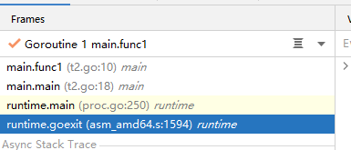

Golang运行过程中，其实所有堆栈底部，都是从goexit 这个函数来开始的。

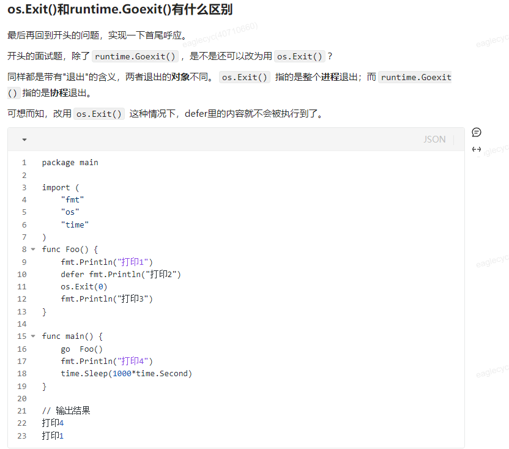

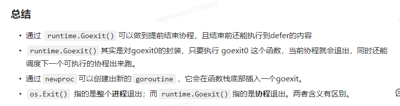


### 7. Slice

```go
type Slice[T any] struct{
    Data *T
    Len int
    Cap int
}
```

Slice 也是一个Struct，使用Slice进行扩容时会修改Data的地址。

Slice进行传递时是值传递，也就是说下面arr传递过去的是一个Slice数组。（左图中函数里的append会触发扩容机制，导致原函数中的arr未被修改，需要改为右图中的调用方式 ）

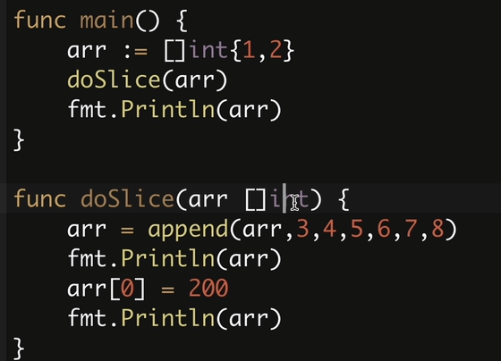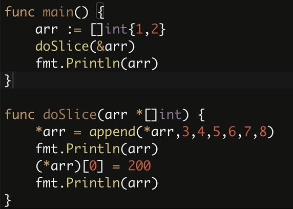

> Slice和数组的区别

1. **长度可变性**：
   - **数组**：数组的长度是固定的，定义数组时需要指定其长度。一旦数组被创建，其长度就无法更改。
   - **切片**：切片的长度是可变的，可以**动态增长或缩小**。切片提供了一个便捷的方式来操作动态数组。
2. **声明方式**：
   - **数组**：使用`[n]T`形式声明一个数组，其中`n`是数组的长度，`T`是数组中元素的类型。
   - **切片**：使用`[]T`形式声明一个切片，其中`T`是切片中元素的类型。
3. **内存分配**：
   - **数组**：数组是一个连续的内存块，其长度在编译时确定，因此在内存中是静态分配的。
   - **切片**：切片在底层引用一个数组，但是切片本身是一个轻量级的结构，其大小可以动态调整。切片的动态性意味着它们需要在堆上分配内存。
4. **传递方式**：
   - **数组**：作为参数传递给函数时，会进行数组的值拷贝，这可能会导致内存开销较大。
   - **切片**：作为参数传递给函数时，传递的是切片的引用，而不是整个切片的拷贝。因此，切片的传递开销较小。
5. **长度和容量**：
   - **数组**：数组的长度是固定的，不能更改。它的长度就是数组中元素的个数。
   - **切片**：切片有长度和容量两个属性。长度是切片当前包含的元素个数，而容量是从切片的开始位置到底层数组末尾的元素个数。切片的容量会根据需要动态增长，但是不能超过底层数组的长度。

### 8. 闭包

​		闭包是一种**创建函数的方法**，这些函数可以访问在其主体之外定义的变量。**闭包是一个可以捕捉其周围环境状态的函数。**这意味着**函数可以访问不在其参数列表中或在其主体中定义的变量。闭包函数可以在外部函数返回后访问这些变量。**

- 创建闭包

在 Go 中，您可以使用匿名函数创建闭包。**创建闭包时，函数会捕获其周围环境的状态**，包括外部函数中定义的任何变量。闭包函数可以在外部函数返回后访问这些变量。

闭包在Go中的基本形式是**函数内定义的函数**，它可以访问并修改函数外部的变量。闭包允许您将函数作为变量传递，将函数定义嵌套在其他函数内部，并且可以捕获并访问其所在的函数范围内的变量。

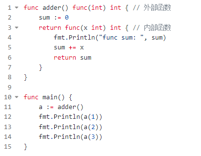

​		adder 是一个返回匿名函数的 加法器函数。 **匿名函数捕获加法器函数中定义的 sum 变量的状态**。每次调用匿名函数时，它都会将参数加到求和变量中，并返回结果。

```GO
返回：
func sum：0
1
func sum：1
3
func sum：3
6
```

### 9. Golang协程、子协程

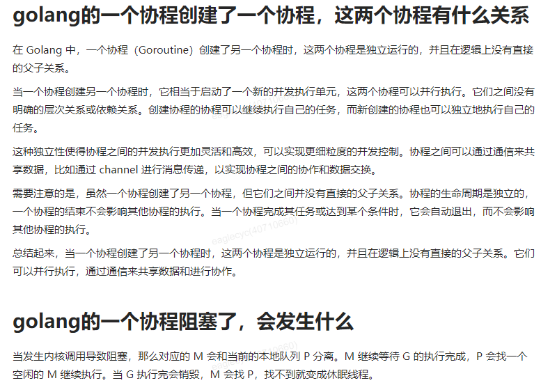


### 10. Context

在Go语言中，`context.Context`是一个接口类型，**用于在函数调用链中传递取消信号、截止时间和请求范围的数据。**它**提供了一种在函数之间传递请求特定的值、取消信号和截止时间的方法。**

`context.Context`**主要用于控制多个Goroutine之间的通信、取消操作和超时控制**。它通常用于以下几种情况：

1. 跨API调用、RPC调用或微服务之间传递请求范围的值。 
2. 控制Goroutine的生命周期，可以取消正在进行的操作。
3. 设置截止时间，以避免长时间运行的操作造成阻塞。

通过`context.Context`，可以在调用链上传递请求范围的值，而不必在每个函数签名中都显式传递。这样可以减少代码的耦合性，并且使得管理和控制请求范围的数据更加方便。

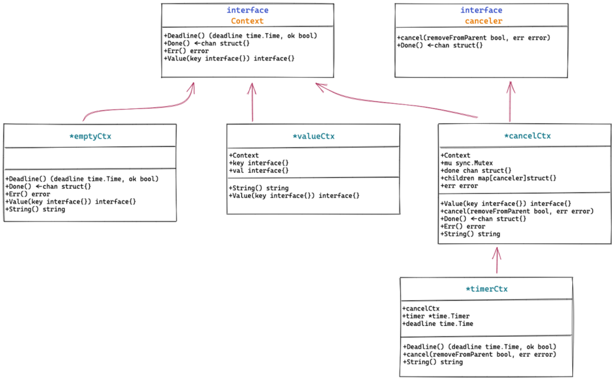

**接口**：

context定义了两个接口，Context和canceler。

emptyCtx 和  valueCtx实现了Context ， cancelCtx同时实现了 Context 和 canceler，timerCtx因为内嵌了cancelCtx，也间接实现了Context和canceler

**Context接口：**

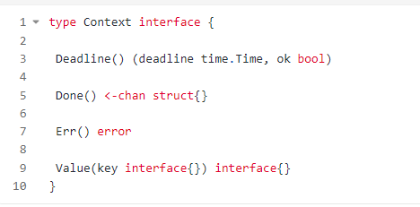

**Context接口有四个方法**，这四个方法都是幂等的，连续多次调用同一个方法，返回的结果都是相同的。

**DeadLine：**返回context被取消的时间，如果没有设置截止时间，返回 false

**Done：**返回一个只读的channel，当Context 被主动取消或者超时自动取消时，该Context及其派生的Context的done channel将会被关闭，读取一个关闭的channel会读取出相应类型的零值，正好利用这一点，与Select配合使用，实现协程控制或者超时退出等

**Err：**返回一个error对象，当channel没有被 close 的时候，返回nil ， 如果channel被close，返回channel被close的原因

**Value：**获取设置的key对应的value，如果不存在则返回nil


**canceler接口：**

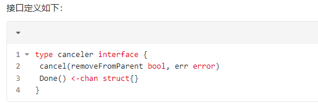

如果一个Context类型实现了上面定义的两个方法，该Context就是一个**可取消的 Context**。Context包中cancelCtx 和 timerCtx 实现了canceler接口，注意这里是指针类型。


### 11. Init 、 main

> Go程序的执行入口是main函数吗？

​		不是，Go程序在启动后会进行一些列的初始化操作，比如初始化内存和栈、初始化调度器（GMP）等，这些初始化都是通过Go汇编完成的，main函数是Go程序中的第一个执行的Goroutine。


### 12. Go Sync包

> sync.Mutex  和 sync.RWMutex

在处理 `goroutine` 时，确保它们**不会同时访问资源**是非常重要的，而 `mutex` 可以帮助我们做到这一点。

> sync.WaitGroup

```go
func main() {
    wg := sync.WaitGroup{}
    for i := 0; i < 500; i++ {
        wg.Add(1)
        go func() {
            defer wg.Done()
            Add()
        }()
    }

    wg.Wait()
    fmt.Println(a)
}
```

`sync.WaitGroup` 有 3 个主要方法：`Add`、`Done` 和 `Wait`。

首先是 `Add(delta int)`：此方法将 `WaitGroup` 计数器增加 `delta` 的值。你通常会在生成 `goroutine` 之前调用它，表示有一个额外的任务需要完成。

如果我们将 `WaitGroup`  放在 `go func() {}` 中，您认为会发生什么？

```go
go func() {
    wg.Add(1)
    defer wg.Done()
    Add()
}()
```

我的编译器喊道，“应该在启动 `goroutine` 之前调用 `wg.Add(1)` 以避免竞争”，我的运行时出现恐慌，`“*panic: sync: WaitGroup is reused before previous Wait has returned*”`。

其他两种方法非常简单：

- 当一个 `goroutine` 结束它的任务时， `Done` 被调用。
- `Wait` 会阻塞调用者，直到 `WaitGroup` 计数器归零，这意味着所有派生的 `goroutine` 都已完成它们的任务。


> sync.Once

sync.Once 是 Go 标准库提供的**使函数只执行一次的实现**，常应用于单例模式，例如初始化配置、保持数据库连接等。作用与 init 函数类似，但有区别。

●init 函数是当所在的 package 首次被加载时执行，若迟迟未被使用，则既浪费了内存，又延长了程序加载时间。

●sync.Once 可以在代码的任意位置初始化和调用，因此可以延迟到使用时再执行，并发场景下是线程安全的。

在多数情况下，sync.Once 被用于控制变量的初始化，这个变量的读写满足如下三个条件：

●当且仅当第一次访问某个变量时，进行初始化（写）；

●变量初始化过程中，所有读都被阻塞，直到初始化完成；

●变量仅初始化一次，初始化完成后驻留在内存里。

sync.Once 仅提供了一个方法 Do，参数 f 是对象初始化函数。

```go
func (o *Once) Do(f func())
```


假设您在一个包中有一个 `CreateInstance()` 函数，但您需要确保它在使用前已初始化。所以你在不同的地方多次调用它，你的实现看起来像这样：

```go
var i = 0
var _isInitialized = false

func CreateInstance() {
    if _isInitialized {
        return
    }

    i = GetISomewhere()
    _isInitialized = true
}
```

但是如果有多个 `goroutine` 调用这个方法呢？ `i = GetISomeWhere` 行会运行多次，即使您为了稳定性只希望它执行一次。

您可以使用我们之前讨论过的互斥锁，但同步包提供了一种更方便的方法：`sync.Once`

```go
var i = 0
var once = &sync.Once{}

func CreateInstance() {
    once.Do(func() {
        i = GetISomewhere()
    })
}
```

使用 `sync.Once`，你可以确保一个函数只执行一次，不管它被调用了多少次或者有多少 `goroutines` 同时调用它。


> sync.Pool

想象一下，你有一个池，里面有一堆你想反复使用的对象。这可以减轻垃圾收集器的一些压力，尤其是在创建和销毁这些资源的成本很高的情况下。

所以，无论何时你需要一个对象，你都可以从池中取出它。当您使用完它时，您可以将它放回池中以备日后重复使用。

```go
var pool = sync.Pool{
    New: func() interface{} {
        return 0
    },
}

func main() {
    pool.Put(1)
    pool.Put(2)
    pool.Put(3)

    a := pool.Get().(int)
    b := pool.Get().(int)
    c := pool.Get().(int)

    fmt.Println(a, b, c) // Output: 1, 3, 2 (乱序)
}
```

`请记住，将对象放入池中的顺序不一定是它们出来的顺序，即使多次运行上述代码时顺序也是随机`。

让我分享一些使用 `sync.Pool` 的技巧：

- 它非常适合**长期存在并且有多个实例需要管理的对象**，例如数据库连接（1000 个连接）、worker goroutine，甚至缓冲区。
- 在将对象返回池之前始终重置对象的状态。这样，您可以避免任何无意的数据泄漏或奇怪的行为。
- 不要指望池中已经存在的对象，因为它们可能会意外释放。

> sync.Map

当同时使用 `map` 时，有点像使用 `RWMutex`。您可以同时进行多次读取，但不能进行多次读写或写入。如果存在冲突，您的服务将崩溃而不是覆盖数据或导致意外行为。

这就是 `sync.Map` 派上用场的地方，因为它可以帮助我们避免这个问题。让我们仔细看看 `sync.Map` 给我们提供什么：

- `CompareAndDelete (go 1.20)`：如果值匹配则删除键的条目；如果不存在值或旧值为 nil，则返回 false。
- `CompareAndSwap（go 1.20）`：如果新旧值匹配，则交换一个键，只要确保旧值是可比较的。
- `Swap (go 1.20)`：交换键的值并返回旧值（如果存在）。
- `LoadOrStore`：获取当前键值或保存并返回提供的值（如果不存在）
- `Range (f func(key, value any)`：遍历映射，将函数 f 应用于每个键值对。如果 f 说返回 false，它会停止。
- `Store`
- `Delete`
- `Load`
- `LoadAndDelete`

Q: 我们为什么不使用带有 `Mutex` 的常规 `map` 呢？

我通常选择带有 `RWMutex` 的 `map`，但在某些情况下认识到 `sync.Map` 的强大功能很重要。那么，它真正发光的地方在哪里呢？

如果您有许多 `goroutines` 访问 `map` 中的单独键，则具有单个互斥锁的常规 `map` 可能会导致争用，因为它仅针对单个写操作锁定整个 `map`。

另一方面，`sync.Map` 使用更完善的锁定机制，有助于最大限度地减少此类场景中的争用。

> sync.Cond

`sync.Cond`是一个条件变量（condition variable）的实现，它**用于在多个goroutine之间进行通信和同步**。条件变量允许goroutine**在满足特定条件时等待或者通知其他goroutine**。

`sync.Cond`通常与`sync.Mutex`结合使用，以实现**在共享数据上的条件等待和通知操作**。条件变量允许goroutine在某些条件为真时等待通知，而不是通过轮询来检查条件是否已满足。

下面是`sync.Cond`的基本用法：

1. 创建`sync.Cond`对象。
2. 在需要等待某个条件的goroutine中，使用`Cond.Wait()`方法来等待条件满足。
3. 在某个goroutine中，使用`Cond.Signal()`或`Cond.Broadcast()`方法来通知等待的goroutine条件已经满足。

```go
func main() {
    var mutex sync.Mutex
    cond := sync.NewCond(&mutex)
    ready := false

    // goroutine 1
    go func() {
        time.Sleep(2 * time.Second)
        mutex.Lock()
        ready = true
        cond.Signal() // 通知等待的goroutine条件已经满足
        mutex.Unlock()
    }()

    // goroutine 2
    mutex.Lock()
    for !ready {
        cond.Wait() // 等待条件满足的通知
    }
    fmt.Println("Condition is met")
    mutex.Unlock()
}
```

在这个例子中，`goroutine 2`等待条件`ready`为true，而`goroutine 1`在一段时间后将`ready`设置为true，并通过`Signal()`方法通知`goroutine 2`条件已经满足，这样`goroutine 2`就可以继续执行了。

总的来说，`sync.Cond`允许在多个goroutine之间进行有效的条件等待和通知，以实现更有效的并发控制。

### 13. 为什么用WaitGroup 而不是Channel？

- `WaitGroups`往往更直观。当你阅读一段代码时，当你看到一个`WaitGroup`时，你会立即知道代码在做什么。方法的名称很明确，而且直奔主题。然而，对于通道来说，有时就不是那么清楚了。使用通道是很聪明的，但当你阅读一段复杂的代码时，理解起来会很麻烦。
- 有的时候，你不需要使用通道。例如，让我们看一下这段代码：

```go
var wg sync.WaitGroup

for i := 0; i < 5; i++ {
    wg.Add(1)
    go func() {
        defer wg.Done()

        fmt.Println(time.Now(), "start")
        time.Sleep(time.Second)
        fmt.Println(time.Now(), "done")
    }()
}

wg.Wait()
fmt.Println(time.Now(), "exiting...")
```

你可以看到，这个`goroutine`并没有与其他`goroutine`进行数据交流。如果你的`goroutine`是一次性的工作，你不需要知道结果，使用`WaitGroup`是可取的。现在看一下这段代码：

```go
ch := make(chan int)

for i := 0; i < 5; i++ {
    go func() {
        randomInt := rand.Intn(10)
        ch <- randomInt
    }()
}

for i := 0; i < 5; i++ {
    fmt.Println(<-ch)
}
```

这里，`goroutine`正在向 `channel` 发送数据。在这些情况下，我们不需要使用`WaitGroup`，因为这将是多余的。如果接收已经做了足够的阻塞，为什么还要等待`goroutine`完成？

`WaitGroups`是专门用来处理等待`goroutines`的。我觉得**通道的主要目的是为了交流数据。你不能用`WaitGroup`来发送和接收数据，但你可以用一个`channel`来同步你的`goroutines`。**

最后，没有正确的答案。我知道这可能很烦人，但这取决于你和你工作的团队。无论什么方法都是最好的，没有答案是错误的。我个人倾向于使用`WaitGroups`进行同步，但你的情况可能有所不同。选择对你来说最直观的东西。

### 14. Select 机制

在 Go 语言中，`select` 是一种**用于处理多个通道操作的控制结构。它可以用于在多个通道之间进行非阻塞的选择操作。**

`select` 语句由一系列的 `case` 子句组成，每个 `case` 子句表示一个通道操作。`select` 语句会按照顺序依次检查每个 `case` 子句，并执行其中可执行的操作。

`select` 的作用主要有以下几个方面：

- **多路复用通道：**`select` 可以同时监听多个通道上的操作，一旦某个通道可读或可写，就会执行相应的操作。这样可以避免使用阻塞的 `channel` 操作，提高程序的并发性能。

- **非阻塞的通道操作：**`select` 语句中的 `case` 子句可以使用非阻塞的通道操作，包括发送和接收操作。如果没有可用的通道操作，`select` 会立即执行 `default` 子句（如果有），或者阻塞等待第一个可执行的操作。

- **超时处理**：通过在 `select` 语句中结合使用 `time.After` 函数和通道操作，可以实现超时机制。例如，可以使用 `select` 监听一个带有超时的通道操作，当超过指定时间时，执行相应的操作。

- **控制并发流程**：`select` 可以与 `goroutine` 结合使用，实现对并发流程的控制。通过在 `select` 中使用通道操作来进行同步或通信，可以协调不同 `goroutine` 之间的执行顺序。

总结：

以下是 `select` 语句的一些特性：

1. 如果没有任何通道操作准备好，且没有默认的 `case` 子句，那么 `select` 语句会被阻塞，直到至少有一个通道操作准备好。
2. 如果有多个 `case` 子句准备好，那么会随机选择一个执行。不会有优先级或顺序的保证。
3. `select` 语句可以用于发送和接收操作，也可以混合使用。
4. `select` 语句可以与 `for` 循环结合使用，以实现对多个通道的连续监控和处理。

`select` 机制是 Golang 中处理并发操作的重要工具之一，它能够很好地处理多个通道操作，避免阻塞和死锁的问题。


1. 聚簇索引和非聚簇索引的区别
2. 怎么避免回表
3. 说说b+树
4. mysql的隔离级别？谈谈可重复读隔离是如何实现的？
5. 谈谈mysql的乐观锁和悲观锁以及适用场景？
6. MySQL 的事务隔离级别，可重复读解决什么，幻读是什么？
7. MySQL 修改数据库某个表的字段用什么指令？
8. 


## 2 Web、项目

1. 介绍一下自己的项目
2. 介绍一下使用 JWT 进行鉴权的过程
3. 说一下 Gin 的拦截器的原理
4. 说一下 Gin 的路由怎么实现的
5. Gin 的路由使用的数据结构（字典树），介绍一下字典树


实习经历做过什么，遇到的困难是怎样的怎么解决，你刚提到的染色环境，你有去了解过吗，架构是怎么样的呢


### 1支撑研发团队选择 Gin 作为 web 框架的原因包括：

-  支持中间件操作（ handlersChain 机制 ）：针对一个请求路径，会有一个handlerChain这样的链条，执行链的方式，实现多个handler的路径处理函数
- 更方便的使用（ gin.Context ）：结合handler可以实现类似拦截器、中间件的能力
- 更强大的路由解析能力（ radix tree 路由树，压缩前缀树 ）


Engine包含的核心内容包括：

```go
type Engine struct {
   // 路由组
    RouterGroup
    // ...
    // context 对象池
    pool             sync.Pool
    // 方法路由树
    trees            methodTrees
    // ...
}
```

- 路由组 RouterGroup：

  ```
  type RouterGroup struct {
      Handlers HandlersChain
      basePath string
      engine *Engine
      root bool
  }
  ```

  RouterGroup 是路由组的概念，其中的配置将被从属于该路由组的所有路由复用：

  - Handlers：路由组共同的 handler 处理函数链. 组下的节点将拼接 RouterGroup 的公用 handlers 和自己的 handlers，组成最终使用的 handlers 链
  - basePath：路由组的基础路径. 组下的节点将拼接 RouterGroup 的 basePath 和自己的 path，组成最终使用的 absolutePath
  - engine：指向路由组从属的 Engine
  - root：标识路由组是否位于 Engine 的根节点. 当用户基于 RouterGroup.Group 方法创建子路由组后，该标识为 false


- Context 对象池 pool：基于 sync.Pool 实现，作为复用 gin.Context 实例的缓冲池.
- 路由树数组 trees：共有 9 棵路由树，对应于 9 种 http 方法. 路由树基于压缩前缀树实现


### 2. 服务熔断

-  服务熔断是一种软件设计模式，**用于分布式系统中处理服务调用失败的情况，**可以防止被调用服务因为频繁失败被压垮。它借鉴了电路中的断路器原理，通过监控服务调用的失败率等条件来决定是否阻止进一步的调用，以保护系统免受过载。
- 服务熔断器有三个主要状态：`关闭（Closed）`、`半开（HalfOpen）`和打开`（Open）`，分别对应不同的保护策略。当服务调用失败次数超过阈值时，熔断器打开，阻止服务调用。在一定时间后，熔断器尝试半开状态，允许少量请求通过以测试服务恢复情况。如果服务恢复，熔断器关闭；如果失败，熔断器保持打开状态。
- 在 go 语言里可以使用 `sentinel-golang` 库实现熔断功能。


## 3 Linux

### 1. 常用命令

> 如何查看当前目录

**pwd**  终端将显示当前工作目录的完整路径。


> 如何查看一个文件

**cat命令：** 用于显示整个文件的内容

**head命令：** 用于显示文件的前几行，默认为前10行。

**tail命令：** 用于显示文件的最后几行，默认为最后10行。常用于查看日志文件。

**vim或vi命令：** 一个文本编辑器，但也可用于查看文件。按`Esc`键，然后输入 `:q` 退出。


> 如何删除一个文件

**rm**   命令来删除文件

**rm -r dirname**  删除一个目录及其内容，可以使用`-r`选项（表示递归删除）


> 如何创建一个文件 文件夹

**touch filename**：创建一个文件

**mkdir**  命令来创建一个文件夹


> 如何文件重命名

**mv**  命令来重命名文件或将文件移动到另一个目录

mv oldfilename newfilename


> 现在有一个txt文件，如何查看后三行

**tail -n 3 filename.txt**


> 如何查看这个文件里包含“abc”字段的内容

**grep** 命令来查找包含特定文本字符串的行

grep "abc" filename.txt

如果你想**忽略大小写**，可以使用`-i`选项：grep -i "abc" filename.txt


> 怎么看cpu使用 内存使用呢 内存里buffer和cache你讲一下

**top命令：** 提供实时的系统性能统计，包括CPU使用情况

**free命令：** 显示系统内存使用情况。`-h`选项以人类可读的格式显示内存大小。

**vmstat命令：** 提供有关虚拟内存、进程、块I/O等的统计信息。

**内存中的Buffer和Cache：**

- **Buffer：** 缓冲区是用于存储文件数据的临时存储区域，以提高对磁盘的读取性能。当系统读取文件时，数据被缓存到内存中的缓冲区，从而加速后续的读取操作。
- **Cache：** 缓存存储的是最近被访问的数据块，以便更快地访问这些数据。与缓冲区不同，缓存通常包括系统的页缓存和文件系统缓存。


> 怎么看进程信息 如何看进程pid

**ps命令：** 提供当前运行进程的快照。显示详细的进程信息，包括用户、PID、CPU使用、内存使用等。

**ps -ef**：

- `-e`: 显示所有进程，包括其他用户的进程。
- `-f`: 显示完整的格式，包括进程的详细信息。

**top命令：** 提供实时的系统性能统计，包括进程信息。

### 2. select、poll、epoll模型


### 3. Reactor模式

**为了保证Redis性能，Redis使用的是基于epoll的Reactor模式，Reactor模式可以看作是一个分发器+一堆处理器。Reactor模式会发起epoll之类的系统调用，如果是读写事件，那么就交给Handler处理，如果是连接事件，那么就交给Acceptor处理。**

**Redis是单线程模型，所以Reactor、Handler、Acceptor其实都是一个线程**

整个过程是这样的：

Redis中的Reactor调用epoll，拿到符合条件的文件描述符

假如说Redis拿到了可读写的文件描述符，就会执行对应的读写操作，如果Redis拿到了创建连接的文件描述符，就会完成连接的初始化，然后准备监听这个连接上的读写事件。

后面Redis6.0之后，Redis改成了多线程模型，但基本原理还是Reactor+epoll


Reactor 模式也是广泛使用的 IO 模式，它的性能很好，Redis 也用了 Reactor 模式。

用一句话来说明 Reactor 模式：**一个分发器 + 一堆处理器。**

一般来说，客户端和服务端的 IO 交互主要有两类事件：**连接事件和读写事件**。那么 Reactor 里面的分发器就是把连接事件交给 Acceptor，把读写事件交给对应的 Handler。这些 Handler 最终会调用到你真正需要读写数据的业务代码。

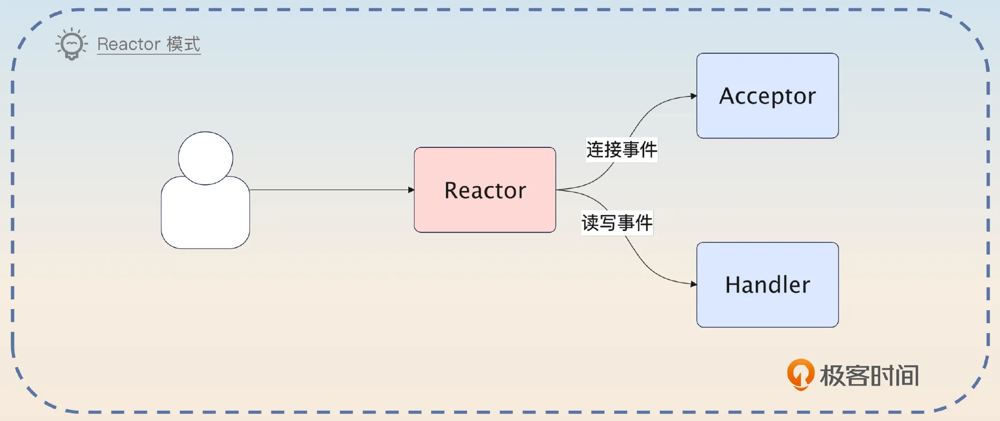

结合前面讲的 epoll，你基本上就能猜到，Redis 的 Reactor 就是调用了 epoll，**拿到创建连接的套接字，或者可读写的套接字，转发给后面的 Acceptor 或者 Handler**。

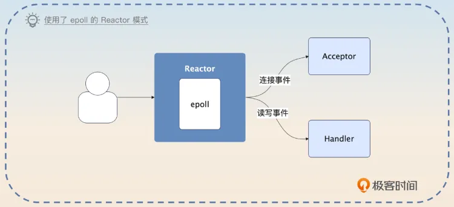

在搞清楚这一点之后，接下来你就能够理解各种 Reactor 的变种了。变种基本上可以分成三类。

- 把 Accetor 做成多线程。
- 把 Handler 做成多线程。
- 把 Reactor 做成多线程。Reactor 的主线程只监听连接创建的事件，监听到了就交给其他线程处理。其他线程则是监听读写事件，然后调用对应的 Handler 处理。

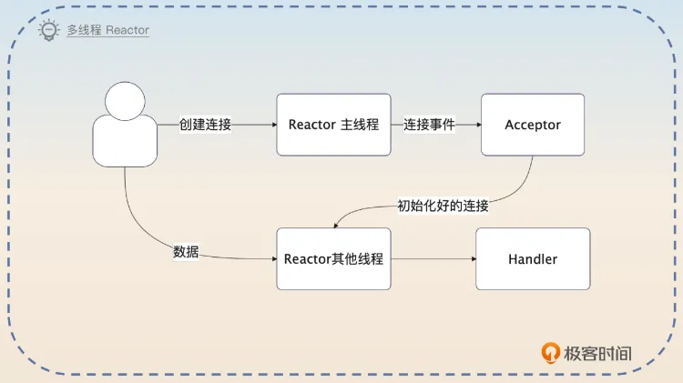

> Redis 为什么引入多线程？

Redis 在 6.0 引入多线程的原因只有一个，**在高并发场景下可以利用多个线程并发处理 IO 任务、命令解析和数据回写**。这些线程也被叫做 IO 线程。默认情况下，多线程模式是被禁用了的，需要显式地开启。

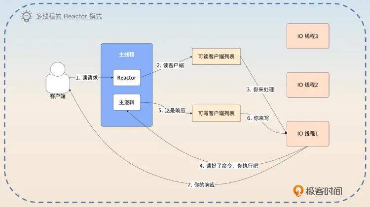

当 Redis 启用了多线程之后，里面的主线程就要负责接收事件、创建连接、执行命令。Redis 的 IO 线程就负责读写数据。

我用一个请求的处理过程来解释一下整个设计。当客户端发出请求的时候，主线程会收到一个可读的事件，于是它把对应的客户端丢到可读的客户端列表。一个 IO 线程会被安排读写这个客户端发过来的命令，并且解析好。紧接着主线程会执行 IO 线程解析好的命令，并且把响应放回到可写客户端列表里面。IO 线程负责写回响应。整个过程就结束了。

所以整个 Redis 在多线程模式下，可以看作**是单线程 Reactor、单线程 Acceptor 和多线程 Handler 的 Reactor 模式。**只不过 Redis 的主线程同时扮演了 Reactor 中分发事件的角色，也扮演了接收请求的角色。同时多线程 Handler 在 Redis 里面仅仅是读写数据，命令的执行还是依赖于主线程来进行的。

虽然说现在 Redis 的 IO 改成多线程之后能够有效利用多核性能，**但是大部分情况下都是不推荐使用多线程模式的。**道理很简单，Redis 在单线程模式下的性能就足以满足绝大多数使用场景了，那么用不用多线程已经无所谓了。


