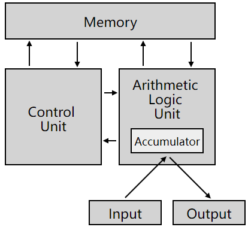
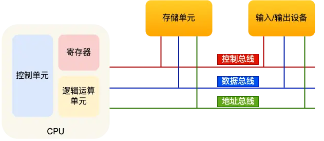
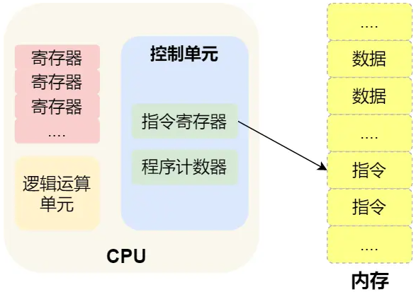
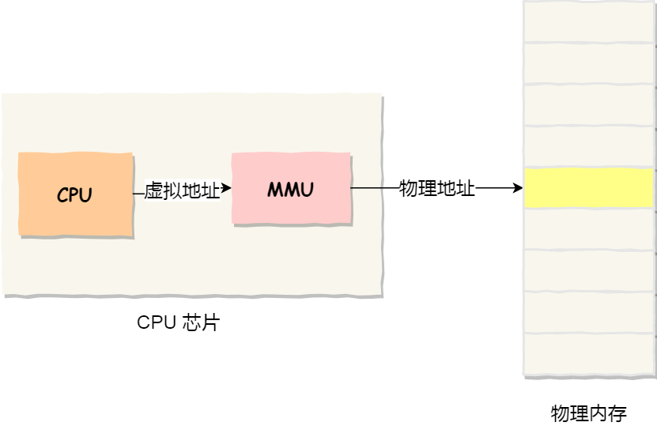
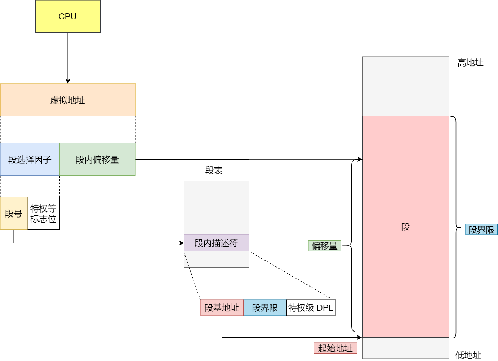
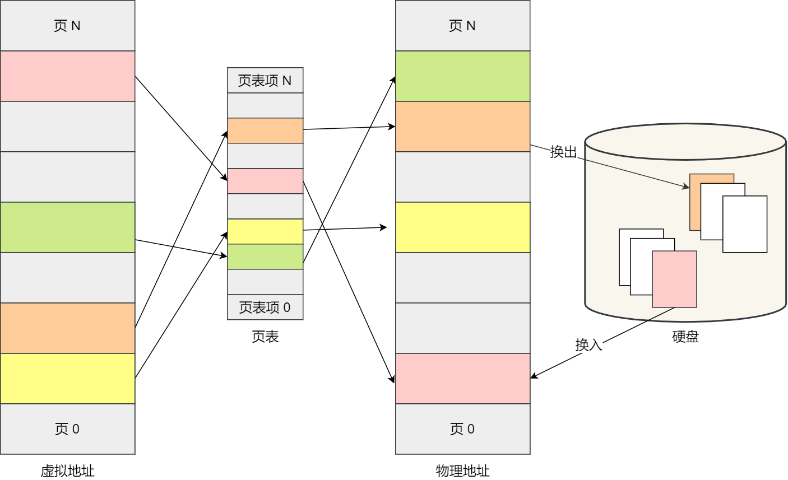

# 硬件结构

## 1. 冯诺伊曼模型

冯诺伊曼模型遵循图灵机的设计，定义了计算机基本结构为5个部分，分别是**运算器、控制器、存储器、输入设备、输出设备**

**CPU**：

32位和64位CPU的最主要区别在于 一次能计算多少字节数据：

- 32 位CPU一次可以计算4个字节
- 64 位CPU一次可以计算8个字节

CPU内部还有一些组件，常见的有**寄存器、控制单元和逻辑运算**单元。其中，控制单元负责控制CPU工作，逻辑运算单元负责计算，而寄存器可以分为多种，常见的寄存器有：

- *通用寄存器*，用来存放需要进行运算的数据，比如需要进行加和运算的两个数据。
- *程序计数器*，用来存储 CPU 要执行下一条指令「所在的内存地址」，注意不是存储了下一条要执行的指令，此时指令还在内存中，程序计数器只是存储了下一条指令「的地址」。
- *指令寄存器*，用来存放当前正在执行的指令，也就是指令本身，指令被执行完成之前，指令都存储在这里。

## 2. 程序执行的基本过程

那 CPU 执行程序的过程如下：

- 第一步，CPU 读取「程序计数器」的值，这个值是指令的内存地址，然后 CPU 的「控制单元」操作「地址总线」指定需要访问的内存地址，接着通知内存设备准备数据，数据准备好后通过「数据总线」将指令数据传给 CPU，CPU 收到内存传来的数据后，将这个指令数据存入到「指令寄存器」。
- 第二步，「程序计数器」的值自增，表示指向下一条指令。这个自增的大小，由 CPU 的位宽决定，比如 32 位的 CPU，指令是 4 个字节，需要 4 个内存地址存放，因此「程序计数器」的值会自增 4；
- 第三步，CPU 分析「指令寄存器」中的指令，确定指令的类型和参数，如果是计算类型的指令，就把指令交给「逻辑运算单元」运算；如果是存储类型的指令，则交由「控制单元」执行；

**总结：**

**程序执行的时候，CPU会根据程序计数器里的内存地址，从内存里把需要执行的指令读取到指令寄存器里，然后根据指令长度自增，开始顺序读取下一条指令。**

CPU从程序计数器读取指令、到执行、再到下一条指令，这个过程会不断循环，直到程序执行结束，这个不断循环的过程被称为**CPU的指令周期**。

# 内存管理

## 1. 虚拟内存

让操作系统为每个进程分配独立的一套「**虚拟地址**」，人人都有，大家自己玩自己的地址就行，互不干涉。

但是有个前提每个进程都不能访问物理地址，至于虚拟地址最终怎么落到物理内存里，对进程来说是透明的，操作系统已经把这些都安排的明明白白了。

**操作系统会提供一种机制，将不同进程的虚拟地址和不同内存的物理地址映射起来。**

- 我们程序所使用的内存地址叫做**虚拟内存地址**（*Virtual Memory Address*）
- 实际存在硬件里面的空间地址叫**物理内存地址**（*Physical Memory Address*）。

操作系统引入了虚拟内存，进程持有的虚拟地址会通过 **CPU 芯片中的内存管理单元（MMU）**的映射关系，来转换变成物理地址，然后再通过物理地址访问内存，如下图所示：

## 2. 内存分段

程序是由若干个逻辑分段组成的，如可由代码分段、数据分段、栈段、堆段组成。**不同的段是有不同的属性的，所以就用分段（Segmentation）的形式把这些段分离出来。**

分段机制下的虚拟地址由两部分组成，**段选择因子**和**段内偏移量**。

段选择因子和段内偏移量：

- **段选择子**就保存在段寄存器里面。段选择子里面最重要的是**段号**，用作段表的索引。**段表**里面保存的是这个**段的基地址、段的界限和特权等级**等。
- 虚拟地址中的**段内偏移量**应该位于 0 和段界限之间，如果段内偏移量是合法的，就将**段基地址加上段内偏移量得到物理内存地址。**

内存分段存在的问题：

- 产生**内存碎片**
- 段的大小需要在编译时确定，这限制了动态内存分配。
- **内存交换效率低**：如果内存交换的时候，交换的是一个占内存空间很大的程序，这样整个机器都会显得卡顿。

## 3. 内存分页

为了解决内存分段的「外部内存碎片和内存交换效率低」的问题，就出现了内存分页。

分页是**把整个虚拟和物理内存空间 切成一段固定尺寸的大小**。这样一个连续并且尺寸固定的内存空间，叫做页。

页表是存储在内存里的，**内存管理单元（MMU）就做将虚拟内存转换为物理地址的工作。**

而当进程访问的虚拟地址在页表中查不到时，系统会产生一个**缺页异常**，进入系统内核空间分配物理内存、更新进程页表，最后再返回用户空间，恢复进程的运行。

> 分页是怎么解决分段的「外部内存碎片和内存交换效率低」的问题？

内存分页由于内存空间都是预先划分好的，也就不会像内存分段一样，在段与段之间会产生间隙非常小的内存，这正是分段会产生外部内存碎片的原因。而**采用了分页，页与页之间是紧密排列的，所以不会有外部碎片。**

但是，因为内存分页机制分配内存的最小单位是一页，即使程序不足一页大小，我们最少只能分配一个页，所以页内会出现内存浪费，所以针对**内存分页机制会有内部内存碎片**的现象。

如果内存空间不够，操作系统会把其他正在运行的进程中的「最近没被使用」的内存页面给释放掉，也就是暂时写在硬盘上，称为**换出**（*Swap Out*）。一旦需要的时候，再加载进来，称为**换入**（*Swap In*）。所以，一次性写入磁盘的也只有少数的一个页或者几个页，不会花太多时间，**内存交换的效率就相对比较高。**

更进一步地，分页的方式使得我们在加载程序的时候，不再需要一次性都把程序加载到物理内存中。我们完全可以在进行虚拟内存和物理内存的页之间的映射之后，并不真的把页加载到物理内存里，而是**只有在程序运行中，需要用到对应虚拟内存页里面的指令和数据时，再加载到物理内存里面去。**

