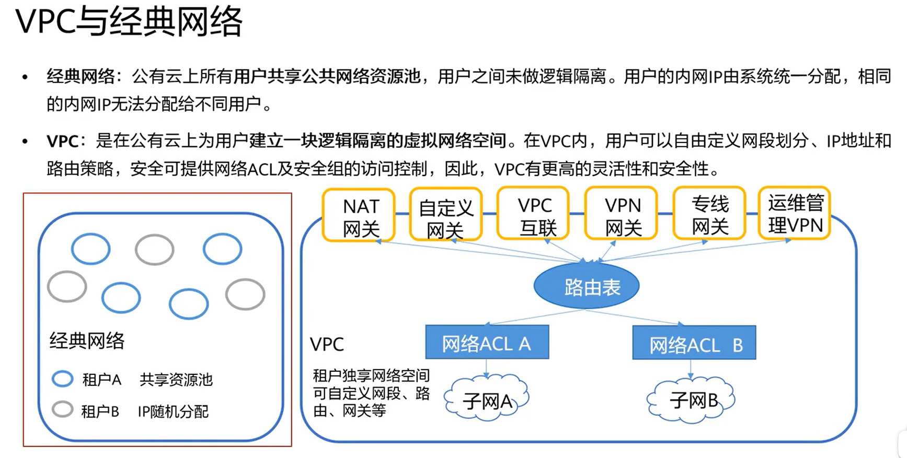
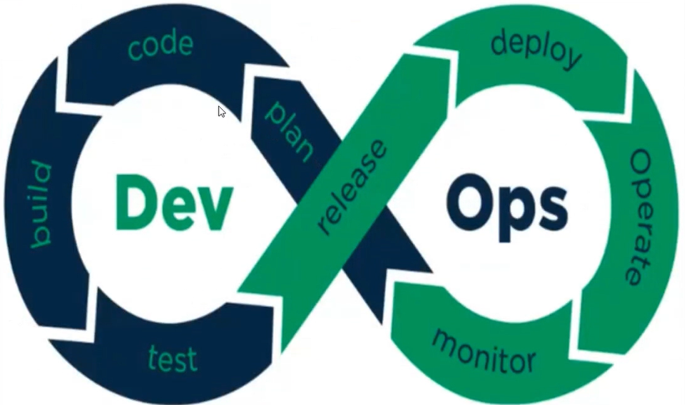
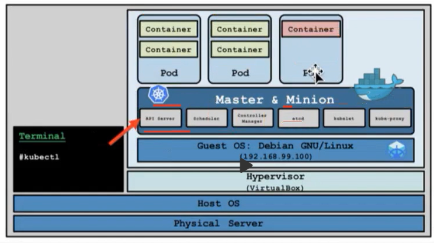
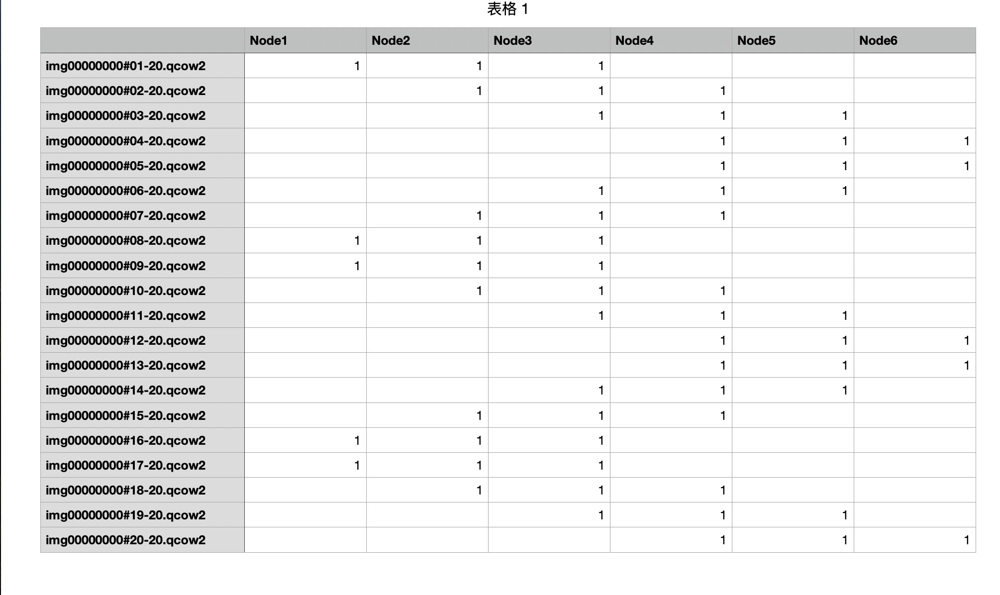

# 1 云原生

## 1.1 什么是云原生

**云计算：**

1. 通过互联网来提供计算资源（服务器、存储、网络等资源）
2. 大量的基础设施进行统一管理，（虚拟化技术，形成一个可以动态分配资源的平台）按需购买，可以大大降低用户的使用成本。
3. 云上的资源不仅包括基础设施，在云上搭建的开放平台、应用等都可以作为一种服务提供给用户，这就是Paas（Platform as a Service）和Saas（Software as a Service）。根据云服务的开放范围，又可以分为公有云、私有云、混合云

**云原生：（Cloud Native）**

如果说一个Cloud Native Application就是指从设计开始就是为了部署在云环境上的。

云原生是一种系统化的方法论和技术的集合，经过不断地演进与发展，目前云原生的核心主要是：**微服务、容器、服务网格、不可变基础设施和声明式API**这五大关键技术。


单体应用---> 拆分 前后端分离  --> 微服务  --> 容器化 --> 容器编排（K8S） --> 服务网格

## 1.2 公有云、私有云

公有云是指第三方提供商：腾讯、阿里、华为等通过公共Internet：服务器、算力、存储、网络等。。。为用户提供的云服务，公有云服务的模式可以是免费或者按量付费。

公有云的**核心属性是共享资源服务（购买大量的服务器，在不同区域配置，实现灾备、降温...）**。第三方提供商将共享的计算、存储、网络等资源按量提供给用户。对于用户来说，由于不需要进行初始IT基础设施投资就可以通过按需付费的方式享受IT服务。

- **公有云的架构**

公有云常见的架构包含包含IaaS（Infrastructure as a Service，基础设施即服务）、PaaS（Platform as a Service，平台即服务）、SaaS（Software as a Service，软件即服务）、运维、运营、安全六大部分。

**IaaS层**主要是将**计算、存储、网络资源的抽象化后将资源提供给用户使用**，并根据实际运用需求，提供对应服务。

**PaaS层**基于IaaS层为用户提供容器服务、微服务开发等服务，即将一个开放平台作为服务提供给用户。 

**SaaS层**主要提供场景化的应用，即将应用作为服务提供给用户，单一软件服务的提供。

**在运维层面**，公有云提供面向用户侧和面向平台侧的运维能力。公有云为使用云服务的用户提供用户运维能力，例如**权限控制、性能监控，状态监控，故障告警**等。而在平台侧，是由公有云保障团队进行运维，保障平台的高可靠性、高可用性及安全性等。

**在运营层面**，公有云提供面向用户侧和面向平台侧的运营能力。**用户拥有提交工单、订单、计费等运营能力**，以协助用户了解运营成本、分析业务趋势。公有云运营团队对用户的工单、投资进行处理与**管控**，同时对于公有云的整体收入进行可视化管理。

**在安全层面**，公有云需要提供系统安全、平台安全、运维安全及**网络安全**等方面需求，**以保障用户及云服务提供商的数据财产安全**。

- **公有云与私有云的比较**

企业部署云计算服务的模式有三大类：公有云、私有云、**混合云**。其中，私有云是企业自己建设的为企业内部提供服务的一种云计算使用方式。**私有云为一个企业单独使用而构建，可部署在企业的数据中心中**，也可统一部署在云平台业务提供商的机房。

**总体对比，与私有云相比，公有云具备以下优点：**

**1.更高的弹性和可扩展性**：使用公共云，客户可以快速订购计算、存储和网络资源来应对激增的业务需求，而无需购买和部署新的硬件。

**2.更低的进入成本**：大多数客户可以无需添加自己的物理基础设施就可以使用公共云服务。

**3.更快地获取最新技术**：在许多情况下，与客户自己购买和安装硬件和软件相比，公有云提供商能够更快地提供最新的硬件和软件，及其对应的升级更新。

与公有云相比，**私有云的安全性更好，但成本也更高**，且私有云整个基础设施的平均利用率要低于公有云

根据业务需求来设定。大部分业务，其实都可以部署在公有云上。


- **建设与运行模式对比**

1.公有云是一种新的IT能力消费模式，公有云的用户只需关注云服务所提供的能力，并不关注背后的资源所在地，以及建设、交付、运维等问题。公有云用户可以快速租用资源，部署自己的业务，前期投入低，业务上线周期短。在运维层面，公有云提供商提供大部分运维服务，公有云用户只需要关注自身的应用。

2.**私有云的资产归属该组织拥有，由该组织主导云的建设、管理和维护，部署在该组织内部的数据中心。**私有云前期建设投入成本较多，建设和调试周期较长。私有云的运维一般需要该组织自身完成。


- **架构对比**

从架构上看，一般认为私有云的IaaS、PaaS能力是公有云IaaS层、PaaS层能力的子集。由于私有云是满足某组织的具体业务需求构建的，因此不需要将IaaS、PaaS的能力全部都纳入私有云，该组织不使用的能力，可以不部署。例如该组织只使用虚拟机服务，不使用裸金属服务，则该私有云中可以不部署裸金属服务。

公有云架构中除了IaaS、PaaS以外，还有SaaS、运营等主要能力。

公有云一般均提供SaaS能力，但是在私有云中，却不一定会部署SaaS软件。当SaaS软件私有化部署后，私有云拥有者需要投入大量的资源去维护SaaS软件，在成本上比使用公有云版本的纯SaaS服务要高得多。在实际部署中，不论是公有云、私有云、混合云，其部署都是基于不同客户的需求制定的SaaS实施方案，主要取决于客户对于安全、成本、维护等各个因素的综合考虑。

由于私有云的私有属性，**在私有云的组织内部一般不涉及费用计算问题**，此时不涉及运营。而公有云需通过各种模式向其用户收费，因此其运营能力是必选项。


- **业务类型对比**

1.公有云中一般部署非核心业务、需要快速迭代的业务、对外部提供服务的业务。  小公司，简单业务

2.**私有云中一般部署该组织的核心业务、设涉及到信息安全等级高的业务**。 高机密业务

3、混合云  ，兼容兼备。主要考虑成本问题。


## 1.3 VPC：虚拟私有云

虚拟私有云（Virtual Private Cloud）是用户在公有云上**申请的隔离的、私密的虚拟网络环境**。用户可以自由配置VPC内的IP地址段、子网、安全组等子服务，也可以申请弹性带宽和弹性IP搭建业务系统。



## 1.4 DevOps

DevOps是一种思想或方法论，它涵盖开发、测试、运维的整个过程。

DevOps强调软件开发人员与测试、软件运维、质量保证部门之间的有效沟通协作

强调通过自动化的方法管理软件变更，软件集成

使软件从构建到测试、发布更加快捷、可靠，最终按时交付软件



  # 2 Docker

## 1. Docker架构


从上图得知，Docker分为三部分，`客户端`，`Docker服务端`，`仓库`。

### 1.1 客户端

平常我们使用的就是客户端，通过客户端`命令`和Docker引擎进行交互

Docker 是一个客户端-服务器（C/S）架构程序。

Docker 客户端只需要向 Docker 服务端发起请求，服务端将完成所有的工作并返回相应结果。

Docker 提供了一个命令行工具 `docker` 以及一整套 RESTful API。

比如：

~~~shell
docker pull 
docker run 
~~~

**客户端可以和服务端在一台宿主机上，也可以不在**

### 1.2 Docker服务端

Docker服务端 又称为Docker主机，Docker引擎，Docker守护进程。

依托于`宿主机`，守护进程，用于管理镜像，容器，执行客户端命令等。

### 1.3 仓库Registry 

Docker有两个重要的概念`镜像`和`容器`。

镜像可以理解为就是软件安装包，容器就是软件安装完成后可运行的状态。

既然镜像是软件安装包，那么这个安装包从哪下载呢？

Docker推出了`Registry`这个概念，一般有人也称为是 注册中心，当我们需要发布Docker镜像（Docker专用软件安装包）的时候，就需要将镜像发布到注册中心上，这样其他人就可以下载使用。

Registry 分为`公共`和`私有`两种。Docker 公司运营公共的 Registry 叫做 `Docker Hub`，地址为：[https://hub.docker.com](https://hub.docker.com/)

* 一个 Docker Registry 中可以包含多个仓库（Repository）

* 每个仓库可以包含多个标签（Tag）

* 每个标签对应一个镜像

通常，一个仓库会包含同一个软件不同版本的镜像，而标签对应该软件的各个版本。我们可以通过 **「<仓库名>:<标签>」** 的格式来指定具体是这个软件哪个版本的镜像。如果不给出标签，将以 **「latest」** 作为默认标签。

## 2. 镜像

上面我们提到，`镜像可以理解为就是软件安装包`，但是这个软件安装包和我们理解意义上是不一样的，一个Docker镜像是`一个完整的操作系统的描述`。

什么意思呢？

就是一个Docker镜像描述了，`需要运行的程序以及运行程序所处的操作系统`

那不同的镜像区别在哪里呢？**镜像中的操作系统中安装的软件不同，运行的程序不同。**

当然镜像只是一个可执行的包，其中包括运行应用程序所需要的所有内容：包含代码，运行时间，库，环境变量和配置文件等。

真正运行，我们需要`通过镜像启动容器`。

**容器才是真正的可运行的操作系统。**

Docker 把 App 文件打包成为一个镜像，并且采用类似多次快照的存储技术，可以实现：

- 多个 App 可以共用相同的底层镜像（初始的操作系统镜像）；
- App 运行时的 IO 操作和镜像文件隔离；
- 通过挂载包含不同配置/数据文件的目录或者卷（Volume），单个 App 镜像可以用来运行无数个不同业务的容器。

## 3. 容器

镜像（Image）和容器（Container）的关系，就像是面向对象程序设计中的类和实例一样，镜像是静态的定义，容器是镜像运行时的实体。

容器可以被创建、启动、停止、删除、暂停等。

**注意：容器运行需要指定镜像，当容器运行后，一个容器就相当于一个虚拟的完整的操作系统，比如你通过mysql的镜像来安装mysql，当mysql的容器启动后，就相当于开启了一个操作系统，mysql只是安装在此容器内部的操作系统中，我们可以进入容器内部操作mysql（和正常操作系统一致），也可以通过docker命令来操作**

## 4. 安装docker

官方文档教程：https://docs.docker.com/engine/install/centos/


1. 卸载原有的版本

   ~~~shell
    sudo yum remove docker \
                     docker-client \
                     docker-client-latest \
                     docker-common \
                     docker-latest \
                     docker-latest-logrotate \
                     docker-logrotate \
                     docker-engine
   ~~~

   

2. 安装 `yum-utils` 

   ~~~shell
   sudo yum install -y yum-utils
   ~~~

3. 添加阿里云镜像

   ~~~shell
   yum-config-manager --add-repo http://mirrors.aliyun.com/docker-ce/linux/centos/docker-ce.repo
   ~~~

4. 安装

   ~~~shell
   sudo yum install docker-ce docker-ce-cli containerd.io
   ~~~

5. 启动并加入开机启动

   ~~~shell
   sudo systemctl start docker
   
   sudo systemctl enable docker
   ~~~


# 3 Kubernetes

## 3.1 Minikube架构



master节点与其它节点合为一体，而整体则通过宿主机上的kubectl进行管理，这样更节省资源


# 4 Jenkins

## 4.1 Jenkins基本指令

```shell
pipeline {
	agent any  // agent : 环境
	stages{  // 步骤集合
		stage('Build'){ //分步骤
			steps{ // 具体的步骤
				sh 'echo "hello hello"'
			}
		}
		stage('Test'){ //分步骤
			steps{ // 具体的步骤
				sh 'echo "hello hello"'
			}
		}
	}
}
```

1. **超时、重试机制：**

```shell
retry(3){ // 连续执行3次，如果不成功就停止 （steps中）
	sh './strat.sh'
}

timeout(time: 10 ,unit: 'SECONDS'){ // 超时问题
	sh 'ping www.baidu.com'
}
```

2. **钩子函数**

pipe执行到某个步骤的时候，做一些事情：

```shell
pipeline {
	agent any
	stages {
		state('Test'){
			steps {
				sh 'echo "fail !";exit 1'
			}
		}
	}
	// 钩子函数，比如执行结果不同，做一些善后工作
	post {
		always{}
		success{}
		failure{}
		unstable{}
		changed{}
	}
}
```

3. **agent定义执行环境**

agent指令**告诉  Jenkins 在哪里以及如何执行Pipeline或者Pipeline子集**。所有的Pipeline都需要agent指令。

agent默认环境是any

agent也可以指定一个Docker环境：

```
agent{
	docker {image 'node:7-alpine'}
}
```

4. **环境变量**

公共的一些环境：

```shell
pipeline {
	agent any
	// 环境变量
	environment{
		DB_PASSWORD = '123456'
		DB_ENGINE = 'sqllite'
	}
	
	stages{ // 多步骤
		stage('Test'){
			steps {
				sh 'printenv'
			}
		}
	}
}
```

 ## 4.2 WebHook

Web的钩子函数

 逻辑：提交代码后，Jenkins能够感知到代码提交了，流水线工程（项目打包、构建镜像、运行容器、测试接口、人工确认、部署上线） 就自动执行。

 


# 5 异构计算

## 5.1 异构计算和分布式计算是什么？有什么区别？

**异构计算（Heterogeneous Computing）**

异构计算指的是**在一个系统中使用不同类型的计算单元或处理器协同工作来执行计算任务**。这些计算单元可能包括CPU、GPU、FPGA（现场可编程门阵列）和其他专用处理器。异构计算的**目的是利用各种处理器的特点，将特定的任务分配给最适合它们的处理器，从而提高效率和性能。**

特点:

- 结合了多种类型的处理器或计算资源。
- 旨在通过将任务分配给最适合的处理器来优化性能和能效。
- 常见于高性能计算、图形处理和大数据分析等领域。

**分布式计算（Distributed Computing）**

分布式计算指的是**在物理上分离的多个计算节点上协同完成计算任务的过程**。这些节点通过网络相连，共同工作以完成一个共同的目标。分布式计算可以提高计算效率，增加容错能力，并允许在多个计算资源之间分配工作负载。

特点:

- 包含多个物理分散的计算节点。
- 节点之间通过网络通信协作解决问题。
- 用于处理大规模计算问题，如云计算、网格计算和大规模在线处理。

**主要区别**

- **计算资源的异质性 vs 同质性**：异构计算侧重于**不同类型的计算资源协同工作**，而分布式计算通常**涉及多个相似或同质的计算节点。**
- **物理结构**：异构计算通常在单个物理系统或紧密连接的几个系统中进行，而分布式计算涉及网络连接的多个分散的计算节点。
- **目标和应用**：异构计算旨在利用不同计算资源的特点以提高特定任务的效率，而分布式计算旨在通过在多个节点之间分配工作来处理大规模或复杂的计算问题。

## 5.2 GPU-GPU异构NUMA体系结构

​		GPU-GPU异构NUMA（Non-Uniform Memory Access）体系结构是一种高级计算架构，设计用于优化多GPU系统中的内存访问和计算效率。这种架构特别适用于拥有多个GPU的系统，其中每个GPU都有自己的本地内存，而且这些GPU之间的内存访问速度可能不同，导致非一致性的内存访问行为。

​		利用页锁定内存的共享特性，设计适合这种结构的程序设计模型将会是GPU计算的一个全新方向，即**共享内存式GPU程序设计**。共享内存式GPU程序设计将CPU与同一个系统中的多个GPU看作通过共享的页锁定内存紧耦合的非对称多处理器系统，并通过页锁定内存中的共享区域实现CPU与GPU之间的高效同步和通信。


# 其它

数学题： 

1个镜像文件以20分片形式分布到6个节点上，每个分片有3副本。现在想要从所有分片中取一个完整的镜像文件，问怎么取能让请求在节点上分布尽量均衡。




​                                                                                                                                                                                 


