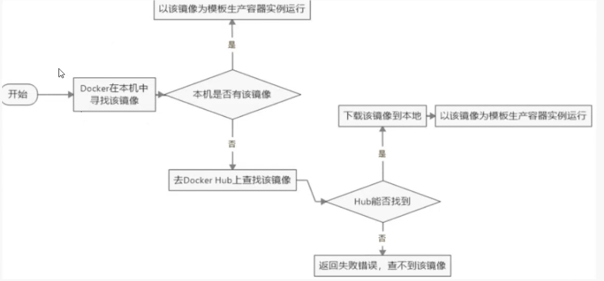
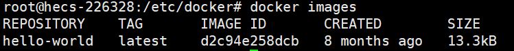
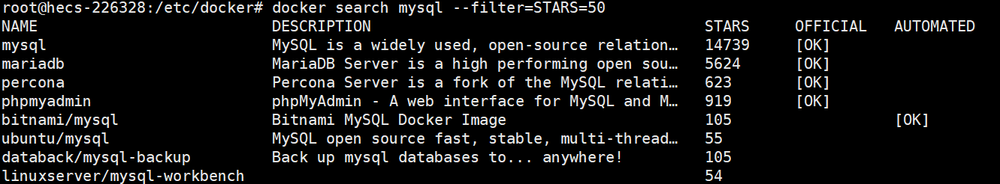
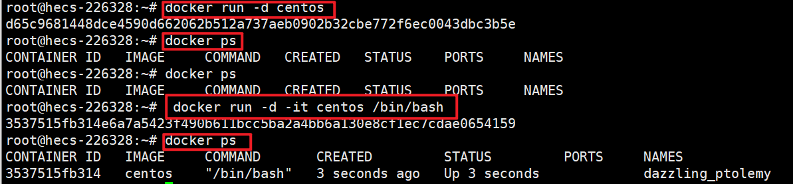
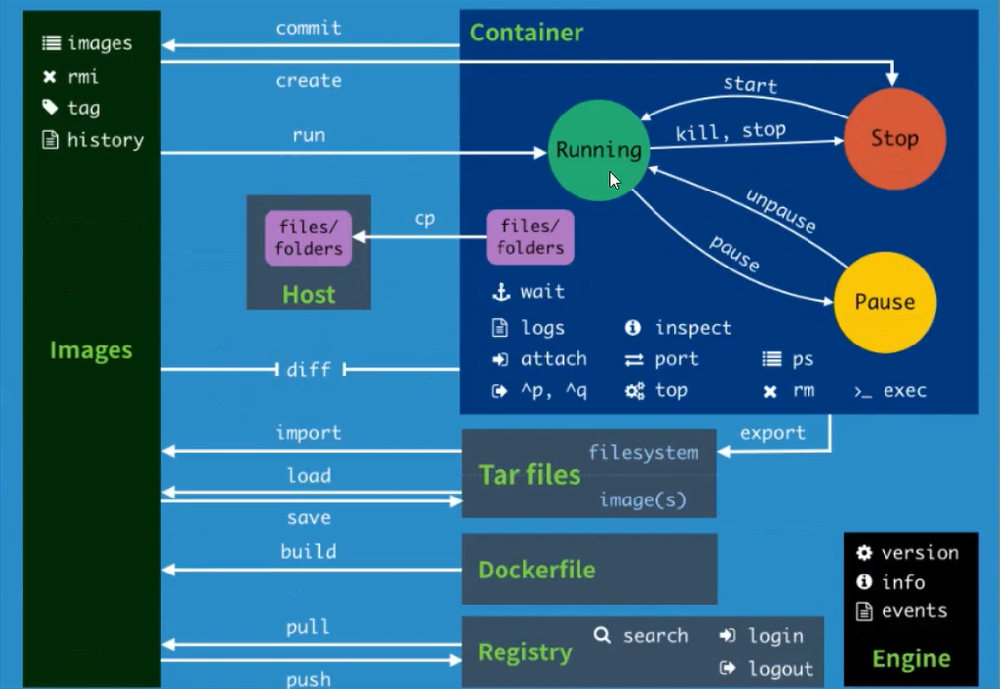
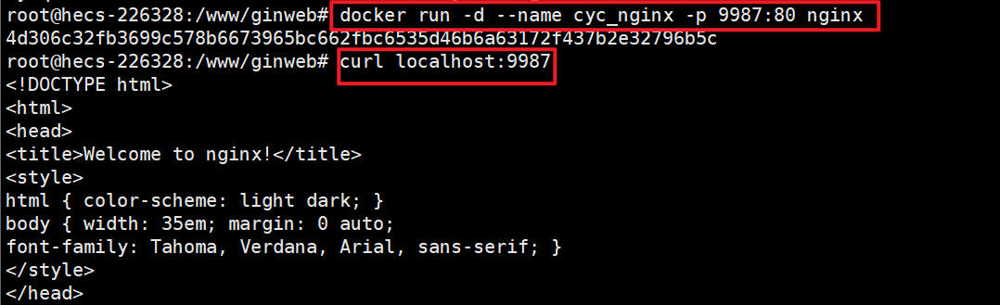
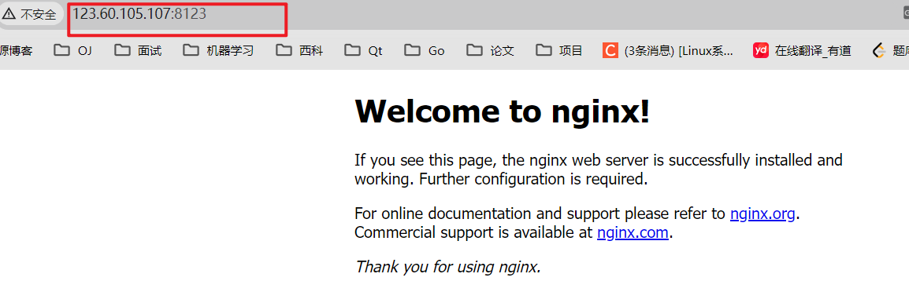

# 1. Docker基础

## 1.1 Docker几个概念

- **镜像（Image）**：**（模板）**

1、安装环境 2、配置环境变量  3、部署项目  4、项目需要使用的文件  5、对外暴露的文件……

把上面所有这些东西封装起来，就是镜像！

```
`镜像Image就是一个只读的模板，镜像可以用来创建Docker容器，一个镜像可以创建很多个容器`
```

- **容器（Container）：**通过镜像来启动的

```
Docker利用容器（Container）独立运行一个或一组应用，容器是用镜像创建的运行实例

它可以被启动、开始、停止、删除。每个容器都是相互隔离的！保证安全的平台。

可以把容器看作是一个简易版的Linux环境（包括root用户权限、进程空间、用户空间和网络空间等）和运行在其中的应用程序
```

- **仓库（Repository）**：私有仓库、公有仓库docker hub

```
仓库是集中存放镜像文件的场所

仓库和 仓库注册服务器（Registry）是有区别的，仓库注册服务器上通常放着多个仓库，每个仓库中又包含了多个镜像，每个镜像又有不同的标签（tag）
```

## 1.2 Docker启动流程

**Docker Run 镜像名**  执行流程：

1. 寻找镜像（如果存在，就通过镜像启动容器，不存在就去仓库中下载镜像）
2. 下载镜像（存在就拉取到本地，然后执行，不存在就直接报错 ）



如何查看下载的镜像：

```
docker images
```

# 2.Docker常用命令

- 查看一些Docker信息

```
docker version
docker info
```

- 帮助命令

```
docker --help
```

## 2.1 镜像命令

```shell
docker images：展示所有的镜像
# -a ：展示所有的镜像  -q ：只展示镜像的id
docker images -a
docker images -q
```



```shell
# 搜索镜像
docker search mysql
# 过滤镜像
docker search mysql --filter=STARS=50
```



```shell
# 下载镜像
docker pull mysql

# 删除镜像  docker rmi (镜像名/镜像ID)
docker rmi hello-world 
# 有容器在使用的话就不能直接删除，需要强制删除
docker rmi -f hello-world

# 删除所有的镜像 $() 是参数
docker rmi -f $(docker images -aq)
```

## 2.2 容器命令

`说明：`有镜像才能够创建容器，如使用centos的镜像来测试，就是一个虚拟的centos！

```shell
docker Pull centos

# docker run 中自带了 docker pull
docker run centos

# docker run 中常用参数
--name="aaa" 给容器起一个名字
-d 			 容器后台启动
-i			 让容器用交互的方式启动
-t			 给容器分配一个终端登录使用  /bin/bash
# 组合  docker run -itd 镜像名 ：通过进入容器的方式启动容器，并且退出的时候后台运行
-p			 指定端口映射（主机访问的端口：容器端口）,可以同时暴露多个端口
-P			 随机暴露一个端口

```

使用`docker run -d centos`命令启动后，如果这个容器里没有前台进程，直接通过-d启动，就会退出，这个时候使用docker ps是查询不到的。想要不让他退出，这个时候使用`docker run -d -it centos /bin/bash`，用交互的方式后台启动，就可以避免此问题。



```shell
docker ps  # 查看运行中的容器  -a 查看所有的  -q 只展示容器id

docker start 容器id  #启动一个已经停止的容器
docker restart 
docker stop
docker kill # 强制停止

docker rm 容器id

docker top 容器id  # 查看容器进程相关信息
```

**docker inspect 命令：查看容器的元数据**

```shell
root@hecs-226328:~# docker inspect 8
[
    {
        "Id": "80757e3573edaaba84c0b19f5554cb5f521fdfd1aa45bc51b559cfa7e71564d1",
        "Created": "2024-01-02T12:47:49.229133664Z",
        "Path": "/bin/bash",
        "Args": [],
        "State": {
            "Status": "running",
            "Running": true,
.....
```

 进入一个正在执行的容器：

```shell
docker exec -it 容器id
```

进入容器正在执行的终端

```shell
docker attach 容器id
```

区别：

exec是在容器中打开新的终端，并且可以启动新的进程 

**attach直接进入容器启动命令的终端，不会启动新的进程**


拷贝容器内的文件到主机上：`docker cp`

```
docker cp 容器id  容器内的文件 拷贝到容器外的哪里
```

 




## 2.3 使用Docker安装nginx

```shell
# 1. 搜索镜像
docker search nginx
# 2. 拉取镜像
docker pull nginx
# 3. 通过镜像启动容器 -d :后台启动  --name：重命名 -p 端口映射  本机端口：容器内端口
docker run -d --name cyc-nginx -p 3500:80 nginx
# 4. 进入容器查看
# docker exec -it

```






