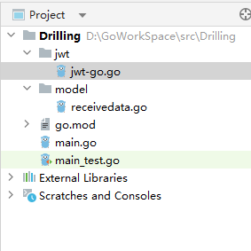

# 1 Go基础

码神之路：https://mszlu.com/go/base/01/01.html#_1-go%E5%8E%86%E5%8F%B2


## 1.1 语言基础

Go 内置了以下基本类型：

- 布尔
  - *bool*
- 字符串
  - *string*
- 整数
  - *int* *int8* *int16* *int32* *int64*
  - *uint* *uint8* *uint16* *uint32* *uint64*
- 字节
  - *byte* (*uint8* 的别名)
- Unicode
  - *rune* (*int32* 的别名，对标C语言中的char类型)
- 浮点
  - *float32* *float64*
- 复数
  - *complex64* *complex128*

Go语言中不能隐式的转化，必须显示地转化。  float64(num)

Go语言中首字母大小写是有区别的

```go
type Person struct {
    FirstName string  // 可被外部包访问
    lastName  string  // 仅包内可访问
}
```

**常量：const**

```go
const version = 1.0
```

**枚举：iota类型**

**go语言中 switch case 语句中不用break**

**函数：**  

```go
// func 函数名（参数列表） 返回值列表 
func ShowName() string{

}
func ShowInfo (bookName , author string , price float64) (bookInfo string , finalPrice float 64){
    
}
// 函数作为参数
func PrintBookInfo(do func(string , string ,float64)(string , float64),
                  bookName , author string ,price float64)

// 调用PrintBookInfo方法
PrintBookInfo( ShowInfo , "书名", "CYC" , 2983.3)
```

**err、panic、recover区别**

error:

- 在Go中，错误（errors）是通过返回值来表示的。
- Go 语言中 函数通常返回一个额外的 `error` 类型值，用于指示函数是否执行成功。
- 开发者通常通过检查返回的错误值来处理错误，并根据情况采取相应的行动。
- 错误的处理是通过 `if err != nil` 来实现的，如果 `err` 不为 `nil`，则表示有错误发生。

panic: 

- `panic` 是一种在运行时触发的紧急错误，它会导致程序中断。
- 当程序遇到无法继续执行的严重错误时，可以使用 `panic` 来中止程序的正常流程。
- `panic` 通常用于表示程序中发生了一些不可恢复的错误，例如数组越界、空指针解引用等。
- 当 `panic` 被调用时，程序会立即停止执行当前函数的代码，并开始向调用栈的上层函数传播，直到达到程序的顶层。

recover

​		在Go语言中，`recover` 是用于捕获 panic 异常的内建函数。当程序发生 panic 时，`recover` 可以用于防止程序崩溃，并且允许程序进行一些清理工作或记录错误信息。`recover` 只有在延迟函数（deferred function）内调用才会生效。


## 1.2 指针

Go语言中的指针不可以运算，而C语言中的指针是可以运算的。

```go
var price int  = 68
var ptr *int  = &price
```

值传递和引用传递

```go
func byValue(price int){
	price += 20
}
func byRef(price *int){
	*price += 20
}

byValue(price)
byRef(&price)
```


## 1.3 数组、切片（slice）、Map

初始化数组

```go
var array1 [6]string
array2 := [3]string{"火锅","烧烤","家常菜"}
array3 := [...]string{"火锅","烧烤","家常菜"}
```

在Go语言中数组是值类型！其它语言中大部分是引用类型

如果想要引用类型，就得使用到指针！

```go
// 值类型！ 
func PrintFood1(foods [3]string){
	foods[2] = "大饼子"
	fmt.Println(foods)
}
// 指针
func PrintFood2(foods *[3]string){
	foods[2] = "大饼子"
	fmt.Println(foods)
}
PrintFood1(foods)
PrintFood2(&foods)
```


**切片**（引用类型）

切片是对数组的一个引用，它包含了一个指向数组的指针、切片的长度和容量信息。创建切片：

```go
 	// 创建一个切片
    var mySlice []int
    fmt.Println("Empty Slice:", mySlice)

    // 使用make函数创建切片，指定长度和容量
    mySlice2 := make([]int, 5, 10)
    fmt.Println("Slice with make:", mySlice2)

    // 直接初始化切片
    mySlice3 := []int{1, 2, 3, 4, 5}
    fmt.Println("Initialized Slice:", mySlice3)
```


```go
// 先定义一个数组array3
array3 := [...]string{"火锅","烧烤","家常菜","家常菜1","家常菜2"}
// 使用切片Slice
slice := array3[1:3]  // 左闭右开
slice1 := array2[1:]  // 1后面的都要
slice2 := array2[:3]  // 3前面的
slice3 := array2[:]  // 全要
// 使用make创建切片
s1 := make([]string , 8)
s2 := make([]string , 8 ,16)
```


**slice中添加数据元素**

```go
slice8 = append(slice8 , "蛋炒饭")
```

**Go语言中数组和切片的区别有哪些？**

1. **长度固定 vs. 长度可变：**
   - **数组：** 数组的长度是固定的，一旦创建就不能更改。
   - **切片：** 切片的长度是可变的，它可以根据需要动态增长或缩小。
2. **内存管理：**
   - **数组：** 数组是值类型，将一个数组赋值给另一个数组会复制整个数组的数据。
   - **切片：** 切片是引用类型，它包含一个指向底层数组的指针、长度和容量信息。多个切片可以引用相同的底层数组，因此修改一个切片会影响其他引用同一底层数组的切片。
3. **初始化：**
   - **数组：** 可以通过指定固定大小并用元素值初始化数组。
   - **切片：** 通常使用 `make` 函数或切片字面量初始化。切片的长度可以在初始化时指定，也可以后续动态增加。
4. **传递参数：**
   - **数组：** 作为参数传递给函数时，会进行值拷贝。
   - **切片：** 作为参数传递给函数时，实际上传递的是切片的引用，因此在函数内对切片的修改会影响到原始切片。
5. **迭代：**
   - **数组：** 使用索引进行迭代。
   - **切片：** 使用 `range` 关键字进行迭代。


**Map**

map 是哈希map，它是无序的，不保证顺序

创建map的方式

```go
1. m := make(map[string]string)
2. var m2 map[string]string
// 对于已声明但未初始化的map，不能直接添加键值对，否则会引发运行时错误。因此，在使用之前，最好使用make函数进行初始化。
m2 = make(map[string]string)
3. m3 := map[string]string{
    "鲁菜"：“九转大肠”,
	"川菜"：“麻婆豆腐”,
}
4. m4:=map[string]map[int]string{
    
}
```

## 1.4 结构体、方法

面向接口编程！！

```go
type Food struct{
	No int32
	Name string
}
```

方法：属于一个结构体的，类似于C++中的this，PY中的self

```go
func (f *Food) Show(){
	fmt.Pringln(f.Name)
}
```

GO语言中函数和方法的区别？


在Go语言中，函数（Function）和方法（Method）有一些关键的区别：

1. **定义位置：**
   - **函数：** 函数是独立的代码块，可以在任何地方定义，不依赖于特定的类型。
   - **方法：** 方法是与特定类型关联的函数。它们必须在类型的定义所在的包中声明。
2. **关联类型：**
   - **函数：** 函数不与任何类型直接关联。
   - **方法：** 方法与一个类型关联。它是在类型的定义中声明的函数。
3. **调用方式：**
   - **函数：** 函数通过包名直接调用，例如`packageName.FunctionName(arguments)`。
   - **方法：** 方法是与类型的实例关联的，通过实例（或者类型）调用，例如`instance.MethodName(arguments)`。
4. **语法：**
   - **函数：** 函数的声明没有接收者（receiver），它们是独立于任何类型的。
   - **方法：** 方法的声明包含一个接收者，即方法的调用者。

## 1.5 接口

​		在Go语言中，接口（interface）是一种定义对象行为的方式，而不关心对象的具体类型。一个对象只要实现了接口中定义的方法，就被视为实现了该接口。接口提供了一种抽象的方式，使得代码更加灵活和可复用。

```go
// 定义一个接口
type Shape interface {
    Area() float64
}

// 定义一个结构体（圆）
type Circle struct {
    Radius float64
}

// Circle 结构体实现 Shape 接口的 Area 方法
func (c Circle) Area() float64 {
    return 3.14 * c.Radius * c.Radius
}

// 定义一个结构体（矩形）
type Rectangle struct {
    Width  float64
    Height float64
}

// Rectangle 结构体实现 Shape 接口的 Area 方法
func (r Rectangle) Area() float64 {
    return r.Width * r.Height
}

```


## 1.6 函数式编程


```go
// 匿名函数赋值给一个变量
show2 := func(){
    ...
}
```


## 1.7 延迟调用 defer

​		Go语言中进行资源释放等功能，通常使用defer函数来实现。

​		在Go语言中，`defer` 语句用于确保一个函数调用在程序执行结束时执行。通常，我们使用 `defer` 来释放资源（例如关闭文件或网络连接）或执行一些清理操作，以确保在函数执行结束时执行这些任务。`defer` 语句的执行顺序是“后进先出”（Last In, First Out，LIFO）的，也就是说，最后一个 `defer` 语句将最先执行，依此类推。


 ## 1.8 通道与协程


channel（FIFO）：

​		CSP模型：通信双方抽象出中间层，数据的流转由中间层控制，通信双方只负责数据的收发，这样就实现了数据的共享。（通过通信来共享内存）

```go
ch := make(chan string)  // 无缓冲通道。必须等有人消费了才能继续运行
ch2 := make(chan string , 6) // 有缓冲通道。6：可缓冲数据的容量
ch <- "回锅肉" // 往chan里写数据
<- ch // 读数据
close(ch) // 关闭通道

```

**WaitGroup**


**Select**

​		类似与switch，case， default，如果有default的情况下，直接走default中的代码

​		select语句会阻塞在case里，知道监听到一个可以执行的IO操作


**锁（Lock）**、sync.Mutex、sync.RWMutex

```go
type Goods struct{
	v map[string] int
	m sync.Mutex
}
func (g *Goods) Inc(key string , num int){
    g.m.Lock()
    defer g.m.Unlock()
    fmt...
    g.v[key]++
    fmt...
}
```


## 1.9 包管理

go mod tidy ：清理未使用的包信息

go get -u 依赖包 ：升级包

go mod init 名称：新建mod的名字

go get 依赖@版本

go build ./...

## 1.10 继承

​		Go语言中并没有传统的类和继承的概念，而是通过组合和接口来实现代码复用和多态性。Go语言鼓励使用组合而非继承，这种方式更加灵活和简洁。在Go中，可以通过嵌套结构体来实现类似继承的效果。一个结构体可以包含另一个结构体，从而获得被嵌套结构体的字段和方法。这被称为组合。

```go
package main

import "fmt"

// Animal 结构体
type Animal struct {
    Name string
}

// Speak 方法
func (a *Animal) Speak() {
    fmt.Println("Animal speaks")
}

// Dog 结构体，嵌套了Animal结构体
type Dog struct {
    Animal
    Breed string
}

// Speak 方法的重写
func (d *Dog) Speak() {
    fmt.Println("Dog barks")
}

func main() {
    // 创建一个Dog实例
    myDog := Dog{
        Animal: Animal{Name: "Buddy"},
        Breed:  "Golden Retriever",
    }

    // 调用嵌套的Animal结构体的Speak方法
    myDog.Animal.Speak()

    // 调用Dog结构体的Speak方法，会覆盖掉嵌套的Animal结构体的Speak方法
    myDog.Speak()
}

```

## 1.11 Context上下文

在Go语言中，`context.Context`是一个非常有用的工具，用于**在程序中传递截止日期、取消信号、超时值和其他截断相关的元数据**。它主要用于在函数调用链上传递这些值，以便于跟踪和控制程序的执行。

- **超时和取消：** `Context`可以帮助在一定时间内自动取消操作，以避免无限期地等待某些事件。通过在`Context`中设置超时，可以确保操作在规定时间内完成，否则将被取消。

```go
ctx, cancel := context.WithTimeout(context.Background(), 5*time.Second)
defer cancel()
// 使用ctx进行操作，当超过5秒时，ctx会自动取消相关操作。
```

- **截止日期：** `Context`还允许在特定日期之前取消操作，以便在需要的情况下终止程序的执行。

```go
deadline := time.Now().Add(1 * time.Hour)
ctx, cancel := context.WithDeadline(context.Background(), deadline)
defer cancel()
// 使用ctx进行操作，当超过截止日期时，ctx会自动取消相关操作。
```

- **值传递：** `Context`可以用于**在函数调用链上传递值**，**而不是在每个函数签名中显式传递。**

```go
ctx := context.WithValue(context.Background(), key, value)
```

- **取消信号传递：** 通过`Context`，可以在一个地方取消多个相关的操作，而不是一个一个手动取消。

```go
ctx, cancel := context.WithCancel(context.Background())
// ...
cancel() // 取消与该Context相关的所有操作。
```


# 2 Go Web 开发

## 2.1 Gin框架

官网：https://gin-gonic.com/zh-cn/docs/

```go
package main
import "github.com/gin-gonic/gin"

func main() {
	r := gin.Default()
	r.GET("/ping", func(c *gin.Context) {
		c.JSON(200, gin.H{
			"message": "pong",
		})
	})
	r.Run() // 监听并在 0.0.0.0:8080 上启动服务
}

// gin.H 本质上是一个map  key：string v：interface{}
```

gin.Default()、gin.New()  它们分别做了什么？有什么区别？


**Gin的路由分组**

路由相关介绍：https://youngxhui.top/2019/07/gin%E4%BA%8C%E8%B7%AF%E7%94%B1/

```go
func main() {
	router := gin.Default()

	// 简单的路由组: v1
	v1 := router.Group("/v1")
	{
		v1.POST("/login", loginEndpoint)
		v1.POST("/submit", submitEndpoint)
		v1.POST("/read", readEndpoint)
	}

	// 简单的路由组: v2
	v2 := router.Group("/v2")
	{
		v2.POST("/login", loginEndpoint)
		v2.POST("/submit", submitEndpoint)
		v2.POST("/read", readEndpoint)
	}

	router.Run(":8080")
}
```

**`ShouldBindQuery` 函数只绑定 url 查询参数而忽略 post 数据。**

捕获  localhost:8085/testing**?name=eason&address=xyz**  中的参数信息

```go
type Person struct {
	Name    string `form:"name"`
	Address string `form:"address"`
}
func main() {
	route := gin.Default()
	route.Any("/testing", startPage)
	route.Run(":8085")
}

func startPage(c *gin.Context) {
	var person Person
	if c.ShouldBindQuery(&person) == nil {
		log.Println("====== Only Bind By Query String ======")
		log.Println(person.Name)
		log.Println(person.Address)
	}
	c.String(200, "Success")
}
```

## 2.2 Gin使用中间件

​		中间件介绍：https://www.cnblogs.com/Aimmi/p/15419009.html		

​		gin 框架允许在请求处理过程中，加入用户自己的钩子函数，这个钩子函数就叫中间件。中间件的英文名称为 MiddleWare。		


​		中间件非常有用，在Java中叫做面向切面编程。中间件也就是把一些需要统一的功能给抽取出来，做在一起，而不是分散在各处。如：日志系统、权限认证、登陆校验，耗时统计……

​		怎么实现？？？全局变量？包名.函数？

```go
func main() {
	// 新建一个没有任何默认中间件的路由
	r := gin.New()

	// 全局中间件
	// Logger 中间件将日志写入 gin.DefaultWriter，即使你将 GIN_MODE 设置为 release。
	// By default gin.DefaultWriter = os.Stdout
	r.Use(gin.Logger())

	// Recovery 中间件会 recover 任何 panic。如果有 panic 的话，会写入 500。
	r.Use(gin.Recovery())

	// 你可以为每个路由添加任意数量的中间件。
	r.GET("/benchmark", MyBenchLogger(), benchEndpoint)

	// 认证路由组
	// authorized := r.Group("/", AuthRequired()) 和使用以下两行代码的效果完全一样:
	authorized := r.Group("/")
	// 路由组中间件! 在此例中，我们在 "authorized" 路由组中使用自定义创建的 AuthRequired() 中间件
	authorized.Use(AuthRequired())
	{
		authorized.POST("/login", loginEndpoint)
		authorized.POST("/submit", submitEndpoint)
		authorized.POST("/read", readEndpoint)

		// 嵌套路由组
		testing := authorized.Group("testing")
		testing.GET("/analytics", analyticsEndpoint)
	}

	// 监听并在 0.0.0.0:8080 上启动服务
	r.Run(":8080")
}

// 定义中间件1
func CustomMiddleWare(c *gin.Context){
    now := time.Now()
    c.Next()
    expired := time.Now().Sub(now)
    fmt.Println(expired)
}
// 定义中间件2
func MiddleWare() gin.HandlerFunc {
	return func(c *gin.Context) {
	  fmt.Println("调用中间件")
	}
}

// 上面两种定义中间间的方式本质上一样，都是使用了一个参数类型为*gin.Context的函数，调用的时候一个加括号，一个不加括号
r.Use(MiddleWare())
r.Use(CustomMiddleWare)
```

**Use() 函数**：常用来添加全局中间件

```go
engine := gin.Default()
engine.Use(MiddleWare()) // 其中MiddleWare()为中间件函数
engine.Use(MiddleWare1(), MiddleWare2(), MiddleWare3()) // 还可以同时使用多个中间件，形成中间件链条。按照写入顺序依次执行。
```

**Next()函数**：contentx.Next函数可以将中间件代码的执行顺序一分为二，Next函数之前的代码在请求处理之前执行，**当执行到Next函数时会中断向下执行，去执行具体的业务逻辑代码**，当业务逻辑代码执行完成后，在继续执行Next函数后面的代码。

## 2.3 退出中间件

**Abort() 函数**：Abort 函数在被调用的函数中阻止后续中间件的执行。例如，你有一个验证当前的请求是否是认证过的 Authorization 中间件。如果验证失败(例如，密码不匹配)，调用 Abort 以确保这个请求的其他函数不会被调用。有个细节需要注意，**调用 Abort 函数不会停止当前的函数的执行，除非后面跟着 return**。

```go
// 定义中间件1
func MiddleWare1() gin.HandlerFunc {
    return func(c *gin.Context) {
        fmt.Println("调用中间件1")
        // 调用 Abort，终止执行后续的中间件
        c.Abort()
    }
}

// 定义中间件2
func MiddleWare2() gin.HandlerFunc {
    return func(c *gin.Context) {
        fmt.Println("调用中间件2")
    }
}

// 定义中间件3
func MiddleWare3() gin.HandlerFunc {
    return func(c *gin.Context) {
        fmt.Println("调用中间件3")
    }
}

// 使用
    engine.Use(MiddleWare1(), MiddleWare2(), MiddleWare3())
// 只有中间件1被调用，其余的中间件被取消执行，而且页面处理函数也被取消执行。
```

 ## 2.4 Post请求数据绑定问题

1. 首先定义和json文件对应的结构体，结构体中的 tag 对应json请求中的Key

```go
type SingleDrill struct {
	DSingleNumber int    `json:"d_single_number"`
	DGas          int    `json:"d_gas"`
	DStart        string `json:"d_start"`
	DEnd          string `json:"d_end"`
    ……
}

type DrillData struct {
	DNumber       uint          `json:"d_number"`
	DSingleLength int           `json:"d_single_length"`
	DDepth        int           `json:"d_depth"`
	SingleDrill   []SingleDrill `json:"single_drill"`
    // 注意结构体嵌套，因为Json中传入的数据可能不止一个，所以使用 结构体切片 来接收
}

type DrillRequest struct {
	DrillName   string      `json:"drill_name"`
	DrillNumber string      `json:"drill_number"`
	Location    string      `json:"location"`
	Time        string      `json:"time"`
	DrillData   []DrillData `json:"drill_data"`
    // 注意结构体嵌套，因为Json中传入的数据可能不止一个，所以使用 结构体切片 来接收
}
```

2. 定义好结构体后，使用Gin框架中的POST来接收数据，使用ShouldBindJSON函数来绑定 JSON和 结构体。

```go
ginServer.POST("/drill/receive_data", receiveData)

func receiveData(c *gin.Context) {
	drillRequest := model.DrillRequest{}
	err := c.ShouldBindJSON(&drillRequest)
	if err != nil {
		c.JSON(400, gin.H{"error": err.Error()})
		return
	}
	// 解析时间字符串为 time.Time 类型
	//parsedTime, err := time.Parse("2006-01-02 15:04:05", drillRequest.Time)
	//if err != nil {
	//	c.JSON(400, gin.H{"error": err.Error()})
	//	return
	//}
}
```

还可以使用 json := make(map[string]interface{})  类型来接收客户端的json请求

## 2.5 JWT鉴权

cookie、session、Token、JWT及对应的登录态机制：https://juejin.cn/post/6952873156700815374

**Token技术**：

- 让生产的sessionid赋予数据信息，其实也就是：token  ，比如：userid=1 —–加密算法—sdfs.232jsndfnskfhkshd.3224235f—返回客户端—后面所有的请求带着token就可以—-然后解析token—-userid=1
- 服务端就做两个事情—-生成token/解析token/校验token


token里面数据的组成：

- token的建议不要放太敏感的信息。（放一个业务id即可。因为通过id还可以继续查询相关信息）
- token必须是安全，token必须对称加密（会在服务端生成唯一秘钥串）或者非对称加密（公钥和私钥）
- token必须要有时效性 （token时效问题。根据你当前公司的业务来决定）
- token续期问题 （token 1个小时）(自行解决)—就生成一个新token把时间给续上。

**什么是JWT？**（JSON Web Token）

https://www.ruanyifeng.com/blog/2018/07/json_web_token-tutorial.html

​		一般而言，用户注册登陆后会生成一个jwt token返回给浏览器，浏览器向服务端请求数据时携带`token`，服务器端使用`signature`中定义的方式进行解码，进而对token进行解析和验证。

**JWT Token组成部分**


- header: 用来指定使用的算法(HMAC SHA256 RSA)和token类型(如JWT)
- payload: 包含声明(要求)，声明通常是用户信息或其他数据的声明，比如用户id，名称，邮箱等. 声明可分为三种: registered,public,private
- signature: 签名部分：用来保证JWT的真实性，可以使用不同的算法

**JWT(Json Web Tokens)是如何工作的**


所以，基本上整个过程分为两个阶段，第一个阶段，客户端向服务端获取token，第二阶段，客户端带着该token去请求相关的资源.

通常比较重要的是，**服务端如何根据指定的规则进行token的生成**。

在认证的时候，当用户用他们的凭证成功登录以后，一个JSON Web Token将会被返回。

此后，token就是用户凭证了，你必须非常小心以防止出现安全问题。一般而言，你保存令牌的时候不应该超过你所需要它的时间。

无论何时用户想要访问受保护的路由或者资源的时候，用户代理（通常是浏览器）都应该带上JWT，典型的，通常放在Authorization header中，用Bearer schema: `Authorization: Bearer <token>`

服务器上的受保护的路由将会检查Authorization header中的JWT是否有效，如果有效，则用户可以访问受保护的资源。如果JWT包含足够多的必需的数据，那么就可以减少对某些操作的数据库查询的需要，尽管可能并不总是如此。

如果token是在授权头（Authorization header）中发送的，那么跨源资源共享(CORS)将不会成为问题，因为它不使用cookie.


- 客户端向授权接口请求授权
- 服务端授权后返回一个access token给客户端
- 客户端使用access token访问受保护的资源


**如何使用 refresh token 刷新 access token**？

要是 access token 验证失败，则浏览器这边需要对 access token 进行更新，方法是使用 refresh token


- access token 的有效期比较短（比如是一周）， refresh token 的有效期比较长（比如一个月），当 acesss token 过期失效但 refresh token 未过期，则使用 refresh token 就可以获取到新的 token
- 如果 refresh token 也失效了，服务器会在响应头返回状态码`401`，浏览器收到该状态码后要求用户`重新登录`
- refresh token 及过期时间是存储在服务器的数据库中，只有在需要申请新的 acesss token 时才会验证，不会`一直请求`，也不需要向 session 一样一直保持在`内存`中以应对大量的请求（这就是使用token作登录态能够减轻服务器`内存压力`的体现）


## 2.6 基于Token的认证和基于服务器的身份认证

**1.基于服务器的认证**

前面说到过session，cookie以及token的区别，在之前传统的做法就是基于存储在服务器上的session来做用户的身份认证，但是通常会有如下问题:

- Sessions: 认证通过后需要将用户的session数据保存在内存中，随着认证用户的增加，内存开销会大
- 扩展性: 由于session存储在内存中，扩展性会受限，虽然后期可以使用redis,memcached来缓存数据
- CORS: 当多个终端访问同一份数据时，可能会遇到禁止请求的问题
- CSRF: 用户容易受到CSRF攻击

**2.Session和JWT Token的异同**

都可以存储用户相关信息，但是session存储在服务端，JWT存储在客户端


**3.基于Token的身份认证如何工作**

基于Token的身份认证是无状态的，服务器或者session中不会存储任何用户信息.(很好的解决了共享session的问题)

- 用户携带用户名和密码请求获取token(接口数据中可使用appId,appKey)
- 服务端校验用户凭证，并返回用户或客户端一个Token
- 客户端存储token,并在请求头中携带Token
- 服务端校验token并返回数据

**注意:**

- 随后客户端的每次请求都需要使用token
- token应该放在header中
- 需要将服务器设置为接收所有域的请求: `Access-Control-Allow-Origin: *`

**4.用Token的好处**

- 无状态和可扩展性
- 安全: 防止CSRF攻击;token过期重新认证

**5.JWT和OAuth的区别**

- 1.OAuth2是一种授权框架 ，JWT是一种认证协议
- 2.无论使用哪种方式切记用HTTPS来保证数据的安全性
- 3.OAuth2用在`使用第三方账号登录的情况`(比如使用weibo, qq, github登录某个app)，而`JWT是用在前后端分离`, 需要简单的对后台API进行保护时使用

**6.token的时限多长才合适？**

使用JWT时，一个让人纠结的问题就是“Token的时限多长才合适？”。

- 面对极度敏感的信息，如钱或银行数据，那就根本不要在本地存放Token，只存放在内存中。这样，随着App关闭，Token也就没有了。（一次性token）
- 此外，将Token的时限设置成较短的时间（如1小时）。
- 对于那些虽然敏感但跟钱没关系，如健身App的进度，这个时间可以设置得长一点，如1个月。
- 对于像游戏或社交类App，时间可以更长些，半年或1年。

并且，文章还建议增加一个“Token吊销”过程来应对Token被盗的情形，类似于当发现银行卡或电话卡丢失，用户主动挂失的过程。

```go
github.com/songzhibin97/gkit
```


## 2.7 Gin框架集成JWT

1. 下载jwt组件

```go
// go get -u github.com/golang-jwt/jwt/v5

go get -u github.com/dgrijalva/jwt-go
```

2. 新建jwtgo目录



3. jwt-go.go 文件中核心部分：

- **jwt数据载体：Claims**

```go
// 自定义有效载荷(这里采用自定义的Name和Email作为有效载荷的一部分)
type CustomClaims struct {
   Username string `json:"username"`
   Password string `json:"password"`
   // StandardClaims结构体实现了Claims接口(Valid()函数)
   jwt.StandardClaims
}
```

为什么不用StandardClaims。因为不具有业务性，可能会把内部属性破坏掉。所以自定义更加灵活。

- 生成Token函数

```go
// 调用jwt-go库生成token
// 指定编码的算法为jwt.SigningMethodHS256
func (j *JWT) CreateToken(claims CustomClaims) (string, error) {
   // https://gowalker.org/github.com/dgrijalva/jwt-go#Token
   // 返回一个token的结构体指针
   token := jwt.NewWithClaims(jwt.SigningMethodHS256, claims)
   return token.SignedString(j.SigningKey)
}
```

- 解析token  & 校验token

```go
// token解码
func (j *JWT) ParserToken(tokenString string) (*CustomClaims, error) {
   // https://gowalker.org/github.com/dgrijalva/jwt-go#ParseWithClaims
   // 输入用户自定义的Claims结构体对象,token,以及自定义函数来解析token字符串为jwt的Token结构体指针
   // Keyfunc是匿名函数类型: type Keyfunc func(*Token) (interface{}, error)
   // func ParseWithClaims(tokenString string, claims Claims, keyFunc Keyfunc) (*Token, error) {}
   token, err := jwt.ParseWithClaims(tokenString, &CustomClaims{}, func(token *jwt.Token) (interface{}, error) {
      return j.SigningKey, nil
   })

   if err != nil {
      // https://gowalker.org/github.com/dgrijalva/jwt-go#ValidationError
      // jwtgo.ValidationError 是一个无效token的错误结构
      if ve, ok := err.(*jwt.ValidationError); ok {
         // ValidationErrorMalformed是一个uint常量，表示token不可用
         if ve.Errors&jwt.ValidationErrorMalformed != 0 {
            return nil, TokenMalformed
            // ValidationErrorExpired表示Token过期
         } else if ve.Errors&jwt.ValidationErrorExpired != 0 {
            return nil, TokenExpired
            // ValidationErrorNotValidYet表示无效token
         } else if ve.Errors&jwt.ValidationErrorNotValidYet != 0 {
            return nil, TokenNotValidYet
         } else {
            return nil, TokenInvalid
         }
      }
   }

   // 将token中的claims信息解析出来并断言成用户自定义的有效载荷结构
   if claims, ok := token.Claims.(*CustomClaims); ok && token.Valid {
      return claims, nil
   }
   return nil, fmt.Errorf("token无效")
}
```

4. 在业务逻辑中添加JWT校验（一般在登录成功后颁发token，比如可以在登陆时进行用户校验，成功后未该次认证请求生成token。）

```go
// 处理认证接口函数
func validation(c *gin.Context) {
   type auth struct {
      Username string `json:"username" binding:"required"`
      Password string `json:"password" binding:"required"`
   }
   authData := auth{}
   err := c.ShouldBindJSON(&authData)
   if err != nil {
      c.JSON(400, gin.H{"error": err.Error(), "code": "400", "result": "Bad Request"})
      return
   }
   // 1. jwt生成token
   myJwt := jwtgo.NewJWT()
   // 2. 生成token
   token, err2 := myJwt.CreateToken(jwtgo.CustomClaims{
      authData.Username,
      authData.Password,
      jwt.StandardClaims{
         // 签发者
         Issuer: "XUST",
         // 签发时间
         IssuedAt: time.Now().Unix(),
         // 过期时间
         ExpiresAt: time.Now().Add(365 * 2 * 24 * time.Hour).Unix(),
         // 生效时间(立即生效)
         NotBefore: time.Now().Add(-10 * time.Second).Unix(),
      },
   })
   if err2 != nil {
      c.JSON(400, gin.H{"message": "token颁发不成功！"})
      return
   }
   c.JSON(http.StatusOK, gin.H{"code": "200", "access_token": token})
}
```

5. 在路由组中使用中间件来进行token验证，即使用jwt解决接口安全性

```go
// token校验中间件
func JWTAuth() gin.HandlerFunc {
   return func(c *gin.Context) {
      // 获取token
      token := c.GetHeader("Authorization")
      if token == "" {
         c.JSON(400, gin.H{"message": "请求未携带token，无权限访问"})
         c.Abort()
         return
      }
      // 校验token
      newJWT := jwtgo.NewJWT()
      parserToken, err := newJWT.ParserToken(token)
      if err != nil {
         c.JSON(400, gin.H{"message": "token失效了"})
         c.Abort()
         return
      }
      c.Set("claims", parserToken)
      c.Next()
   }
}
```

路由组中使用该中间件：

```go
// 接口隔离，比如登录，健康检查都不需要拦截和做任何的处理
loginRouter.InitLoginRouter(ginServer)
codeRouter.InitCodeRouter(ginServer)
// 业务模块接口，
publicGroup := ginServer.Group("/api")
// 只要接口全部使用jwt拦截
publicGroup.Use(middle.JWTAuth())
{
    videoRouter.InitVideoRouter(publicGroup)
    courseRouter.InitCourseRouter(publicGroup)
}
```

## 2.8 服务器部署Gin项目

1. **在服务器上开启安全组，开放需要的端口**：**进入实例详情页面--->点击左下角“本实例安全组”---->安全组列表---->配置规则**

   有时候我们配置了安全规则，还是无法访问8080端口，这个时候，可能是因为我们的服务器本身没有开启8080端口，需要我们进行第二步的操作。

2. **服务器开启8080端口**


涉及到的相关命令解释：

firewall-cmd --zone=public --add-port=8080/tcp --permanent   # 开放8080端口

firewall-cmd --zone=public --remove-port=8080/tcp --permanent  #关闭8080端口

firewall-cmd --reload   # 配置立即生效

通过以上两步，我们就可以访问服务器的8080端口了。

3. **打包本地项目（Windows端实现采用以下命令：也可以在Linux下直接使用go run ...实现，但是要在Linux系统中安装go环境）**

```sh
set CGO_ENABLED=0
set GOARCH=amd64
set GOOS=linux/windows
go build -o 目录/可执行文件的名字(.exe)  main.go
go build -o 目录/可执行文件的名字(.exe) 
```

比如：

```sh
set CGO_ENABLED=0
set GOARCH=amd64
set GOOS=linux/windows
go build -o build/drill(.exe)  main.go
go build -o build/drill(.exe) 
```

4. **把生成的drill文件上传到服务器中**,并使用**chmod +x ..** 命令添加执行权限

新建一个/www

```sh
mkdir -p /www/ginweb
cd /www/ginweb
```

- mkdir -p /www/ginweb  递归创建文件夹
- cd /www/ginweb  进入指定的文件夹


5. **修改drill为守护进程运行**

守护方式启动 (后台方式启动)

```sh
nohup ./drill &
```

关闭该进程：

先查找到该进程：

```
ps -ef | grep drill
```

然后使用kill命令杀掉

```
kill PID
```


# 3 GORM

ORM：Object Relation Mapping


GORM官网：https://gorm.io/zh_CN/docs/connecting_to_the_database.html

```go
// 安装MySQL驱动
go get -u gorm.io/driver/mysql
// 安装gorm包
go get -u gorm.io/gorm
```


## 3.1 连接数据库：

```go
import (
    
  "gorm.io/driver/mysql"
  "gorm.io/gorm"
)

func main() {
  // 参考 https://github.com/go-sql-driver/mysql#dsn-data-source-name 获取详情
  dsn := "user:pass@tcp(127.0.0.1:3306)/dbname?charset=utf8mb4&parseTime=True&loc=Local"
  db, err := gorm.Open(mysql.Open(dsn), &gorm.Config{})
}
```

可以修改上述代码提升可移植性

```go
func connectMySQLDB() {
   // 1. 连接数据库
   username := "root"
   password := "root"
   host := "127.0.0.1"
   port := 3306
   dbname := "manage"
   dsn := fmt.Sprintf("%s:%s@tcp(%s:%d)/%s?charset=utf8mb4&parseTime=True&loc=Local", username, password, host, port, dbname)
   db, err := gorm.Open(mysql.Open(dsn), &gorm.Config{})
   if err != nil {
      panic("数据库连接失败,error=" + err.Error())
   }
   fmt.Println(db)
}
```

## 3.2 通过结构体生成表结构

新建一个结构体：

```go
type Product srtuct{
    gorm.Model
    Code string
    Price uint
}
```

当有结构体嵌套时，可以采用以下标签，来保证数据库的生成

```go
gorm:"embedded"
```

如有结构体如下：

```go
type DrillData struct {
   DNumber       uint        `json:"d_number" binding:"required"`
   DSingleLength int         `json:"d_single_length" binding:"required"`
   DDepth        int         `json:"d_depth" binding:"required"`
   SingleDrill   SingleDrill `json:"single_drill" binding:"required" gorm:"embedded"`
}

type DrillRequest struct {
   gorm.Model
   DrillName   string    `json:"drill_name" binding:"required"`
   DrillNumber string    `json:"drill_number" binding:"required"`
   Location    string    `json:"location" binding:"required"`
   Time        string    `json:"time" binding:"required"`
   DrillData   DrillData `json:"drill_data" binding:"required" gorm:"embedded"`
}
```

其中`gorm.Model`的源码如下：


如何通过结构体**自动迁移**成表结构？

```go
err = db.AutoMigrate(&model.Product{})
```

## 3.3 增删改查：

```go
db.Create(&model.Product{Code:"D42",Price:200}) // 增加
var p model.Product
db.First(&p,1) // 查询第一条语句
db.Frist(&p ,"code=?","D42") // 条件查询
db.Model(&p).Update("price",300) // 更新 
db.Model(&p).Updates(model.Product{
    Code:"FF42",
    Price:600,
})
// 删除1：真实的物理删除 delete ... from ... where id = ...
// 删除2：数据非常宝贵，一般是软删除：flag status: 0不显示 1显示，删除的时候把flag值为0，查询的时候选择flag为1的记录
db.Delete(&p , 2) // 软删除


```

当字段是非指针类型时：**Update()方法能更新空值**、**Updates()方法不能更新空值**

当字段是指针类型时：**Update()方法能更新空值**、**Updates()方法也能更新空值**


**Gorm更新数据为0值时，默认不会更新成功**

解决方法1：需要借助Map

```go
db.Model(&p).Updates(map[string]interface{}{
    "Code":"FF42",
    "Price":0,
})
```

解决方法2：改结构体中的属性类型：sql.NullString

```go
// 修改前：
type Product srtuct{
    gorm.Model
    Code string
    Price uint
}
// 修改后
type Product srtuct{
    gorm.Model
    Code sql.NullString
    Price uint
}

```

## 3.4 嵌入结构体

GORM优先是约定大于配置！

对于匿名字段，GORM 会将其字段包含在父结构体中，例如：

```go
type User struct {
  gorm.Model
  Name string
}
// 等效于
type User struct {
  ID        uint           `gorm:"primaryKey"`
  CreatedAt time.Time
  UpdatedAt time.Time
  DeletedAt gorm.DeletedAt `gorm:"index"`
  Name string
}
```

对于正常的结构体字段，你也可以通过标签 `embedded` 将其嵌入，例如：

## 3.5 批量添加数据


```go
users := []model.User{
	{Name:"小明"},
	{Name:"小A"},
	{Name:"小B"},
	{Name:"小C"},
	{Name:"小D"},
} 
//第一种：
db.Create(users)
//第二种：
db.CreateInBatches(users,2)
//第三种
db.Model(&Model.User{}).Create([]map[string]interface{}{
    {"Name":"小明"},
	{"Name":"小A"},
	{"Name":"小B"},
	{"Name":"小C"},
	{"Name":"小D"},
})
```


# 4 RPC

RPC= Remote Procedure Call (远程过程调用)


## 4.1  RPC的四要素


服务端一定要提供一个方法给客户端调用

## 4.2 GO语言原生的RPC

**原生的RPC代码示例：**

服务端代码：

```go
type FoodService struct {
}

func (f *FoodService) SayName(request string, resp *string) error {
	*resp = "您点的菜是：" + request
	return nil
}

func main() {
	listen, err := net.Listen("tcp", ":9090")
	if err != nil {
		fmt.Println(err)
		return
	}
	err = rpc.RegisterName("FoodService", &FoodService{})
	if err != nil {
		fmt.Println(err)
		return
	}
	accept, err := listen.Accept()
	if err != nil {
		fmt.Println(err)
		return
	}
	rpc.ServeConn(accept)
}
```

客户端代码：

```go
func main() {
	c, err := rpc.Dial("tcp", "localhost:9090")
	if err != nil {
		fmt.Println(err)
		return
	}
	reply := ""
	err = c.Call("FoodService.SayName", "九转大肠", &reply)
	if err != nil {
		fmt.Println(err)
		return
	}
	fmt.Println(reply)
}
```

上述代码存在问题：客户端必须知道服务端暴露给自己的方法名称：FoodService.SayName，调用方法暴露了太多细节，不利于调用方的使用。

 **原生的RPC如何支持高并发？如何跨语言？**

如何实现跨语言？

1. 使用  xxx.MethodName 格式
2. json格式交互： {“method”:"FoodService.SayName",params:["爆炒小龙虾"],"id":1}

如何实现高并发？

​	修改服务端代码：使用for循环，循环监听客户端，每有一个客户端来了使用go关键字开辟协程

```go
	for {
		accept, err := listen.Accept()
		if err != nil {
			fmt.Println(err)
			return
		}
		//rpc.ServeConn(accept)
		go rpc.ServeCodec(jsonrpc.NewServerCodec(accept))
	}
```

## 4.3 GRPC+Protobuf

官网：https://grpc.io/docs/

中文版：https://doc.oschina.net/grpc

**什么是gRPC？**

​		 gRPC是开源的RPC远程过程调用框架。它使得client和server应用能够透明通信（即gRPC维护client和server之间的通信，我们只需按照一定语法进行编写即可，无需关心底层通信实现），使用gRPC能够使系统间联系更加简单。RPC与语言无关！

​		 使用gRPC，编写代码时能够像调用本地对象一样去调用不同机器上的远程方法，使得部署分布式应用和服务更加简单。和很多RPC系统一样，gRPC基于定义服务的思想，制定具有参数和返回值的远程调用方法。

- 在服务端，其实现gRPC定义的接口并运行gRPC服务以处理客户端调用请求。
- 在客户端，留有对应的存根stub，提供和gRPC服务端相同的方法。


​		 gRPC客户端和服务端可以处在不同的环境。例如gRPC服务端使用java提供服务，而gRPC客户端采用go语言请求调用gRPC服务。

**什么是ProtoBuf？**

​		Protocol Buffers（protobuf）是一种由Google开发的轻量级、高效的数据序列化格式。它被设计用于结构化数据的序列化，使其能够在不同系统之间进行有效的通信，同时保持高效性和可扩展性。


**安装protobuf：**


**安装gRPC核心库：**


## 4.4 编写Protobuf文件

proto的语法如下：这只是一个约束，最终我们使用这个约束利用工具自动生成Go语言代码。

proto中文件介绍：https://mszlu.com/grpc/01/01.html#_3-2-hello-world

```protobuf
// 使用proto3的语法 
syntax = "proto3";

// 生成go文件的是在哪个目录哪个包下，pb目录下
option go_package = "./pb";

package pb;

// 定义一个服务，Study是服务中的方法，这个方法可以接收客户端的参数，再返回服务端的响应
service Study{
  // rpc 服务函数名 (参数) 返回 (返回参数)
  rpc Study(BookRequest) returns(BookResponse);
}

// message可以理解为Go中的结构体，这里面的 = 1 并不是赋值，而是这个遍历在message中的位置、message就是需要传输的数据格式的定义
message BookRequest {
  string name = 1;
  // int64 age = 2;
}

message BookResponse{
  string msg = 1;
}
```

编写好了protoc文件后，在./proto目录下执行以下命令：

```protobuf
protoc --go_out=. hello.proto
protoc --go-grpc_out=. hello.proto
```


## 4.5 服务端+客户端代码编写

**服务端代码**

- 创建gRPC Server对象，可以理解为它是Server端的抽象对象
- 将Server（包含需要被调用的服务端接口）注册到gRPC Server的内部注册中心。这样可以在接受到请求时，通过内部的服务发现，发现该服务端接口并转接进行逻辑处理。
- 创建Listen，监听TCP端口
- gRPC Server开始 lis.Accept，直到Stop

```go
type server struct {
	pb.UnimplementedStudyServer
}

func (s *server) Study(ctx context.Context, req *pb.BookRequest) (*pb.BookResponse, error) {
	return &pb.BookResponse{Msg: "hello!" + req.Name}, nil
}

func main() {
	// 开启端口监听
	listen, err := net.Listen("tcp", ":9090")
	if err != nil {
		fmt.Println(err)
		return
	}
	// 创建gRPC服务
	grpcServer := grpc.NewServer()
	// 在gRPC服务端中注册我们自己编写的服务
	pb.RegisterStudyServer(grpcServer, &server{})
	// 启动服务
	err = grpcServer.Serve(listen)
	if err != nil {
		fmt.Println(err)
		return
	}
}
```

**客户端代码**

- 创建与给定目标（服务端）的连接交互
- 创建server 的客户端对象
- 发送RPC请求，等待同步响应，得到回调后返回响应结果
- 输出响应结果

```go
func main() {
   // 连接到server端，此处禁用安全传输，没有加密和验证
   conn, err := grpc.Dial("127.0.0.1:9090", grpc.WithTransportCredentials(insecure.NewCredentials()))
   if err != nil {
      log.Fatalf("did not connect: %v", err)
   }
   defer conn.Close()
   // 建立连接
   client := pb.NewStudyClient(conn)
   // 执行RPC调用（这个方法在服务端来实现并返回结果）
   resp, _ := client.Study(context.Background(), &pb.BookRequest{Name: "eagle cyc"})
   fmt.Println(resp.GetMsg())
}
```

## 4.6 gRPC认证-安全传输

- SSL/TLS认证方式（http2）
- 基于Token的认证方式
- 不采用任何措施的连接，这是不安全的连接（http1）

- 自定义的身份认证

​		TLS（Transport Layer Security，安全传输层），TLS是建立在传输层TCP之上的协议，服务于应用层，它的前身是SSL（Secure Socket Layer，安全套接字层），它实现了将应用层的报文进行加密后再交由TCP进行传输的功能。

​		TLS协议主要解决如下三个网络安全问题：

1. 保密：保密通过加密encryption实现，所有信息都加密传输，第三方无法嗅探
2. 完整性：通过MAC校验机制，一旦被篡改，通信双方会立刻发现
3. 认证：双方认证，双方都可以配备证书，防止身份被冒充

 

**Token认证：**（客户端实现两个方法就好了）


gRPC将各种认证方式浓缩统一到一个凭证上，可以单独使用一种凭证，比如只使用TLS凭证或者只使用自定义凭证，也可以多种凭证组合，gRPC提供统一的API验证机制，使研发人员使用方便，这也是gRPC设计的巧妙之处。


