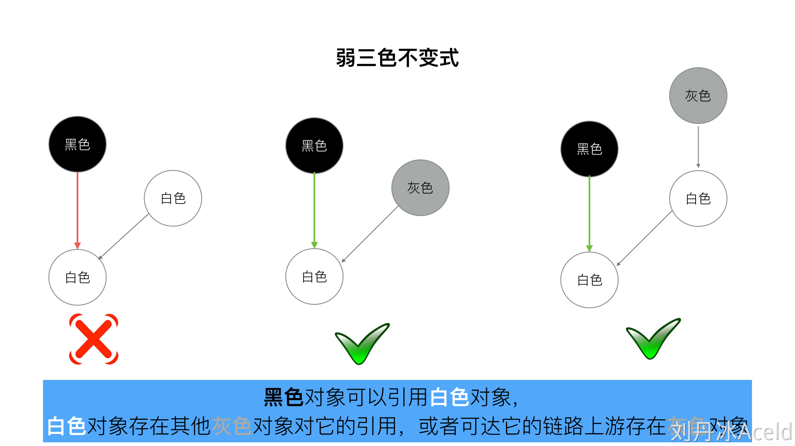

# 1 Go基础语法

## 1.1 数据类型

**1.使用值为 nil 的 slice、map会发生啥**

允许对值为 nil 的 slice 添加元素，但对值为 nil 的 map 添加元素，则会造成运行时 panic。

```go
// map 错误示例
func main() {
    var m map[string]int
    m["one"] = 1  // error: panic: assignment to entry in nil map
    // m := make(map[string]int)// map 的正确声明，分配了实际的内存
}    

// slice 正确示例
func main() {
 var s []int
 s = append(s, 1)
}
```

 **2.访问 map 中的 key，需要注意啥**

当访问 map 中不存在的 key 时，Go 则**会返回元素对应数据类型的零值，比如 nil、’’ 、false 和 0，**取值操作总有值返回，故不能通过取出来的值，来判断 key 是不是在 map 中。

检查 key 是否存在可以用 map 直接访问，检查返回的第二个参数即可。

```go
// 错误的 key 检测方式
func main() {
 x := map[string]string{"one": "2", "two": "", "three": "3"}
 if v := x["two"]; v == "" {
  fmt.Println("key two is no entry") // 键 two 存不存在都会返回的空字符串
 }
}

// 正确示例
func main() {
 x := map[string]string{"one": "2", "two": "", "three": "3"}
 if _, ok := x["two"]; !ok {
  fmt.Println("key two is no entry")
 }
}
```

**3.string 类型的值可以修改吗**

**不能，**尝试使用索引遍历字符串，来更新字符串中的个别字符，是不允许的。

string 类型的值是只读的二进制 byte slice，如果真要修改字符串中的字符，**将 string 转为 []byte 修改后，再转为 string 即可。**

```go
// 修改字符串的错误示例
func main() {
 x := "text"
 x[0] = "T"  // error: cannot assign to x[0]
 fmt.Println(x)
}


// 修改示例
func main() {
 x := "text"
 xBytes := []byte(x)
 xBytes[0] = 'T' // 注意此时的 T 是 rune 类型
 x = string(xBytes)
 fmt.Println(x) // Text
}
```

**4.switch 中如何强制执行下一个 case 代码块**

switch 语句中的 case 代码块会默认带上 break，但可以使用 fallthrough 来强制执行下一个 case 代码块。

```go
func main() {
     isSpace := func(char byte) bool {
          switch char {
          case ' ': // 空格符会直接 break，返回 false // 和其他语言不一样
          // fallthrough // 返回 true
          case '\t':
           return true
          }
          return false
     }
     fmt.Println(isSpace('\t')) // true
     fmt.Println(isSpace(' ')) // false
}
```

**5.如何从 panic 中恢复**

在一个 **defer 延迟执行的函数中调用 recover ，它便能捕捉/中断 panic。**

```go
// 错误的 recover 调用示例
func main() {
 recover() // 什么都不会捕捉
 panic("not good") // 发生 panic，主程序退出
 recover() // 不会被执行
 println("ok")
}

// 正确的 recover 调用示例
func main() {
 defer func() {
  fmt.Println("recovered: ", recover())
 }()
 panic("not good")
}
```

**6.简短声明的变量需要注意啥**

- 简短声明的变量只能在**函数内部**使用
- **struct 的变量字段不能使用 := 来赋值**
- 不能用简短声明方式来**单独为一个变量重复声明**， := 左侧至少有一个新变量，才允许多变量的重复声明

**7.range 迭代 map是有序的吗**

**无序的。**Go 的运行时是有意打乱迭代顺序的，所以你得到的迭代结果可能不一致。但也并不总会打乱，得到连续相同的 5 个迭代结果也是可能的。

## 1.2 defer

**1.recover的执行时机**

**recover 必须在 defer 函数中运行**。recover **捕获的是祖父级调用时的异常**，**直接调用时无效。**

```go
func main() {
    recover() // 无效
    panic(1)
}
```

直接 defer 调用也是无效。

```go
func main() {
    defer recover()
    panic(1)
}
```

defer 调用时多层嵌套依然无效。

```go
func main() {
    defer func() {
        func() { recover() }()
    }()
    panic(1)
}
```

**必须在 defer 函数中直接调用**才有效。

```
func main() {
    defer func() {
        recover()
    }()
    panic(1)
}
```

**2.闭包**

闭包（Closure）是一种函数值，它引用了在其外部作用域中定义的变量。**闭包允许这些变量在闭包函数内被访问和修改，**即使这些变量在闭包函数被调用时不再处于其原始作用域。

```go
func closureFunc() func() int {
    // 在闭包函数内定义变量
    x := 0
    // 返回一个匿名函数
    return func() int {
        // 访问并修改外部作用域的变量
        x++
        return x
    }
}
func main() {
    // 创建一个闭包函数
    myClosure := closureFunc()
    // 调用闭包函数，它会记住在创建时的上下文
    fmt.Println(myClosure())  // 输出：1
    fmt.Println(myClosure())  // 输出：2
}
```

在上面的例子中，`closureFunc` 返回一个匿名函数，这个匿名函数可以访问并修改 `closureFunc` 内的变量 `x`。每次调用 `myClosure` 时，它都会保留对相同的 `x` 变量的引用，并且 `x` 的值在每次调用时都会递增。

闭包在Go中常用于实现函数式编程的一些特性，例如函数柯里化、延迟执行等。通过闭包，可以将函数作为一等公民传递，更灵活地处理程序逻辑。

**3.闭包错误引用同一个变量问题怎么处理**

在每轮迭代中生成一个局部变量 i 。如果没有 i := i 这行，将会打印同一个变量5，这是因为`defer`语句内部引用了循环变量`i`，当`defer`语句执行时，`i`已经变成了5。因此，无论循环执行了多少次，`defer`语句最终输出的都是5。

```go
func main() {
    for i := 0; i < 5; i++ {
        i := i
        defer func() {
            println(i)
        }()
    }
}
```

或者是通过函数参数传入 i 。

```go
func main() {
    for i := 0; i < 5; i++ {
        defer func(i int) {
            println(i)
        }(i)
    }
}
```

**4.在循环内部执行defer语句会发生啥**

defer 在函数退出时才能执行，在 for 执行 defer 会导致资源延迟释放。

```go
func main() {
    for i := 0; i < 5; i++ {
        func() {
            f, err := os.Open("/path/to/file")
            if err != nil {
                log.Fatal(err)
            }
            defer f.Close() // 匿名函数func()退出时执行defer语句
        }()
    }
}
```

func 是一个局部函数，在局部函数里面执行 defer 将不会有问题。由于 `defer` 语句是后进先出的，所以在循环结束时，会按照后进先出的顺序关闭文件。最后一次迭代会最先执行，然后是倒数第二次，以此类推。


## 1.3 http

**1.你是如何关闭 HTTP 的响应体的**

直接在处理 HTTP 响应错误的代码块中，直接关闭非 nil 的响应体；手动调用 defer 来关闭响应体。

```go
// 正确示例
func main() {
 resp, err := http.Get("http://www.baidu.com")
 // 关闭 resp.Body 的正确姿势
 if resp != nil {
    defer resp.Body.Close()
 }

 checkError(err)
 defer resp.Body.Close()

 body, err := ioutil.ReadAll(resp.Body)
 checkError(err)

 fmt.Println(string(body))
}
```

**2.你是否主动关闭过http连接，为啥要这样做**

有关闭，不关闭会程序可能会消耗完 socket 描述符。有如下2种关闭方式：

- 直接**设置请求变量的 Close 字段值为 true**，每次请求结束后就会主动关闭连接。或者**设置 Header 请求头部选项 Connection: close，然后服务器返回的响应头部也会有这个选项，此时 HTTP 标准库会主动断开连接**

```go
// 主动关闭连接
func main() {
 req, err := http.NewRequest("GET", "http://golang.org", nil)
 checkError(err)

 req.Close = true
 //req.Header.Add("Connection", "close") // 等效的关闭方式

 resp, err := http.DefaultClient.Do(req)
 if resp != nil {
  defer resp.Body.Close()
 }
 checkError(err)

 body, err := ioutil.ReadAll(resp.Body)
 checkError(err)

 fmt.Println(string(body))
}
```

你可以创建一个自定义配置的 HTTP transport 客户端，用来取消 HTTP 全局的复用连接。

```go
func main() {
 tr := http.Transport{DisableKeepAlives: true}
 client := http.Client{Transport: &tr}

 resp, err := client.Get("https://golang.google.cn/")
 if resp != nil {
  defer resp.Body.Close()
 }
 checkError(err)

 fmt.Println(resp.StatusCode) // 200

 body, err := ioutil.ReadAll(resp.Body)
 checkError(err)

 fmt.Println(len(string(body)))
}
```

**3.解析 JSON 数据时，默认将数值当做哪种类型**

在 encode/decode JSON 数据时，Go 默认会将数值当做 float64 处理。

```go
func main() {
     var data = []byte(`{"status": 200}`)
     var result map[string]interface{}

     if err := json.Unmarshal(data, &result); err != nil {
     log.Fatalln(err)
}
```

解析出来的 200 是 float 类型。


## 1.4 Goroutine

**1.说出一个避免Goroutine泄露的措施**

可以通过 context 包来避免内存泄漏。

```go
func main() {
    ctx, cancel := context.WithCancel(context.Background())
    ch := func(ctx context.Context) <-chan int {
        ch := make(chan int)
        go func() {
            for i := 0; ; i++ {
                select {
                case <- ctx.Done():
                    return
                case ch <- i:
                }
            }
        } ()
        return ch
    }(ctx)

    for v := range ch {
        fmt.Println(v)
        if v == 5 {
            cancel()
            break
        }
    }
}
```

下面的 for 循环停止取数据时，就用 cancel 函数，让另一个协程停止写数据。如果下面 for 已停止读取数据，上面 for 循环还在写入，就会造成内存泄漏。


## 1.5 Go包管理的方式有哪些？

GoPATH ( < Go1.5) -->  Go Vendor (>=Go1.5)  -->  Go Modules(>=Go1.11)

- **GoPATH模式：**
  - 2009.11.10随Go语言诞生
  - 通过统一包存放的路径实现包管理（本质是只是提供了一个存放包路径的环境变量）
  - 不支持依赖包的版本控制
- **Go Modules模式**
  - 2018年8月，go1.11版本中，Go111MODULE=on开启
  - Go1.13开始，Go moudules默认启用

- **GoPATH模式和GoPATH路径的区别**
  - GoPath 模式是指我们通过GoPath来管理我们的包
  - GoPath路径值指的是Gopath这个环境变量的路径（不管我们使用那种包管理方式，都可以有GoPath路径，并不是说设置了GOPath路径就一定使用了GoPath模式）
- **GoRoot 和GoPath路径的区别**
  - GoRoot 是Golang的安装目录（存放的是Go语言内置的安装包、工具类）
  - GoPATH是Go语言指定的工作空间
    - GoPATH目录和GoRoot目录不能是同一个目录
    - GoPATH模式下，我们的**工程代码就必须放在Gopath/src目录下**
- **go get 、 go build 、 go install、go run 命令区别**
  - go get 将远程代码克隆到 $GOPATH/src目录下，然后执行go install命令，可以加上-d 指定仅下载不安装
  - go install  
    - 如果是可生成**可执行的二进制文件，存储在 $GOPATH/bin**目录下
    - 普通包，将会编译**生成.a 结尾的文件，放到$GoPATH/pkg目**录下
  - go build 默认会在当前目录下编译生成可执行的文件，可指定路径，而且go build不会将可执行目录放置在 $GOPATH/bin目录下
  - go run 编译并运行go文件，go run 不依赖GOPATH，智能编译可执行的go文件
- **GoPATH目录下三个文件：**
  - src 存放源代码文件
  - pkg 存放编译后的文件
  - bin 存放编译后的可执行文件


- **如何使用Go Modules？**


GO111MODULE=on 只是开启Go Modules的前提，还需要通过go mod init初始化工程

go mod常用指令

1. go mod init
2. go mod tidy
3. go mod download
4. go mod vendor


 

  ## 1.6 Go内部包

1. internal文件夹内的包


2. 内部开发的包


## 1.8 GMP模型

博客：https://www.yuque.com/aceld/golang/srxd6d

https://learnku.com/articles/41728


在 Go 中，**线程是运行 goroutine 的实体，调度器的功能是把可运行的 goroutine 分配到工作线程上**。

1. **全局队列（Global Queue）**：存放等待运行的 G。

2. **P 的本地队列**：同全局队列类似，存放的也是等待运行的 G，存的数量有限，不超过 256 个。新建 G’时，G’优先加入到 P 的本地队列，如果队列满了，则会把本地队列中一半的 G 移动到全局队列。

3. **P 列表：**所有的 P 都在程序启动时创建，并保存在数组中，最多有 GOMAXPROCS(可配置) 个。

4. **M：**线程想运行任务就得获取 P，**从 P 的本地队列获取 G**，P 队列为空时，M 也会尝试从全局队列拿一批 G 放到 P 的本地队列，**或从其他 P 的本地队列偷一半放到自己 P 的本地队列**。M 运行 G，G 执行之后，M 会从 P 获取下一个 G，不断重复下去。

**Goroutine 调度器和 OS 调度器是通过 M 结合起来的，每个 M 都代表了 1 个内核线程，OS 调度器负责把内核线程分配到 CPU 的核上执行。**


(2) 调度器的设计策略

- **复用线程：**避免频繁的创建、销毁线程，而是对线程的复用。

1）work stealing 机制：当本线程无可运行的 G 时，尝试从其他线程绑定的 P 偷取 G，而不是销毁线程。

2）hand off 机制：当本线程因为 G 进行系统调用阻塞时，线程释放绑定的 P，把 P 转移给其他空闲的线程执行。

- **利用并行**：GOMAXPROCS 设置 P 的数量，最多有 GOMAXPROCS 个线程分布在多个 CPU 上同时运行。GOMAXPROCS 也限制了并发的程度，比如 GOMAXPROCS = 核数/2，则最多利用了一半的 CPU 核进行并行。

- **抢占：**在 coroutine 中要等待一个协程主动让出 CPU 才执行下一个协程，在 Go 中，一个 goroutine 最多占用 CPU 10ms，防止其他 goroutine 被饿死，这就是 goroutine 不同于 coroutine 的一个地方。

- **全局 G 队列：**在新的调度器中依然有全局 G 队列，但功能已经被弱化了，当 M 执行 work stealing 从其他 P 偷不到 G 时，它可以从全局 G 队列获取 G。

### go func () 调度流程


从上图我们可以分析出几个结论：

 1、我们通过 go func () 来创建一个 goroutine；

 2、有两个存储 G 的队列，一个是局部调度器 P 的本地队列、一个是全局 G 队列。新创建的 G 会先保存在 P 的本地队列中，如果 P 的本地队列已经满了就会保存在全局的队列中；

 3、G 只能运行在 M 中，一个 M 必须持有一个 P，M 与 P 是 1：1 的关系。M 会从 P 的本地队列弹出一个可执行状态的 G 来执行，如果 P 的本地队列为空，就会向其他的 MP 组合偷取一个可执行的 G 来执行；

 4、一个 M 调度 G 执行的过程是一个循环机制；

 5、当 M 执行某一个 G 时候如果发生了 syscall 或则其余阻塞操作，M 会阻塞，如果当前有一些 G 在执行，runtime 会把这个线程 M 从 P 中摘除 (detach)，然后再创建一个新的操作系统的线程 (如果有空闲的线程可用就复用空闲线程) 来服务于这个 P；

 6、当 M 系统调用结束时候，这个 G 会尝试获取一个空闲的 P 执行，并放入到这个 P 的本地队列。如果获取不到 P，那么这个线程 M 变成休眠状态， 加入到空闲线程中，然后这个 G 会被放入全局队列中。


## 1.9 垃圾回收

博客：https://www.yuque.com/aceld/golang/zhzanb

三色标记法：

- 条件1: 一个白色对象被黑色对象引用**(白色被挂在黑色下)**
- 条件2: 灰色对象与它之间的可达关系的白色对象遭到破坏**(灰色同时丢了该白色)**
  如果当以上两个条件同时满足时，就会出现对象丢失现象!

并且，如图所示的场景中，如果示例中的白色对象3还有很多下游对象的话, 也会一并都清理掉。


为了防止这种现象的发生，最简单的方式就是STW（Stop the world），直接禁止掉其他用户程序对对象引用关系的干扰，但是**STW的过程有明显的资源浪费，对所有的用户程序都有很大影响**。那么是否可以在保证对象不丢失的情况下合理的尽可能的提高GC效率，减少STW时间呢？答案是可以的，我们只要使用一种机制，尝试去破坏上面的两个必要条件就可以了。


- **强三色不变式**

强制性的不允许黑色对象引用白色对象（破坏条件1）

- **弱三色不变式**

黑色对象可以引用白色对象，白色对象存在其它灰色对象对它的引用，或者可达它的链路上游还存在灰色对象。（破坏条件2）



### 1.9.1 屏障机制

- **插入屏障**

`具体操作`: 在A对象引用B对象的时候，B对象被标记为灰色。**(将B挂在A下游，B必须被标记为灰色)**

`满足`: **强三色不变式**. (不存在黑色对象引用白色对象的情况了， 因为白色会强制变成灰色)

- **删除屏障**

`具体操作`: 被删除的对象，如果自身为灰色或者白色，那么被标记为灰色。

`满足`: **弱三色不变式**. (保护灰色对象到白色对象的路径不会断)


**Go V1.8的混合写屏障(hybrid write barrier)机制**

插入写屏障和删除写屏障的短板：

-  插入写屏障：结束时需要STW来重新扫描栈，标记栈上引用的白色对象的存活； 
-  删除写屏障：回收精度低，GC开始时STW扫描堆栈来记录初始快照，这个过程会保护开始时刻的所有存活对象。 


Go V1.8版本引入了混合写屏障机制（hybrid write barrier），避免了对栈re-scan的过程，极大的减少了STW的时间。结合了两者的优点。


5. 


