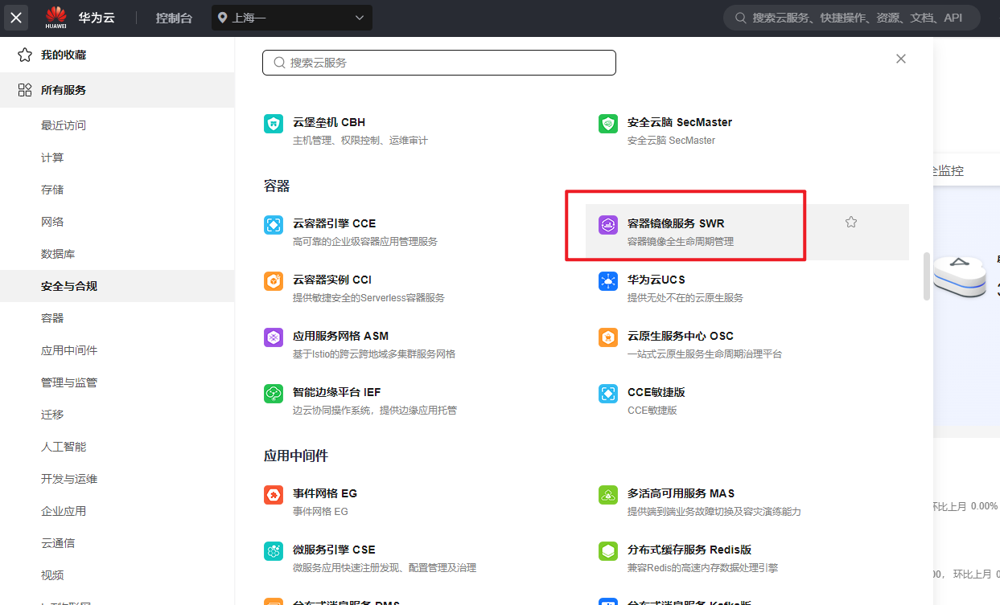
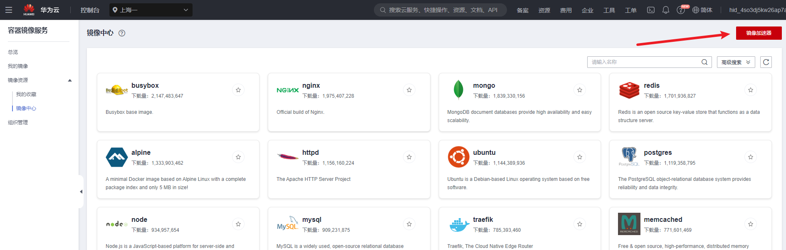
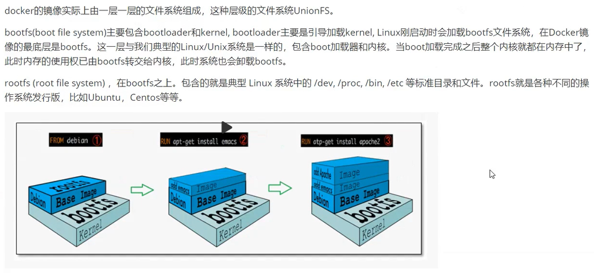
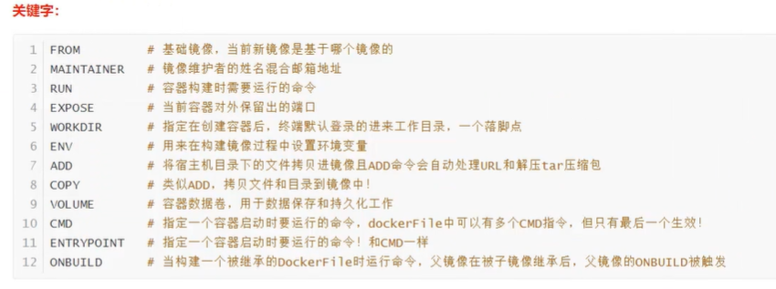
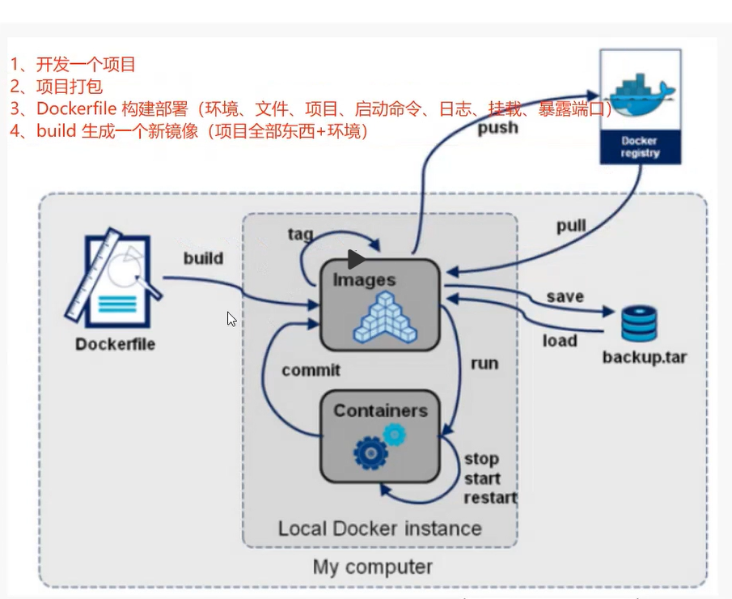
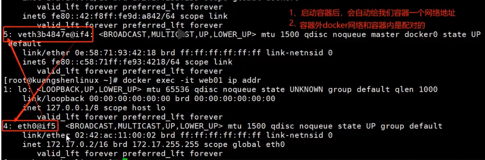
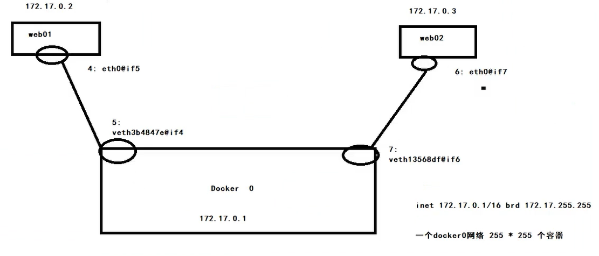
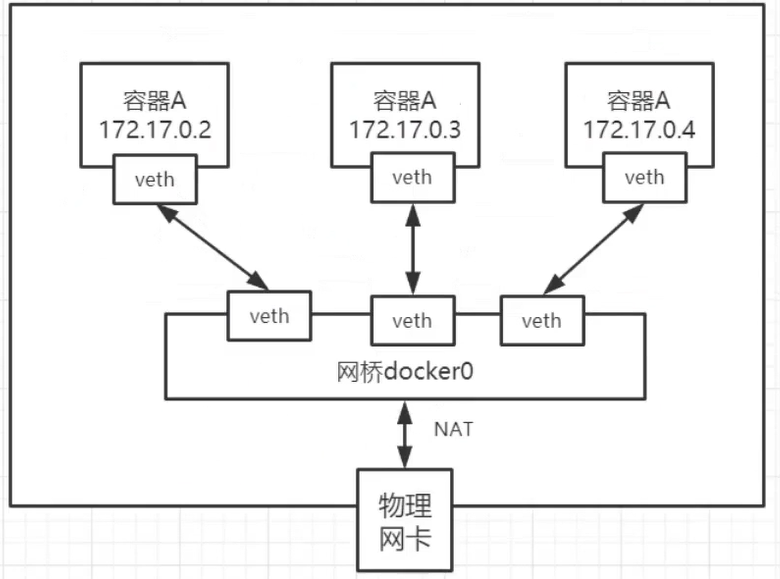
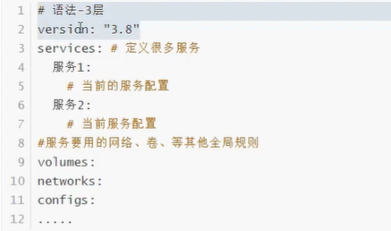
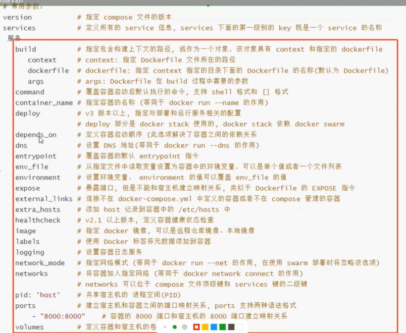

# 1. Docker基础

## 1.1 Docker几个概念

- **镜像（Image）**：**（模板）**

1、安装环境 2、配置环境变量  3、部署项目  4、项目需要使用的文件  5、对外暴露的文件……

把上面所有这些东西封装起来，就是镜像！

```
`镜像Image就是一个只读的模板，镜像可以用来创建Docker容器，一个镜像可以创建很多个容器`
```

- **容器（Container）：**通过镜像来启动的

```
Docker利用容器（Container）独立运行一个或一组应用，容器是用镜像创建的运行实例

它可以被启动、开始、停止、删除。每个容器都是相互隔离的！保证安全的平台。

可以把容器看作是一个简易版的Linux环境（包括root用户权限、进程空间、用户空间和网络空间等）和运行在其中的应用程序
```

- **仓库（Repository）**：私有仓库、公有仓库docker hub

```
仓库是集中存放镜像文件的场所

仓库和 仓库注册服务器（Registry）是有区别的，仓库注册服务器上通常放着多个仓库，每个仓库中又包含了多个镜像，每个镜像又有不同的标签（tag）
```

## 1.2 Docker启动流程

**Docker Run 镜像名**  执行流程：

1. 寻找镜像（如果存在，就通过镜像启动容器，不存在就去仓库中下载镜像）
2. 下载镜像（存在就拉取到本地，然后执行，不存在就直接报错 ）


如何查看下载的镜像：

```
docker images
```

## 1.3 Docker镜像加速

在华为云中找到容器镜像加速代码：





加速地址如下：

```
{
    "registry-mirrors": [ "https://ccb240fd397d451bb8a43e9e0aca687e.mirror.swr.myhuaweicloud.com" ]
}
```


# 2.Docker常用命令

- 查看一些Docker信息

```
docker version
docker info
```

- 帮助命令

```
docker --help
```

## 2.1 镜像命令

```shell
docker images：展示所有的镜像
# -a ：展示所有的镜像  -q ：只展示镜像的id
docker images -a
docker images -q
```


```shell
# 搜索镜像
docker search mysql
# 过滤镜像
docker search mysql --filter=STARS=50
```


```shell
# 下载镜像
docker pull mysql

# 删除镜像  docker rmi (镜像名/镜像ID)
docker rmi hello-world 
# 有容器在使用的话就不能直接删除，需要强制删除
docker rmi -f hello-world

# 删除所有的镜像 $() 是参数
docker rmi -f $(docker images -aq)
```

## 2.2 容器命令

`说明：`有镜像才能够创建容器，如使用centos的镜像来测试，就是一个虚拟的centos！

```shell
docker Pull centos

# docker run 中自带了 docker pull
docker run centos

# docker run 中常用参数
--name="aaa" 给容器起一个名字
-d 			 容器后台启动
-i			 让容器用交互的方式启动
-t			 给容器分配一个终端登录使用  /bin/bash
# 组合  docker run -itd 镜像名 ：通过进入容器的方式启动容器，并且退出的时候后台运行
-p			 指定端口映射（主机访问的端口：容器端口）,可以同时暴露多个端口
-P			 随机暴露一个端口

```

使用`docker run -d centos`命令启动后，如果这个容器里没有前台进程，直接通过-d启动，就会退出，这个时候使用docker ps是查询不到的。想要不让他退出，这个时候使用`docker run -d -it centos /bin/bash`，用交互的方式后台启动，就可以避免此问题。


```shell
docker ps  # 查看运行中的容器  -a 查看所有的  -q 只展示容器id

docker start 容器id  #启动一个已经停止的容器
docker restart 
docker stop
docker kill # 强制停止

docker rm 容器id

docker top 容器id  # 查看容器进程相关信息
```

**docker inspect 命令：查看容器的元数据**

```shell
root@hecs-226328:~# docker inspect 8
[
    {
        "Id": "80757e3573edaaba84c0b19f5554cb5f521fdfd1aa45bc51b559cfa7e71564d1",
        "Created": "2024-01-02T12:47:49.229133664Z",
        "Path": "/bin/bash",
        "Args": [],
        "State": {
            "Status": "running",
            "Running": true,
.....
```

 进入一个正在执行的容器：

```shell
docker exec -it 容器id
```

进入容器正在执行的终端

```shell
docker attach 容器id
```

区别：

exec是在容器中打开新的终端，并且可以启动新的进程 

**attach直接进入容器启动命令的终端，不会启动新的进程**


拷贝容器内的文件到主机上：`docker cp`

```
docker cp 容器id  容器内的文件 拷贝到容器外的哪里
```

 


## 2.3 使用Docker安装nginx

```shell
# 1. 搜索镜像
docker search nginx
# 2. 拉取镜像
docker pull nginx
# 3. 通过镜像启动容器 -d :后台启动  --name：重命名 -p 端口映射  本机端口：容器内端口
docker run -d --name cyc-nginx -p 3500:80 nginx
# 4. 进入容器查看
# docker exec -it

```


# 3. Docker进阶

## 3.1 portainer安装（Linux）

教程：https://www.modb.pro/db/395327

可视化工具：

```shell
# 启动镜像
docker run -d -p 8124:9000 --restart=always -v /var/run/docker.sock:/var/run/docker.sock --name portainer portainer/portainer-ce
```

启动完成后既可以在本地访问8124端口进入可视化界面


## 3.2 Docker镜像

镜像是一种轻量级、可执行的独立软件包，用来打包软件运行环境和基于运行环境开发的软件，它包含运行某个软件所需要的所有内容，包括代码、运行时库、环境变量和配置文件

**Docker镜像加载原理**

**UnionFS （联合文件系统）：**

UnionFS：Union文件系统是一种**分层、轻量级并且高性能的文件级系统**，它支持对文件系统的修改作为一次提交来一层层地叠加，同时可以将不同目录挂载到同一个虚拟文件系统下。Union文件系统是Docker镜像的基础，镜像可以通过分层来进行继承，基于基础镜像可以制作各种具体的应用镜像。

特性：一次同时加载多个文件系统，但从外面看起来，**只能看到一个文件系统，联合加载会把各层文件系统叠加起来，**这样最终的文件系统会包含所有地层的文件和目录。




通过·`docker inspect xxx`命令来查看docker的RootFS

```shell
"RootFS": {
            "Type": "layers",
            "Layers": [
         "sha256:9eb82f04c782ef3f5ca25911e60d75e441ce0fe82e49f0dbf02c81a3161d1300",
         "sha256:6427e36e38734cc5f8172a32837f1a7089fb3e3ae8b5c12f6882cb6466d6b482",
         "sha256:1a4bac3ca47c45b2341b866d4403690c45c4a87e8cb897afda5dd6be52f37eda",
         "sha256:7c06655789f2bd431a94e2cf7d363afbe3497ba18ca4565dc772ba82ade0cb74",
         "sha256:902a5f810181e3b8b2f7c5e39013d1e4acceb917f1f778ac199d495abba1e9f3",
         "sha256:52d9c23a9a201b21e95fed351c1ba1418a54ba1bd2ba26f5238d8bd8f38fd328",
         "sha256:9ffac285cc4fa861d7843807b42d509e216a8a107f694c4ac68f2a2d670332c7",
         "sha256:5ba1eb4d2ba5041fcc90b141f7942ff4e59570dddc8dc1786f2fe32d7d19c41d",
         "sha256:9ba725af2ff003dfa3fa052c2a9d8580f46b78bb603986d3428037c328811a3f",
         "sha256:d5455ab92c3f4a8a72d62f8ae5557440a8e5d09c6580e45f0f8f2747bb79c07d",
         "sha256:7c77abddd30092838eb397a4c64e73ee743eca8bf2412c9914e8ad2e6191bed9"
            ]
        },
        "Metadata": {
            "LastTagTime": "0001-01-01T00:00:00Z"
        }
```

**理解：**

**所有的Docker镜像都起始于一个基础镜像层，当进行修改或增加新的内容时，就会在当前镜像层之上，创建新的镜像层。**

## 3.3 镜像commit

```shell
docker commit 容器id

-m=”提交的信息”
-a=“作者”
```

docker commit 提交容器的副本，让这个容器产生一个新的镜像。

使用Commit命令提交了之后，相当于是新增了一层，继续使用inspect命令查看时就会发现新增了一层rootfs


## 3.4 容器数据卷

**什么是容器数据卷**
**docker的理念回顾:**
将应用和运行的环境打包形成容器运行，运行可以伴随着容器，但是我们对于数据的要求，是希望能够持久化的!就好比，你安装一个MySQL，结果你把容器删了，就相当于制库跑路了，这TM也太扯了吧! 

所以我们希望容器之间有可能可以**共享数据**，Docker容器产生的数据，如果不通过docker commit 生成新的镜像，使得数据作为镜像的一部分保存下来，那么当容器删除后，数据自然也就没有了!这样是行不通的!

为了能保存教据在Doker中我们就可以使用**卷**! 让数据持我到我们本地! 这样教据就不会因为容器刷除而丢失了

**作用:**  -v 挂载volume

**卷就是目录或者文件，存在一个或者多个容器中**，由doker挂载到容器，但不属于联合文件系统，因此**能够绕过 Union Fle System** ，**提供一些用于持续存储或共享数据的特性**:
卷的设计目的就是**数据的持久化**，完全独立于容器的生存周期，因此**Docker不会在容器删除时删除其挂载的数据卷.**

**特点:**
1、数据卷可在容器之间共享或重用数据
2、卷中的更改可以直接生效
3、数据卷中的更改不会包含在镜像的更新中
4、**数据卷的生命周期一直持续到没有容器使用它为止**
所以: 总结一句话: **就是容器的持久化，以及容器间的继承和数据共享!**

- **使用数据卷**

```shell
docker -v 宿主机目录：容器目录

# 自动创建对应的文件夹
docker run -it -v /home/ceshi:/root centos /bin/bash

```

**如在宿主机  home/ceshi文件夹内新增了文件，则在容器内的root文件夹内也能看见更新的文件**

**删除容器后，数据依旧存在！**

**容器再次重新挂载回来，容器内又可使用这个数据了！！**

 

使用inspect 命令查看挂载信息：

```shell
"Mounts": [
            {
                "Type": "bind",
                "Source": "/var/run/docker.sock",  // 宿主机路径
                "Destination": "/var/run/docker.sock", // 容器内路径
                "Mode": "", 
                "RW": true,  可读可写
                "Propagation": "rprivate"
            },
            {
                "Type": "volume",
                "Name": "30a1665a807b90046c4daae546f5004e25079db39cc275d703a01112d8452873",
                "Source": "/var/lib/docker/volumes/30a1665a807b90046c4daae546f5004e25079db39cc275d703a01112d8452873/_data",
                "Destination": "/data",
                "Driver": "local",
                "Mode": "",
                "RW": true,
                "Propagation": ""
            }
        ],
```

## 3.5 docker安装mysql

```shell
docker run -d -p 8566:3306 \
-v /home/mysql/conf:/etc/mysql/conf.d \
-v /home/mysql/data:/var/lib/mysql \
-e MYSQL_ROOT_PASSWORD=123456 \
--name mysql001 \
mysql
```

 1、测试，创建数据库，新增数据

 2、删除容器

 3、启动容器，数据依旧存在


# 4. DockerFile

## 4.1 Dockerfile挂载数据卷

DockerFile是用来构建Docker镜像的构建文件，是由一些列命令和参数构成的脚本。

```dockerfile
docker build 构成一个镜像
-f  指定要用哪个文件构建
-t  输出的镜像名
```

如果没有指定本地的容器卷目录，那么默认是使用匿名挂载的。

docker默认的匿名目录是`/var/lib/docker/volumes/...`

```shell
# 指定目录挂载
-v 宿主机目录：容器内目录

# 匿名挂载
-v 容器内路径
docker run -d -P --name nginx -v /etc/nginx nginx

# 匿名挂载的缺点，就是不好维护，通常使用命令docker volume来维护
docker volume ls

# 具名挂载
-v 卷名：/容器内路径
docker run -d -p --name nginx2 -v nginxconfig:/etc/nginx nginx
```

## 4.2 DockerFile

微服务打包成镜像，在任何装了Docker的地方，都可以下载使用，极其方便。

Docker的开发流程：

**开发应用 --> DockerFile --> 打包为镜像 --> 上传到仓库（私有仓库、公有仓库）  --> 下载镜像  --> 启动运行**

如Dockerhub中Centos的DockerFile为：

```dockerfile
FROM scratch
ADD centos-7-x86_64-docker.tar.xz /

LABEL \
    org.label-schema.schema-version="1.0" \
    org.label-schema.name="CentOS Base Image" \
    org.label-schema.vendor="CentOS" \
    org.label-schema.license="GPLv2" \
    org.label-schema.build-date="20201113" \
    org.opencontainers.image.title="CentOS Base Image" \
    org.opencontainers.image.vendor="CentOS" \
    org.opencontainers.image.licenses="GPL-2.0-only" \
    org.opencontainers.image.created="2020-11-13 00:00:00+00:00"

CMD ["/bin/bash"]
```

构建步骤：

1. 编写DockerFile文件
2. docker build构建镜像（生成一个image）
3. docker run

**DockerFile指令**

关键字：



**基础知识:**

1. 每条保留字指令都必须为**大写字母**且后面要跟随至少一个参数

2. 指令按照从上到下，顺序执行

3. `#`表示注释

4. 每条指令**都会创建一个新的镜像层**，并对镜像进行提交


**流程:**

   1、docker从基础镜像运行一个容器
   2、执行一条指令并对容器做出修改
   3、执行类似 `docker commit` 的操作提交一个新的镜像层
   4、Docker再基于刚提交的镜像运行一个新容器
   5、执行dockerfile中的下一条指令直到所有指令都执行完成!

**说明:**
   从应用软件的角度来看，DockerFile，docker镜像与docker容器分别代表软件的三个不同阶段。

- DockerFile 是软件的原材料(代码)

- Docker镜像则是软件的交付品 (.apk)

- Docker 容器则是软件的运行状态 (客户下载安装执行)

  

**DockerFile 面向开发，Docker镜像成为交付标准，Docker容器则涉及部署与运维，三者缺一不可!**


```shell
# 构建我们自己的镜像，最后有一个. 
-f  指定dockerfile文件
-t  输出的镜像文件名：版本
docker build -f dockerfile-mycentos -t mycentos:1.0 .

```

如可以编写如下DockerFile

```dockerfile
FROM centos
MAINTAINER cyc<2477721334@qq.com>
ENV MYPATH /usr/local
WORKDIR $MYPATH

# 在基础的cnetos上安装vim

RUN yum -y install vim
RUN yum -y install net-tools

EXPOSE 8142
CMD echo $MYPATH
CMD echo "----end----"
CMD /bin/bash
```

项目中编写DockerFile
1、基于一个空的镜像
2、下载需要的环境  **ADD**
3、执行环境变量的配置 **ENV**
4、执行一些Linux命令 **RUN**
5、日志  **CMD**
6、端口暴露  **EXPOSE**
7、挂载数据卷  **VOLUMES**
这个过程就是你手动部署项目的过程，通过Docker可以在未来实现自动化构建


**docker history 查看镜像的变更历史**




# 5. Docker网络

## 5.1 Docker0网络

准备工作：先清理一下环境

```shell
docker rm -f $(docker ps -a -q)  # 删除所有容器
docker rmi -f $(docker images -qa) # 删除全部镜像
```

本地干净的网络：

```shell
root@hecs-226328:~# ip addr

# 本地回环网络
1: lo: <LOOPBACK,UP,LOWER_UP> mtu 65536 qdisc noqueue state UNKNOWN group default qlen 1000
    link/loopback 00:00:00:00:00:00 brd 00:00:00:00:00:00
    inet 127.0.0.1/8 scope host lo
       valid_lft forever preferred_lft forever
    inet6 ::1/128 scope host 
       valid_lft forever preferred_lft forever
# 网卡地址
2: eth0: <BROADCAST,MULTICAST,UP,LOWER_UP> mtu 1500 qdisc fq_codel state UP group default qlen 1000
    link/ether fa:16:3e:45:9d:35 brd ff:ff:ff:ff:ff:ff
    inet 192.168.0.152/24 brd 192.168.0.255 scope global dynamic noprefixroute eth0
       valid_lft 54743sec preferred_lft 54743sec
    inet6 fe80::f816:3eff:fe45:9d35/64 scope link 
       valid_lft forever preferred_lft forever
       
# docker 0 网络 ， docker创建的网络
3: docker0: <NO-CARRIER,BROADCAST,MULTICAST,UP> mtu 1500 qdisc noqueue state DOWN group default 
    link/ether 02:42:8b:82:b2:a7 brd ff:ff:ff:ff:ff:ff
    inet 172.17.0.1/16 brd 172.17.255.255 scope global docker0
       valid_lft forever preferred_lft forever
    inet6 fe80::42:8bff:fe82:b2a7/64 scope link 
       valid_lft forever preferred_lft forever
```

1、微服务这么多，访问怎么解决?  (容器名)
2、docker每启动一个容器，就会给他分配一个ip。doker0是docker默认给的。我们不指定网络的情况下，创建容器都在docker0中，未来开发中，我们要自定义网络。

**docker每启动一个容器，就会给他分配一个ip。这个ip就是归docker0 管理**

**容器外本地可以ping到容器里面**






Docker使用Linux桥接，在宿主机虚拟一个Docker容器网桥（Docker0），Docker 启动一个容器时会根据Docker网桥的网段分配给容器一个IP地址，称为Container-IP，同时Docker网桥是每个容器的默认网关，因为在同一宿主机内的容器都接入同一个网桥，这样容器就能够通过容器的Container-IP直接通信。



Docker容器网络就很好的利用了**Linux虚拟网络技术**，在本地主机和容器内分别创建一个虚拟接口，并让他们彼此联通(这样一对接口叫**veth pair)**
Docker中的网络接口默认都是虚拟的接口。虚拟接口的优势就是**转发效率极高**(因为Linux是在内核中进行数据的复制来实现虚拟接口之间的数据转发，无需通过外部的网络设备交换)，对于本地系统和容器系统来说，虚拟接口跟一个正常的以太网卡相比并没有区别，只是他的速度快很多。


Docker 0 网络的特点：

1. 它是默认的
2. 域名访问不通
3. --link 可以让域名通了，但是删了又不行


## 5.2 Docker Compose

之前单机服务的时候，通过Dockerfile 构建为镜像，然后使用  docker run使其称为一个服务

如

```
user 服务   8080
net 服务  7000
pay 服务  8888
……
```

**问题:**
  前面我们使用Docker的时候，定义 Dockerfile 文件，然后使用 docker build、docker run 等命令操作容器，**然而微服务架构的应用系统一般包含若干个微服务，每个微服务一般都会部署多个实例**，如果每个微服务都要手动启停，那么效率之低，维护量之大可想而之。

**使用 Docker Compose 可以轻松，高效的管理容器，它是一个用于定义和运行多容器 Docker 的应用程序工具**


Compose：**容器的批量管理**

Compose 定义和运行多个Docker 容器，通过Compose，使用一个yaml文件来管理多个服务，然后通过一个简单的命令，就可以将所有的服务全部启动。

Docker Compose使用案例：

Using Compose is essentially a three-step process:

1. Define your app's environment with a `Dockerfile` so it can be reproduced anywhere.
2. Define the services that make up your app in a `compose.yaml` file so they can be run together in an isolated environment.
3. Run `docker compose up` and the Docker compose command starts and runs your entire app.

A `compose.yaml` looks like this:

```dockerfile
services:
  web:
    build: .
    ports:
      - "8000:5000"
    volumes:
      - .:/code
      - logvolume01:/var/log
    depends_on:
      - redis
  redis:
    image: redis
volumes:
  logvolume01: {}
```

Compose 中有两个重要概念：

1. **服务（Service）：**一个应用的容器，实际上可以包括若干运行相同镜像的容器实例

2. **项目（project）:**由一组关联的应用容器组成的一个完整业务单元，在docker-compose.yml中定义

Compose 项目是由Python编写的，实际上就是调用了Docker服务提供的API来对容器进行管理，因此，只要所在的操作系统的平台支持Docker API，就可以在其上利用Compose来进行编排管理


## 5.3 常用命令

1. 执行命令运行容器：docker compose up  -d
2. 查看镜像  docker images
3. 停止和删除容器  docker compose stop xx  和 docker compose rm xx






​             


