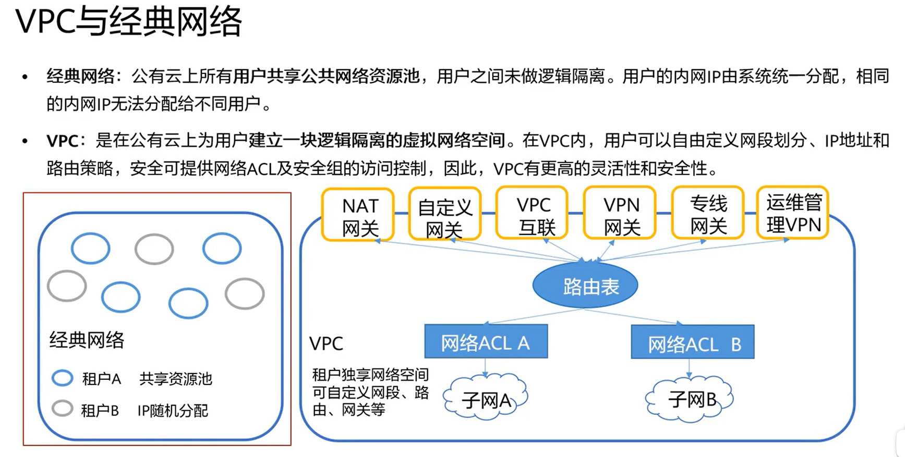
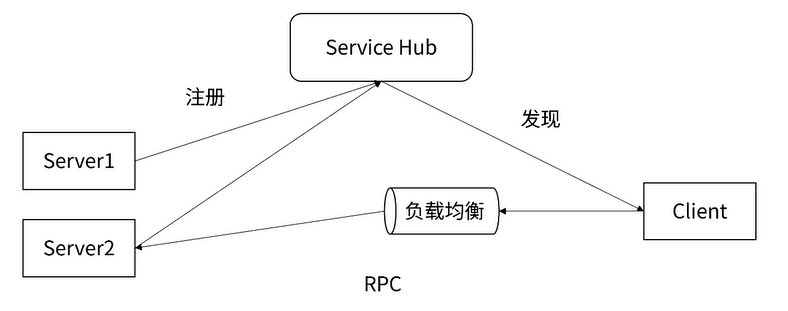
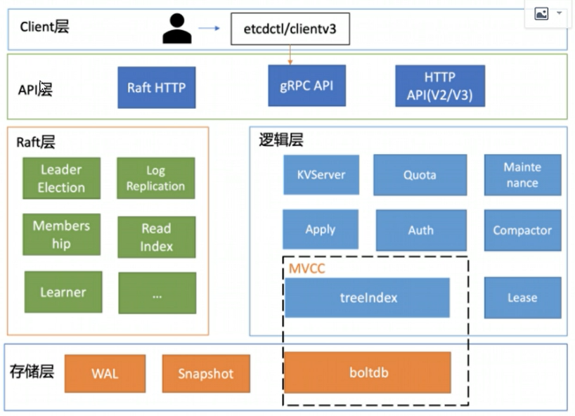
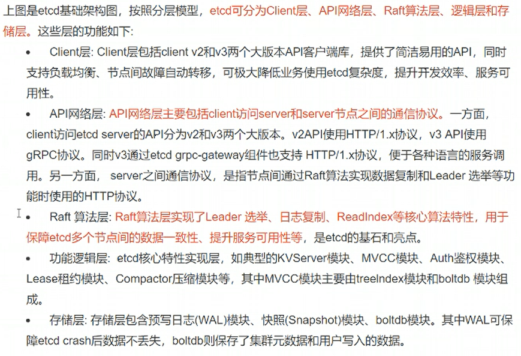
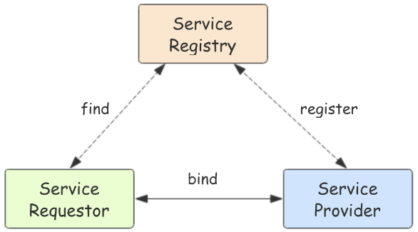
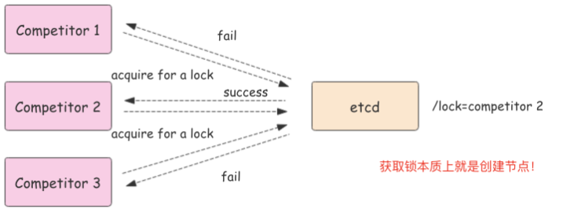

# 1 云原生

## 1.1 什么是云原生

**云计算：**

1. 通过互联网来提供计算资源（服务器、存储、网络等资源）
2. 大量的基础设施进行统一管理，（虚拟化技术，形成一个可以动态分配资源的平台）按需购买，可以大大降低用户的使用成本。
3. 云上的资源不仅包括基础设施，在云上搭建的开放平台、应用等都可以作为一种服务提供给用户，这就是Paas（Platform as a Service）和Saas（Software as a Service）。根据云服务的开放范围，又可以分为公有云、私有云、混合云

**云原生：（Cloud Native）**

如果说一个Cloud Native Application就是指从设计开始就是为了部署在云环境上的。

云原生是一种系统化的方法论和技术的集合，经过不断地演进与发展，目前云原生的核心主要是：**微服务、容器、服务网格、不可变基础设施和声明式API**这五大关键技术。

单体应用---> 拆分 前后端分离  --> 微服务  --> 容器化 --> 容器编排（K8S） --> 服务网格

## 1.2 公有云、私有云

公有云是指第三方提供商：腾讯、阿里、华为等通过公共Internet：服务器、算力、存储、网络等。。。为用户提供的云服务，公有云服务的模式可以是免费或者按量付费。

公有云的**核心属性是共享资源服务（购买大量的服务器，在不同区域配置，实现灾备、降温...）**。第三方提供商将共享的计算、存储、网络等资源按量提供给用户。对于用户来说，由于不需要进行初始IT基础设施投资就可以通过按需付费的方式享受IT服务。

- **公有云的架构**

公有云常见的架构包含包含IaaS（Infrastructure as a Service，基础设施即服务）、PaaS（Platform as a Service，平台即服务）、SaaS（Software as a Service，软件即服务）、运维、运营、安全六大部分。

**IaaS层**主要是将**计算、存储、网络资源的抽象化后将资源提供给用户使用**，并根据实际运用需求，提供对应服务。

**PaaS层**基于IaaS层为用户提供容器服务、微服务开发等服务，即将一个开放平台作为服务提供给用户。 

**SaaS层**主要提供场景化的应用，即将应用作为服务提供给用户，单一软件服务的提供。

**在运维层面**，公有云提供面向用户侧和面向平台侧的运维能力。公有云为使用云服务的用户提供用户运维能力，例如**权限控制、性能监控，状态监控，故障告警**等。而在平台侧，是由公有云保障团队进行运维，保障平台的高可靠性、高可用性及安全性等。

**在运营层面**，公有云提供面向用户侧和面向平台侧的运营能力。**用户拥有提交工单、订单、计费等运营能力**，以协助用户了解运营成本、分析业务趋势。公有云运营团队对用户的工单、投资进行处理与**管控**，同时对于公有云的整体收入进行可视化管理。

**在安全层面**，公有云需要提供系统安全、平台安全、运维安全及**网络安全**等方面需求，**以保障用户及云服务提供商的数据财产安全**。

- **公有云与私有云的比较**

企业部署云计算服务的模式有三大类：公有云、私有云、**混合云**。其中，私有云是企业自己建设的为企业内部提供服务的一种云计算使用方式。**私有云为一个企业单独使用而构建，可部署在企业的数据中心中**，也可统一部署在云平台业务提供商的机房。

**总体对比，与私有云相比，公有云具备以下优点：**

**1.更高的弹性和可扩展性**：使用公共云，客户可以快速订购计算、存储和网络资源来应对激增的业务需求，而无需购买和部署新的硬件。

**2.更低的进入成本**：大多数客户可以无需添加自己的物理基础设施就可以使用公共云服务。

**3.更快地获取最新技术**：在许多情况下，与客户自己购买和安装硬件和软件相比，公有云提供商能够更快地提供最新的硬件和软件，及其对应的升级更新。

与公有云相比，**私有云的安全性更好，但成本也更高**，且私有云整个基础设施的平均利用率要低于公有云

根据业务需求来设定。大部分业务，其实都可以部署在公有云上。

- **建设与运行模式对比**

1.公有云是一种新的IT能力消费模式，公有云的用户只需关注云服务所提供的能力，并不关注背后的资源所在地，以及建设、交付、运维等问题。公有云用户可以快速租用资源，部署自己的业务，前期投入低，业务上线周期短。在运维层面，公有云提供商提供大部分运维服务，公有云用户只需要关注自身的应用。

2.**私有云的资产归属该组织拥有，由该组织主导云的建设、管理和维护，部署在该组织内部的数据中心。**私有云前期建设投入成本较多，建设和调试周期较长。私有云的运维一般需要该组织自身完成。

- **架构对比**

从架构上看，一般认为私有云的IaaS、PaaS能力是公有云IaaS层、PaaS层能力的子集。由于私有云是满足某组织的具体业务需求构建的，因此不需要将IaaS、PaaS的能力全部都纳入私有云，该组织不使用的能力，可以不部署。例如该组织只使用虚拟机服务，不使用裸金属服务，则该私有云中可以不部署裸金属服务。

公有云架构中除了IaaS、PaaS以外，还有SaaS、运营等主要能力。

公有云一般均提供SaaS能力，但是在私有云中，却不一定会部署SaaS软件。当SaaS软件私有化部署后，私有云拥有者需要投入大量的资源去维护SaaS软件，在成本上比使用公有云版本的纯SaaS服务要高得多。在实际部署中，不论是公有云、私有云、混合云，其部署都是基于不同客户的需求制定的SaaS实施方案，主要取决于客户对于安全、成本、维护等各个因素的综合考虑。

由于私有云的私有属性，**在私有云的组织内部一般不涉及费用计算问题**，此时不涉及运营。而公有云需通过各种模式向其用户收费，因此其运营能力是必选项。

- **业务类型对比**

1.公有云中一般部署非核心业务、需要快速迭代的业务、对外部提供服务的业务。  小公司，简单业务

2.**私有云中一般部署该组织的核心业务、设涉及到信息安全等级高的业务**。 高机密业务

3、混合云  ，兼容兼备。主要考虑成本问题。

## 1.3 VPC：虚拟私有云

虚拟私有云（Virtual Private Cloud）是用户在公有云上**申请的隔离的、私密的虚拟网络环境**。用户可以自由配置VPC内的IP地址段、子网、安全组等子服务，也可以申请弹性带宽和弹性IP搭建业务系统。

# 2 etcd

etcd：A distributed, reliable key-value store for the most critical data of a distributed system

一个分布式、可靠的键值存储，用于存储分布式系统中最关键的数据

**服务注册与发现：**

**etcd的应用场景：**

分布式系统中的数据分为**控制数据和应用数据**。etcd的使用场景**默认处理的数据都是控制数据**，对于应用数据，只推荐数据量很小，但是更新访问频繁的情况。

常见的etcd使用场景包括：配置共享、服务注册和发现、分布式锁、分布式队列、分布式通知和协调、主备选举等。

## 2.1 etcd架构

 

etcd具有以下特点：

- 完全复制：集群中的每个节点都可以使用完整的存档
- 高可用性：Etcd可用于避免硬件的单点故障或网络问题
- 一致性：每次读取都会返回跨多主机的最新写入
- 简单：包括一个定义良好、面向用户的API（gRPC）
- 安全：实现了带有可选的客户端证书身份验证的自动化TLS
- 快速：每秒10000次写入的基准速度
- 可靠：使用Raft算法实现了强一致、高可用的服务存储目录

## 2.2 etcd应用场景

1. **服务发现**

​		服务发现要解决的也是分布式系统中最常见的问题之一，即在同一个分布式集群中的进程或服务，要如何才能找到对方并建立连接。本质上来说，服务发现就是想要了解集群中是否有进程在监听 udp 或 tcp 端口，并且通过名字就可以查找和连接。

2. **配置中心**

​		将一些配置信息放到 etcd 上进行集中管理。

​		这类场景的使用方式通常是这样：应用在启动的时候主动从 etcd 获取一次配置信息，同时，在 etcd 节点上注册一个 Watcher 并等待，以后每次配置有更新的时候，etcd 都会实时通知订阅者，以此达到获取最新配置信息的目的。

3. **分布式锁**

因为 etcd 使用 Raft 算法保持了数据的强一致性，某次操作存储到集群中的值必然是全局一致的，所以很容易实现分布式锁。锁服务有两种使用方式，一是保持独占，二是控制时序。

- 保持独占即所有获取锁的用户最终只有一个可以得到。etcd 为此提供了一套实现分布式锁原子操作 CAS（CompareAndSwap）的 API。通过设置prevExist值，可以保证在多个节点同时去创建某个目录时，只有一个成功。而创建成功的用户就可以认为是获得了锁。
- 控制时序，即所有想要获得锁的用户都会被安排执行，但是获得锁的顺序也是全局唯一的，同时决定了执行顺序。etcd 为此也提供了一套 API（自动创建有序键），对一个目录建值时指定为POST动作，这样 etcd 会自动在目录下生成一个当前最大的值为键，存储这个新的值（客户端编号）。同时还可以使用 API 按顺序列出所有当前目录下的键值。此时这些键的值就是客户端的时序，而这些键中存储的值可以是代表客户端的编号。

