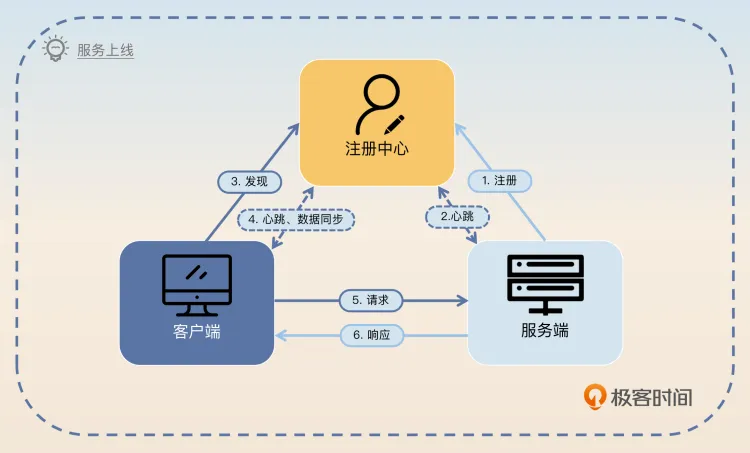
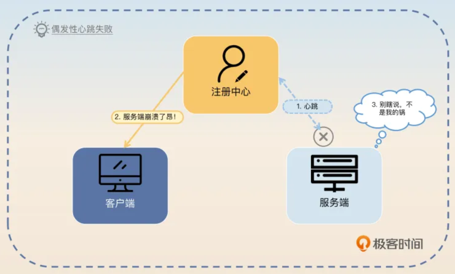
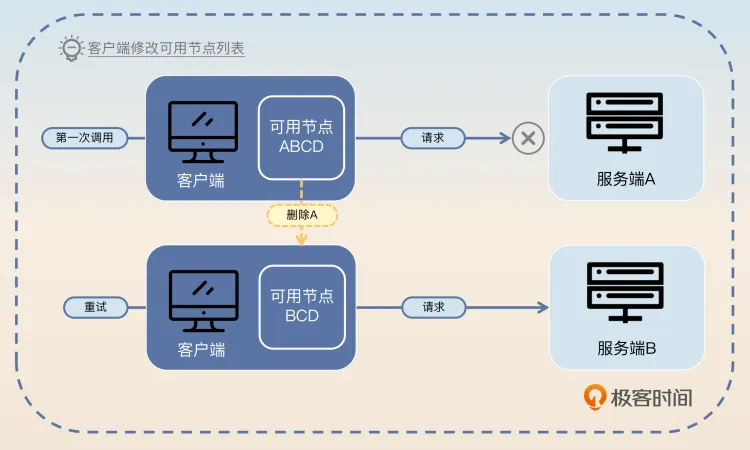
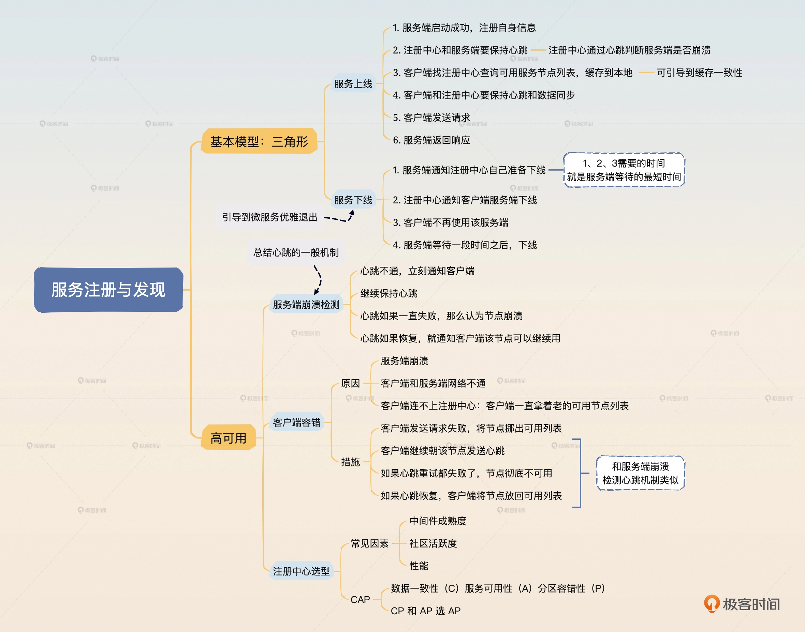

# 1. 服务注册与发现

1. 服务端启动的时候，会先向注册中心中 注册自身的一些信息，**主要是定位信息**
2. 注册成功后，服务端和注册中心要保持心跳
3. 客户端第一次发起对某个服务的调用时，需要**先找注册中心获得所有可用服务节点列表**。随后**客户端会在本地缓存每个服务对应的可用节点列表**
4. 客户端和注册中心**也要保持心跳和数据同步**，后续服务端有任何变动，注册中心都会通知客户端，客户端会更新本地的可用节点列表
5. 客户端发送请求
6. 服务端返回相应

`第一步中：服务端注册的数据除了定位信息是必需的以外，剩下需要什么数据都是根据微服务框架本身的功能和业务来设计的。比如说很多微服务框架支持分组功能，那么就可以让服务端在注册的时候同时注册自己的分组信息，比如说当前节点是 VIP 节点。那么客户端在收到 VIP 请求之后就会把请求发给 VIP 节点。 `

> 服务注册与发现怎么保证高可用？

从三个点来回答：  **注册服务端崩溃检测、客户端容错 和 注册中心选型** 

- **服务端崩溃检测**

正常情况下，服务端下线都需要通知注册中心。那么万一服务端宕机了呢？在这种情况下，服务端是没办法通知注册中心的，注册中心自然也就不会通知客户端。那么客户端就会继续把请求发送给服务端，而这些请求显然都会失败。

注册中心如何判断服务器宕机了？

你可能在上面这张图片里注意到了，服务端崩溃之后注册中心和服务端之间的心跳就无法继续保持了。所以你得出一个简单的结论：**如果注册中心和服务端之间的心跳断了，就认为服务端已经崩溃了**。但是，如果注册中心和服务端之间的网络出现偶发性的抖动，那么心跳也会失败。此时服务端并没有真的崩溃，还活得好好的。

显然，**心跳断了则服务端崩溃的判断并不能成立**。这时候你可能会想到能不能多发几次心跳呢？答案是可以，但是次数越多，心跳间隔越长，注册中心断定服务端已经崩溃的时间就越长。而时间越长，就有越多请求发送给服务端。万一这个时候服务端真的崩溃了，这些请求都会失败。所以这就陷入两难境地了。要么是误以为服务端崩溃，要么是误以为服务端还活着。

所以关键词就是心跳，你可以这样回答。

`影响到可用性的另一个关键点是注册中心需要尽快发现服务端宕机。在基本模型里面，如果服务端突然宕机，那么服务端是来不及通知注册中心的。所以注册中心需要有一种检测机制，判断服务端有没有崩溃。在服务端崩溃的情况下，要及时通知客户端，不然客户端就会继续把请求发送到已经崩溃的节点上。这种检测就是利用心跳来进行的。当注册中心发现和服务端的心跳失败了，那么它就应该认为服务端可能已经崩溃了，就立刻通知客户端停止使用该服务端。但是这种失败可能是偶发性的失败，比如说因为网络偶尔不稳定造成的。所以注册中心要继续保持心跳。如果几次心跳都失败了，那么就可以认为服务端已经彻底不可用了。但是如果心跳再次恢复了，那么注册中心就要再次告诉客户端这个服务端是可用的。`

回答到这里，亮点已经有了，不过你还可以继续钓鱼，稍微升华一下。

`实际上，在所有有心跳机制的分布式系统里面判断节点是否崩溃都是一个棘手的问题。比如说心跳失败了要不要继续重试，是立刻重试还是间隔重试，重试的话试几次？`

`理论上来说，在心跳失败之后如果不进行重试就直接判定服务端崩溃，那么就难以处理偶发性网络不通的问题。而如果要重试，比如说在注册中心和服务端的模型里面，重试三次，而且重试间隔是十秒钟，那么注册中心确定服务端崩溃就需要三十秒。在这三十秒内，客户端估计有成千上万的请求尝试发到崩溃的服务端，结果都失败了。`

如果不考虑重试间隔的话，就难以避开偶发性的失败。比如说注册中心和服务端之间网络抖动，那么第一次心跳失败之后，你立刻重试多半也是失败的，因为此时网络很可能还是不稳定。

`所以比较好的策略是立刻重试几次，如果都失败了就再间隔一段时间继续重试。所有的重试机制实际上也是要谨慎考虑重试次数和重试间隔的，确保在业务可以接受的范围内重试成功。不过再怎么样，从服务端崩溃到客户端知道，中间总是存在一个时间误差的，这时候就需要客户端来做容错了。`

这个回答里面，最后的一句话，就是为了引出下面这个亮点：**客户端容错**。

- **客户端容错**

客户端容错是指尽量**在注册中心或者服务端节点出现问题的时候，依旧保证请求能够发送到正确的节点上**。

以你要紧接着前面刷的亮点继续回答，关键词是**换节点**，也就是所谓的 **failover.**

`客户端容错第一个要考虑的是如果某个服务端节点崩溃了该怎么办。在服务端节点崩溃之后，到注册中心发现，再到客户端收到通知，是存在一段延时的，这个延时是能算出来的。在这段延时内，客户端发送请求给这个服务端节点都会失败。`

`这个时候需要客户端来做一些容错。一般的策略是客户端在发现调不通之后，应该尝试换另外一个节点进行重试。如果客户端上的服务发现组件或者负载均衡器能够根据调用结果来做一些容错的话，那么它们应该要尝试将这个节点挪出可用节点列表，在短时间内不要再使用这个节点了。后面再考虑将这个节点挪回去。`

- **注册中心选型**

注册中心更加关注 **CAP** 中选 **CP** 还是选 **AP** 的问题。

**C：Consistency，数据一致性** 

**A：Availability，服务可用性** 

**P：Partition-tolerance，分区容错性** 

CAP 理论告诉我们，**一个分布式系统不可能同时满足数据一致性、服务可用性和分区容错性这三个基本需求，最多只能同时满足其中的两个。**

简单来说，选择 CP 就是选了一致性和分区容错性，而选择 AP 就相当于选了可用性和分区容错性。看上去 P 分区容错性是肯定要选的，那么剩下的就是选 C（一致性） 还是选 A（可用性） 了。那么你要先理解在注册中心选型里面，一致性和可用性究竟哪个更加重要？**标准答案是可用性，也就意味着 CP 和 AP 你应该选 AP。**

前面我们讨论了客户端容错，那么显然在选择 AP 的情况下，客户端就可能拿到错误的可用节点列表。如果客户端将请求发到错误的可用节点上，就会出现错误，此时客户端自然可以执行容错，换一个可用节点重试。

所以我们要抓住关键词**客户端容错**进行回答。

在注册中心选型上，重要的是 CAP 原理中应该选择 AP，比如说 Eureka，又或者 **Nacos 启用 AP 模式**。

万一你公司并没有使用 AP 模型的注册中心，比如说用了 CP 模型的 ZooKeeper，那么你就可以进一步解释，关键词是**体量小**。

我司之所以用 ZooKeeper，主要是因为我司体量小，集群规模也不大，ZooKeeper 虽然不是 AP 的，但是在这种体量下也够用了。不过我也尝试在公司内部推动看能否换一个中间件，比如说用 Nacos 的 AP 模式。

# 2. 负载均衡

- 静态负载均衡算法：挑出最合适的节点

**轮询和加权轮询、随机和加权随机、哈希和一致性哈希算法**

- 动态负载均衡算法：依赖于实时判断所有候选节点的状态，并且从里面挑出最合适的节点。

**最少连接数、最少活跃请求数、最快响应时间**

