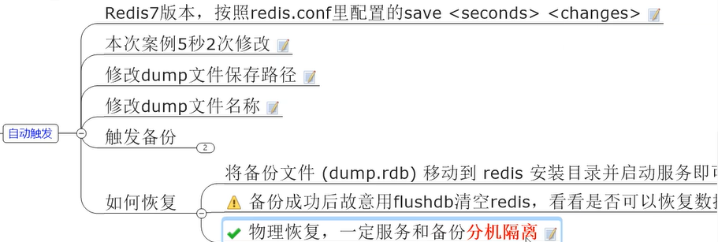

# 1 MySQL数据库

## 1.1 Ubuntu安装Mysql服务

安装等教程：https://www.sjkjc.com/mysql/install-on-ubuntu/

解决无法连接错误：https://blog.csdn.net/zhangzehai2234/article/details/82885130

1. **更新软件仓库包索引**

执行以下命令更新 Ubuntu 本地软件仓库的包索引。

```bash
sudo apt update
```

2. **升级本地软件**

输入以下命令升级系统：

```bash
sudo apt upgrade
```

3. **安装 MySQL**

执行以下命令开始安装 MySQL：

```bash
sudo apt install mysql-server
```

这一步会安装一个不安全的 MySQL 服务器。我们将在下一步配置服务器的安全性。安装完成后，我们先启动 MySQL 服务器：

```bash
sudo systemctl start mysql
```

4. **MySQL 安全配置**

执行以下命令调整 MySQL 服务器的安全性：

```bash
sudo mysql_secure_installation
```

这将会输出：

```txt
Securing the MySQL server deployment.

Connecting to MySQL using a blank password.

VALIDATE PASSWORD COMPONENT can be used to test passwords
and improve security. It checks the strength of password
and allows the users to set only those passwords which are
secure enough. Would you like to setup VALIDATE PASSWORD component?

Press y|Y for Yes, any other key for No:
```

这里时问你是否使用密码验证组件。输入 ‘Y’ 并按下回车键。


```txt
There are three levels of password validation policy:

LOW    Length >= 8
MEDIUM Length >= 8, numeric, mixed case, and special characters
STRONG Length >= 8, numeric, mixed case, special characters and dictionary                  file

Please enter 0 = LOW, 1 = MEDIUM and 2 = STRONG:
```

这是是设置密码验证策略的级别。他提供了 3 个级别：

- `LOW`: 密码长度至少 8 位
- `MEDIUM`: 密码长度至少 8 位, 由数字、混合大小写的字母和特殊字符组成
- `STRONG`: 密码长度至少 8 位, 由数字、混合大小写的字母、特殊字符和字典文件组成

请选择适合你的密码级别。在这里由于是用来开发和测试，我选择 `0`.

```txt
Please set the password for root here.

New password:

Re-enter new password:
```

在这里，输入两次密码。

```txt
Estimated strength of the password: 25
Do you wish to continue with the password provided?(Press y|Y for Yes, any other key for No) : Y
```

如果你对密码强度满意，输入 `Y` 和回车键后继续。

```txt
By default, a MySQL installation has an anonymous user,
allowing anyone to log into MySQL without having to have
a user account created for them. This is intended only for
testing, and to make the installation go a bit smoother.
You should remove them before moving into a production
environment.

Remove anonymous users? (Press y|Y for Yes, any other key for No) : Y
Success.


Normally, root should only be allowed to connect from
'localhost'. This ensures that someone cannot guess at
the root password from the network.

Disallow root login remotely? (Press y|Y for Yes, any other key for No) : Y
Success.

By default, MySQL comes with a database named 'test' that
anyone can access. This is also intended only for testing,
and should be removed before moving into a production
environment.


Remove test database and access to it? (Press y|Y for Yes, any other key for No) : Y
 - Dropping test database...
Success.

 - Removing privileges on test database...
Success.

Reloading the privilege tables will ensure that all changes
made so far will take effect immediately.

Reload privilege tables now? (Press y|Y for Yes, any other key for No) : Y
Success.

All done!
```

在这里，上面所有问题都输入 `Y` 。然后完成整个配置过程。

## 1.2 Ubuntu 修改Mysql中root用户密码

1. **安装成功后，初始化的时候系统会随机分配一个用户名密码：从以下路径可以查看：**

```sh
sudo cat /etc/mysql/debian.cnf
```


图中显示的user、password就是默认随机的账户与密码，我们可以使用这组账号与面进行mysql登录

2. **系统默认的root用户是无密码的，需要对密码进行修改：**

**mysql5.7版本命令：**

```sh
update user set password=PASSWORD("123456") where user=root;                              --设置密码为123456
或者是
update user set authentication_string=PASSWORD(“123456”) where user=‘root’;              --设置密码为123456

执行完命令之后
flush privileges;  更新所有操作权限，
重启数据库
service mysql restart 即可
```

mysql 5.7.9以后废弃了password字段和password()函数；authentication_string:字段表示用户密码，而authentication_string字段下只能是mysql加密后的41位字符串密码。

**mysql8+版本命令：**

```sh
use mysql; 
 
update user set authentication_string='' where user='root';      --将字段置为空
 
alter user 'root'@'localhost' identified with mysql_native_password by 'cyc_db123';     
--修改密码为cyc_db123
```

修改成功！


3. **修改数据库配置文件绕过密码登录**

**不建议使用**

​		设置过程中因为绕过密码登录，会使root用户处于无密码状态，后期修改密码会报一个root处于无密码状态的错误，当然能解决。

当修改完密码后，还要将添加的内容注释掉，较为繁琐！

```sh
sudo gedit /etc/mysql/mysql.conf.d/mysqld.cnf        # 这里你也可以用vim编辑器，都是一样的。

vim /etc/mysql/mysql.conf.d/mysqld.cnf
```

在这个文件中添加如下内容：

```sh
skip-grant-tables
```


保存退出！重启mysql服务

```
service mysql restart
```

登录mysql，密码随便输，直接就进去了！

```sh
mysql -u root -p
```

## 1.3 本地无法连接远程服务器解决办法

- **Navicat 直接连接不上远程服务器：**连接时间很长而且返回错误

1. 编辑mysql配置文件，把其中bind-address = 127.0.0.1注释了

```sh
sudo vi /etc/mysql/mysql.conf.d/mysqld.cnf
```


重启mysql：

```sh
service mysql restart
```


- **Navicat 远程连接服务器上的数据库时报错：（Host  “XXX” is not allowed to connect to this MySQL server）**

问题描述：
1、远程服务器安装了mysql服务并且启动成功，在本地可以进行自由的访问和更新等操作
2、服务器已开通了远程访问服务器3306端口的权限并且通过netstat -ltnp命令查看3306处于监听过程中
3、远程通过工具链接该mysql数据库会报Host ‘xxx.xxx.xxx.xxx’(本地ip) is not allowed to connect to this MySQL server 的错误

解决办法：
1、远程链接服务器，在服务器内mysql系统目录下的/bin文件下执行./mysql -u root -p;输入密码登入mysql；
2、在mysql中执行use mysql命令，进入系统数据库
3、在mysql数据库中执行下面的命令;如果返回结果如下图：

```mysql
use mysql; 
select host from user where user = 'root'
```


4、在mysql数据库中执行如下命令：

```mysql
update user set host = '%' where user = 'root';
flush privileges;
```

5、执行完成后通过命令 service mysql restart 来重启mysql数据库，大功告成


重启mysql：

```sh
mysql restart
```


## 1.4 InnoDB

在InnoDB里也使用到了局部性原理（即计算机认为你取一个数据的时候大概率会用到相邻的一些数据，会把相邻的这些数据（页、段）都取出来存入内存当中。），通常设置一页的大小为16kb


- **InnoDB行格式**

一行记录可以以不同的格式存在InnoDB中，行格式分别有Compact、Redundant、Dynamic、和Compressed

可以在创建或者修改表的语句中指定行格式：

```mysql
CREATE TABLE 表名 ROW_FORMAT = 行格式名称
ALTER TABLE 表名 ROW_FORMAT = 行格式名称
```


真正一行数据除了真实数据外，还包括：

1. 变长字段长度列表（1字节）
2. NULL标志位（1字节）
3. 记录头信息（1字节）

​	一行最大存65535（字节）个数据（包括变成字段、NULL标志、记录头），一页最大存16kb（16384字节），这个时候就发生了行溢出，这个时候找数据就需要跨页来找了。

​	所以真实存数据是 （这一行的部分数据+下一页的地址）


# 2 MongoDB

MongoDB是一个**基于分布式文件存储的数据库**。由[C++](https://baike.baidu.com/item/C%2B%2B/99272?fromModule=lemma_inlink)语言编写。旨在为WEB应用提供可扩展的高性能数据[存储解决方案](https://baike.baidu.com/item/存储解决方案/10864850?fromModule=lemma_inlink)。MongoDB是一个基于文档的数据库，其中文档是指一组键值（JSON）对（类似于关系型数据库中的一行记录），其中值可以是字符串、整数、数组、嵌套文档等各种数据类型。MongoDB中的文档可以是动态的，即不需要提前定义文档的结构。MongoDB将文档组织为**集合**（类似于关系型数据库中的表），集合中的文档可以根据需要进行添加、删除、更新和查询等操作。 

## 2.1 MongoDB是什么？

**特点**

**1.高度可扩展：**MongoDB是一种分布式数据库，可以轻松地将数据分布到多个节点上，从而实现数据的高可用和负载均衡。MongoDB还支持水平扩展，即在需要时可以添加更多的节点来扩展数据存储和处理能力。

**2.灵活的数据模型：**MongoDB的文档是基于BSON（二进制JSON）格式存储的，因此可以支持各种数据类型和数据结构。MongoDB还支持嵌套文档和数组，从而实现更复杂的数据结构和查询。

**3.高性能：**MongoDB使用内存映射文件（MMAP）来管理数据存储和读写，从而实现高效的数据访问和查询。MongoDB还支持索引和聚合操作，可以更快速地处理大量数据。

**4.多样化的查询：**MongoDB支持各种类型的查询，包括范围查询、文本搜索、地理位置查询等，从而满足不同应用场景下的数据需求。

**5.容易学习和使用：**MongoDB的语法简单、直观，可以通过命令行工具、图形界面或各种语言的驱动程序进行操作。

## 2.2 核心概念

- **库**

mongodb中的库类似于传统关系型数据库的概念，用来通过不同的库隔离应用数据。

可以建立多个数据库，每个库都有自己的集合和权限，不同的数据库也放在不同的文件中。默认数据库为test，数据库存储在启动指定的data目录中

- **集合**

集合就是MongoDB的文档组，类似于关系型数据库中表的概念

集合存在于数据库中，**每个集合没有固定的结构**。这意味着对集合可以插入不同格式和类型的数据，但通常情况下我们插入集合的数据都会有一定的关联性。

- **文档**

文档是集合中一条条的数据，是一组键值对（BSON）。


# 3 Redis

Remote Dictionary Server远程字典服务器

Redis是一种基于内存的KV键值对内存数据库。


 ## 3.1 Redis安装

安装：https://www.bilibili.com/video/BV13R4y1v7sP?p=10&spm_id_from=pageDriver&vd_source=5241cb8c54046580d0a0e441d9855375


从git上下载最新稳定版本的tar.gz包，然后上传到服务器：

解压：

```
sudo tar zxvf redis-7.0.2.tar.gz
```

安装依赖

```
sudo apt install pkg-config
```

然后在/usr/local/bin目录下就能看到redis相关了


- redis-cli：客户端操作入口
- redis-server：服务器启动命令
- redis-sentinel：redis集群使用

 修改配置文件：


## 3.2 Redis数据类型

### 3.2.1 字符串string

String类型是二进制安全的，意思是redis可以包含任意数据，比如jpg图片或者序列化的对象。

一个Redis中字符串value最多可以是512M

setnx k v ：只有k不存在时设置v（可以用来做分布式锁）

| 序号 | 命令及描述                                                   |
| :--- | :----------------------------------------------------------- |
| 1    | [SET key value](https://www.runoob.com/redis/strings-set.html) 设置指定 key 的值。 |
| 2    | [GET key](https://www.runoob.com/redis/strings-get.html) 获取指定 key 的值。 |
| 3    | [GETRANGE key start end](https://www.runoob.com/redis/strings-getrange.html) 返回 key 中字符串值的子字符 |
| 4    | [GETSET key value](https://www.runoob.com/redis/strings-getset.html) 将给定 key 的值设为 value ，并返回 key 的旧值(old value)。 |
| 5    | [GETBIT key offset](https://www.runoob.com/redis/strings-getbit.html) 对 key 所储存的字符串值，获取指定偏移量上的位(bit)。 |
| 6    | [MGET key1 [key2..\]](https://www.runoob.com/redis/strings-mget.html) 获取所有(一个或多个)给定 key 的值。 |
| 7    | [SETBIT key offset value](https://www.runoob.com/redis/strings-setbit.html) 对 key 所储存的字符串值，设置或清除指定偏移量上的位(bit)。 |
| 8    | [SETEX key seconds value](https://www.runoob.com/redis/strings-setex.html) 将值 value 关联到 key ，并将 key 的过期时间设为 seconds (以秒为单位)。 |
| 9    | [SETNX key value](https://www.runoob.com/redis/strings-setnx.html) 只有在 key 不存在时设置 key 的值。 |
| 10   | [SETRANGE key offset value](https://www.runoob.com/redis/strings-setrange.html) 用 value 参数覆写给定 key 所储存的字符串值，从偏移量 offset 开始。 |
| 11   | [STRLEN key](https://www.runoob.com/redis/strings-strlen.html) 返回 key 所储存的字符串值的长度。 |
| 12   | [MSET key value [key value ...\]](https://www.runoob.com/redis/strings-mset.html) 同时设置一个或多个 key-value 对。 |
| 13   | [MSETNX key value [key value ...\]](https://www.runoob.com/redis/strings-msetnx.html) 同时设置一个或多个 key-value 对，当且仅当所有给定 key 都不存在。 |
| 14   | [PSETEX key milliseconds value](https://www.runoob.com/redis/strings-psetex.html) 这个命令和 SETEX 命令相似，但它以毫秒为单位设置 key 的生存时间，而不是像 SETEX 命令那样，以秒为单位。 |
| 15   | [INCR key](https://www.runoob.com/redis/strings-incr.html) 将 key 中储存的数字值增一。 |
| 16   | [INCRBY key increment](https://www.runoob.com/redis/strings-incrby.html) 将 key 所储存的值加上给定的增量值（increment） 。 |
| 17   | [INCRBYFLOAT key increment](https://www.runoob.com/redis/strings-incrbyfloat.html) 将 key 所储存的值加上给定的浮点增量值（increment） 。 |
| 18   | [DECR key](https://www.runoob.com/redis/strings-decr.html) 将 key 中储存的数字值减一。 |
| 19   | [DECRBY key decrement](https://www.runoob.com/redis/strings-decrby.html) key 所储存的值减去给定的减量值（decrement） 。 |
| 20   | [APPEND key value](https://www.runoob.com/redis/strings-append.html) 如果 key 已经存在并且是一个字符串， APPEND 命令将指定的 value 追加到该 key 原来值（value）的末尾。 |


### 3.2.2 列表List

Redis列表是简单的字符串列表，安装插入顺序排序。可以添加一个元素到列表的头部或者尾部。一般用在栈、队列、消息队列等场景。

它底层实际上是一个**双端链表**，最多可以包含2^32 - 1个元素


| 序号 | 命令及描述                                                   |
| :--- | :----------------------------------------------------------- |
| 1    | [BLPOP key1 [key2 \] timeout](https://www.runoob.com/redis/lists-blpop.html) 移出并获取列表的第一个元素， 如果列表没有元素会阻塞列表直到等待超时或发现可弹出元素为止。 |
| 2    | [BRPOP key1 [key2 \] timeout](https://www.runoob.com/redis/lists-brpop.html) 移出并获取列表的最后一个元素， 如果列表没有元素会阻塞列表直到等待超时或发现可弹出元素为止。 |
| 3    | [BRPOPLPUSH source destination timeout](https://www.runoob.com/redis/lists-brpoplpush.html) 从列表中弹出一个值，将弹出的元素插入到另外一个列表中并返回它； 如果列表没有元素会阻塞列表直到等待超时或发现可弹出元素为止。 |
| 4    | [LINDEX key index](https://www.runoob.com/redis/lists-lindex.html) 通过索引获取列表中的元素 |
| 5    | [LINSERT key BEFORE\|AFTER pivot value](https://www.runoob.com/redis/lists-linsert.html) 在列表的元素前或者后插入元素 |
| 6    | [LLEN key](https://www.runoob.com/redis/lists-llen.html) 获取列表长度 |
| 7    | [LPOP key](https://www.runoob.com/redis/lists-lpop.html) 移出并获取列表的第一个元素 |
| 8    | [LPUSH key value1 [value2\]](https://www.runoob.com/redis/lists-lpush.html) 将一个或多个值插入到列表头部 |
| 9    | [LPUSHX key value](https://www.runoob.com/redis/lists-lpushx.html) 将一个值插入到已存在的列表头部 |
| 10   | [LRANGE key start stop](https://www.runoob.com/redis/lists-lrange.html) 获取列表指定范围内的元素 |
| 11   | [LREM key count value](https://www.runoob.com/redis/lists-lrem.html) 移除列表元素 |
| 12   | [LSET key index value](https://www.runoob.com/redis/lists-lset.html) 通过索引设置列表元素的值 |
| 13   | [LTRIM key start stop](https://www.runoob.com/redis/lists-ltrim.html) 对一个列表进行修剪(trim)，就是说，让列表只保留指定区间内的元素，不在指定区间之内的元素都将被删除。 |
| 14   | [RPOP key](https://www.runoob.com/redis/lists-rpop.html) 移除列表的最后一个元素，返回值为移除的元素。 |
| 15   | **[RPOPLPUSH source destination](https://www.runoob.com/redis/lists-rpoplpush.html) 移除列表的最后一个元素，并将该元素添加到另一个列表并返回** |
| 16   | [RPUSH key value1 [value2\]](https://www.runoob.com/redis/lists-rpush.html) 在列表中添加一个或多个值到列表尾部 |
| 17   | [RPUSHX key value](https://www.runoob.com/redis/lists-rpushx.html) 为已存在的列表添加值 |

应用场景：微信公众号的订阅列表

### 3.2.3 哈希表Hash

Redis hash 是一个 string 类型的 field（字段） 和 value（值） 的映射表，hash 特别适合用于存储对象。

Redis 中每个 hash 可以存储 232 - 1 键值对（40多亿）。

相当于 map[key]**map[string] string**


| 序号 | 命令及描述                                                   |
| :--- | :----------------------------------------------------------- |
| 1    | [HDEL key field1 [field2\]](https://www.runoob.com/redis/hashes-hdel.html) 删除一个或多个哈希表字段 |
| 2    | [HEXISTS key field](https://www.runoob.com/redis/hashes-hexists.html) 查看哈希表 key 中，指定的字段是否存在。 |
| 3    | [HGET key field](https://www.runoob.com/redis/hashes-hget.html) 获取存储在哈希表中指定字段的值。 |
| 4    | [HGETALL key](https://www.runoob.com/redis/hashes-hgetall.html) 获取在哈希表中指定 key 的所有字段和值 |
| 5    | [HINCRBY key field increment](https://www.runoob.com/redis/hashes-hincrby.html) 为哈希表 key 中的指定字段的整数值加上增量 increment 。 |
| 6    | [HINCRBYFLOAT key field increment](https://www.runoob.com/redis/hashes-hincrbyfloat.html) 为哈希表 key 中的指定字段的浮点数值加上增量 increment 。 |
| 7    | [HKEYS key](https://www.runoob.com/redis/hashes-hkeys.html) 获取哈希表中的所有字段 |
| 8    | [HLEN key](https://www.runoob.com/redis/hashes-hlen.html) 获取哈希表中字段的数量 |
| 9    | [HMGET key field1 [field2\]](https://www.runoob.com/redis/hashes-hmget.html) 获取所有给定字段的值 |
| 10   | [HMSET key field1 value1 [field2 value2 \]](https://www.runoob.com/redis/hashes-hmset.html) 同时将多个 field-value (域-值)对设置到哈希表 key 中。 |
| 11   | [HSET key field value](https://www.runoob.com/redis/hashes-hset.html) 将哈希表 key 中的字段 field 的值设为 value 。 |
| 12   | [HSETNX key field value](https://www.runoob.com/redis/hashes-hsetnx.html) 只有在字段 field 不存在时，设置哈希表字段的值。 |
| 13   | [HVALS key](https://www.runoob.com/redis/hashes-hvals.html) 获取哈希表中所有值。 |
| 14   | [HSCAN key cursor [MATCH pattern\] [COUNT count]](https://www.runoob.com/redis/hashes-hscan.html) 迭代哈希表中的键值对。 |

应用场景：购物车、中小型商城 

###  3.2.4 集合Set

Redis中的Set**是String类型的无序集合**，**集合成员是唯一**的，这意味着集合中不能出现重复的数据，集合对象的编码可以是intest或者hashtable。**（单值多Value，且无重复）**

Set集合是通过哈希表实现的，所以添加、删除、查找的复杂度都是O(1)

 

| 序号 | 命令及描述                                                   |
| :--- | :----------------------------------------------------------- |
| 1    | [SADD key member1 [member2\]](https://www.runoob.com/redis/sets-sadd.html) 向集合添加一个或多个成员 |
| 2    | [SCARD key](https://www.runoob.com/redis/sets-scard.html) 获取集合的成员数 |
| 3    | [SDIFF key1 [key2\]](https://www.runoob.com/redis/sets-sdiff.html) 返回第一个集合与其他集合之间的差异。 |
| 4    | [SDIFFSTORE destination key1 [key2\]](https://www.runoob.com/redis/sets-sdiffstore.html) 返回给定所有集合的差集并存储在 destination 中 |
| 5    | [SINTER key1 [key2\]](https://www.runoob.com/redis/sets-sinter.html) 返回给定所有集合的交集 |
| 6    | [SINTERSTORE destination key1 [key2\]](https://www.runoob.com/redis/sets-sinterstore.html) 返回给定所有集合的交集并存储在 destination 中 |
| 7    | [SISMEMBER key member](https://www.runoob.com/redis/sets-sismember.html) 判断 member 元素是否是集合 key 的成员 |
| 8    | [SMEMBERS key](https://www.runoob.com/redis/sets-smembers.html) 返回集合中的所有成员 |
| 9    | [SMOVE source destination member](https://www.runoob.com/redis/sets-smove.html) 将 member 元素从 source 集合移动到 destination 集合 |
| 10   | [SPOP key](https://www.runoob.com/redis/sets-spop.html) 移除并返回集合中的一个随机元素 |
| 11   | [SRANDMEMBER key [count\]](https://www.runoob.com/redis/sets-srandmember.html) 返回集合中一个或多个随机数 |
| 12   | [SREM key member1 [member2\]](https://www.runoob.com/redis/sets-srem.html) 移除集合中一个或多个成员 |
| 13   | [SUNION key1 [key2\]](https://www.runoob.com/redis/sets-sunion.html) 返回所有给定集合的并集 |
| 14   | [SUNIONSTORE destination key1 [key2\]](https://www.runoob.com/redis/sets-sunionstore.html) 所有给定集合的并集存储在 destination 集合中 |
| 15   | [SSCAN key cursor [MATCH pattern\] [COUNT count]](https://www.runoob.com/redis/sets-sscan.html) 迭代集合中的元素 |

集合的运算：


应用场景：

1. 微信抽奖小程序
2. 微信朋友圈点赞查看同赞的朋友


3. QQ中可能认识的人

### 3.2.5 有序集合ZSet

ZSet也叫做Sortet Set：有序集合

ZSet和Set**不同的是每个元素都会关联一个double类型的分数（Score）**，redis正是通过分数来为集合中的成员进行从小到大的排序。

之前Set是 k1  v1 v2 v3 , 现在Zset是 k1 score1 v1 score2 v2

ZSet的成员是唯一的，但分数（Score）却可以重复

ZSet集合是通过哈希表实现的，所以添加、删除、查找的复杂度都是O(1)


| 序号 | 命令及描述                                                   |
| :--- | :----------------------------------------------------------- |
| 1    | [ZADD key score1 member1 [score2 member2\]](https://www.runoob.com/redis/sorted-sets-zadd.html) 向有序集合添加一个或多个成员，或者更新已存在成员的分数 |
| 2    | [ZCARD key](https://www.runoob.com/redis/sorted-sets-zcard.html) 获取有序集合的成员数 |
| 3    | [ZCOUNT key min max](https://www.runoob.com/redis/sorted-sets-zcount.html) 计算在有序集合中指定区间分数的成员数 |
| 4    | [ZINCRBY key increment member](https://www.runoob.com/redis/sorted-sets-zincrby.html) 有序集合中对指定成员的分数加上增量 increment |
| 5    | [ZINTERSTORE destination numkeys key [key ...\]](https://www.runoob.com/redis/sorted-sets-zinterstore.html) 计算给定的一个或多个有序集的交集并将结果集存储在新的有序集合 destination 中 |
| 6    | [ZLEXCOUNT key min max](https://www.runoob.com/redis/sorted-sets-zlexcount.html) 在有序集合中计算指定字典区间内成员数量 |
| 7    | [ZRANGE key start stop [WITHSCORES\]](https://www.runoob.com/redis/sorted-sets-zrange.html) 通过索引区间返回有序集合指定区间内的成员 |
| 8    | [ZRANGEBYLEX key min max [LIMIT offset count\]](https://www.runoob.com/redis/sorted-sets-zrangebylex.html) 通过字典区间返回有序集合的成员 |
| 9    | [ZRANGEBYSCORE key min max [WITHSCORES\] [LIMIT]](https://www.runoob.com/redis/sorted-sets-zrangebyscore.html) 通过分数返回有序集合指定区间内的成员 |
| 10   | [ZRANK key member](https://www.runoob.com/redis/sorted-sets-zrank.html) 返回有序集合中指定成员的索引 |
| 11   | [ZREM key member [member ...\]](https://www.runoob.com/redis/sorted-sets-zrem.html) 移除有序集合中的一个或多个成员 |
| 12   | [ZREMRANGEBYLEX key min max](https://www.runoob.com/redis/sorted-sets-zremrangebylex.html) 移除有序集合中给定的字典区间的所有成员 |
| 13   | [ZREMRANGEBYRANK key start stop](https://www.runoob.com/redis/sorted-sets-zremrangebyrank.html) 移除有序集合中给定的排名区间的所有成员 |
| 14   | [ZREMRANGEBYSCORE key min max](https://www.runoob.com/redis/sorted-sets-zremrangebyscore.html) 移除有序集合中给定的分数区间的所有成员 |
| 15   | [ZREVRANGE key start stop [WITHSCORES\]](https://www.runoob.com/redis/sorted-sets-zrevrange.html) 返回有序集中指定区间内的成员，通过索引，分数从高到低 |
| 16   | [ZREVRANGEBYSCORE key max min [WITHSCORES\]](https://www.runoob.com/redis/sorted-sets-zrevrangebyscore.html) 返回有序集中指定分数区间内的成员，分数从高到低排序 |
| 17   | [ZREVRANK key member](https://www.runoob.com/redis/sorted-sets-zrevrank.html) 返回有序集合中指定成员的排名，有序集成员按分数值递减(从大到小)排序 |
| 18   | [ZSCORE key member](https://www.runoob.com/redis/sorted-sets-zscore.html) 返回有序集中，成员的分数值 |
| 19   | [ZUNIONSTORE destination numkeys key [key ...\]](https://www.runoob.com/redis/sorted-sets-zunionstore.html) 计算给定的一个或多个有序集的并集，并存储在新的 key 中 |
| 20   | [ZSCAN key cursor [MATCH pattern\] [COUNT count]](https://www.runoob.com/redis/sorted-sets-zscan.html) 迭代有序集合中的元素（包括元素成员和元素分值） |


### 3.2.6 地理空间GEO

type(geo) == zset：GEO是ZSet的子类。

Redis GEO 主要用于存储地理位置信息，并对存储的信息进行操作，该功能在 Redis 3.2 版本新增。

Redis GEO 操作方法有：

- geoadd：添加地理位置的坐标。
- geopos：获取地理位置的坐标。
- geodist：计算两个位置之间的距离。
- georadius：根据用户给定的经纬度坐标来获取指定范围内的地理位置集合。
- georadiusbymember：根据储存在位置集合里面的某个地点获取指定范围内的地理位置集合。
- geohash：返回一个或多个位置对象的 geohash 值。


**geoadd**

geoadd 用于存储指定的地理空间位置，可以将一个或多个经度(longitude)、纬度(latitude)、位置名称(member)添加到指定的 key 中。

geoadd 语法格式如下：

```
GEOADD key longitude latitude member [longitude latitude member ...]
```


### 3.2.7 基数统计HyperLogLog

Redis HyperLogLog 是用来做基数统计的算法，HyperLogLog 的优点是，**在输入元素的数量或者体积非常非常大时，计算基数所需的空间总是固定 的、并且是很小的**。

**基数：是一种数据集、去重复后的真实个数。**

**基数统计：用于统计一个集合中不重复的元素个数，就是对集合去重复后剩余元素的计算。**（去重脱水后的真实数据）

在 Redis 里面，每个 HyperLogLog 键只需要花费 12 KB 内存，就可以计算接近 2^64 个不同元素的基 数。这和计算基数时，元素越多耗费内存就越多的集合形成鲜明对比。

但是，因为 HyperLogLog 只会根据输入元素来计算基数，而不会储存输入元素本身，所以 HyperLogLog 不能像集合那样，返回输入的各个元素。

| 序号 | 命令及描述                                                   |
| :--- | :----------------------------------------------------------- |
| 1    | [PFADD key element [element ...\]](https://www.runoob.com/redis/hyperloglog-pfadd.html) 添加指定元素到 HyperLogLog 中。 |
| 2    | [PFCOUNT key [key ...\]](https://www.runoob.com/redis/hyperloglog-pfcount.html) 返回给定 HyperLogLog 的基数估算值。 |
| 3    | [PFMERGE destkey sourcekey [sourcekey ...\]](https://www.runoob.com/redis/hyperloglog-pfmerge.html) 将多个 HyperLogLog 合并为一个 HyperLogLog |

应用场景：统计一个网站每天的独立访客。

### 3.2.8 位图BitMap

**由 0和1** 状态表现的二进制位的bit数组。


BitMap是用String类型作为底层数据结构实现的一种二值状态的数据类型。位图的本质是数组，它是基于String数据类型的按位操作。该数组由多个二进制位组成，每个二进制位都对应一个偏移量。


应用场景：签到

### 3.2.9 位域BitField

位域BitField可以将一个Redis字符串看作是一个由二进制位组成的数组，并对这个数组中任意偏移进行访问和修改。

### 3.2.10 流Stream

Stream：流，类似于RabbitMQ、Kafka、rocketmq等消息中间件

Redis实现5.0之前消息队列两种方案：1. List点对点模式 2.Redis的发布订阅

Redis5.0之后新的强大的消息队列方案：Stream：Redis版本的MQ消息中间件+阻塞队列

Stream底层结构：


队列相关命令：


## 3.3 Key操作命令


## 3.4 Redis持久化-RDB

如何把内存中的数据写进硬盘里？


RDB（Redis DataBase）：RDB是在指定的时间间隔内，执行数据集的时间点快照。

它实现类似照片记录效果的方式，就是把某一时刻的数据和状态以文件的形式写到磁盘上，也就是快照。这样一来即使故障宕机，快照文件也不会丢失，数据的可靠性就得到了保证。

这个快照文件就叫做RDB文件(dump.rdb)

- 自动触发RDB




- **手动触发RDB**

Redis提供了两个命令来生产RDB文件：**SAVE（会阻塞！！！**）、BGSAVE（默认，**生产环境只允许用BGSAVE**）

通过**开辟子进程** 可以立刻备份文件！！

**RDB的优点**

- RDB是Redis 数据的一个非常紧凑的单文件时间点表示。RDB文件非常适合备份。例如，您可能希望在最近的24小时内每小时归档一次RDB文件，并在30天内每天保存一个RDB快照。这使您可以在发生灾难时轻松恢复不同版本的数据集。
- RDB非常适合灾难恢复，它是一个可以传输到远程数据中心或Amazon S3(可能已加密）的压缩文件。
- RDB最大限度地提高了Redis 的性能，因为Redis 父进程为了持久化而需要做的唯一工作就是派生一个将完成所有其余工作的子进程。父进程永远不会执行磁盘I/О或类似操作。
- 与AOF 相比，RDB允许使用大数据集更快地重启。
- 在副本上，RDB支持重启和故障转移后的部分重新同步。

小总结：

- 适合大规模的数据恢复
- 按照业务定时备份
- 对数据完整性和一致性要求不高
- RDB文件在内存中的加载速度要比AOF快很多

**RDB的劣势**

- 如果您需要在Redis停止工作时（例如断电后）将数据丢失的可能性降到最低，那么RDB并不好。您可以配置生成RDB的不同保存点（例如，在对数据集至少5分钟和100次写入之后，您可以有多个保存点)。但是，您通常会每五分钟或更长时间创建一次RDB快照，因此，如果Redis由于任何原因在没有正确关闭的情况下停止工作，您应该准备好丢失最新分钟的数据。
- RDB需要经常fork()以便使用子进程在磁盘上持久化。如果数据集很大，fork()可能会很耗时，并且如果数据集很大并且CPU性能不是很好，可能会导致Redis停止为客户端服务几毫秒甚至一秒钟。AOF也需要fork()但频率较低，您可以调整要重写日志的频率，而不需要对持久性进行任何权衡。

小总结：

- 在一定间隔时间做一次备份，所以如果redis意外down掉的话，就会丢失从当前至最近一次快照期间的数据，**快照之间的数据会丢失**
- 内存数据的全量同步，如果数据量太大会导致IO严重影响服务器性能
- RDB依赖于主进程的fork，在更大的数据集中，这可能会导致服务请求的瞬间延迟。fork的时候内存中的数据被克隆了一份，大致2倍的膨胀性，需要考虑


**哪些情况会触发RDB快照？**

1. 配置文件中默认的快照配置（自动触发）
2. 手动save、bgsave命令
3. 执行flushall、flushdb命令也会产生dump.rdb文件，但里面是空的
4. 执行shutdown且没有设置aof持久化
5. 主从复制时，主节点自动触发


## 3.5 Redis持久化-AOF

AOF（Append Only File）：

**以日志的形式来记录每个写操作**，将Redis执行过的所有写指令记录下来(读操作不记录)，只许追加文件但是不可以改写文件，redis启动之初会读取该文件重新构建数据，换言之，redis重启的话就根据日志文件的内容将写指令从前到后执行一次以完成数据的恢复工作

默认情况下，redis是没有开启AOF的。开启AOF功能需要设置配置文件：

```
appendonly yes
```

AOF默认保存的是appendonly.aof文件


1.Client作为命令的来源，会有多个源头以及源源不断的请求命令。

2.在这些命令到达Redis Server 以后并不是直接写入AOF文件，会将其这些命令**先放入AOF缓存中**进行保存。这里的AOF缓冲区实际上是内存中的一片区域，存在的目的是当这些命令达到一定量以后再写入磁盘，避免频繁的磁盘IO操作。

3.AOF缓冲会根据AOF缓冲区**同步文件的三种写回策略**将命令写入磁盘上的AOF文件。

4.随着写入AOF内容的增加为避免文件膨胀**，会根据规则进行命令的合并**(**又称AOF重写**)，**从而起到AOF文件压缩的目的。**

5.当Redis Server服务器重启的时候会队AOF文件载入数据。

- **AOF缓冲区三种写回策略**

**ALways**：同步写回，每个写命令执行完立刻同步地将日志写会磁盘

**everysec**：每秒写回，每个写命令执行完，只是先把日志写到AOF文件的内存缓冲区，每隔1秒把缓冲区中的内容写入到磁盘

**no**：操作系统控制的写回，每个写命令执行完，只是先把日志写到AOF文件的内存缓冲区，由操作系统决定何时将缓冲区内容写回磁盘

小总结：


- **如何开启AOF？**

修改配置文件：


.aof文件保存路径：


**MP-AOF实现** （Multi Part AOF）

**方案概述** 顾名思义，MP-AOF就是将原来的单个AOF文件拆分成多个AOF文件。在MP-AOF中，我们将AOF分为三种类型, 分别为:

- **BASE: 表示基础AOF**，它一般由子进程通过重写产生，该文件最多只有一个。
- **INCR:表示增量AOF**，它一般会在AOFRW开始执行时被创建，该文件可能存在多个。
- **HISTORY**:表示历史AOF，它由BASE和INCR AOF变化而来，每次AOFRW成功完成时，本次AOFRW之前对应的BASE和INCR AOF都将变为HISTORY，HISTORY类型的AOF会被Redis自动删除。

为了管理这些AOF文件，我们引入了一个manifest (清单)文件来跟踪、管理这些AOF。同时，为了便于AOF备份和拷贝，我们将所有的AOF文件和manifest文件放入一个单独的文件目录中，目录名由appenddirname配置(Redis 7.0新增配置项)决定。

**AOF优点**

- 使用AOF Redis 更加持久: 您可以有不同的fsync 策略: 根本不fsync、每秒 fsync、每次查询时fsync。使用每秒fsync的默认策略，写入性能仍然很棒。fsync 是使用后台线程执行的，当没有fsync正在进行时，主线程将努力执行写入，因此您只能丢失一秒钟的写入。
- AOF 日志是一个仅附加日志，因此不会出现寻道问题，也不会在断电时出现损坏问题。即使由于某种原因(磁盘已满或其他原因) 日志以写一半的命令结尾，redis-check-aof 工具也能够轻松修复它。
- 当AOF 变得太大时，Redis 能够在后台自动重写AOF。重写是完全安全的，因为当 Redis继续附加到旧文件时，会使用创建当前数据集所需的最少操作集生成一个全新的文件，一旦第二个文件准备就绪，Redis 就会切换两者并开始附加到新的那一个。
- AOF以易于理解和解析的格式依次包含所有操作的日志。您甚至可以轻松导出AOF文件。例如，即使您不小心使用孩FLUSHALL命令刷新了所有内容，只要在此期间没有执行日志重写，您仍然可以通过停止服务器、删除最新命令并重新启动 Redis 来保存您的数据集。

**AOF缺点**

相同数据集的数据而言AOF文件要远大于RDB文件，恢复速度慢于RDB

AOF运行效率要慢于RDB，每秒同步策略效率较好，不同步效率和RDB相同

**AOF重写机制**

​		由于AOF持久化是Redis不断将写命令记录到 AOF 文件中，随着Redis不断的进行，AOF 的文件会越来越大,文件越大，占用服务器内存越大以及 AOF 恢复要求时间越长。 为了解决这个问题，**Redis新增了重写机制**，当AOF文件的大小超过所设定的峰值时，Redis就会**自动**启动AOF文件的内容压缩.只保留可以恢复数据的最小指令集或者可以**手动使用命令 bgrewriteaof 来重新**。

- **自动触发**

满足配置文件中的选项后，Redis会记录上次重写时的AOF大小，默认配置是当AOF文件大小是上次rewrite后大小的一倍且文件大于64M时

- **手动触发**

客户端向服务器发送bgrewriteaof命令

​		**也就是说AOF文件重写并不是对原文件进行重新整理，而是直接读取服务器现有的键值对，然后用一条命令去代替之前记录这个键值对的多条命令，生成一个新的文件后去替换原来的AOF文件。** AOF文件重写触发机制:通过 redis.conf配置文件中的 auto-aof-rewrite-percentage:默认值为100，以及auto-aof-rewrite-min-size: 64mb配置，也就是说默认Redis会记录上次重写时的AOF大小，**默认配置是当AOF文件大小是上次rewrite后大小的一倍且文件大于64M时触发。**

**重写原理**

1. 在重写开始前，redis会创建一个“重写子进程”，这个子进程会读取现有的AOF文件，并将其包含的指令进行分析压缩并写入到一个临时文件中。
2. 与此同时，主进程会将新接收到的写指令一边累积到内存缓冲区中，一边继续写入到原有的AOF文件中，这样做是保证原有的AOF文件的可用性，避免在重写过程中出现意外。
3. 当“重写子进程”完成重写工作后，它会给父进程发一个信号，父进程收到信号后就会将内存中缓存的写指令追加到新AOF文件中
4. 当追加结束后，redis就会用新AOF文件来代替旧AOF文件，之后再有新的写指令，就都会追加到新的AOF文件中
5. 重写aof文件的操作，并没有读取旧的aof文件，而是将整个内存中的数据库内容用命令的方式重写了一个新的aof文件，这点和快照有点类似


**推荐方式**：RDB+AOF混合方式

1开启混合方式设置 ：aof-use-redb-preamble的值位yes

 2 RDB+AOF的混合方式--------->结论:RDB镜像做全量持久化，AOF做增量持久化 先使用RDB进行快照存储，然后使用AOF持久化记录所有的写操作，当重写策略满足或手动触发重写的时候，将最新的数据存储为新的RDB记录。这样的话，重启服务的时候会从RDB和AOF两部分恢复数据，既保证了数据完整性，又提高了恢复数据的性能。简单来说:混合持久化方式产生的文件一部分是RDB格式，一部分是AOF格式。----》AOF包括了RDB头部+AOF混写

**纯缓存模式：不使用任何持久化方式**

关闭RDB ：  save “ ”

禁用AOF： appendonly no

## 3.6 Redis事务

Redis事务允许**一次单步操作执行一组命**令，一个事务中的所有命令都会序列化，**按顺序地串行化执行而不会被其它命令插入，**不许加塞

**Redis事务 VS 数据库事务**

| 1.单独的隔离操作     | Redis的事务仅仅是保证事务里的操作会被连续独占的执行，redis命令执行是单线程架构，在执行完事务内所有指令前是不可能再去同时执行其他客户端的请求的 |
| -------------------- | ------------------------------------------------------------ |
| 2.没有隔离级别的概念 | 因为事务提交前任何指令都不会被实际执行，也就不存在”事务内的查询要看到事务里的更新，在事务外查询不能看到”这种问题了 |
| 3.不保证原子性       | Redis的事务**不保证原子性**，也就是不保证所有指令同时成功或同时失败，只有决定是否开始执行全部指令的能力，没有执行到一半进行回滚的能力 |
| 4.排它性             | Redis会保证一个事务内的命令依次执行，而不会被其它命令插入    |


**watch监控：**

悲观锁（Pessimistic Lock），每次去拿数据的时候都认为别人会修改，所以每次拿数据的时候**都会上锁**，这样别人想拿这个数据就会block直到它拿到锁

乐观锁（Optimistic Lock），每次拿数据的时候都认为别人不会修改，**所以不会上锁**，但是在更新的时候会判断一下在此期间有没有别人更新这个数据。

乐观锁策略：提交版本必须大于记录当前版本才能执行更新。

**开启：**以multi开始一个事务

**入队：**将多个命令入队到事务中，接到这些命令并不会立即执行，而是放到等待执行的事务队列里面

**执行：**有exec命令触发事务

## 3.7 Redis管道

**面试题：如何优化频繁命令往返造成的性能瓶颈？**

Redis是一种基于**客户端-服务端模型**以及请求/响应协议的TCP服务。一个请求会遵循以下步骤: 

1客户端向服务端发送命令分四步**(发送命令→命令排队→命令执行-返回结果)**，并监听Socket返回，通常以阻塞模式等待服务端响应。 

2服务端处理命令，并将结果返回给客户端。

 上述两步称为: **Round Trip Time(简称RTT,数据包往返于两端的时间**)。


​		如果同时需要执行大量的命令，那么就要等待上一条命令应答后再执行，这中间不仅仅多了RTT (Round Time Trip) ，而且还频繁调用系统IO， 发送网络请求，同时需要redis调用多次read()和write()系统方法， 系统方法会将数据从用户态转移到内核态，这样就会对进程上下文有比较大的影响了，性能不太。这时候Redis管道就出现了。

**上述问题的解决思路**

​		管道(pipeline)可以一次性发送多条命令给服务端，**服务端依次处理完毕后，通过一条响应一次性将结果返回，通过减少客户端与redis的通信次数来实现降低往返延时时间**。pipeline实现的原理是队列，先进先出特性就保证数据的顺序性。


pipeline是为了解决RTT往返时，仅仅是将命令打包一次性发送，对整个Redis的执行不造成其他任何影响

案例：


**小总结**

- pipeline与原生批量命令对比
  1. 原生批量命令是原子性(例如：mset、mget)，**pipeline是非原子性的**
  2. 原生批量命令一次只能执行一种命令，**pipeline支持批量执行不同命令**
  3. 原生批量命令是服务端实现，而pipeline需要服务端与客户端共同完成
- pipeline与事务对比
  1. 事务具有原子性，管道不具有原子性
  2. 管道一次性将多条命令发送到服务器，事务是一条一条的发，事务只有在接收到exec命令后才会执行，管道不会
  3. 执行事务时会阻塞其他命令的执行，而执行管道中的命令时不会
- 使用pipeline注意事项
  1. pipeline缓冲的指令只是会依次执行，不保证原子性，如果执行中指令发生异常，将会继续执行后续的指令
  2. 使用pipeline组装的命令个数不能太多，不然数量过大客户端阻塞的时间可能过久，同时服务端此时也被迫回复一个队列答复，占用很多内存

## 3.8 Redis发布订阅


