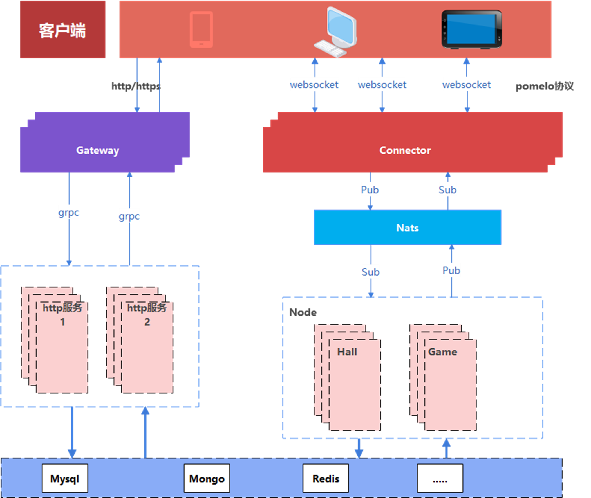
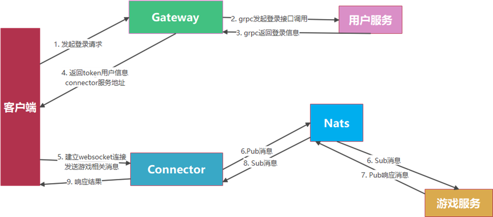
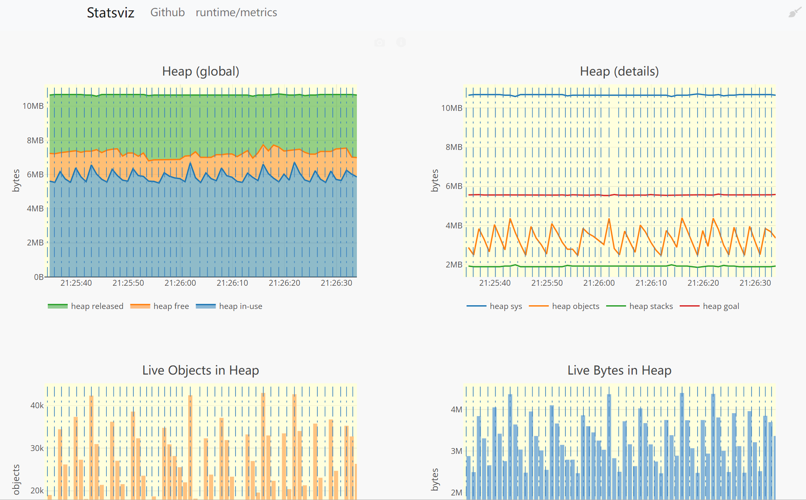

# 1 棋牌游戏

## 1.1 项目结构

- Gate：网关，用来转发客户端http请求和返回Connector地址
- Connector：连接器（前端服务器），管理用户连接，转发请求到游戏服务器
- Framework：框架实现，疯转websocket通信，session管理，nats通信等
- Core：核心实现，数据库操作等
- Common：通用实现，主要提供工具类支持
- User/Hall/Game：业务逻辑，User是用户服务处理账号相关，Hall是大厅相关，Game是游戏逻辑
- Config：配置文件


## 1.2 项目逻辑

**项目架构**



**请求流程**



在请求的时候通过网关（gate），网关然后通过路由发送给对应的User服务上，然后处理对应的业务逻辑。

## 1.3 User服务

User服务主要是管理账号相关，比如账号的注册，积分，支付，推广等等，是http服务。

### 1.3.1 配置

~~~go
go get github.com/spf13/viper
~~~

viper可以读取yml，json，toml等格式的数据，常用的配置文件一般是yaml格式和json格式。

~~~go
package config

import (
	"fmt"
	"github.com/fsnotify/fsnotify"
	"github.com/spf13/viper"
	"log"
)

var Conf *Config

type Config struct {
	Log        LogConf  `mapstructure:"log"`
	Port       int      `mapstructure:"port"`
	WsPort     int      `mapstructure:"wsPort"`
	MetricPort int      `mapstructure:"metricPort"`
	HttpPort   int      `mapstructure:"httpPort"`
	AppName    string   `mapstructure:"appName"`
	Database   Database `mapstructure:"db"`
	Jwt        JwtConf  `mapstructure:"jwt"`
	Grpc       GrpcConf `mapstructure:"grpc"`
	Etcd       EtcdConf `mapstructure:"etcd"`
    Domain     map[string]Domain `mapstructure:"domain"`
    Services   map[string]ServicesConf `mapstructure:"services"`
}
type ServicesConf struct {
	Id         string `mapstructure:"id"`
	ClientHost string `mapstructure:"clientHost"`
	ClientPort int    `mapstructure:"clientPort"`
}
type Domain struct {
	Name        string `mapstructure:"name"`
	LoadBalance bool   `mapstructure:"loadBalance"`
}
type JwtConf struct {
	Secret string `mapstructure:"secret"`
	Exp    int64  `mapstructure:"exp"`
}
type LogConf struct {
	Level string `mapstructure:"level"`
}

// Database 数据库配置
type Database struct {
	MongoConf MongoConf `mapstructure:"mongo"`
	RedisConf RedisConf `mapstructure:"redis"`
}
type MongoConf struct {
	Url         string `mapstructure:"url"`
	Db          string `mapstructure:"db"`
	UserName    string `mapstructure:"userName"`
	Password    string `mapstructure:"password"`
	MinPoolSize int    `mapstructure:"minPoolSize"`
	MaxPoolSize int    `mapstructure:"maxPoolSize"`
}
type RedisConf struct {
	Addr         string   `mapstructure:"addr"`
	ClusterAddrs []string `mapstructure:"clusterAddrs"`
	Password     string   `mapstructure:"password"`
	PoolSize     int      `mapstructure:"poolSize"`
	MinIdleConns int      `mapstructure:"minIdleConns"`
	Host         string   `mapstructure:"host"`
	Port         int      `mapstructure:"port"`
}
type EtcdConf struct {
	Addrs       []string       `mapstructure:"addrs"`
	RWTimeout   int            `mapstructure:"rwTimeout"`
	DialTimeout int            `mapstructure:"dialTimeout"`
	Register    RegisterServer `mapstructure:"register"`
}
type RegisterServer struct {
	Addr    string `mapstructure:"addr"`
	Name    string `mapstructure:"name"`
	Version string `mapstructure:"version"`
	Weight  int    `mapstructure:"weight"`
	Ttl     int64  `mapstructure:"ttl"` //租约时长
}
type GrpcConf struct {
	Addr string `mapstructure:"addr"`
}

func InitConfig(configFile string) {
	Conf = new(Config)
	v := viper.New()
	v.SetConfigFile(configFile)
	v.WatchConfig()
	v.OnConfigChange(func(e fsnotify.Event) {
		log.Println("配置文件被修改")
		err := v.Unmarshal(&Conf)
		if err != nil {
			panic(fmt.Errorf("配置文件被修改以后，报错，err:%v \n", err))
		}
	})
	err := v.ReadInConfig()
	if err != nil {
		panic(fmt.Errorf("读取配置文件报错，err:%v \n", err))
	}
	if err := v.Unmarshal(&Conf); err != nil {
		panic(fmt.Errorf("Unmarshal data to Conf failed ，err:%v \n", err))
	}
}

~~~

配置文件：

~~~yml
metricPort: 5854
appName: user
log:
  level: DEBUG
grpc:
  addr: 127.0.0.1:11500
etcd:
  addrs:
    - 127.0.0.1:2379
  register:
    name: user
    addr: 127.0.0.1:11500
    version: v1
    weight: 10
    ttl: 10
db:
  mongo:
    url: mongodb://127.0.0.1:27018
    userName: root
    password: root123456
    minPoolSize: 10
    maxPoolSize: 100
    db: mschess
  redis:
    addr: 127.0.0.1:6379
    poolSize: 10
    minIdleConns: 1
    password:
jwt:
  secret: 123456
  exp: 7
~~~

**代码段解释：**

```go
var configFile = flag.String("config", "application.yml", "config file")
```

这段代码是Go语言中使用标准库中的`flag`包来处理命令行参数的代码片段。这段代码定义了一个命令行参数，其中：

- `configFile` 是一个指向字符串的指针，用于存储命令行参数的值。
-  flag.String函数创建了一个新的命令行参数，接受三个参数：
  - `"config"` 是命令行参数的名称，表示该参数用于指定配置文件。
  - `"application.yml"` 是该命令行参数的默认值，如果用户没有提供该参数，将使用默认值。
  - `"config file"` 是该命令行参数的描述，用于在用户请求帮助时显示

### 1.3.2 监控

~~~shell
go get github.com/arl/statsviz@latest
~~~

可视化的go运行时指标实时图。

~~~go
package metrics

import (
	"github.com/arl/statsviz"
	"net/http"
)
// Serve 启动可视化监听指标服务 可视化图表 /debug/statsviz
func Serve(addr string) error {
	mux := http.NewServeMux()
	err := statsviz.Register(mux)
	if err != nil {
		return err
	}
	if err := http.ListenAndServe(addr, mux); err != nil {
		return err
	}
	return nil
}
~~~

~~~go
var configFile = flag.String("config", "application.yml", "config file")

func main() {
	flag.Parse()
	config.InitConfig(*configFile)
	go func() {
		err := metrics.Serve(fmt.Sprintf("0.0.0.0:%d", config.Conf.MetricPort))
		if err != nil {
			panic(err)
		}
	}()
    for{}
}
~~~

访问：`http://localhost:5854/debug/statsviz`



- **IP地址为0.0.0.0和127.0.0.1、localhost有什么区别？**

1. **0.0.0.0:**
   - `0.0.0.0` 是一个特殊的地址，通常被称为"通配地址"或"任意地址"，用于表示任何网络接口上的所有IP地址。当服务器绑定到 `0.0.0.0` 时，它会监听所有可用的网络接口，并接受来自任何IP地址的连接请求。这通常用于让服务器在所有网络接口上都可用，而不仅仅是绑定到一个特定的接口。在实际应用中，如果希望服务器对外可用，通常会将地址设置为`0.0.0.0`，这样服务器将能够接受来自本地主机和网络上其他计算机的连接。
2. **127.0.0.1:**
   - `127.0.0.1` 是回环地址（Loopback Address），它始终指向本地主机。当一个服务绑定到 `127.0.0.1` 时，它只能接受来自本地主机（即同一台计算机）的连接请求。这通常用于在本地计算机上运行的服务，不希望被网络上的其他计算机访问。
3. **localhost:**
   - `localhost` 是一个主机名，通常映射到 `127.0.0.1`。它也用于表示本地主机。当使用 `localhost` 作为地址时，它实际上是在使用 `127.0.0.1` 地址。

总的来说，`0.0.0.0` 表示在所有可用网络接口上监听，`127.0.0.1` 和 `localhost` 表示在本地主机上监听。如果你希望在本地进行开发和测试，并希望服务仅在本地可用，通常会选择使用 `127.0.0.1` 或 `localhost`。如果你希望服务对外可用，可以选择使用 `0.0.0.0`。

### 1.3.3 GRPC服务


