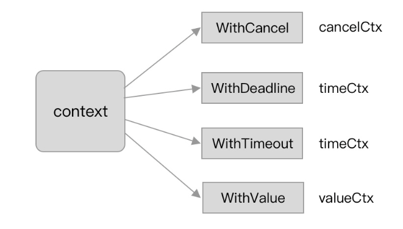
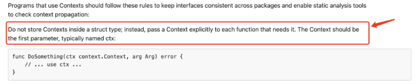
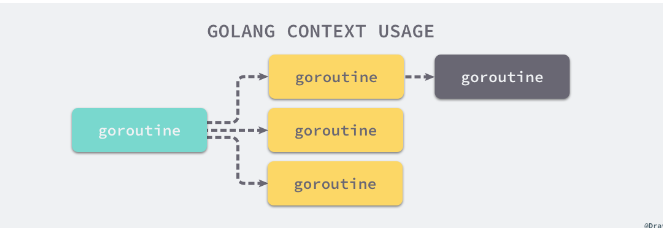
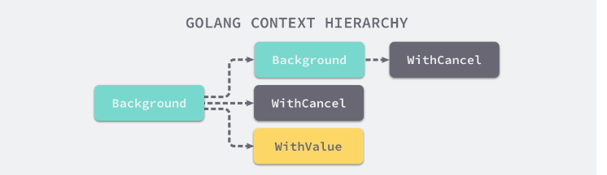

# 1 项目搭建

## 1.1 项目结构

- Gate：网关，用来转发客户端http请求和返回Connector地址

- Connector：连接器（前端服务器），管理用户连接，转发请求到游戏服务器

- Framework：框架实现，封装websocket通信，session管理，nats通信等

- Core：核心实现，数据库操作等

- Common：通用实现，主要提供工具类支持

- User/Hall/Game：业务逻辑，User是用户服务处理账号相关，Hall是大厅相关，Game是游戏逻辑

- Config：配置文件

  

```go
func main(){
    LoadConf() // 加载配置
    LoadDBData()  // 加载数据库
    StartGameServer() //启动游戏服务器
    ResolveGameLogic() // 处理游戏逻辑
    StopGameServer() // 停止服务
}
Log() 日志服务贯穿始终
func ResolveGameLogic(){
    Log()...
    saveGameData() // 处理游戏逻辑时通常会存储玩家的相关游戏数据，放缓存、Mongo、DB
}

```


## 1.2 项目逻辑

**项目架构**


**请求流程**


在请求的时候通过网关（gate），网关然后通过路由发送给对应的User服务上，然后处理对应的业务逻辑。

## 1.3 User服务

User服务主要是管理账号相关，比如账号的注册，积分，支付，推广等等，是http服务。

### 1.3.1 配置

~~~go
go get github.com/spf13/viper
~~~

viper可以读取yml，json，toml等格式的数据，常用的配置文件一般是yaml格式和json格式。

~~~go
package config

import (
	"fmt"
	"github.com/fsnotify/fsnotify"
	"github.com/spf13/viper"
	"log"
)

var Conf *Config

type Config struct {
	Log        LogConf  `mapstructure:"log"`
	Port       int      `mapstructure:"port"`
	WsPort     int      `mapstructure:"wsPort"`
	MetricPort int      `mapstructure:"metricPort"`
	HttpPort   int      `mapstructure:"httpPort"`
	AppName    string   `mapstructure:"appName"`
	Database   Database `mapstructure:"db"`
	Jwt        JwtConf  `mapstructure:"jwt"`
	Grpc       GrpcConf `mapstructure:"grpc"`
	Etcd       EtcdConf `mapstructure:"etcd"`
    Domain     map[string]Domain `mapstructure:"domain"`
    Services   map[string]ServicesConf `mapstructure:"services"`
}
type ServicesConf struct {
	Id         string `mapstructure:"id"`
	ClientHost string `mapstructure:"clientHost"`
	ClientPort int    `mapstructure:"clientPort"`
}
type Domain struct {
	Name        string `mapstructure:"name"`
	LoadBalance bool   `mapstructure:"loadBalance"`
}
type JwtConf struct {
	Secret string `mapstructure:"secret"`
	Exp    int64  `mapstructure:"exp"`
}
type LogConf struct {
	Level string `mapstructure:"level"`
}

// Database 数据库配置
type Database struct {
	MongoConf MongoConf `mapstructure:"mongo"`
	RedisConf RedisConf `mapstructure:"redis"`
}
type MongoConf struct {
	Url         string `mapstructure:"url"`
	Db          string `mapstructure:"db"`
	UserName    string `mapstructure:"userName"`
	Password    string `mapstructure:"password"`
	MinPoolSize int    `mapstructure:"minPoolSize"`
	MaxPoolSize int    `mapstructure:"maxPoolSize"`
}
type RedisConf struct {
	Addr         string   `mapstructure:"addr"`
	ClusterAddrs []string `mapstructure:"clusterAddrs"`
	Password     string   `mapstructure:"password"`
	PoolSize     int      `mapstructure:"poolSize"`
	MinIdleConns int      `mapstructure:"minIdleConns"`
	Host         string   `mapstructure:"host"`
	Port         int      `mapstructure:"port"`
}
type EtcdConf struct {
	Addrs       []string       `mapstructure:"addrs"`
	RWTimeout   int            `mapstructure:"rwTimeout"`
	DialTimeout int            `mapstructure:"dialTimeout"`
	Register    RegisterServer `mapstructure:"register"`
}
type RegisterServer struct {
	Addr    string `mapstructure:"addr"`
	Name    string `mapstructure:"name"`
	Version string `mapstructure:"version"`
	Weight  int    `mapstructure:"weight"`
	Ttl     int64  `mapstructure:"ttl"` //租约时长
}
type GrpcConf struct {
	Addr string `mapstructure:"addr"`
}

func InitConfig(configFile string) {
	Conf = new(Config)
	v := viper.New()
	v.SetConfigFile(configFile)
	v.WatchConfig()
	v.OnConfigChange(func(e fsnotify.Event) {
		log.Println("配置文件被修改")
		err := v.Unmarshal(&Conf)
		if err != nil {
			panic(fmt.Errorf("配置文件被修改以后，报错，err:%v \n", err))
		}
	})
	err := v.ReadInConfig()
	if err != nil {
		panic(fmt.Errorf("读取配置文件报错，err:%v \n", err))
	}
	if err := v.Unmarshal(&Conf); err != nil {
		panic(fmt.Errorf("Unmarshal data to Conf failed ，err:%v \n", err))
	}
}

~~~

配置文件：

~~~yml
metricPort: 5854
appName: user
log:
  level: DEBUG
grpc:
  addr: 127.0.0.1:11500
etcd:
  addrs:
    - 127.0.0.1:2379
  register:
    name: user
    addr: 127.0.0.1:11500
    version: v1
    weight: 10
    ttl: 10
db:
  mongo:
    url: mongodb://127.0.0.1:27018
    userName: root
    password: root123456
    minPoolSize: 10
    maxPoolSize: 100
    db: mschess
  redis:
    addr: 127.0.0.1:6379
    poolSize: 10
    minIdleConns: 1
    password:
jwt:
  secret: 123456
  exp: 7
~~~

**代码段解释：**

```go
var configFile = flag.String("config", "application.yml", "config file")
```

这段代码是Go语言中使用标准库中的`flag`包来处理命令行参数的代码片段。这段代码定义了一个命令行参数，其中：

- `configFile` 是一个指向字符串的指针，用于存储命令行参数的值。
-  flag.String函数创建了一个新的命令行参数，接受三个参数：
  - `"config"` 是命令行参数的名称，表示该参数用于指定配置文件。
  - `"application.yml"` 是该命令行参数的默认值，如果用户没有提供该参数，将使用默认值。
  - `"config file"` 是该命令行参数的描述，用于在用户请求帮助时显示

### 1.3.2 监控

~~~shell
go get github.com/arl/statsviz@latest
~~~

可视化的go运行时指标实时图。

~~~go
package metrics

import (
	"github.com/arl/statsviz"
	"net/http"
)
// Serve 启动可视化监听指标服务 可视化图表 /debug/statsviz
func Serve(addr string) error {
	mux := http.NewServeMux()
	err := statsviz.Register(mux)
	if err != nil {
		return err
	}
	if err := http.ListenAndServe(addr, mux); err != nil {
		return err
	}
	return nil
}
~~~

~~~go
var configFile = flag.String("config", "application.yml", "config file")

func main() {
	flag.Parse()
	config.InitConfig(*configFile)
	go func() {
		err := metrics.Serve(fmt.Sprintf("0.0.0.0:%d", config.Conf.MetricPort))
		if err != nil {
			panic(err)
		}
	}()
    for{}
}
~~~

访问：`http://localhost:5854/debug/statsviz`


- **IP地址为0.0.0.0和127.0.0.1、localhost有什么区别？**

1. **0.0.0.0:**
   - `0.0.0.0` 是一个特殊的地址，通常被称为"通配地址"或"任意地址"，用于表示任何网络接口上的所有IP地址。当服务器绑定到 `0.0.0.0` 时，它会监听所有可用的网络接口，并接受来自任何IP地址的连接请求。这通常用于让服务器在所有网络接口上都可用，而不仅仅是绑定到一个特定的接口。在实际应用中，如果希望服务器对外可用，通常会将地址设置为`0.0.0.0`，这样服务器将能够接受来自本地主机和网络上其他计算机的连接。
2. **127.0.0.1:**
   - `127.0.0.1` 是回环地址（Loopback Address），它始终指向本地主机。当一个服务绑定到 `127.0.0.1` 时，它只能接受来自本地主机（即同一台计算机）的连接请求。这通常用于在本地计算机上运行的服务，不希望被网络上的其他计算机访问。
3. **localhost:**
   - `localhost` 是一个主机名，通常映射到 `127.0.0.1`。它也用于表示本地主机。当使用 `localhost` 作为地址时，它实际上是在使用 `127.0.0.1` 地址。

总的来说，`0.0.0.0` 表示在所有可用网络接口上监听，`127.0.0.1` 和 `localhost` 表示在本地主机上监听。如果你希望在本地进行开发和测试，并希望服务仅在本地可用，通常会选择使用 `127.0.0.1` 或 `localhost`。如果你希望服务对外可用，可以选择使用 `0.0.0.0`。

### 1.3.3 GRPC服务

1. 下载包

```go
 go get google.golang.org/grpc
```

2. 编写Run函数启动程序，可以用来启动grpc服务、http服务、日志、数据库等，

```go
package app

import (
   "common/config"
   "context"
   "fmt"
   "google.golang.org/grpc"
   "log"
   "net"
   "os"
   "os/signal"
   "syscall"
)

// Run 启动程序：启动grpc服务、http服务、日志、数据库等
func Run(ctx context.Context) error {
   // 启动grpc服务端
   server := grpc.NewServer()
   go func() {
      lis, err := net.Listen("tcp", config.Conf.Grpc.Addr)
      if err != nil {
         log.Fatalf("user grpc server listen err: %v", err)
      }
      // 阻塞操作
      err = server.Serve(lis)
      if err != nil {
         log.Fatalf("user grpc server run listen err: %v", err)
      }
   }()
   // 优雅启停 遇到中断信号、退出、终止、挂断
   stop := func() {
      server.Stop()
      fmt.Println("stop app finish")
   }
   //创建一个缓冲大小为1的信号通道 c
   c := make(chan os.Signal, 1)
   //使用 signal.Notify 函数注册监听操作系统信号的通道 c，指定要监听的信号类型
   signal.Notify(c, syscall.SIGTERM, syscall.SIGQUIT, syscall.SIGINT, syscall.SIGHUP)
   for {
      select {
      //上下文（context）被取消
      case <-ctx.Done():
         stop()
         return nil
      //检测到信号通道 c 有信号传入
      case s := <-c:
         switch s {
         case syscall.SIGTERM, syscall.SIGQUIT, syscall.SIGINT:
            stop()
            log.Println("user app quit")
            return nil
         case syscall.SIGHUP:
            // 挂断信号
            stop()
            log.Println("hang up!! user app quit")
            return nil
         default:
            return nil
         }
      }
   }
}
```

3. 在Main函数中调用Run函数，即可以实现启动grpc服务操作。

```go
func main() {
	// 1. 加载配置
	flag.Parse()
	config.InitConfig(*configFile)
	// 2. 启动监控
	go func() {
		err := metrics.Serve(fmt.Sprintf("0.0.0.0:%d", config.Conf.MetricPort))
		if err != nil {
			panic(err)
		}
	}()
	// 3. 启动grpc服务端
	err := app.Run(context.Background())
	if err != nil {
		log.Println(err)
		os.Exit(1)
	}
}

```

### 1.3.4 日志服务

1. **Go原生log包**

`log`默认输出到标准错误（`stderr`），每条日志前会自动加上日期和时间。如果日志不是以换行符结尾的，那么`log`会自动加上换行符。即每条日志会在新行中输出。

`log`提供了三组函数：

- `Print/Printf/Println`：正常输出日志；
- `Panic/Panicf/Panicln`：输出日志后，以拼装好的字符串为参数调用`panic`；
- `Fatal/Fatalf/Fatalln`：输出日志后，调用`os.Exit(1)`退出程序。

命名比较容易辨别，带`f`后缀的有格式化功能，带`ln`后缀的会在日志后增加一个换行符。

```go
  log.Printf("%s login, age:%d", u.Name, u.Age)
  log.Panicf("Oh, system error when %s login", u.Name)
  log.Fatalf("Danger! hacker %s login", u.Name)
```

注意，上面的程序中由于调用`log.Panicf`会`panic`，所以`log.Fatalf`并不会调用。

2. **使用框架**

使用这个日志库：

```go
go get github.com/charmbracelet/log@latest
```

自己封装一下：

```go
package logs

import (
	"common/config"
	"github.com/charmbracelet/log"
	"os"
	"time"
)

var Logger *log.Logger

func InitLog(appName string) {
	Logger = log.New(os.Stderr)
	if config.Conf.Log.Level == "DEBUG" {
		Logger.SetLevel(log.DebugLevel)
	} else {
		Logger.SetLevel(log.InfoLevel)
	}
	Logger.SetPrefix(appName)
	Logger.SetReportTimestamp(true)
	Logger.SetTimeFormat(time.RFC1123)
}

func Fatal(format string, values ...any) {
	if len(values) == 0 {
		Logger.Fatal(format)
	} else {
		Logger.Fatalf(format, values)
	}
}

func Info(format string, values ...any) {
	if len(values) == 0 {
		Logger.Info(format)
	} else {
		Logger.Infof(format, values)
	}
}

func Warn(format string, values ...any) {
	if len(values) == 0 {
		Logger.Warn(format)
	} else {
		Logger.Warnf(format, values)
	}
}

func Error(format string, values ...any) {
	if len(values) == 0 {
		Logger.Error(format)
	} else {
		Logger.Errorf(format, values)
	}
}

func Debug(format string, values ...any) {
	if len(values) == 0 {
		Logger.Debug(format)
	} else {
		Logger.Debugf(format, values)
	}
}
```

### 1.3.5 etcd注册中心

我们需要将grpc服务，注册到etcd注册中心，这样通过etcd，我们就实现了负载均衡。

1. go get

```go
go get go.etcd.io/etcd/client/v3
```

2. 写Server相关函数

```go
package discovery

import "fmt"

type Server struct {
	Name    string `json:"name"`
	Addr    string `json:"addr"`
	Weight  int    `json:"weight"`
	Version string `json:"version"`
	Ttl     int64  `json:"ttl"`
}

func (s Server) BuildRegisterKey() string {
	if len(s.Version) == 0 {
		// user 作为key
		return fmt.Sprintf("/%s/%s", s.Name, s.Addr)
	}
	// user/v1 作为key
	return fmt.Sprintf("/%s/%s/%s", s.Name, s.Version, s.Addr)
}
```

3. descovery中register注册函数

```go
package discovery

import (
	"common/config"
	"common/logs"
	"context"
	"encoding/json"
	clientv3 "go.etcd.io/etcd/client/v3"
	"time"
)

// 将grpc服务注册到etcd
// 原理：创建一个租约，将grpc服务注册到etcd，绑定租约
// 过了租约时间，etcd就会删除grpc服务信息
// 实现心跳，完成续租，如果etcd没有，就新注册。
type Register struct {
	etcdCli     *clientv3.Client                        // etcd 连接
	leaseID     clientv3.LeaseID                        // 租约id
	DialTimeout int                                     // 超时时间
	ttl         int                                     // 租约时间
	keepAliveCh <-chan *clientv3.LeaseKeepAliveResponse // 心跳
	info        Server                                  // 注册的server信息
	closeCh     chan struct{}
}

func NewRegister() *Register {
	return &Register{
		DialTimeout: 3,
	}
}

func (r *Register) Register(conf config.EtcdConf) error {
	// 注册信息
	info := Server{
		Name:    conf.Register.Name,
		Addr:    conf.Register.Addr,
		Weight:  conf.Register.Weight,
		Version: conf.Register.Version,
		Ttl:     conf.Register.Ttl,
	}
	// 建立etcd的连接
	var err error
	r.etcdCli, err = clientv3.New(clientv3.Config{
		Endpoints:   conf.Addrs,
		DialTimeout: time.Duration(r.DialTimeout) * time.Second,
	})
	if err != nil {
		return err
	}
	r.info = info
	err = r.register()
	if err != nil {
		return err
	}
	r.closeCh = make(chan struct{})
	// 放入协程中， 根据心跳的结果 做相应的操作
	go r.watcher()
	return nil
}

func (r *Register) register() error {
	// 1.创建租约
	ctx, cancelFunc := context.WithTimeout(context.Background(), time.Second*time.Duration(r.DialTimeout))
	defer cancelFunc()
	var err error
	if err = r.createLease(ctx, r.info.Ttl); err != nil {
		return err
	}
	// 2、心跳检测
	if r.keepAliveCh, err = r.keepAlive(ctx); err != nil {
		return err
	}
	// 3、绑定租约
	// key value
	data, _ := json.Marshal(r.info)
	return r.bindLease(ctx, r.info.BuildRegisterKey(), string(data))
}

// KeepAlive 心跳，确保服务正常
func (r *Register) keepAlive(ctx context.Context) (<-chan *clientv3.LeaseKeepAliveResponse, error) {
	resChan, err := r.etcdCli.KeepAlive(ctx, r.leaseID)
	if err != nil {
		logs.Error("bindLease failed, error: %v", err)
		return resChan, err
	}
	return resChan, nil
}

func (r *Register) bindLease(ctx context.Context, key string, value string) error {
	// put 动作
	_, err := r.etcdCli.Put(ctx, key, value, clientv3.WithLease(r.leaseID))
	if err != nil {
		logs.Error("bindLease failed,err:%v", err)
	}
	return nil
}

// 创建租约
func (r *Register) createLease(ctx context.Context, ttl int64) error {
	grant, err := r.etcdCli.Grant(ctx, ttl)
	if err != nil {
		logs.Error("createLease failed,err:%v", err)
	}
	r.leaseID = grant.ID
	return nil
}

// Watcher 监听 续租 注销等
func (r *Register) watcher() {
	// 租约到期了 是不是需要去检测自动注册
	ticker := time.NewTicker(time.Duration(r.info.Ttl) * time.Second)
	for {
		select {
		case <-r.closeCh:
			logs.Info("stop register...")
			//注销
			if err := r.unregister(); err != nil {
				logs.Error("Stop Register,unregister failed, error:%v", err)
			}
			//撤销租约
			if _, err := r.etcdCli.Revoke(context.Background(), r.leaseID); err != nil {
				logs.Error("Stop Register,Revoke failed, error:%v", err)
			}
		case res := <-r.keepAliveCh:
			//续约
			if res == nil {
				if err := r.register(); err != nil {
					logs.Error("keepAliveCh,register failed, error:%v", err)
				}
			}
		case <-ticker.C:
			if r.keepAliveCh == nil {
				//租约到期 检查是否需要自动注册
				if err := r.register(); err != nil {
					logs.Error("ticker.C keepAliveCh==nil,register failed, error:%v", err)
				}
			}

		}
	}
}

// 注销服务
func (r *Register) unregister() interface{} {
	_, err := r.etcdCli.Delete(context.Background(), r.info.BuildRegisterKey())
	return err
}

func (r *Register) Stop() {
	r.closeCh <- struct{}{}
}
```

registerEndPointToEtcd 方法给出了将 grpc 服务端节点注册到 etcd 模块的示例：

- eclient.NewFromURL 创建 etcd 客户端 etcdClient
- endpoints.NewManager 创建 etcd 服务端节点管理模块 etcdManager
- etcdClient.Grant 申请一份租约，租约的有效时间为 ttl
- etcdManager.AddEndpoint 将当前节点注册到 etcd 中，同时会和租约进行关联
- etcdClient.KeepAliveOnce 对租约进行一轮续期，重置租约失效的 ttl

心跳检测是一种机制，用于定期发送信号或请求以确认系统、服务或设备的存活状态。在分布式系统和网络通信中，心跳检测通常用于以下目的：

1. **保持连接状态：** 心跳检测用于维持在系统组件之间的连接状态。通过定期发送心跳信号，可以确保网络连接仍然有效，避免因连接断开而导致通信失败。
2. **服务健康检查：** 在分布式系统中，各个服务节点可能会定期发送心跳信号，以确保它们的运行正常。接收方可以通过检查心跳信号来判断发送方的服务是否处于健康状态。
3. **租约续约：** 在分布式系统中，服务可能会使用租约机制，定期发送心跳信号来续约租约。这有助于确保服务在注册表或键值存储系统中的信息保持有效，防止因租约到期而导致服务被认为已经下线。
4. **检测节点故障：** 在集群环境中，节点可能会由于各种原因宕机或失去响应。心跳检测可以帮助及时发现这些故障节点，并采取相应的措施，如重新分配任务、切换到备用节点等。
5. **服务发现：** 在服务发现系统中，心跳检测用于检测服务的可用性。服务注册中心可以通过检查服务节点的心跳来确定服务是否在线，从而提供可靠的服务发现机制。

## 1.4 用户注册功能（上）

### 1.4.1 Mongo数据库

https://github.com/mongodb/mongo-go-driver

1. 获取go get库

```go
go get go.mongodb.org/mongo-driver/mongo
```

2. 自定义mongo.go文件，实现对mongo-go-driver的封装

```go
package database

type MongoManager struct {
	Cli *mongo.Client
	Db  *mongo.Database
}

func NewMongo() *MongoManager {
	// 创建超时时间
	ctx, cancelFunc := context.WithTimeout(context.Background(), time.Second*10)
	defer cancelFunc()
	// 连接
	clientOptions := options.Client().ApplyURI(config.Conf.Database.MongoConf.Url)
	clientOptions.SetAuth(options.Credential{
		Username: config.Conf.Database.MongoConf.UserName,
		Password: config.Conf.Database.MongoConf.Password,
	})
	clientOptions.SetMinPoolSize(uint64(config.Conf.Database.MongoConf.MinPoolSize))
	clientOptions.SetMaxPoolSize(uint64(config.Conf.Database.MongoConf.MaxPoolSize))
	client, err := mongo.Connect(ctx, clientOptions)
	if err != nil {
		logs.Fatal("mongo connect err:%v", err)
		return nil
	}
	err = client.Ping(ctx, readpref.Primary())
	if err != nil {
		logs.Fatal("mongo Ping err:%v", err)
		return nil
	}
	m := &MongoManager{}
	m.Cli = client
	m.Db = client.Database(config.Conf.Database.MongoConf.Db)
	return m
}

func (m *MongoManager) Close() {
	err := m.Cli.Disconnect(context.TODO())
	if err != nil {
		logs.Error("mongo close error: %v", err)
	}
}

```


### 1.4.2 Redis数据库

官网：https://github.com/redis/go-redis、https://redis.uptrace.dev/zh/

```go
go get github.com/redis/go-redis/v9
```

1. 封装Redis中相关函数

```go
package database

type RedisManager struct {
	ClusterCli *redis.ClusterClient // 集群
	Cli        *redis.Client        // 单机
}

func NewRedis() *RedisManager {
	ctx, cancelFunc := context.WithTimeout(context.Background(), time.Second*10)
	defer cancelFunc()
	var clusterCli *redis.ClusterClient
	var cli *redis.Client
	clusterAddrs := config.Conf.Database.RedisConf.ClusterAddrs
	if len(clusterAddrs) <= 0 {
		//单节点
		cli = redis.NewClient(&redis.Options{
			Addr:         config.Conf.Database.RedisConf.Addr,
			PoolSize:     config.Conf.Database.RedisConf.PoolSize,
			MinIdleConns: config.Conf.Database.RedisConf.MinIdleConns,
			Password:     config.Conf.Database.RedisConf.Password,
		})
	} else {
		//集群
		clusterCli = redis.NewClusterClient(&redis.ClusterOptions{
			Addrs:        config.Conf.Database.RedisConf.ClusterAddrs,
			PoolSize:     config.Conf.Database.RedisConf.PoolSize,
			MinIdleConns: config.Conf.Database.RedisConf.MinIdleConns,
			Password:     config.Conf.Database.RedisConf.Password,
		})
	}
	if clusterCli != nil {
		err := clusterCli.Ping(ctx).Err()
		if err != nil {
			logs.Fatal("redis cluster ping err: %v", err)
		}
	} else {
		err := cli.Ping(ctx).Err()
		if err != nil {
			logs.Fatal("redis ping err: %v", err)
		}
	}
	return &RedisManager{
		Cli:        cli,
		ClusterCli: clusterCli,
	}
}

func (r *RedisManager) Close() {
	if r.ClusterCli != nil {
		if err := r.ClusterCli.Close(); err != nil {
			logs.Fatal("redis Cluster connect err: %v", err)
		}
	}
	if r.Cli != nil {
		if err := r.Cli.Close(); err != nil {
			logs.Fatal("redis connect err: %v", err)
		}
	}
}

// 封装Set方法
func (r *RedisManager) Set(ctx context.Context, key, value string, expire time.Duration) error {
	if r.ClusterCli != nil {
		return r.ClusterCli.Set(ctx, key, value, expire).Err()
	}
	if r.Cli != nil {
		return r.Cli.Set(ctx, key, value, expire).Err()
	}
	return nil
}
```

### 1.4.3 封装自定义Mongo、Redis

在/core/repo目录下新建core.go文件，实现对Mongo、Redis的封装

```go
package repo

import "common/database"

type Manager struct {
	Mongo *database.MongoManager
	Redis *database.RedisManager
}

func New() *Manager {
	return &Manager{
		Mongo: database.NewMongo(),
		Redis: database.NewRedis(),
	}
}
```

使用repo库，app.go中

```go
		// 3. 初始化数据库、需要Mongo、Redis
		manager := repo.New()
```

## 1.5 Gate服务

项目中通过Gate网关来找到User注册服务，因此需要搭建Gate服务，其中包括

router路由目录：主要初始化grpc的client，现在网关是作为grpc的客户端来调用 User 的grpc服务，以及需要初始化Gin框架

api目录：handler函数，主要实现路由处理操作

app目录：初始化Gate服务


router.go

```go
// 注册路由
func RegisterRouter() *gin.Engine {
	if config.Conf.Log.Level == "DEBUG" {
		gin.SetMode(gin.DebugMode)
	} else {
		gin.SetMode(gin.ReleaseMode)
	}
	// 初始化grpc的client，现在网关是作为grpc的客户端来调用 User 的grpc服务
	rpc.Init()
	r := gin.Default()
	userHandler := api.NewUserHandler()
	r.POST("/register", userHandler.Register)
	return r
}
```

api/user.go

```go
type UserHandler struct {
}

func NewUserHandler() *UserHandler {
	return &UserHandler{}
}

func (u *UserHandler) Register(ctx *gin.Context) {
	// 客户端
	//response, err := rpc.UserClient.Register(context.TODO(), &pb.RegisterParams{})
	//if err != nil {
	//
	//}
	//uid := response.Uid
	// 生成token
	// 返回内容
	//ctx.JSON(200,)
}
```

app.go

```go
// Run 启动程序：启动grpc服务、http服务、日志、数据库等
func Run(ctx context.Context) error {
	// 1. 做一个日志库 info error fatal debug
	logs.InitLog(config.Conf.AppName)
	go func() {
		// gin 启动  注册一个路由
		r := router.RegisterRouter()
		r.Run(fmt.Sprintf(":%s", config.Conf.HttpPort))
	}()
	// 优雅启停 遇到中断信号、退出、终止、挂断
	stop := func() {
		time.Sleep(time.Second * 3)
		logs.Info("stop app finish")
	}
	//创建一个缓冲大小为1的信号通道 c
	c := make(chan os.Signal, 1)
	//使用 signal.Notify 函数注册监听操作系统信号的通道 c，指定要监听的信号类型
	signal.Notify(c, syscall.SIGTERM, syscall.SIGQUIT, syscall.SIGINT, syscall.SIGHUP)
	for {
		select {
		//上下文（context）被取消
		case <-ctx.Done():
			stop()
			return nil
		//检测到信号通道 c 有信号传入
		case s := <-c:
			switch s {
			case syscall.SIGTERM, syscall.SIGQUIT, syscall.SIGINT:
				stop()
				logs.Info("user app quit")
				return nil
			case syscall.SIGHUP:
				// 挂断信号
				stop()
				logs.Info("hang up!! user app quit")
				return nil
			default:
				return nil
			}
		}
	}
}
```


## 1.6 用户注册功能（中）

### 1.6.1 grpc客户端构建


### 1.6.2 etcd解析器实现


## 1.7 用户注册功能（下）

### 1.7.1 gate层使用grpc调用user注册服务

1. 注册路由：

```go
// 注册路由
func RegisterRouter() *gin.Engine {
	if config.Conf.Log.Level == "DEBUG" {
		gin.SetMode(gin.DebugMode)
	} else {
		gin.SetMode(gin.ReleaseMode)
	}
	// 初始化grpc的client，现在网关是作为grpc的客户端来调用 User 的grpc服务
	rpc.Init()
	r := gin.Default()
	userHandler := api.NewUserHandler()
	r.POST("/register", userHandler.Register)
	return r
}
```

2. Handler（api）中的注册函数

```go
func (u *UserHandler) Register(ctx *gin.Context) {
   // 接收参数
   var req pb.RegisterParams
   err2 := ctx.ShouldBindJSON(&req)
   if err2 != nil {
      common.Fail(ctx, biz.RequestDataError)
      return
   }
   // rpc客户端
   response, err := rpc.UserClient.Register(context.TODO(), &pb.RegisterParams{})
   if err != nil {
      common.Fail(ctx, msError.ToError(err))
      return
   }
   uid := response.Uid
   logs.Info("uid:%s", uid)
   // 生成token  jwt A.B.C A部分头（定义加密算法） B部分存储数据 C部分签名
   customClaims := jwts.CustomClaims{
      Uid: uid,
      RegisteredClaims: jwt.RegisteredClaims{
         //Issuer:    "",
         //Subject:   "",
         //Audience:  nil,
         ExpiresAt: jwt.NewNumericDate(time.Now().Add(7 * 24 * time.Hour)),
         //NotBefore: nil,
         //IssuedAt:  nil,
         //ID:        "",
      },
   }
   token, err := jwts.GenToken(&customClaims, config.Conf.Jwt.Secret)
   if err != nil {
      logs.Error("jwt gen token err : %v ", err)
      common.Fail(ctx, biz.Fail)
      return
   }
   result := map[string]any{
      "token": token,
      "serverInfo": map[string]any{
         "host": config.Conf.Services["connector"].ClientHost,
         "port": config.Conf.Services["connector"].ClientPort,
      },
   }
   common.Success(ctx, result)
}
```

### 1.7.2 User服务中注册

该服务 调用 dao中的代码，操作数据库，实现用户注册和数据库的交互

```go
func (a *AccountService) Register(ctx context.Context, req *pb.RegisterParams) (*pb.RegisterResponse, error) {
   if req.LoginPlatform == requests.WeiXin {
      ac, err := a.wxRegister(req)
      if err != nil {
         return &pb.RegisterResponse{}, msError.GrpcError(err)
      }
      return &pb.RegisterResponse{
         Uid: ac.Uid,
      }, nil
   }
   return &pb.RegisterResponse{}, nil
}

func (a *AccountService) wxRegister(req *pb.RegisterParams) (*entity.Account, *msError.Error) {
   // 1. 封装一个account结构，
   ac := &entity.Account{
      WxAccount:  req.Account,
      CreateTime: time.Now(),
   }
   //2.需要生成几个数字做为用户的唯一id  redis自增
   uid, err := a.redisDao.NextAccountId()
   if err != nil {
      return ac, biz.SqlError
   }
   ac.Uid = uid
   // 3. 将其存入数据库(mongo 分布式id)
   err = a.accountDao.SaveAccount(context.TODO(), ac)
   if err != nil {
      return ac, biz.SqlError
   }
   return ac, nil
}
```

### 1.7.3 解决跨域问题

在router中使用中间件，中间件为如下代码：

```go
func Cors() gin.HandlerFunc {
   return func(c *gin.Context) {
      method := c.Request.Method
      origin := c.Request.Header.Get("Origin")
      if origin != "" {
         c.Header("Access-Control-Allow-Origin", origin)
         c.Header("Access-Control-Allow-Methods", "POST, GET, PUT, DELETE, OPTIONS")
         c.Header("Access-Control-Allow-Headers", "Content-Type, Content-Length, Token")
         c.Header("Access-Control-Expose-Headers", "Access-Control-Allow-Headers, Token")
         c.Header("Access-Control-Max-Age", "172800")
         c.Header("Access-Control-Allow-Credentials", "true")
         c.Set("content-type", "application/json")
      }
      if method == "OPTIONS" {
         //c.JSON(200, Controller.R(200, nil, "Options Request"))
         c.AbortWithStatus(http.StatusNoContent)
      }
      c.Next()
   }
}
```

# 2 框架开发


## 2.1 Connector

### 2.1.1 加载游戏配置

游戏配置文件使用json来存储，放在config目录下，gameConfig.json  servers.json

解析json文件：（framework目录下game包里）

```go
// 读取一个目录
func InitConfig(configDir string) {
   Conf = new(Config)
   dir, err := os.ReadDir(configDir)
   if err != nil {
      logs.Fatal("read config dir err: %v", err)
   }
   // 读取dir目录下的文件名称
   for _, v := range dir {
      configFile := path.Join(configDir, v.Name())
      if v.Name() == gameConfig {
         readGameConfig(configFile)
      }
      if v.Name() == servers {
         readServersConfig(configFile)
      }
   }
}

func readServersConfig(configFile string) {
   var serversConfig ServersConf
   v := viper.New()
   v.SetConfigFile(configFile)
   v.WatchConfig()
   v.OnConfigChange(func(in fsnotify.Event) {
      logs.Info("serversConfig配置文件被修改")
      err := v.Unmarshal(&serversConfig)
      if err != nil {
         panic(fmt.Errorf("Unmarshal change serversConfig data，err：%v\n", err))
      }
      Conf.ServersConf = serversConfig
   })
   err := v.ReadInConfig()
   if err != nil {
      panic(fmt.Errorf("读取serversConfig配置文件出错，err：%v\n", err))
   }
   // 解析
   err = v.Unmarshal(&serversConfig)
   if err != nil {
      panic(fmt.Errorf("Unmarshal serversConfig data，err：%v\n", err))
   }
   Conf.ServersConf = serversConfig
   typeServerConfig()
}

func typeServerConfig() {
   if len(Conf.ServersConf.Servers) > 0 {
      if Conf.ServersConf.TypeServer == nil {
         // 一个ServerType可能对应多个服务器，所以使用map[string] []*ServersConfig 类型，其中value为切片
         Conf.ServersConf.TypeServer = make(map[string][]*ServersConfig)
      }
      for _, v := range Conf.ServersConf.Servers {
         if Conf.ServersConf.TypeServer[v.ServerType] == nil {
            Conf.ServersConf.TypeServer[v.ServerType] = make([]*ServersConfig, 0)
         }
         Conf.ServersConf.TypeServer[v.ServerType] = append(Conf.ServersConf.TypeServer[v.ServerType], v)
      }
   }
}

func readGameConfig(configFile string) {
   var gameConfig = make(map[string]GameConfigValue)
   v := viper.New()
   v.SetConfigFile(configFile)
   v.WatchConfig()
   v.OnConfigChange(func(in fsnotify.Event) {
      logs.Info("Game配置文件被修改")
      err := v.Unmarshal(&gameConfig)
      if err != nil {
         panic(fmt.Errorf("Unmarshal change config data，err：%v\n", err))
      }
      Conf.GameConfig = gameConfig
   })
   err := v.ReadInConfig()
   if err != nil {
      panic(fmt.Errorf("读取配置文件出错，err：%v\n", err))
   }
   // 解析
   err = v.Unmarshal(&gameConfig)
   if err != nil {
      panic(fmt.Errorf("Unmarshal game config data，err：%v\n", err))
   }
   Conf.GameConfig = gameConfig
}

// 获取connector的地址
func (c *Config) GetConnector(serverId string) *ConnectorConfig {
   for _, v := range c.ServersConf.Connector {
      if v.ID == serverId {
         return v
      }
   }
   return nil
}
```

**将connector组件文件写在框架framework目录下**

```go
type Connector struct {
   isRunning bool
   wsManager *net.Manager
}

func Default() *Connector {
   return &Connector{}
}

func (c *Connector) Run(serverId string) {
   if !c.isRunning {
      //启动websocket和nat
      c.Serve(serverId)
   }
}

func (c *Connector) Close() {
   if c.isRunning {
      //关闭websocket和nat
   }
}

func (c *Connector) Serve(serverId string) {
   // 传入地址：需要读取配置文件，在游戏中可能会加载很多的配置信息，如果写入yml为文件中，可能会难以维护
   // 一般在游戏中的配置读取采用json来存取
   // 1. 读取Config配置文件
   connectorConfig := game.Conf.GetConnector(serverId)
   if connectorConfig == nil {
      logs.Fatal("no connector config.")
   }
   addr := fmt.Sprintf("%s:%d", connectorConfig.Host, connectorConfig.ClientPort)
   c.wsManager.Run(addr)
}
```

### 2.1.2 ws管理器


# 3 项目相关

## 3.1 Marshal、Unmarshal

1. **Marshal（编组/序列化）：**
   - `Marshal` 是将数据从一种数据结构转换为另一种表示形式的过程，通常是**将数据转换为字节流或字符串，**以便进行存储、传输或其他用途。编组的目的是创建一个可传输和可存储的版本，通常在网络通信或数据持久化时使用。
   - 在不同的编程语言中，"Marshal" 的实现可能有所不同，但其基本思想是相似的。
2. **Unmarshal（解组/反序列化）：**
   - `Unmarshal` 是与 `Marshal` 相反的过程，即**将已编组的数据重新转换为程序可用的数据结构**。这个过程通常涉及解析字节流或字符串，将其还原为原始的数据结构或对象。
   - 反序列化在接收数据或从存储介质中读取数据时很有用，以便将其转换为程序中可操作的形式。

这两个概念通常与数据的持久化、远程过程调用（RPC）、消息传递和其他需要将数据在不同系统之间传输或存储的场景中一起使用。在很多编程语言中，有专门的库或工具提供了 `Marshal` 和 `Unmarshal` 的功能，例如，在Go语言中，`encoding/json` 包提供了相关的功能，而在Python中，`json` 模块执行类似的任务。

## 3.2 Context相关

https://draveness.me/golang/docs/part3-runtime/ch06-concurrency/golang-context/

上下文（Context）是 Go 语言中非常有特色的一个特性，其主要的作用是**在 goroutine 中进行上下文的传递**，而在**传递信息中又包含了 goroutine 的运行控制、上下文信息传递**等功能。



- 在Context标准库的文档中有提到，使用上下文的程序应该遵循以下规则，以保持跨包的接口一致。



1. 不要将 context 存储在结构体中。
2. 应该将 context 显式传递给每个需要它的函数，其应该是第一个参数，通常将参数命名为 ctx。
3. 不要传递 nil context。如果您不确定要使用哪个 context，请传递 `context.TODO`。

- **设计原理**

在 Goroutine 构成的树形结构中对信号进行同步以减少计算资源的浪费是 [`context.Context`](https://draveness.me/golang/tree/context.Context) 的最大作用。Go 服务的每一个请求都是通过单独的 Goroutine 处理的，HTTP/RPC 请求的处理器会启动新的 Goroutine 访问数据库和其他服务。

如下图所示，我们可能会创建多个 Goroutine 来处理一次请求，而 [`context.Context`](https://draveness.me/golang/tree/context.Context) 的作用是**在不同 Goroutine 之间同步请求特定数据、取消信号以及处理请求的截止日期**。



**默认上下文：**[`context`](https://github.com/golang/go/tree/master/src/context) 包中最常用的方法还是 [`context.Background`](https://draveness.me/golang/tree/context.Background)、[`context.TODO`](https://draveness.me/golang/tree/context.TODO)，这两个方法都会返回预先初始化好的私有变量 `background` 和 `todo`，它们会在同一个 Go 程序中被复用：

- **Context.Background()**

- **context.TODO()**

```go
func Background() Context {
	return background
}

func TODO() Context {
	return todo
}

var (
	background = new(emptyCtx)
	todo       = new(emptyCtx)
)
type emptyCtx int
func (*emptyCtx) Deadline() (deadline time.Time, ok bool) {
	return
}

func (*emptyCtx) Done() <-chan struct{} {
	return nil
}

func (*emptyCtx) Err() error {
	return nil
}

func (*emptyCtx) Value(key any) any {
	return nil
}
```

从上述代码中，我们不难发现 [`context.emptyCtx`](https://draveness.me/golang/tree/context.emptyCtx) 通过空方法实现了 [`context.Context`](https://draveness.me/golang/tree/context.Context) 接口中的所有方法，它没有任何功能。




- **context.WithTimeout**

```go
ctx, cancel := context.WithTimeout(context.Background(),
                                   time.Second*time.Duration(r.DialTimeout))
defer cancel()
```

https://blog.csdn.net/yzf279533105/article/details/107292247

1. context包的WithTimeout()函数接受一个 Context 和超时时间作为参数，返回其子Context和取消函数cancel

2. 新创建协程中传入子Context做参数，且需监控子Context的Done通道，若收到消息，则退出

3. 需要新协程结束时，在外面调用 cancel 函数，即会往子Context的Done通道发送消息

4. 若不调用cancel函数，到了原先创建Contetx时的超时时间，它也会自动调用cancel()函数，即会往子Context的Done通道发送消息

`ctx` 将在以下情况之一发生时被取消：

1. 超时时间到达：当经过 `time.Second * time.Duration(r.DialTimeout)` 之后，`ctx` 将自动取消。
2. 手动调用 `cancel()`：如果在超时之前调用了 `cancel` 函数，也会取消 `ctx`。

在这两种情况下，`ctx` 都将不再有效，任何通过它派生的上下文和操作都将收到取消信号。


## 3.3 fmt

**Print**

Print系列函数会将内容输出到系统的标准输出，区别在于：Print函数直接输出内容，Printf函数支持格式化输出字符串，Println函数会在输出内容的结尾添加一个换行符。

```go
func main() {
    fmt.Print("在终端打印该信息。")
    name := "枯藤"
    fmt.Printf("我是：%s\n", name)
    fmt.Println("在终端打印单独一行显示")
}
```

**Fprint**

Fprint系列函数会将内容输出到一个io.Writer接口类型的变量w中，我们通常用这个函数往文件中写入内容。

```go
// 向标准输出写入内容
fmt.Fprintln(os.Stdout, "向标准输出写入内容")
fileObj, err := os.OpenFile("./xx.txt", os.O_CREATE|os.O_WRONLY|os.O_APPEND, 0644)
if err != nil {
    fmt.Println("打开文件出错，err:", err)
    return
}
name := "枯藤"
// 向打开的文件句柄中写入内容
fmt.Fprintf(fileObj, "往文件中写如信息：%s", name)
```

**Sprint**

Sprint系列函数会把**传入的数据生成并返回一个字符串。**

```go
s1 := fmt.Sprint("枯藤")
name := "枯藤"
age := 18
s2 := fmt.Sprintf("name:%s,age:%d", name, age)
s3 := fmt.Sprintln("枯藤")
fmt.Println(s1, s2, s3)
```

**Errorf**

Errorf函数根据format参数生成格式化字符串并返回一个包含该字符串的错误。

```go
err := fmt.Errorf("这是一个错误")
```

**占位符**

布尔型

| 占位符 | 说明        |
| ------ | ----------- |
| %t     | true或false |

整型

| 占位符 | 说明                                                         |
| ------ | ------------------------------------------------------------ |
| %b     | 表示为二进制                                                 |
| %c     | 该值对应的unicode码值                                        |
| %d     | 表示为十进制                                                 |
| %o     | 表示为八进制                                                 |
| %x     | 表示为十六进制，使用a-f                                      |
| %X     | 表示为十六进制，使用A-F                                      |
| %U     | 表示为Unicode格式：U+1234，等价于”U+%04X”                    |
| %q     | 该值对应的单引号括起来的go语法字符字面值，必要时会采用安全的转义表示 |

浮点数与复数

| 占位符 | 说明                                                   |
| ------ | ------------------------------------------------------ |
| %b     | 无小数部分、二进制指数的科学计数法，如-123456p-78      |
| %e     | 科学计数法，如-1234.456e+78                            |
| %E     | 科学计数法，如-1234.456E+78                            |
| %f     | 有小数部分但无指数部分，如123.456                      |
| %F     | 等价于%f                                               |
| %g     | 根据实际情况采用%e或%f格式（以获得更简洁、准确的输出） |
| %G     | 根据实际情况采用%E或%F格式（以获得更简洁、准确的输出） |

字符串和[]byte

| 占位符 | 说明                                                         |
| ------ | ------------------------------------------------------------ |
| %s     | 直接输出字符串或者[]byte                                     |
| %q     | 该值对应的双引号括起来的go语法字符串字面值，必要时会采用安全的转义表示 |
| %x     | 每个字节用两字符十六进制数表示（使用a-f                      |
| %X     | 每个字节用两字符十六进制数表示（使用A-F）                    |

指针

| 占位符 | 说明                           |
| ------ | ------------------------------ |
| %p     | 表示为十六进制，并加上前导的0x |

通用占位符

| 占位符 | 说明                               |
| ------ | ---------------------------------- |
| %v     | 值的默认格式表示                   |
| %+v    | 类似%v，但输出结构体时会添加字段名 |
| %#v    | 值的Go语法表示                     |
| %T     | 打印值的类型                       |
| %%     | 百分号                             |


## 3.4 time.NewTicker

使用time.Tick(时间间隔)来设置定时器，定时器的本质上是一个通道（channel）。

```go
func tickDemo() {
    ticker := time.Tick(time.Second) //定义一个1秒间隔的定时器
    for i := range ticker {
        fmt.Println(i)//每秒都会执行的任务
    }
}
```


