# 常见面试题

## 1 Go语言基础

### 1. GC有那些方法

> V1.3 之前使用 **标记-清除算法**

暂停所有的业务逻辑，标记出程序的可达和不可达的对象，然后清除

**缺点：**

- **需要暂停程序（STW，Stop the World）**STW的过程中，CPU不执行用户代码，全部用于垃圾回收，这个过程的影响很大，所以STW也是一些回收机制最大的难题和希望优化的点。所以在执行GC清除的这段时间，程序会暂定停止任何工作，卡在那等待回收执行完毕。

- 标记需要扫描整个heap；
- 清除数据会产生heap碎片。

> Go V1.5 中的三色并发标记法

三色标记法GC过程和其他用户goroutine**可并发运行**，但需要一定时间的**STW(stop the world)**，所谓**三色标记法**实际上就是通过三个阶段的标记来确定清楚的对象都有哪些

有两种情况，在三色标记法中，是不希望被发生的。

- 条件1: 一个白色对象被黑色对象引用**(白色被挂在黑色下)**
- 条件2: 灰色对象与它之间的可达关系的白色对象遭到破坏**(灰色同时丢了该白色)**
  如果当以上两个条件同时满足时，就会出现对象丢失现象!

> Go V1.8的混合写屏障(hybrid write barrier)机制

插入写屏障和删除写屏障的短板：

-  插入写屏障：结束时需要STW来重新扫描栈，标记栈上引用的白色对象的存活； 
-  删除写屏障：回收精度低，GC开始时STW扫描堆栈来记录初始快照，这个过程会保护开始时刻的所有存活对象。 

Go V1.8版本引入了混合写屏障机制（hybrid write barrier），避免了对栈re-scan的过程，极大的减少了STW的时间。结合了两者的优点。

Golang中的混合写屏障满足`弱三色不变式`，结合了删除写屏障和插入写屏障的优点，**只需要在开始时并发扫描各个goroutine的栈，使其变黑并一直保持，这个过程不需要STW，而标记结束后，因为栈在扫描后始终是黑色的，也无需再进行re-scan操作了**，减少了STW的时间。

`具体操作`:

1、GC开始将**栈上的**对象全部扫描并标记为黑色(之后不再进行第二次重复扫描，无需STW)，

2、GC期间，任何**在栈上创建的新对象，均为黑色。**

3、被删除的对象标记为灰色。

4、被添加的对象标记为灰色。

`满足`: 变形的**弱三色不变式**.


**总结：**

GoV1.3- 普通标记清除法，整体过程需要启动STW，效率极低。

GoV1.5- 三色标记法， **堆空间启动写屏障（插入写屏障、删除写屏障），栈空间不启动**，全部扫描之后，需要重新扫描一次栈(需要STW)，效率普通

GoV1.8-**三色标记法+混合写屏障机制**， 栈空间不启动，堆空间启动。整个过程几乎不需要STW，效率较高。


### 2. map数据结构

> golang的map是不是并发安全的？怎么保证安全？

在Go语言中，`map` 是并发不安全的。这意味着在并发环境中对 `map` 进行读写操作时可能会导致未定义的行为或数据竞争。

要确保在并发环境中安全地使用 `map`，可以采用以下几种方法之一：

1. **使用互斥锁（Mutex）**:在对 `map` 进行读写操作时，使用 `sync.Mutex` 进行加锁和解锁操作
2. **使用读写锁（RWMutex）**：如果你的应用程序中有更多的读操作而不是写操作，可以考虑使用 `sync.RWMutex`，它允许多个 goroutine 并发地读取 `map`，但在写入时会排他性地锁定
3. **使用`sync.Map`：** Go语言提供了 `sync` 包中的 `Map` 类型，它是并发安全的。`sync.Map` 提供了一些原子性的操作，可以在并发环境中安全地进行读写操作。

>  map是如何扩容的

1. **创建新的哈希表**：当 `map` 中的元素数量达到一定的阈值时，Go会触发扩容。扩容时，系统会创建一个新的哈希表，其大小是原始哈希表大小的两倍。同时，Go会选择新的哈希函数用于在新的桶中重新分布元素。
2. **迁移元素**：在创建新的哈希表后，Go会**遍历原始哈希表中的每个桶，将其中的元素重新插入到新的哈希表中的相应桶。**这一过程需要**考虑新哈希表的大小和新的哈希函数，以确保元素被正确地映射到新的桶中。**
3. **释放旧的哈希表**：在元素迁移完成后，原始的哈希表会被释放。注意，释放哈希表时，Go 并不会立即释放内存，而是等到垃圾回收器进行下一次垃圾回收时才会释放。

但需要注意的是，由于 `map` 扩容时需要重新分配内存并迁移元素，可能会引发一定的性能开销。因此，在性能敏感的场景中，你可能需要考虑在初始化时指定 `map` 的初始容量，以减少扩容的次数。

> map删除操作的底层逻辑

1. **计算键的哈希值**：首先，通过哈希函数计算待删除键的哈希值。
2. **定位桶**：通过对哈希值取模，定位到哈希表中的一个桶。
3. **在桶中查找键值对**：在定位的桶中查找待删除键对应的键值对。这可能涉及到遍历桶内的链表或使用其他数据结构进行查找。
4. **删除键值对**：如果找到了待删除的键值对，将其从桶中移除。注意，这可能涉及到更新链表、重新计算哈希值等操作，以保持哈希表的正确性。
5. **检查是否需要缩小哈希表**：在删除键值对后**，如果哈希表的负载因子（当前元素数量与桶的总数的比率）低于某个阈值，系统可能会考虑缩小哈希表，减小内存占用。**缩小哈希表的过程与扩容类似，但是新的哈希表大小是原始大小的一半。

需要注意的是，Go语言的 `map` 实现使用了**开放定址法解决哈希冲突，而非链地址法**。这意味着桶中的元素是直接存储在哈希表数组中，而非在链表或其他数据结构中。这也使得删除操作相对简单，因为在桶中查找和删除键值对的过程是直接进行的。

> 多协程并发写Map，但是保证这100个key不重复，会发生什么

在Go语言中，`map` 并不是并发安全的，因此在多协程并发写入 `map` 时可能会导致竞态条件，进而导致不确定的结果。在你的情况下，如果这100个key是唯一的，那么可能发生以下情况：

1. **正常情况**：如果多个协程同时写入 `map` 的不同键值对，而且这100个key确实是唯一的，那么在没有竞争条件的情况下，它们可能都能够成功写入。
2. **竞态条件**：由于 `map` 不是并发安全的，如果多个协程同时尝试写入具有相同键的值，那么可能会导致竞态条件，其中一个协程的写入可能会覆盖另一个协程的写入，从而导致最终结果出现错误。

> map, slice 未初始化，操作会怎么样。发生 panic 应该怎么办

在Go语言中，对未初始化的map和slice进行操作会导致运行时panic。这是因为未初始化的map和slice的值为nil，而尝试在nil值上执行操作通常会导致panic。

处理panic的一种方式是使用**recover函数**。在Go语言中，可以使用defer语句来延迟执行recover函数，以捕获panic并进行处理。

```go
func myFunction() {
    defer func() {
        if r := recover(); r != nil {
            fmt.Println("Recovered from panic:", r)
            // 进行适当的处理
        }
    }()   
    // 在这里进行可能引发panic的操作
}
```


### 3. golang的make和new

- new() 函数用于**创建指定类型的零值变量**，并返回**该变量的指针**

- make() 用于**创建并初始化 引用类型的变量**，如slice、map、channel等。

> 区别：

1. new可以创建任意类型的变量，而make仅用于创建引用类型的变量
2. new返回的是指针，而make 返回的是初始化后的值
3. new返回的变量是零值，make 创建的变量是根据类型进行初始化

> 底层实现：

- new函数：new在底层使用了Go的  **runtime.newobject**函数， **runtime.newobject**会分配一块内存，大小为指定类型的大小，并将该内存清零。然后 **runtime.newobject**会返回这块内存的指针。

- make：make函数在底层使用了Go的**runtime.makeslice、runtime.makemap、和runtime.makechannel**函数，这些函数会先分配一块内存，然后返回切片/映射/通道结构体

> new一个map、slice会有什么问题？

new函数返回的是**指向分配类型的零值指针**，对于map、slice来说，它会**返回一个指向nil的指针**，因此在使用new函数创建完毕，必须要使用make函数来进行初始化，否则会导致运行时错误。而且对使用new分配的类型进行增删改时，会引发空指针异常。

### 4. GMP模型

GMP通常是指Goroutine、M（操作系统的线程）和P（处理器）的模型。Go语言中GMP的本质就是**把大量的 G 分配到少量的 M （线程）上去执行，并利用多核并行，实现更强大的并发**。

GMP模型的工作原理如下：

- 每个M都有一个本地的任务队列（run queue），其中包含了需要执行的Goroutine。
- 多个M可以共享一个全局的队列，用于处理长时间运行的Goroutine。
- P负责从本地和全局队列中选择Goroutine，并将其分配给可用的M执行。
- 当Goroutine需要等待I/O操作或其他阻塞操作时，M会释放关联的P，使其可以执行其他Goroutine。


### 5. Channel 内存管理

在Go语言中，Channel（通道）的内存管理由Go运行时系统负责。Channel是一种在Goroutine之间进行安全通信的机制，其内存管理主要涉及到**通道的创建、使用和关闭等方面**。

1. **通道的创建：**
   - 通道的创建是一个动态的过程，Go运行时系统负责为通道分配内存。通道的内存分配是在运行时进行的，而不是在编译时。
   - 通道的大小和类型等信息会被存储在相应的数据结构中。
2. **通道的使用：**
   - 通道的读写操作是通过发送（send）和接收（receive）来实现的。这些操作会涉及到内存的复制和移动。
   - 在进行通道的读写时，Go运行时系统会负责确保数据的安全传递，并且在需要时进行锁定以避免数据竞态。
3. **通道的关闭：**
   - 关闭通道是为了告知接收方不再有新的数据发送，这在通信结束时很重要。
   - 关闭通道时，Go运行时系统会确保通道中尚未被读取的数据被读取完毕，然后关闭通道。这有助于确保通道关闭后不再有未处理的数据。
4. **垃圾回收：**
   - Go语言的垃圾回收器负责管理不再使用的内存，包括通道占用的内存。
   - 当通道不再被引用（即没有Goroutine在使用）时，垃圾回收器会回收相应的内存资源。


\1. 谈项目
\2. golang的make和new的区别
\3. 如果new 切片会怎么样
\4. 切片和数组的区别
\5. golang的进程、线程、协程的区别
\6. 谈谈gmp模型
\7. 如果没有gmp全局队列会怎么样
\8. golang的map是不是并发安全的？怎么保证安全？
\9. map是如何扩容的
\10. 说说b+树
\11. mysql的隔离级别？谈谈可重复读隔离是如何实现的？
\12. 谈谈mysql的乐观锁和悲观锁以及适用场景？


1. 切片和数组的区别
2. golang的进程、线程、协程的区别
3. 谈谈gmp模型
4. 如果没有gmp全局队列会怎么样
5. gc的触发时机
6. 说一说golang中数组和切片的区别，slice在做函数参数是的修改和添加是怎么回事，会改变实参吗
7. 读已经close的channel会怎么样
8. 进程，线程，协程区别
9. 怎么看待golang是值传递，go的引用传递和值传递，
10. golang的defer语句是怎么用的，他在return前还是后，defer中修改值会怎么样。
11. 内存逃逸相关？？
12. 进程、线程、协程的区别
13. Golang 的 GMP 调度
    - 说下 GMP 的整个过程
    - M 发生系统调用了 G 和 P 会怎么样
    - M 系统调用结束以后会怎么样
14. slice 和 array 的区别
15. recover 怎么使用的，defer 相比普通的在函数最后执行操作，其优势是什么
16. channel 相关操作
17. map 有序无序，为什么？map 是否并发安全？如何保证并发安全？map 并发读写都是不安全的。
18. 如何控制 GMP 中 M 的数量？(???)
19. 如何控制 goroutine 的生命周期，channel 的作用，context 的作用
20. select 如何使用？
21. new 和 make 的区别？


\2. 说一下Go的GMP模型
\3. M和P是一对一的吗
\4. 如果有一个协程它是死循环，如何调度
\5. 如果有一个协程阻塞，如何调度
\6. Map是并发安全的吗
\8. 讲一下乐观锁和悲观锁
\9. 什么是读写锁
\10. 同一slice上的切片其底层数组是同一个吗
\11. append操作返回的底层数组会变吗
\12. 有缓冲和无缓冲channel有什么区别
\13. 协程泄露你知道吗
\14. 主函数中无缓冲channel只写不读，会发生什么
\15. Go的GC你了解吗
\16. 说一下三色标记法
\17. 说一下多态
\18. 指针常量和常量指针
\19. 说一下Mysql的索引吧
\20. 联合索引在什么情况下会命中失败
\21. innodb和myisam有什么区别
\22. 事务是什么
\23. 进程和线程有什么区别
\24. 用户态与内核态
\25. TCP的三次握手每一次握手的目的是什么
\26. Redis的五种数据类型
\27. Docker打包镜像的命令
\28. Docker commit是干什么的
\29. 容器如何跟宿主机走同一个网
\30. 怎么让容器随着Docker服务的重启而自动重启呢
\31. Dockerfile中写多个CMD会有什么问题
\32. Go中的make和new的区别
\33. 如果对slice中的元素取指针，放到一个新的数组中，新数组中的值是什么样的
\34. 在defer中修改了局部变量并return，返回值为类型和(变量+类型)两种情况下会返回什么
\35. 讲一下闭包
\36. 闭包是在解决什么问题
\37. Go中的Context说一下
\38. 什么场景下用Context
\39. 请设计一个协程池


## 2 数据库

MySQL结构图：

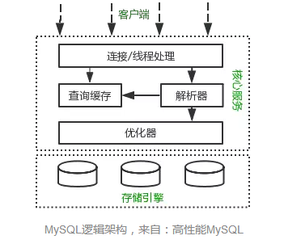


### 1 表空间结构

**表空间由段（segment）、区（extent）、页（page）、行（row）组成**，InnoDB存储引擎的逻辑存储结构大致如下图：

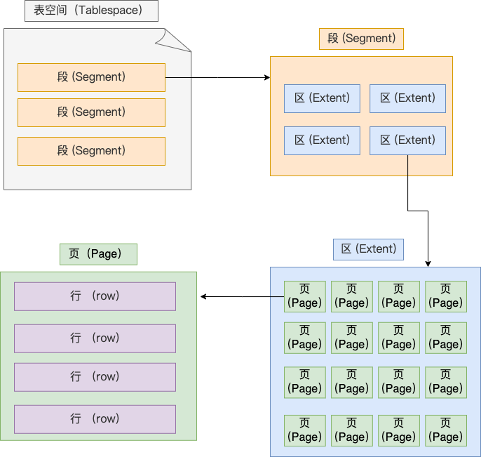

**页：InnoDB 的数据是按「页」为单位来读写的**，也就是说，当需要读一条记录的时候，并不是将这个行记录从磁盘读出来，而是以页为单位，将其整体读入内存。

**默认每个页的大小为 16KB**，也就是最多能保证 16KB 的连续存储空间。

**区（extent）** InnoDB 存储引擎是用 B+ 树来组织数据的。

B+ 树中每一层都是通过双向链表连接起来的，如果是以页为单位来分配存储空间，那么链表中相邻的两个页之间的物理位置并不是连续的，可能离得非常远，那么磁盘查询时就会有大量的随机I/O，随机 I/O 是非常慢的。

解决这个问题也很简单，就是让链表中相邻的页的物理位置也相邻，这样就可以使用顺序 I/O 了，那么在范围查询（扫描叶子节点）的时候性能就会很高。

那具体怎么解决呢？

**在表中数据量大的时候，为某个索引分配空间的时候就不再按照页为单位分配了，而是按照区（extent）为单位分配。每个区的大小为 1MB，对于 16KB 的页来说，连续的 64 个页会被划为一个区，这样就使得链表中相邻的页的物理位置也相邻，就能使用顺序 I/O 了**。

**段：**表空间是由各个段（segment）组成的，段是由多个区（extent）组成的。段一般分为数据段、索引段和回滚段等。

- 索引段：存放 B + 树的非叶子节点的区的集合；
- 数据段：存放 B + 树的叶子节点的区的集合；
- 回滚段：存放的是回滚数据的区的集合


### 2 Compact行格式

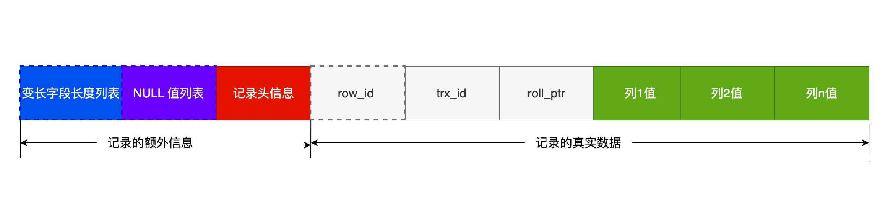

> 每个数据库表的行格式都有「NULL 值列表」吗？

NULL 值列表也不是必须的。

**当数据表的字段都定义成 NOT NULL 的时候，这时候表里的行格式就不会有 NULL 值列表了**。

所以在设计数据库表的时候，通常都是建议将字段设置为 NOT NULL，这样可以至少节省 1 字节的空间（NULL 值列表至少占用 1 字节空间）。


### 3 Varchar(n) 中n的最大取值是多少？

**MySQL 规定除了 TEXT、BLOBs 这种大对象类型之外，其他所有的列（不包括隐藏列和记录头信息）占用的字节长度加起来不能超过 65535 个字节**。

也就是说，一行记录除了 TEXT、BLOBs 类型的列，限制最大为 65535 字节，注意是一行的总长度，不是一列。

一行记录最大能存储 65535 字节的数据，但是这个是包含「变长字段字节数列表所占用的字节数」和「NULL值列表所占用的字节数」。所以， 我们在算 varchar(n) 中 n 最大值时，需要减去这两个列表所占用的字节数。


要算 varchar(n) 最大能允许存储的字节数，还要看数据库表的字符集，因为字符集代表着1个字符要占用多少字节，比如 ascii 字符集， 1 个字符占用 1 字节，那么 varchar(100) 意味着最大能允许存储 100 字节的数据。

> MySQL 怎么知道 varchar(n) 实际占用数据的大小？

MySQL 的 Compact 行格式中会用「变长字段长度列表」存储变长字段实际占用的数据大小。


### 4 MySQL 的 NULL 值是怎么存放的？

MySQL 的 Compact 行格式中会用「NULL值列表」来标记值为 NULL 的列，NULL 值并不会存储在行格式中的真实数据部分。

NULL值列表会占用 1 字节空间，当表中所有字段都定义成 NOT NULL，行格式中就不会有 NULL值列表，这样可节省 1 字节的空间。

### 5 行溢出后，MySQL 是怎么处理的？

如果一个数据页存不了一条记录，InnoDB 存储引擎会自动将溢出的数据存放到「溢出页」中。

Compact 行格式针对行溢出的处理是这样的：当发生行溢出时，在记录的真实数据处只会保存该列的一部分数据，而把剩余的数据放在「溢出页」中，然后真实数据处用 20 字节存储指向溢出页的地址，从而可以找到剩余数据所在的页。

Compressed 和 Dynamic 这两种格式采用完全的行溢出方式，记录的真实数据处不会存储该列的一部分数据，只存储 20 个字节的指针来指向溢出页。而实际的数据都存储在溢出页中。


### 6 索引分类

我们可以按照四个角度来分类索引。

- 按「数据结构」分类：**B+tree索引、Hash索引、Full-text索引**。
- 按「物理存储」分类：**聚簇索引（主键索引）、二级索引（辅助索引）**。
- 按「字段特性」分类：**主键索引、唯一索引、普通索引、前缀索引**。
- 按「字段个数」分类：**单列索引、联合索引**。


### 7 B+树索引

B+Tree 是一种多叉树，叶子节点才存放数据，非叶子节点只存放索引，而且每个节点里的数据是**按主键顺序存放**的。每一层父节点的索引值都会出现在下层子节点的索引值中，因此在叶子节点中，包括了所有的索引值信息，并且每一个叶子节点都有两个指针，分别指向下一个叶子节点和上一个叶子节点，形成一个双向链表。

主键索引的 B+Tree 如图所示：

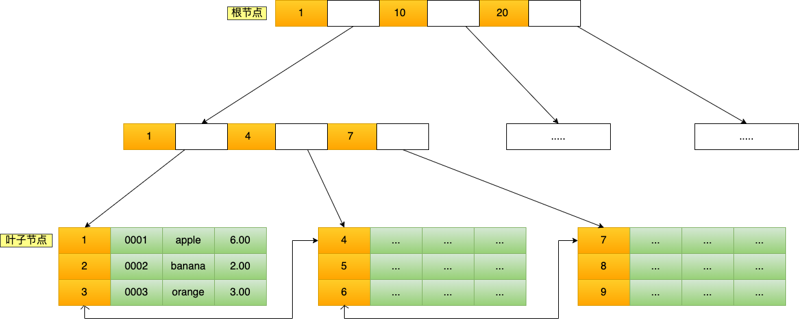

B+Tree 存储千万级的数据只需要 3-4 层高度就可以满足，这意味着从千万级的表查询目标数据最多需要 3-4 次磁盘 I/O，所以**B+Tree 相比于 B 树和二叉树来说，最大的优势在于查询效率很高，因为即使在数据量很大的情况，查询一个数据的磁盘 I/O 依然维持在 3-4次。**

> 通过二级索引查询商品数据的过程

主键索引的 B+Tree 和二级索引的 B+Tree 区别如下：

- 主键索引的 B+Tree 的叶子节点存放的是实际数据，所有完整的用户记录都存放在主键索引的 B+Tree 的叶子节点里；
- 二级索引的 B+Tree 的叶子节点存放的是主键值，而不是实际数据。

如果我用 product_no 二级索引查询商品，如下查询语句：

```sql
select * from product where product_no = '0002';
```

会先检二级索引中的 B+Tree 的索引值（商品编码，product_no），找到对应的叶子节点，然后获取主键值，然后再通过主键索引中的 B+Tree 树查询到对应的叶子节点，然后获取整行数据。**这个过程叫「回表」，也就是说要查两个 B+Tree 才能查到数据**。如下图：

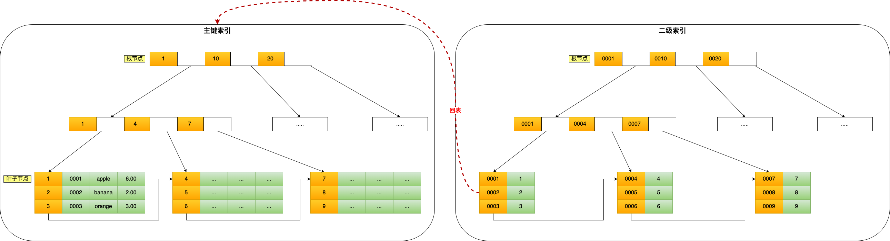

### 8 为什么InnoDB 选择 B+树作为索引的数据结构？

https://xiaolincoding.com/mysql/index/why_index_chose_bpuls_tree.html

***1、B+Tree vs B Tree***

B+Tree 只在叶子节点存储数据，而 B 树 的非叶子节点也要存储数据，所以 B+Tree 的单个节点的数据量更小，在相同的磁盘 I/O 次数下，就能查询更多的节点。

另外，B+Tree 叶子节点采用的是双链表连接，适合 MySQL 中常见的基于范围的顺序查找，而 B 树无法做到这一点。

B+ 树与 B 树差异的点，主要是以下这几点：

- **叶子节点（最底部的节点）才会存放实际数据（索引+记录），非叶子节点只会存放索引；**
- **B+树所有索引都会在叶子节点出现，叶子节点之间构成一个有序双向链表；**
- 非叶子节点的索引也会同时存在在子节点中，并且是在子节点中所有索引的最大（或最小）。
- 非叶子节点中有多少个子节点，就有多少个索引；

***2、B+Tree vs 二叉树***

对于有 N 个叶子节点的 B+Tree，其搜索复杂度为`O(logdN)`，其中 d 表示节点允许的最大子节点个数为 d 个。

在实际的应用当中， d 值是大于100的，这样就保证了，即使数据达到千万级别时，B+Tree 的高度依然维持在 3~4 层左右，也就是说一次数据查询操作只需要做 3~4 次的磁盘 I/O 操作就能查询到目标数据。

而二叉树的每个父节点的儿子节点个数只能是 2 个，意味着其搜索复杂度为 `O(logN)`，这已经比 B+Tree 高出不少，因此二叉树检索到目标数据所经历的磁盘 I/O 次数要更多。

***3、B+Tree vs Hash***

Hash 在做等值查询的时候效率贼快，搜索复杂度为 O(1)。

但是 Hash 表不适合做范围查询，它更适合做等值的查询，这也是 B+Tree 索引要比 Hash 表索引有着更广泛的适用场景的原因


### 9 聚簇索引、二级索引

从物理存储的角度来看，索引分为聚簇索引（主键索引）、二级索引（辅助索引）。

这两个区别在前面也提到了：

- 主键索引的 B+Tree 的叶子节点存放的是实际数据，所有完整的用户记录都存放在主键索引的 B+Tree 的叶子节点里；
- 二级索引的 B+Tree 的叶子节点存放的是主键值，而不是实际数据。

所以，在查询时使用了二级索引，如果查询的数据能在二级索引里查询的到，那么就不需要回表，这个过程就是**覆盖索引**。如果查询的数据不在二级索引里，就会先检索二级索引，找到对应的叶子节点，获取到主键值后，然后再检索主键索引，就能查询到数据了，这个过程就是**回表**。


**总结：**

- **聚簇索引的叶子节点存放的是实际数据，所有完整的用户记录都存放在聚簇索引的叶子节点；**
- **二级索引（非聚簇索引）的叶子节点存放的是主键值，而不是实际数据。**


### 10 联合索引 最左匹配原则

**联合索引的最左匹配原则，在遇到范围查询（如 >、<）的时候，就会停止匹配，也就是范围查询的字段可以用到联合索引，但是在范围查询字段的后面的字段无法用到联合索引。注意，对于 >=、<=、BETWEEN、like 前缀匹配的范围查询，并不会停止匹配，前面我也用了四个例子说明了**。


### 11 索引失效

常见发生索引失效的情况：

- 当我们使用左或者左右模糊匹配的时候，也就是 `like %xx` 或者 `like %xx%`这两种方式都会造成索引失效；
- 当我们在查询条件中对索引列做了计算、函数、类型转换操作，这些情况下都会造成索引失效；
- 联合索引要能正确使用需要遵循最左匹配原则，也就是按照最左优先的方式进行索引的匹配，否则就会导致索引失效。
- 在 WHERE 子句中，如果在 OR 前的条件列是索引列，而在 OR 后的条件列不是索引列，那么索引会失效。

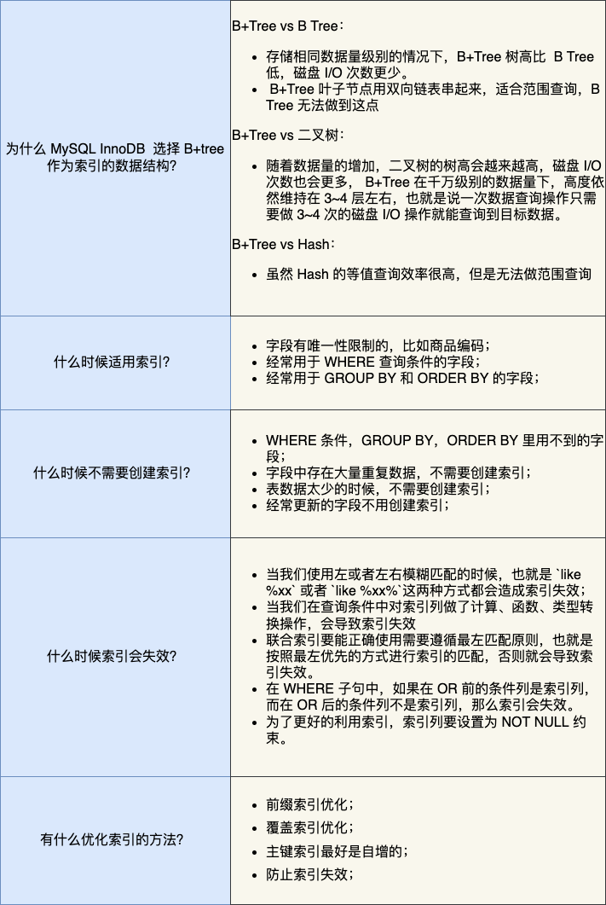


### 12 事务四大特性

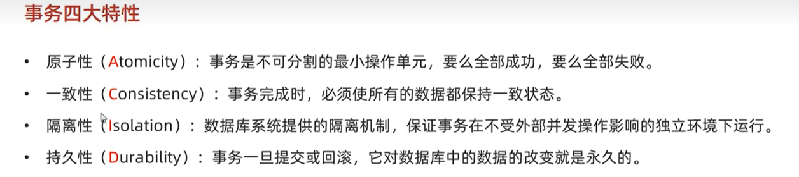

并发事务所引发的问题：

**脏读：**一个事务读到另外一个事务还没有提交的数据

**幻读**：一个事务按照条件查询数据时，没有对应的数据行，但是在插入数据时，发现这行数据又存在了，好像出现了“幻影”

**不可重复读：**一个事务先后读取同一条记录，但两次读取的数据不同

### 13 事务的隔离级别

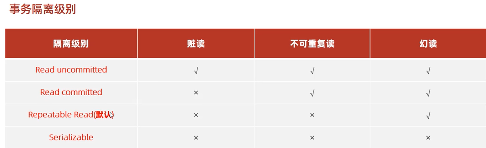

```mysql
-- 查看事务隔离级别
select @@transaction_isolation;

-- 设置事务隔离级别
set session transaction isolation level read uncommitted
```

事务的隔离级别越高，数据越安全，但是性能越低。

- **读未提交（\*read uncommitted\*）**，指一个事务还没提交时，它做的变更就能被其他事务看到；
- **读提交（\*read committed\*）**，指一个事务提交之后，它做的变更才能被其他事务看到；
- **可重复读（\*repeatable read\*）**，指一个事务执行过程中看到的数据，一直跟这个事务启动时看到的数据是一致的，**MySQL InnoDB 引擎的默认隔离级别**；
- **串行化（\*serializable\* ）**；会对记录加上读写锁，在多个事务对这条记录进行读写操作时，如果发生了读写冲突的时候，后访问的事务必须等前一个事务执行完成，才能继续执行；


### 14 MySQL锁

- 全局锁

执行后，**整个数据库就处于只读状态了**，这时其他线程执行以下操作，都会被阻塞：

​       对数据的增删改操作，比如 insert、delete、update等语句；

​       对表结构的更改操作，比如 alter table、drop table 等语句。

> 应用场景：**全库逻辑备份**：这样在备份数据库期间，不会因为数据或表结构的更新，而出现备份文件的数据与预期的不一样。


- 表级锁

  - 表共享读锁（read lock）
  - 表独占写锁（write lock）

  ```mysql
  --- 加锁
  lock tables 表名... read/write
  --- 解锁
  unlock tables
  ```

  - 元数据锁（meta data lock ，MDL），系统自动控制 
    - 对一张表进行 CRUD 操作时，加的是 **MDL 读锁**；
    - 对一张表做结构变更操作的时候，加的是 **MDL 写锁**；
  - 意向锁

- 行级锁


### 15 Redis如何实现服务高可用？

#### 主从复制

主从复制是 Redis 高可用服务的最基础的保证，实现方案就是将从前的一台 Redis 服务器，同步数据到多台从 Redis 服务器上，即**一主多从**的模式，且**主从服务器之间采用的是「读写分离」的方式**。

**主服务器可以进行读写操作，当发生写操作时自动将写操作同步给从服务器**，而**从服务器一般是只读，并接受主服务器同步过来写操作命令，然后执行这条命令**。

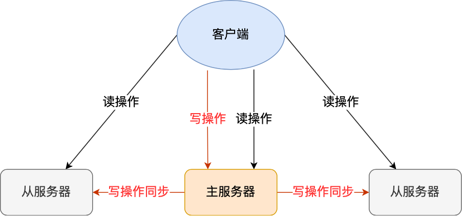

也就是说，所有的数据修改只在主服务器上进行，然后将最新的数据同步给从服务器，这样就使得主从服务器的数据是一致的。

注意，主从服务器之间的命令复制是**异步**进行的。

具体来说，在主从服务器命令传播阶段，主服务器收到新的写命令后，会发送给从服务器。但是，主服务器并不会等到从服务器实际执行完命令后，再把结果返回给客户端，而是主服务器自己在本地执行完命令后，就会向客户端返回结果了。如果从服务器还没有执行主服务器同步过来的命令，主从服务器间的数据就不一致了。

所以，无法实现强一致性保证（主从数据时时刻刻保持一致），数据不一致是难以避免的。

#### 哨兵模式

在使用 Redis 主从服务的时候，会有一个问题，就是当 Redis 的主从服务器出现故障宕机时，需要手动进行恢复。

为了解决这个问题，Redis 增加了哨兵模式（**Redis Sentinel**），因为哨兵模式做到了可以监控主从服务器，并且提供**主从节点故障转移的功能。**


#### 切片集群模式

当 Redis 缓存数据量大到一台服务器无法缓存时，就需要使用 **Redis 切片集群**（Redis Cluster ）方案，它将数据分布在不同的服务器上，以此来降低系统对单主节点的依赖，从而提高 Redis 服务的读写性能。

Redis Cluster 方案采用哈希槽（Hash Slot），来处理数据和节点之间的映射关系。在 Redis Cluster 方案中，**一个切片集群共有 16384 个哈希槽**，这些哈希槽类似于数据分区，每个键值对都会根据它的 key，被映射到一个哈希槽中，具体执行过程分为两大步：

- 根据键值对的 key，按照 [CRC16 算法 (opens new window)](https://en.wikipedia.org/wiki/Cyclic_redundancy_check)计算一个 16 bit 的值。
- 再用 16bit 值对 16384 取模，得到 0~16383 范围内的模数，每个模数代表一个相应编号的哈希槽。

接下来的问题就是，这些哈希槽怎么被映射到具体的 Redis 节点上的呢？有两种方案：

- **平均分配：** 在使用 cluster create 命令创建 Redis 集群时，Redis 会自动把所有哈希槽平均分布到集群节点上。比如集群中有 9 个节点，则每个节点上槽的个数为 16384/9 个。
- **手动分配：** 可以使用 cluster meet 命令手动建立节点间的连接，组成集群，再使用 cluster addslots 命令，指定每个节点上的哈希槽个数。


1. 聚簇索引和非聚簇索引的区别
2. mysql的事务隔离级别
3. 怎么避免回表
4. 说说b+树
5. mysql的隔离级别？谈谈可重复读隔离是如何实现的？
6. 谈谈mysql的乐观锁和悲观锁以及适用场景？
7. MySQL 的事务隔离级别，可重复读解决什么，幻读是什么？
8. MySQL 修改数据库某个表的字段用什么指令？
9. Redis 的数据结构有哪些？GEO 怎么用的？
10. Redis 如何实现分布式锁？


## 3 网络

### 1. 浏览器输入 URL 的一个过程


### 2. TCP 三次握手，四次握手的过程

**三次握手：**

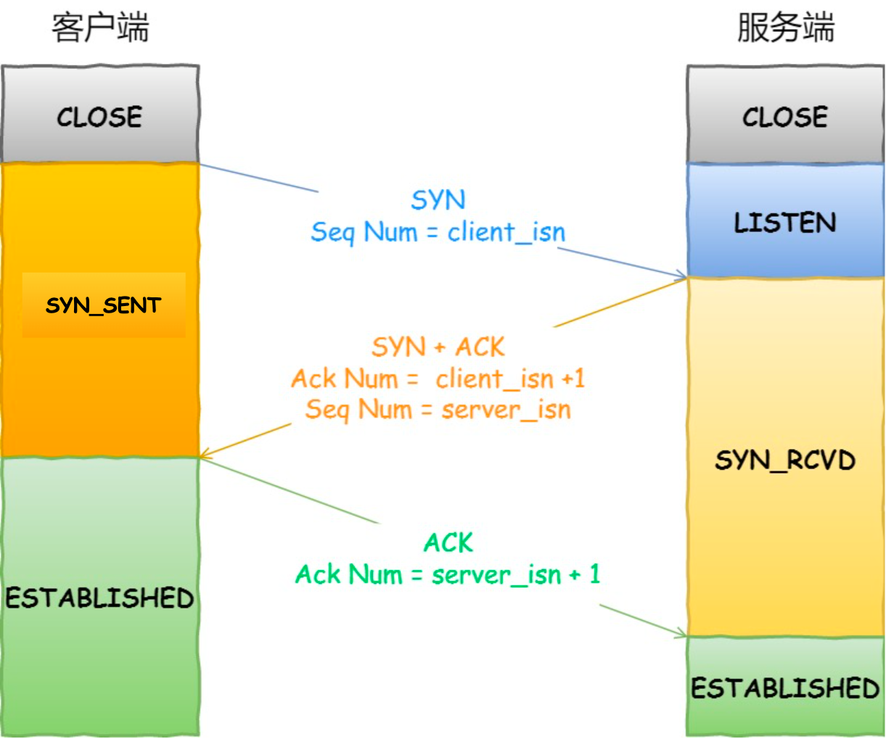

- 一开始，客户端和服务端都处于 `CLOSE` 状态。先是服务端主动监听某个端口，处于 `LISTEN` 状态
- 客户端会随机初始化序号（`client_isn`），将此序号置于 TCP 首部的「序号」字段中，同时把 `SYN` 标志位置为 `1`，表示 `SYN` 报文。接着把第一个 SYN 报文发送给服务端，表示向服务端发起连接，该报文不包含应用层数据，之后客户端处于 `SYN-SENT` 状态。
- 服务端收到客户端的 `SYN` 报文后，首先服务端也随机初始化自己的序号（`server_isn`），将此序号填入 TCP 首部的「序号」字段中，其次把 TCP 首部的「确认应答号」字段填入 `client_isn + 1`, 接着把 `SYN` 和 `ACK` 标志位置为 `1`。最后把该报文发给客户端，该报文也不包含应用层数据，之后服务端处于 `SYN-RCVD` 状态。
- 客户端收到服务端报文后，还要向服务端回应最后一个应答报文，首先该应答报文 TCP 首部 `ACK` 标志位置为 `1` ，其次「确认应答号」字段填入 `server_isn + 1` ，最后把报文发送给服务端，这次报文可以携带客户到服务端的数据，之后客户端处于 `ESTABLISHED` 状态。
- 服务端收到客户端的应答报文后，也进入 `ESTABLISHED` 状态。

从上面的过程可以发现**第三次握手是可以携带数据的，前两次握手是不可以携带数据的**，这也是面试常问的题。

**四次挥手**


- 客户端打算关闭连接，此时会发送一个 TCP 首部 `FIN` 标志位被置为 `1` 的报文，也即 `FIN` 报文，之后客户端进入 `FIN_WAIT_1` 状态。
- 服务端收到该报文后，就向客户端发送 `ACK` 应答报文，接着服务端进入 `CLOSE_WAIT` 状态。
- 客户端收到服务端的 `ACK` 应答报文后，之后进入 `FIN_WAIT_2` 状态。
- 等待服务端处理完数据后，也向客户端发送 `FIN` 报文，之后服务端进入 `LAST_ACK` 状态。
- 客户端收到服务端的 `FIN` 报文后，回一个 `ACK` 应答报文，之后进入 **`TIME_WAIT` 状态**
- 服务端收到了 `ACK` 应答报文后，就进入了 `CLOSE` 状态，至此服务端已经完成连接的关闭。
- 客户端在经过 `2MSL` 一段时间后，自动进入 `CLOSE` 状态，至此客户端也完成连接的关闭。

你可以看到，每个方向都需要**一个 FIN 和一个 ACK**，因此通常被称为**四次挥手**。

这里一点需要注意是：**主动关闭连接的，才有 TIME_WAIT 状态。**


### 3. 为什么是三次握手？不是两次？四次？

https://xiaolincoding.com/network/3_tcp/tcp_interview.html#%E4%B8%BA%E4%BB%80%E4%B9%88%E6%98%AF%E4%B8%89%E6%AC%A1%E6%8F%A1%E6%89%8B-%E4%B8%8D%E6%98%AF%E4%B8%A4%E6%AC%A1%E3%80%81%E5%9B%9B%E6%AC%A1

- （主要原因）**TCP 使用三次握手建立连接的最主要原因是防止「历史连接」初始化了连接。**
- 三次握手才可以同步双方的初始序列号
- 三次握手才可以避免资源浪费

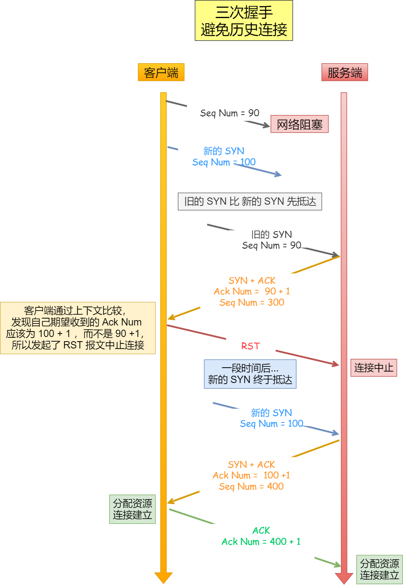

TCP 建立连接时，通过三次握手**能防止历史连接的建立，能减少双方不必要的资源开销，能帮助双方同步初始化序列号**。序列号能够保证数据包不重复、不丢弃和按序传输。

不使用「两次握手」和「四次握手」的原因：

- 「两次握手」：无法防止历史连接的建立，会造成双方资源的浪费，也无法可靠的同步双方序列号；
- 「四次握手」：三次握手就已经理论上最少可靠连接建立，所以不需要使用更多的通信次数。

### 4. 为什么挥手四次？

- 关闭连接时，客户端向服务端发送 `FIN` 时，仅仅表示客户端不再发送数据了但是还能接收数据。
- 服务端收到客户端的 `FIN` 报文时，先回一个 `ACK` 应答报文，而服务端可能还有数据需要处理和发送，等服务端不再发送数据时，才发送 `FIN` 报文给客户端来表示同意现在关闭连接。

从上面过程可知，服务端通常需要等待完成数据的发送和处理，所以服务端的 `ACK` 和 `FIN` 一般都会分开发送，因此是需要四次挥手。

但是**在特定情况下，四次挥手是可以变成三次挥手的**


### 5.  TIME_WAIT出现在什么时候？要等到多久？2MSL为什么要等这么久？

客户端（主动断开连接方）在收到第三次回收后，会进入TIme_WAIT状态，开启时长为2MSL的定时器，如果中途再次收到第三次挥手的报文后，就会重置定时器，当等待2MSL市场后，客户端就会断开连接。

`MSL` 是 Maximum Segment Lifetime，**报文最大生存时间**，它是任何报文在网络上存在的最长时间，超过这个时间报文将被丢弃。因为 TCP 报文基于是 IP 协议的，而 IP 头中有一个 `TTL` 字段，是 IP 数据报可以经过的最大路由数，每经过一个处理他的路由器此值就减 1，当此值为 0 则数据报将被丢弃，同时发送 ICMP 报文通知源主机。

MSL 与 TTL 的区别： MSL 的单位是时间，而 TTL 是经过路由跳数。所以 **MSL 应该要大于等于 TTL 消耗为 0 的时间**，以确保报文已被自然消亡。

**TTL 的值一般是 64，Linux 将 MSL 设置为 30 秒，意味着 Linux 认为数据报文经过 64 个路由器的时间不会超过 30 秒，如果超过了，就认为报文已经消失在网络中了**。

TIME_WAIT 等待 2 倍的 MSL，比较合理的解释是： **网络中可能存在来自发送方的数据包，当这些发送方的数据包被接收方处理后又会向对方发送响应，所以一来一回需要等待 2 倍的时间**。

比如，如果被动关闭方没有收到断开连接的最后的 ACK 报文，就会触发超时重发 `FIN` 报文，另一方接收到 FIN 后，会重发 ACK 给被动关闭方， 一来一去正好 2 个 MSL。

可以看到 **2MSL时长** 这其实是相当于**至少允许报文丢失一次**。比如，若 ACK 在一个 MSL 内丢失，这样被动方重发的 FIN 会在第 2 个 MSL 内到达，TIME_WAIT 状态的连接可以应对。

为什么不是 4 或者 8 MSL 的时长呢？你可以想象一个丢包率达到百分之一的糟糕网络，连续两次丢包的概率只有万分之一，这个概率实在是太小了，忽略它比解决它更具性价比。

`2MSL` 的时间是从**客户端接收到 FIN 后发送 ACK 开始计时的**。如果在 TIME-WAIT 时间内，因为客户端的 ACK 没有传输到服务端，客户端又接收到了服务端重发的 FIN 报文，那么 **2MSL 时间将重新计时**。

在 Linux 系统里 `2MSL` 默认是 `60` 秒，那么一个 `MSL` 也就是 `30` 秒。**Linux 系统停留在 TIME_WAIT 的时间为固定的 60 秒**。


**为什么需要TIME_WAIT状态？**

1. 为了防止历史连接中的数据，被后面相同四元组的连接错误的接收，因此 TCP 设计了 TIME_WAIT 状态，状态会持续 `2MSL` 时长，这个时间**足以让两个方向上的数据包都被丢弃，使得原来连接的数据包在网络中都自然消失，再出现的数据包一定都是新建立连接所产生的。**
2. 保证 「被动关闭连接」的一方，能被正确的关闭，也就是说，TIME-WAIT 作用是**等待足够的时间以确保最后的 ACK 能让被动关闭方接收，从而帮助其正常关闭。**


**如果服务端要避免过多的 TIME_WAIT 状态的连接，就永远不要主动断开连接，让客户端去断开，由分布在各处的客户端去承受 TIME_WAIT**。

**什么场景下服务端会主动断开连接呢？**主动断开连接就会产生TIME_WAIT

- 第一个场景：HTTP 没有使用长连接
- 第二个场景：HTTP 长连接超时
- 第三个场景：HTTP 长连接的请求数量达到上限


### 6. 如果已经建立了连接，但是客户端突然出现故障了怎么办？


TCP 有**保活机制**。这个机制的原理是这样的：

定义一个时间段，在这个时间段内，如果没有任何连接相关的活动，TCP 保活机制会开始作用，每隔一个时间间隔，发送一个探测报文，该探测报文包含的数据非常少，如果连续几个探测报文都没有得到响应，则认为当前的 TCP 连接已经死亡，系统内核将错误信息通知给上层应用程序。

如果开启了 TCP 保活，需要考虑以下几种情况：

- 第一种，对端程序是正常工作的。当 TCP 保活的探测报文发送给对端, 对端会正常响应，这样 **TCP 保活时间会被重置**，等待下一个 TCP 保活时间的到来。
- 第二种，对端主机宕机并重启。当 TCP 保活的探测报文发送给对端后，对端是可以响应的，但由于没有该连接的有效信息，**会产生一个 RST 报文**，这样很快就会发现 TCP 连接已经被重置。
- 第三种，是对端主机宕机（*注意不是进程崩溃，进程崩溃后操作系统在回收进程资源的时候，会发送 FIN 报文，而主机宕机则是无法感知的，所以需要 TCP 保活机制来探测对方是不是发生了主机宕机*），或对端由于其他原因导致报文不可达。当 TCP 保活的探测报文发送给对端后，石沉大海，没有响应，连续几次，达到保活探测次数后，**TCP 会报告该 TCP 连接已经死亡**。

TCP 保活的这个机制检测的时间是有点长，我们可以自己在应用层实现一个心跳机制。

比如，web 服务软件一般都会提供 `keepalive_timeout` 参数，用来指定 HTTP 长连接的超时时间。如果设置了 HTTP 长连接的超时时间是 60 秒，web 服务软件就会**启动一个定时器**，如果客户端在完成一个 HTTP 请求后，在 60 秒内都没有再发起新的请求，**定时器的时间一到，就会触发回调函数来释放该连接。**

为了避免资源浪费，web服务软件一般都可以指定HTTP长连接的超时时间，假设设置了 HTTP 长连接的超时时间是 60 秒，nginx 就会启动一个「定时器」，**如果客户端在完后一个 HTTP 请求后，在 60 秒内都没有再发起新的请求，定时器的时间一到，nginx 就会触发回调函数来关闭该连接，那么此时服务端上就会出现 TIME_WAIT 状态的连接**。

### 7 如果已经建立了连接，但是服务端的进程崩溃会发生什么？

TCP 的连接信息是由内核维护的，所以当服务端的进程崩溃后，内核需要回收该进程的所有 TCP 连接资源，于是内核会发送第一次挥手 FIN 报文，后续的挥手过程也都是在内核完成，并不需要进程的参与，所以即使服务端的进程退出了，还是能与客户端完成 TCP 四次挥手的过程。

### 8 TCP 如何保证它的数据的顺序性


TCP（传输控制协议）通过序号（Sequence Number）和确认序号（Acknowledgment Number）来保证数据的顺序性。以下是TCP如何实现数据顺序性的主要机制：

1. **序号（Sequence Number）：** 每个TCP报文段都有一个序号字段，用来标识报文段中第一个字节的序号。发送方会对每个发送的字节进行编号，接收方使用这个序号来按正确的顺序组装数据。TCP使用32位的序号字段，因此序号可以达到很大的范围。
2. **确认序号（Acknowledgment Number）：** 在TCP通信中，接收方向发送方确认已成功接收的数据，同时通过确认序号告诉发送方下一次期望接收的数据的序号。这有助于发送方知道哪些数据已经成功到达，哪些数据还需要重传。
3. **滑动窗口机制：** TCP使用滑动窗口来控制流量和确保顺序性。发送方维护一个发送窗口，表示可以发送的字节范围，而接收方维护一个接收窗口，表示可以接收的字节范围。滑动窗口机制允许发送方在不等待确认的情况下继续发送数据，从而提高效率。
4. **流控制：** TCP使用流控制机制来防止发送方发送过多的数据，以避免超过接收方的处理能力。通过控制窗口大小，TCP可以确保在网络中的合理流量控制下进行数据传输，从而保持顺序性。


### 9 TCP超时重传

TCP 的策略是**超时间隔加倍** ， 就是 每当遇到一次超时重传的时候，都会将下一次超时时间间隔设为先前值的两倍。两次超时，就说明网络环境差，不宜频繁反复发送。


### 10 TCP滑动窗口

滑动窗口可以指定窗口大小，窗口大小就是指**无需等待确认应答，而可以继续发送数据的最大值**。

窗口的实现实际上是操作系统开辟的一个缓存空间，发送方主机在等到确认应答返回之前，必须在缓冲区中保留已发送的数据。如果按期收到确认应答，此时数据就可以从缓存区清除。

> 窗口大小由哪一方决定？

TCP 头里有一个字段叫 `Window`，也就是窗口大小。

**这个字段是接收端告诉发送端自己还有多少缓冲区可以接收数据。于是发送端就可以根据这个接收端的处理能力来发送数据，而不会导致接收端处理不过来。**

所以，通常窗口的大小是由接收方的窗口大小来决定的。

发送方发送的数据大小不能超过接收方的窗口大小，否则接收方就无法正常接收到数据。


### 11 TCP拥塞控制

**在网络出现拥堵时，如果继续发送大量数据包，可能会导致数据包时延、丢失等，这时 TCP 就会重传数据，但是一重传就会导致网络的负担更重，于是会导致更大的延迟以及更多的丢包，这个情况就会进入恶性循环被不断地放大....**

所以，TCP 不能忽略网络上发生的事，它被设计成一个无私的协议，当网络发送拥塞时，TCP 会自我牺牲，降低发送的数据量。

于是，就有了**拥塞控制**，控制的目的就是**避免「发送方」的数据填满整个网络。**

为了在「发送方」调节所要发送数据的量，定义了一个叫做「**拥塞窗口**」的概念。

> 拥塞控制有哪些控制算法？

拥塞控制主要是四个算法：

1. **慢启动**

TCP 在刚建立连接完成后，首先是有个慢启动的过程，这个慢启动的意思就是一点一点的提高发送数据包的数量，如果一上来就发大量的数据，这不是给网络添堵吗？

慢启动的算法记住一个规则就行：**当发送方每收到一个 ACK，拥塞窗口 cwnd 的大小就会加 1。**

2. **拥塞避免**

当拥塞窗口 `cwnd` 「超过」慢启动门限 `ssthresh` 就会进入拥塞避免算法。

一般来说 `ssthresh` 的大小是 `65535` 字节。

那么进入拥塞避免算法后，它的规则是：**每当收到一个 ACK 时，cwnd 增加 1/cwnd。**

3. **拥塞发生**

当网络出现拥塞，也就是会发生数据包重传，重传机制主要有两种：

- 超时重传
- 快速重传

这两种使用的拥塞发送算法是不同的，接下来分别来说说。

> 发生超时重传的拥塞发生算法

当发生了「超时重传」，则就会使用拥塞发生算法。

这个时候，ssthresh 和 cwnd 的值会发生变化：

- `ssthresh` 设为 `cwnd/2`，
- `cwnd` 重置为 `1` （是恢复为 cwnd 初始化值，我这里假定 cwnd 初始化值 1）

> 发生快速重传的拥塞发生算法

还有更好的方式，前面我们讲过「快速重传算法」。当接收方发现丢了一个中间包的时候，发送三次前一个包的 ACK，于是发送端就会快速地重传，不必等待超时再重传。

TCP 认为这种情况不严重，因为大部分没丢，只丢了一小部分，则 `ssthresh` 和 `cwnd` 变化如下：

- `cwnd = cwnd/2` ，也就是设置为原来的一半;
- `ssthresh = cwnd`;
- 进入快速恢复算法

4. **快速恢复**

快速重传和快速恢复算法一般同时使用，快速恢复算法是认为，你还能收到 3 个重复 ACK 说明网络也不那么糟糕，所以没有必要像 `RTO` 超时那么强烈。


## 4 Web、项目

1. 介绍一下自己的项目
2. 介绍一下使用 JWT 进行鉴权的过程
3. 说一下 Gin 的拦截器的原理
4. 说一下 Gin 的路由怎么实现的
5. Gin 的路由使用的数据结构（字典树），介绍一下字典树


### 1支撑研发团队选择 Gin 作为 web 框架的原因包括：

-  支持中间件操作（ handlersChain 机制 ）：针对一个请求路径，会有一个handlerChain这样的链条，执行链的方式，实现多个handler的路径处理函数
- 更方便的使用（ gin.Context ）：结合handler可以实现类似拦截器、中间件的能力
- 更强大的路由解析能力（ radix tree 路由树，压缩前缀树 ）


Engine包含的核心内容包括：

```go
type Engine struct {
   // 路由组
    RouterGroup
    // ...
    // context 对象池
    pool             sync.Pool
    // 方法路由树
    trees            methodTrees
    // ...
}
```

- 路由组 RouterGroup：

  ```
  type RouterGroup struct {
      Handlers HandlersChain
      basePath string
      engine *Engine
      root bool
  }
  ```

  RouterGroup 是路由组的概念，其中的配置将被从属于该路由组的所有路由复用：

  - Handlers：路由组共同的 handler 处理函数链. 组下的节点将拼接 RouterGroup 的公用 handlers 和自己的 handlers，组成最终使用的 handlers 链
  - basePath：路由组的基础路径. 组下的节点将拼接 RouterGroup 的 basePath 和自己的 path，组成最终使用的 absolutePath
  - engine：指向路由组从属的 Engine
  - root：标识路由组是否位于 Engine 的根节点. 当用户基于 RouterGroup.Group 方法创建子路由组后，该标识为 false


- Context 对象池 pool：基于 sync.Pool 实现，作为复用 gin.Context 实例的缓冲池.
- 路由树数组 trees：共有 9 棵路由树，对应于 9 种 http 方法. 路由树基于压缩前缀树实现


##  5 通用技术

