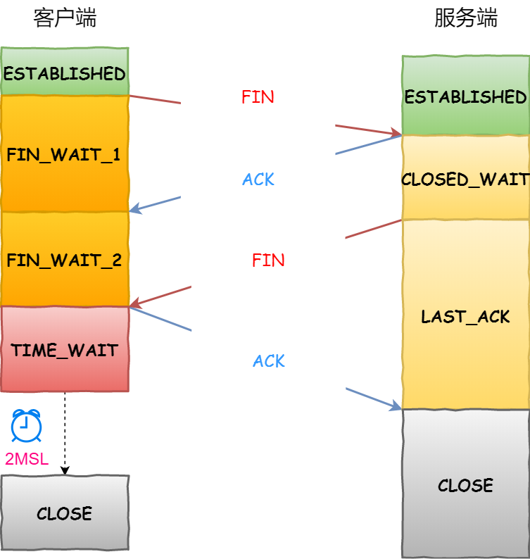

# 常见面试题

## 1 Go语言基础

1. golang的make和new的区别
2. 如果new 切片会怎么样
3. 切片和数组的区别
4. golang的进程、线程、协程的区别
5. 谈谈gmp模型
6. 如果没有gmp全局队列会怎么样
7. golang的map是不是并发安全的？怎么保证安全？
8. map是如何扩容的
9. gc的触发时机
10. 说一说golang中数组和切片的区别，slice在做函数参数是的修改和添加是怎么回事，会改变实参吗
11. go中make和new的区别，详细一点
12. 读已经close的channel会怎么样
13. 进程，线程，协程区别
14. 怎么看待golang是值传递，go的引用传递和值传递，
15. golang的defer语句是怎么用的，他在return前还是后，defer中修改值会怎么样。
16. map并发安全吗，怎么变并发安全，map的删除底层（tnnd只背了扩容，nan绷）
17. 内存逃逸相关？？
18. 进程、线程、协程的区别
19. Golang 的 GMP 调度
    - 说下 GMP 的整个过程
    - M 发生系统调用了 G 和 P 会怎么样
    - M 系统调用结束以后会怎么样
20. slice 和 array 的区别
21. map, slice 未初始化，操作会怎么样。发生 panic 应该怎么办
22. recover 怎么使用的，defer 相比普通的在函数最后执行操作，其优势是什么
23. channel 相关操作
24. map 有序无序，为什么？map 是否并发安全？如何保证并发安全？map 并发读写都是不安全的。
25. 如何控制 GMP 中 M 的数量？(???)
26. 如何控制 goroutine 的生命周期，channel 的作用，context 的作用
27. select 如何使用？
28. new 和 make 的区别？

## 2 数据库

1. 聚簇索引和非聚簇索引的区别
2. mysql的事务隔离级别
3. 怎么避免回表
4. 说说b+树
5. mysql的隔离级别？谈谈可重复读隔离是如何实现的？
6. 谈谈mysql的乐观锁和悲观锁以及适用场景？
7. MySQL 的事务隔离级别，可重复读解决什么，幻读是什么？
8. MySQL 修改数据库某个表的字段用什么指令？
9. Redis 的数据结构有哪些？GEO 怎么用的？
10. Redis 如何实现分布式锁？

## 3 网络

### 1. 浏览器输入 URL 的一个过程

### 2. TCP 三次握手，四次握手的过程

**三次握手：**

- 一开始，客户端和服务端都处于 `CLOSE` 状态。先是服务端主动监听某个端口，处于 `LISTEN` 状态
- 客户端会随机初始化序号（`client_isn`），将此序号置于 TCP 首部的「序号」字段中，同时把 `SYN` 标志位置为 `1`，表示 `SYN` 报文。接着把第一个 SYN 报文发送给服务端，表示向服务端发起连接，该报文不包含应用层数据，之后客户端处于 `SYN-SENT` 状态。
- 服务端收到客户端的 `SYN` 报文后，首先服务端也随机初始化自己的序号（`server_isn`），将此序号填入 TCP 首部的「序号」字段中，其次把 TCP 首部的「确认应答号」字段填入 `client_isn + 1`, 接着把 `SYN` 和 `ACK` 标志位置为 `1`。最后把该报文发给客户端，该报文也不包含应用层数据，之后服务端处于 `SYN-RCVD` 状态。
- 客户端收到服务端报文后，还要向服务端回应最后一个应答报文，首先该应答报文 TCP 首部 `ACK` 标志位置为 `1` ，其次「确认应答号」字段填入 `server_isn + 1` ，最后把报文发送给服务端，这次报文可以携带客户到服务端的数据，之后客户端处于 `ESTABLISHED` 状态。
- 服务端收到客户端的应答报文后，也进入 `ESTABLISHED` 状态。

从上面的过程可以发现**第三次握手是可以携带数据的，前两次握手是不可以携带数据的**，这也是面试常问的题。

**四次挥手**

- 客户端打算关闭连接，此时会发送一个 TCP 首部 `FIN` 标志位被置为 `1` 的报文，也即 `FIN` 报文，之后客户端进入 `FIN_WAIT_1` 状态。
- 服务端收到该报文后，就向客户端发送 `ACK` 应答报文，接着服务端进入 `CLOSE_WAIT` 状态。
- 客户端收到服务端的 `ACK` 应答报文后，之后进入 `FIN_WAIT_2` 状态。
- 等待服务端处理完数据后，也向客户端发送 `FIN` 报文，之后服务端进入 `LAST_ACK` 状态。
- 客户端收到服务端的 `FIN` 报文后，回一个 `ACK` 应答报文，之后进入 **`TIME_WAIT` 状态**
- 服务端收到了 `ACK` 应答报文后，就进入了 `CLOSE` 状态，至此服务端已经完成连接的关闭。
- 客户端在经过 `2MSL` 一段时间后，自动进入 `CLOSE` 状态，至此客户端也完成连接的关闭。

你可以看到，每个方向都需要**一个 FIN 和一个 ACK**，因此通常被称为**四次挥手**。

这里一点需要注意是：**主动关闭连接的，才有 TIME_WAIT 状态。**

### 3. 为什么是三次握手？不是两次？四次？

https://xiaolincoding.com/network/3_tcp/tcp_interview.html#%E4%B8%BA%E4%BB%80%E4%B9%88%E6%98%AF%E4%B8%89%E6%AC%A1%E6%8F%A1%E6%89%8B-%E4%B8%8D%E6%98%AF%E4%B8%A4%E6%AC%A1%E3%80%81%E5%9B%9B%E6%AC%A1

- （主要原因）**TCP 使用三次握手建立连接的最主要原因是防止「历史连接」初始化了连接。**
- 三次握手才可以同步双方的初始序列号
- 三次握手才可以避免资源浪费

TCP 建立连接时，通过三次握手**能防止历史连接的建立，能减少双方不必要的资源开销，能帮助双方同步初始化序列号**。序列号能够保证数据包不重复、不丢弃和按序传输。

不使用「两次握手」和「四次握手」的原因：

- 「两次握手」：无法防止历史连接的建立，会造成双方资源的浪费，也无法可靠的同步双方序列号；
- 「四次握手」：三次握手就已经理论上最少可靠连接建立，所以不需要使用更多的通信次数。

### 4. 为什么挥手四次？

- 关闭连接时，客户端向服务端发送 `FIN` 时，仅仅表示客户端不再发送数据了但是还能接收数据。
- 服务端收到客户端的 `FIN` 报文时，先回一个 `ACK` 应答报文，而服务端可能还有数据需要处理和发送，等服务端不再发送数据时，才发送 `FIN` 报文给客户端来表示同意现在关闭连接。

从上面过程可知，服务端通常需要等待完成数据的发送和处理，所以服务端的 `ACK` 和 `FIN` 一般都会分开发送，因此是需要四次挥手。

但是**在特定情况下，四次挥手是可以变成三次挥手的**

### 5.  TIME_WAIT出现在什么时候？要等到多久？2MSL为什么要等这么久？

客户端（主动断开连接方）在收到第三次回收后，会进入TIme_WAIT状态，开启时长为2MSL的定时器，如果中途再次收到第三次挥手的报文后，就会重置定时器，当等待2MSL市场后，客户端就会断开连接。

`MSL` 是 Maximum Segment Lifetime，**报文最大生存时间**，它是任何报文在网络上存在的最长时间，超过这个时间报文将被丢弃。因为 TCP 报文基于是 IP 协议的，而 IP 头中有一个 `TTL` 字段，是 IP 数据报可以经过的最大路由数，每经过一个处理他的路由器此值就减 1，当此值为 0 则数据报将被丢弃，同时发送 ICMP 报文通知源主机。

MSL 与 TTL 的区别： MSL 的单位是时间，而 TTL 是经过路由跳数。所以 **MSL 应该要大于等于 TTL 消耗为 0 的时间**，以确保报文已被自然消亡。

**TTL 的值一般是 64，Linux 将 MSL 设置为 30 秒，意味着 Linux 认为数据报文经过 64 个路由器的时间不会超过 30 秒，如果超过了，就认为报文已经消失在网络中了**。

TIME_WAIT 等待 2 倍的 MSL，比较合理的解释是： **网络中可能存在来自发送方的数据包，当这些发送方的数据包被接收方处理后又会向对方发送响应，所以一来一回需要等待 2 倍的时间**。

比如，如果被动关闭方没有收到断开连接的最后的 ACK 报文，就会触发超时重发 `FIN` 报文，另一方接收到 FIN 后，会重发 ACK 给被动关闭方， 一来一去正好 2 个 MSL。

可以看到 **2MSL时长** 这其实是相当于**至少允许报文丢失一次**。比如，若 ACK 在一个 MSL 内丢失，这样被动方重发的 FIN 会在第 2 个 MSL 内到达，TIME_WAIT 状态的连接可以应对。

为什么不是 4 或者 8 MSL 的时长呢？你可以想象一个丢包率达到百分之一的糟糕网络，连续两次丢包的概率只有万分之一，这个概率实在是太小了，忽略它比解决它更具性价比。

`2MSL` 的时间是从**客户端接收到 FIN 后发送 ACK 开始计时的**。如果在 TIME-WAIT 时间内，因为客户端的 ACK 没有传输到服务端，客户端又接收到了服务端重发的 FIN 报文，那么 **2MSL 时间将重新计时**。

在 Linux 系统里 `2MSL` 默认是 `60` 秒，那么一个 `MSL` 也就是 `30` 秒。**Linux 系统停留在 TIME_WAIT 的时间为固定的 60 秒**。

**为什么需要TIME_WAIT状态？**

1. 为了防止历史连接中的数据，被后面相同四元组的连接错误的接收，因此 TCP 设计了 TIME_WAIT 状态，状态会持续 `2MSL` 时长，这个时间**足以让两个方向上的数据包都被丢弃，使得原来连接的数据包在网络中都自然消失，再出现的数据包一定都是新建立连接所产生的。**
2. 保证 「被动关闭连接」的一方，能被正确的关闭，也就是说，TIME-WAIT 作用是**等待足够的时间以确保最后的 ACK 能让被动关闭方接收，从而帮助其正常关闭。**

**如果服务端要避免过多的 TIME_WAIT 状态的连接，就永远不要主动断开连接，让客户端去断开，由分布在各处的客户端去承受 TIME_WAIT**。

**什么场景下服务端会主动断开连接呢？**主动断开连接就会产生TIME_WAIT

- 第一个场景：HTTP 没有使用长连接
- 第二个场景：HTTP 长连接超时
- 第三个场景：HTTP 长连接的请求数量达到上限

### 6. 如果已经建立了连接，但是客户端突然出现故障了怎么办？

TCP 有**保活机制**。这个机制的原理是这样的：

定义一个时间段，在这个时间段内，如果没有任何连接相关的活动，TCP 保活机制会开始作用，每隔一个时间间隔，发送一个探测报文，该探测报文包含的数据非常少，如果连续几个探测报文都没有得到响应，则认为当前的 TCP 连接已经死亡，系统内核将错误信息通知给上层应用程序。

如果开启了 TCP 保活，需要考虑以下几种情况：

- 第一种，对端程序是正常工作的。当 TCP 保活的探测报文发送给对端, 对端会正常响应，这样 **TCP 保活时间会被重置**，等待下一个 TCP 保活时间的到来。
- 第二种，对端主机宕机并重启。当 TCP 保活的探测报文发送给对端后，对端是可以响应的，但由于没有该连接的有效信息，**会产生一个 RST 报文**，这样很快就会发现 TCP 连接已经被重置。
- 第三种，是对端主机宕机（*注意不是进程崩溃，进程崩溃后操作系统在回收进程资源的时候，会发送 FIN 报文，而主机宕机则是无法感知的，所以需要 TCP 保活机制来探测对方是不是发生了主机宕机*），或对端由于其他原因导致报文不可达。当 TCP 保活的探测报文发送给对端后，石沉大海，没有响应，连续几次，达到保活探测次数后，**TCP 会报告该 TCP 连接已经死亡**。

TCP 保活的这个机制检测的时间是有点长，我们可以自己在应用层实现一个心跳机制。

比如，web 服务软件一般都会提供 `keepalive_timeout` 参数，用来指定 HTTP 长连接的超时时间。如果设置了 HTTP 长连接的超时时间是 60 秒，web 服务软件就会**启动一个定时器**，如果客户端在完成一个 HTTP 请求后，在 60 秒内都没有再发起新的请求，**定时器的时间一到，就会触发回调函数来释放该连接。**

为了避免资源浪费，web服务软件一般都可以指定HTTP长连接的超时时间，假设设置了 HTTP 长连接的超时时间是 60 秒，nginx 就会启动一个「定时器」，**如果客户端在完后一个 HTTP 请求后，在 60 秒内都没有再发起新的请求，定时器的时间一到，nginx 就会触发回调函数来关闭该连接，那么此时服务端上就会出现 TIME_WAIT 状态的连接**。

### 7 如果已经建立了连接，但是服务端的进程崩溃会发生什么？

TCP 的连接信息是由内核维护的，所以当服务端的进程崩溃后，内核需要回收该进程的所有 TCP 连接资源，于是内核会发送第一次挥手 FIN 报文，后续的挥手过程也都是在内核完成，并不需要进程的参与，所以即使服务端的进程退出了，还是能与客户端完成 TCP 四次挥手的过程。

### 8 TCP 如何保证它的数据的顺序性

TCP（传输控制协议）通过序号（Sequence Number）和确认序号（Acknowledgment Number）来保证数据的顺序性。以下是TCP如何实现数据顺序性的主要机制：

1. **序号（Sequence Number）：** 每个TCP报文段都有一个序号字段，用来标识报文段中第一个字节的序号。发送方会对每个发送的字节进行编号，接收方使用这个序号来按正确的顺序组装数据。TCP使用32位的序号字段，因此序号可以达到很大的范围。
2. **确认序号（Acknowledgment Number）：** 在TCP通信中，接收方向发送方确认已成功接收的数据，同时通过确认序号告诉发送方下一次期望接收的数据的序号。这有助于发送方知道哪些数据已经成功到达，哪些数据还需要重传。
3. **滑动窗口机制：** TCP使用滑动窗口来控制流量和确保顺序性。发送方维护一个发送窗口，表示可以发送的字节范围，而接收方维护一个接收窗口，表示可以接收的字节范围。滑动窗口机制允许发送方在不等待确认的情况下继续发送数据，从而提高效率。
4. **流控制：** TCP使用流控制机制来防止发送方发送过多的数据，以避免超过接收方的处理能力。通过控制窗口大小，TCP可以确保在网络中的合理流量控制下进行数据传输，从而保持顺序性。

### 9 TCP超时重传

TCP 的策略是**超时间隔加倍** ， 就是 每当遇到一次超时重传的时候，都会将下一次超时时间间隔设为先前值的两倍。两次超时，就说明网络环境差，不宜频繁反复发送。

### 10 TCP滑动窗口

滑动窗口可以指定窗口大小，窗口大小就是指**无需等待确认应答，而可以继续发送数据的最大值**。

窗口的实现实际上是操作系统开辟的一个缓存空间，发送方主机在等到确认应答返回之前，必须在缓冲区中保留已发送的数据。如果按期收到确认应答，此时数据就可以从缓存区清除。

> 窗口大小由哪一方决定？

TCP 头里有一个字段叫 `Window`，也就是窗口大小。

**这个字段是接收端告诉发送端自己还有多少缓冲区可以接收数据。于是发送端就可以根据这个接收端的处理能力来发送数据，而不会导致接收端处理不过来。**

所以，通常窗口的大小是由接收方的窗口大小来决定的。

发送方发送的数据大小不能超过接收方的窗口大小，否则接收方就无法正常接收到数据。

### 11 TCP拥塞控制

**在网络出现拥堵时，如果继续发送大量数据包，可能会导致数据包时延、丢失等，这时 TCP 就会重传数据，但是一重传就会导致网络的负担更重，于是会导致更大的延迟以及更多的丢包，这个情况就会进入恶性循环被不断地放大....**

所以，TCP 不能忽略网络上发生的事，它被设计成一个无私的协议，当网络发送拥塞时，TCP 会自我牺牲，降低发送的数据量。

于是，就有了**拥塞控制**，控制的目的就是**避免「发送方」的数据填满整个网络。**

为了在「发送方」调节所要发送数据的量，定义了一个叫做「**拥塞窗口**」的概念。

> 拥塞控制有哪些控制算法？

拥塞控制主要是四个算法：

1. **慢启动**

TCP 在刚建立连接完成后，首先是有个慢启动的过程，这个慢启动的意思就是一点一点的提高发送数据包的数量，如果一上来就发大量的数据，这不是给网络添堵吗？

慢启动的算法记住一个规则就行：**当发送方每收到一个 ACK，拥塞窗口 cwnd 的大小就会加 1。**

2. **拥塞避免**

当拥塞窗口 `cwnd` 「超过」慢启动门限 `ssthresh` 就会进入拥塞避免算法。

一般来说 `ssthresh` 的大小是 `65535` 字节。

那么进入拥塞避免算法后，它的规则是：**每当收到一个 ACK 时，cwnd 增加 1/cwnd。**

3. **拥塞发生**

当网络出现拥塞，也就是会发生数据包重传，重传机制主要有两种：

- 超时重传
- 快速重传

这两种使用的拥塞发送算法是不同的，接下来分别来说说。

> 发生超时重传的拥塞发生算法

当发生了「超时重传」，则就会使用拥塞发生算法。

这个时候，ssthresh 和 cwnd 的值会发生变化：

- `ssthresh` 设为 `cwnd/2`，
- `cwnd` 重置为 `1` （是恢复为 cwnd 初始化值，我这里假定 cwnd 初始化值 1）

> 发生快速重传的拥塞发生算法

还有更好的方式，前面我们讲过「快速重传算法」。当接收方发现丢了一个中间包的时候，发送三次前一个包的 ACK，于是发送端就会快速地重传，不必等待超时再重传。

TCP 认为这种情况不严重，因为大部分没丢，只丢了一小部分，则 `ssthresh` 和 `cwnd` 变化如下：

- `cwnd = cwnd/2` ，也就是设置为原来的一半;
- `ssthresh = cwnd`;
- 进入快速恢复算法

4. **快速恢复**

快速重传和快速恢复算法一般同时使用，快速恢复算法是认为，你还能收到 3 个重复 ACK 说明网络也不那么糟糕，所以没有必要像 `RTO` 超时那么强烈。

## 4 Web、项目

1. 介绍一下自己的项目
2. 介绍一下使用 JWT 进行鉴权的过程
3. 说一下 Gin 的拦截器的原理
4. 说一下 Gin 的路由怎么实现的
5. Gin 的路由使用的数据结构（字典树），介绍一下字典树

##  5 通用技术

